## 表空间

MySQL中最顶层的逻辑管理结构是表空间，根据用途表空间分为如下几类：

- 系统表空间：存放数据字典（data dict）、双写缓存（double write buffer）、变更缓存（change buffer）、回滚日志（undo log）及可能的表数据和索引。文件信息由innodb_data_home_dir和innodb_data_file_path控制，默认情况下有一个ibdata1文件。
- 独占表空间：存放表数据和索引，是否开启由innodb_file_per_table控制，默认开启，开启后每个表会生成独立的ibd文件。
- 通用表空间：通过create tablespace语法创建的共享表空间。
- Undo表空间：存放undo log，文件路径由innodb_undo_directory控制，表空间个数由innodb_undo_tablespaces控制，undo log默认存储在系统表空间中。
- 临时表空间：存放临时表，文件路径由innodb_temp_data_file_path控制。

## ibd 文件格式解析

### idb文件

默认情况下每个表会生成一个独立的ibd文件。

Ibd文件中最小存储单元是page，默认情况下每个page是16K，大小由innodb_page_size控制。Ibd中的page包含多种不同类型，每种类型有特定的存储格式及作用，主要是：

- **Tablespaces**(**FIL_PAGE_TYPE_FSP_HDR**,File space header)：是数据文件的第一个Page，存储表空间关键元数据信息。
- **Segments**(**FIL_PAGE_INODE**,Index node)：数据文件的第3个page，用于管理数据文件中的segement，每个索引占用2个segment，分别用于管理叶子节点和非叶子节点。
- **Extents**(**FIL_PAGE_TYPE_XDES**,Extent descriptor)：XDES Page除了文件头部外，其他都和FSP_HDR页具有相同的数据结构，可以称之为Extent描述页，每个Extent占用40个字节，一个XDES Page最多描述256个Extent。
- **Pages**(**FIL_PAGE_INDEX**,B-tree node)：是InnoDB管理存储空间的基本单位，一个页的大小一般是16KB。

除了这四种外，其实还有一个主要的页：**page ibuf(FIL_PAGE_IBUF_BITMAP)**，也就是用于保存接下来这个FIL_PAGE_TYPE_FSP_HDR或者FIL_PAGE_TYPE_XDES的随后所有的页的change buffer信息。

>整个ibd文件中所有page属于同一个表空间，ibd文件前3个page是固定的，分别是page fsp、page ibuf、page inode。

其他的表空间元信息Page，如 **FSP_TRX_SYS_PAGE_NO**，共享表空间第6个Page，记录了InnoDB重要的事务系统信息。 **FSP_DICT_HDR_PAGE_NO**，共享表空间第8个Page，存储了SYS_TABLES，SYS_TABLE_IDS，SYS_COLUMNS，**SYS_INDEXES**和SYS_FIELDS等数据词典表的**Root Page**（b+树Root节点所在Page）。 

Ibd文件总体结构如下图所示：

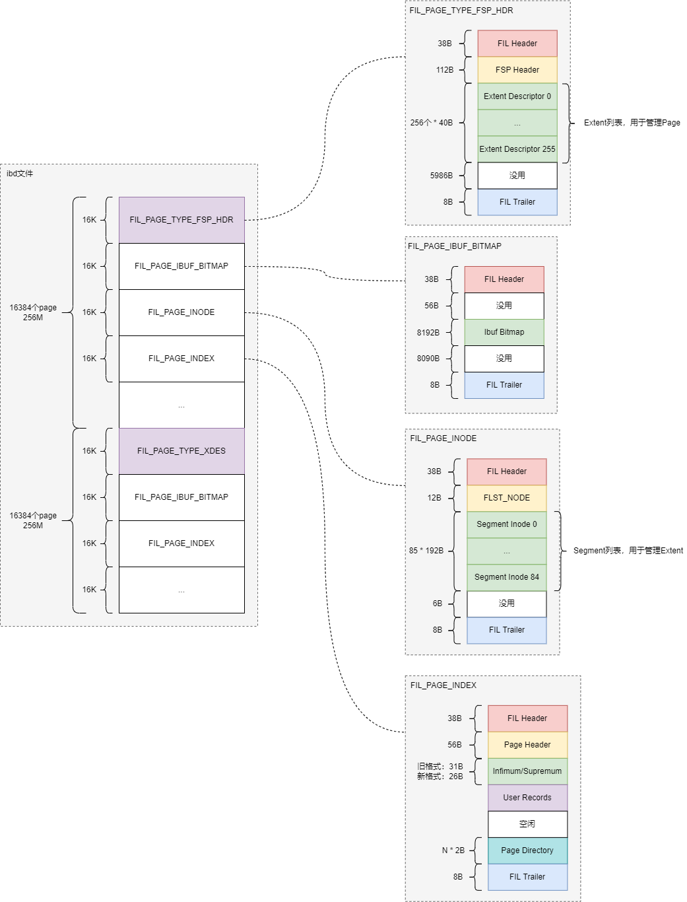

一个索引的结构：

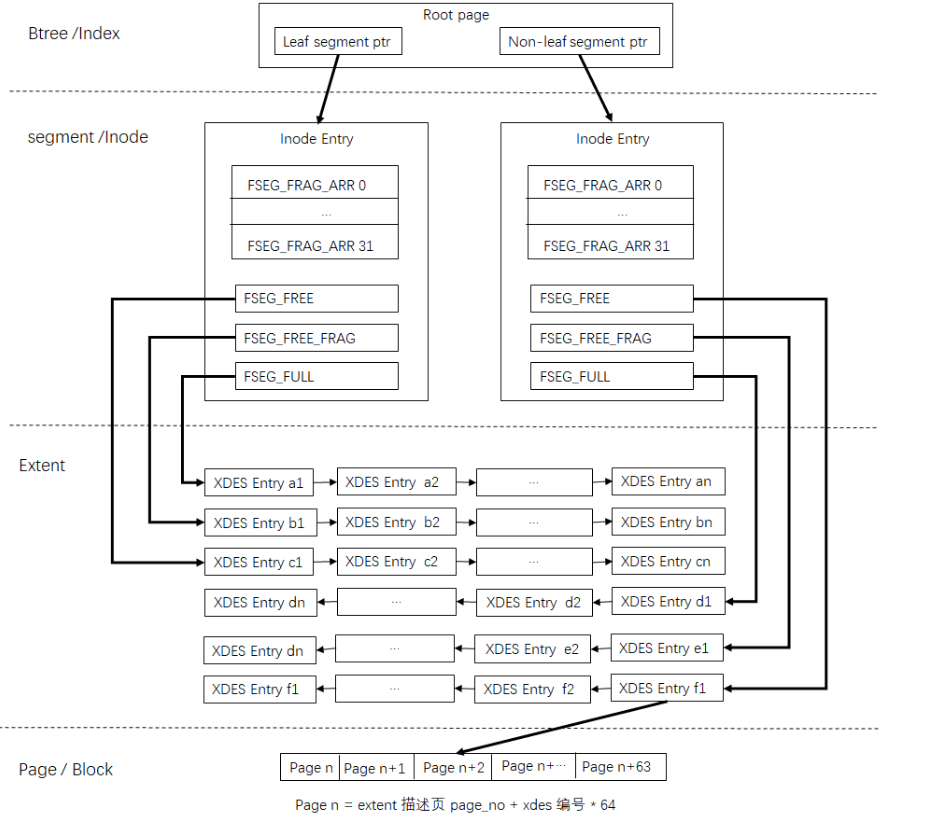

当创建一个新的索引时，实际上构建一个新的btree(btr_create)，先为非叶子节点Segment分配一个inode entry，再创建root page，并将该segment的位置记录到root page中，然后再分配leaf segment的Inode entry，并记录到root page中。当删除某个索引后，该索引占用的空间需要能被重新利用起来。

当我们需要打开一张表时，需要从表空间的数据词典表中加载元数据信息，其中SYS_INDEXES系统表中记录了用户表中所有索引Root Page对应的page no，进而找到B+树Root Page(FIL_PAGE_INDEX)，就可以对整个用户数据B+树进行操作。

### page类型和格式(File Header & Trailer)

page类型及作用如表所示（参考源码fil0fil.h）：

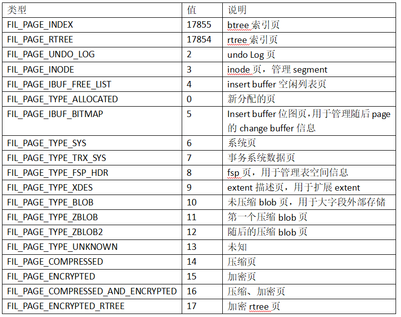

在ibd中每个page具有相同的头部(**File Header**)，该头部占用固定38字节大小，各字段信息如下（参考源码fil0fil.h）：

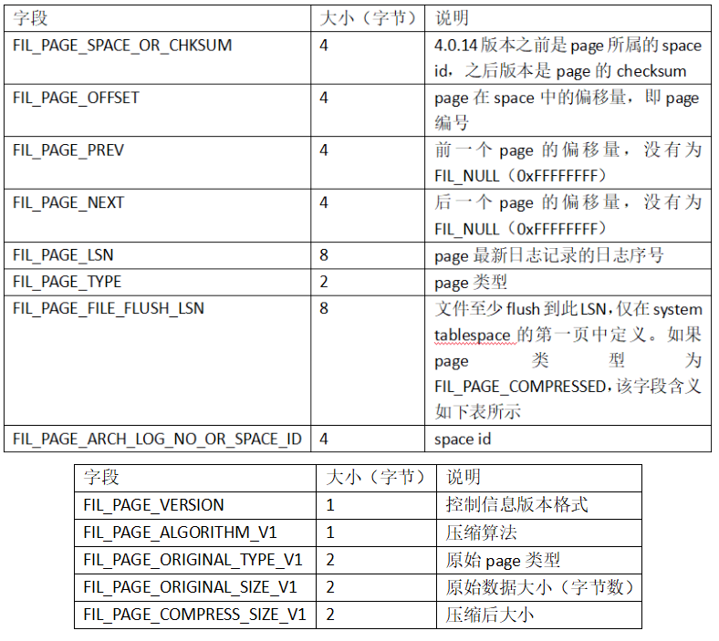

同样在ibd中每个page具有相同的尾部(**File Trailer**)，该尾部占用固定8字节大小，字段信息如下（参考源码fil0fil.h）：

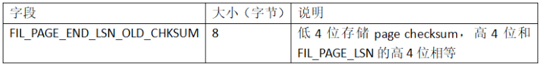

File Trailer是为了**检测页是否已经完整地写入磁盘**（如可能发生的写入过程中磁盘损坏、机器关机等）。

**前4字节代表该页的 checksum值，最后4字节和 File Header 中的 FIL_PAGE_LSN相同**。将这两个值与File Header中的FIL_PAGE_SPACE_OR_CHKSUM和 FIL_PAGE_LSN值进行比较，看是否一致（checksum 的比较需要通过 InnoDB 的 checksum 函数来进行比较，不是简单的等值比较），以此来保证页的完整性（not corrupted）。

在默认配置下，InnoDB存储引擎每次从磁盘读取一个页就会检测该页的完整性，**即页是否发生 Corrupt**，这就是通过 File Trailer部分进行检测，而该部分的检测会有一定的开销。用户可以通过参数 `innodb_checksums` 来开启或关闭对这个页完整性的检查。

MySQL 5.6.6版本开始新增了参数 `innodb_checksum_algorithm`，该参数用来控制检测 checksum 函数的算法，**默认值为 crc32**，可设置的值有：**innodb、crc32、none、strict_innodb、strict_crc32、strict none**。

innodb为兼容之前版本 InnoDB页的 checksum 检测方式，crc32为 MySQL 5.6.6版本引进的新的 checksum算法，该算法较之前的 innodb 有着较高的性能。但是若表中所有页的 checksum 值都以 strict 算法保存，那么低版本的 MySQL数据库将不能读取这些页。none表示不对页启用checksum 检查。

strict *正如其名，表示严格地按照设置的 checksum算法进行页的检测。因此若低版本 MySQL 数据库升级到MySQL 5.6.6或之后的版本，启用 strict_crc32将导致不能读取表中的页。启用strict_crc32方式是最快的方式，因为其不再对innodb和 crc32算法进行两次检测。故推荐使用该设置。若数据库从低版本升级而来，则需要进行mysql_upgrade 操作。

### **FIL_PAGE_TYPE_FSP_HDR**

FSP page是ibd文件的第一个page，主要用于管理全局extent列表、全局inode page列表。FSP page的总体结构如下图所示：

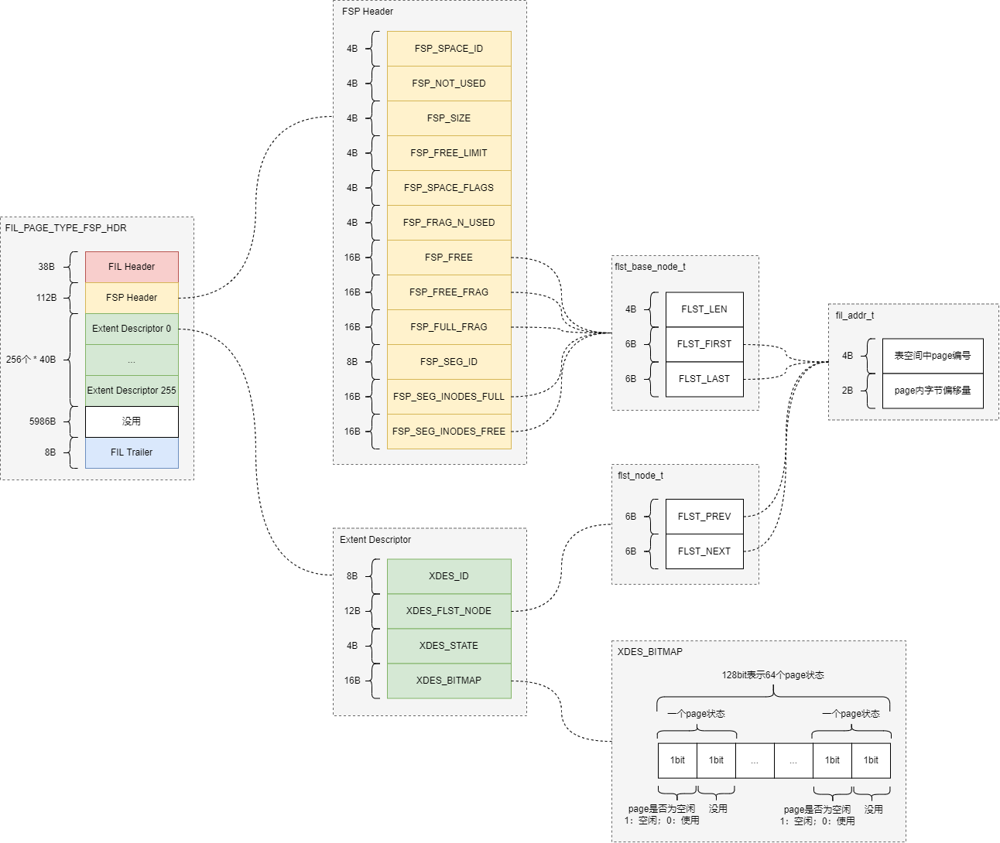

#### 格式

FSP_HDR page主体字段信息如下：

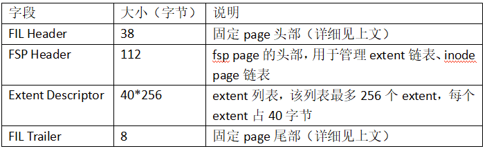

FSP Header字段信息如下：

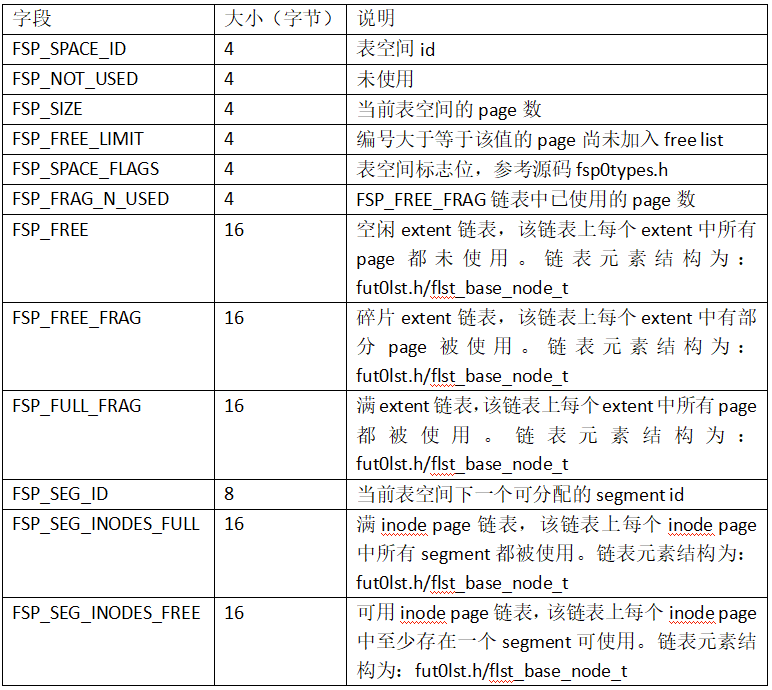

flst_base_node_t是通用的链表头节点结构，字段信息如下：

fil_addr_t是通用的节点地址结构，字段信息如下：

#### Extent Descriptor格式

Extent Descriptor结构：

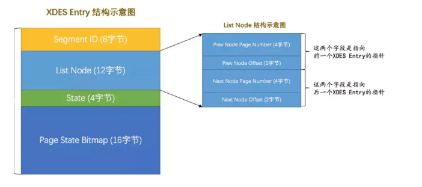

字段信息如下：

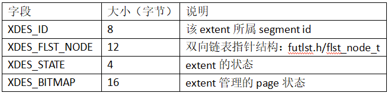

flst_node_t是通用的双向链表指针结构，字段信息如下：

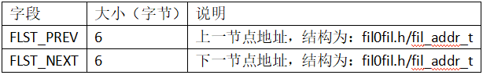

extent状态标志如下：

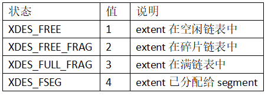

XDES_BITMAP是extent用于管理紧随当前所在页之后的page，每个page占用2bit，一个extent可以管理64个page，结构如下：

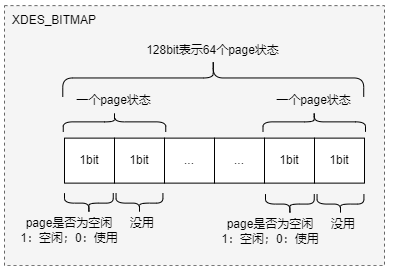

####  Extent Descriptor链表管理

Ibd文件中的全局extent链表在FSP page中进行管理，包括：

- 空闲extent链表
- 碎片extent链表
- 满extent链表

分别由FSP Header中字段**FSP_FREE**、**FSP_FREE_FRAG**、**FSP_FULL_FRAG**表示。

每个extent链表中的元素是Extent Descriptor结构，**一个FSP page最多包含256个Extent Descriptor**，**一个Extent Descriptor最多管理64个page**，也就是说一个FSP page最多管理**16384**个page(第三页的FIL_PAGE_IBUF_BITMAP记录的就是这16384个page的change buffer信息)，当page不够时，需要扩展Extent Descriptor，这是通过增加类型为**FIL_PAGE_TYPE_XDES**的page来完成的，**该类型的page和FSP page除了FSP Header不同外，其他一样，主要是为了扩展Extent Descriptor**，详细见后文。

全局extent链表管理关系如下图所示：

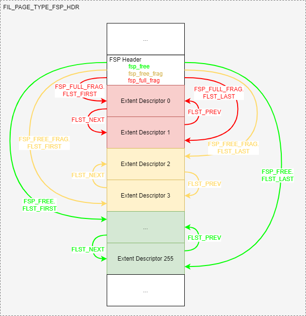

注意一下的是：**链表中的Extent Descriptor元素可能来自FSP page或XDES page**。因为FIL_PAGE_TYPE_XDES并没有FSP page的FSP Header。

Extent Descriptor用于管理page，每个Extent Descriptor最多管理随后的64个page，例如：Extent Descriptor 0管理page 0至page 63，Extent Descriptor 1管理page 64至page 127，依次类推。管理关系如下所示：

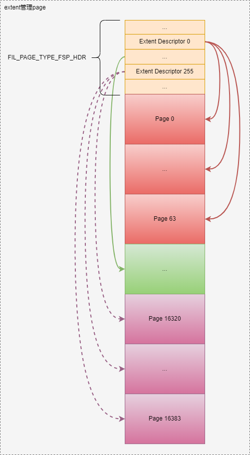

#### Inode page链表管理

Ibd文件中的全局inode page链表在FSP page中进行管理，包括：

- 满inode page链表
- 可用inode page链表

分别由FSP Header中字段**FSP_SEG_INODES_FULL**、**FSP_SEG_INODES_FREE**表示，每个inode page链表中的元素是page。全局inode page 链表管理关系如下图所示：

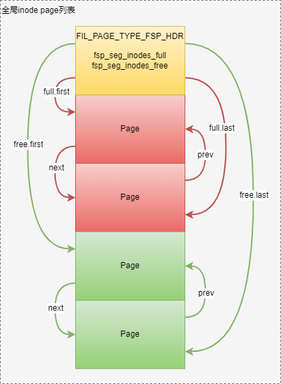

### FIL_PAGE_INODE

Inode page是ibd文件的第三个page，主要用于管理segment。Inode page总体结构如下图所示：

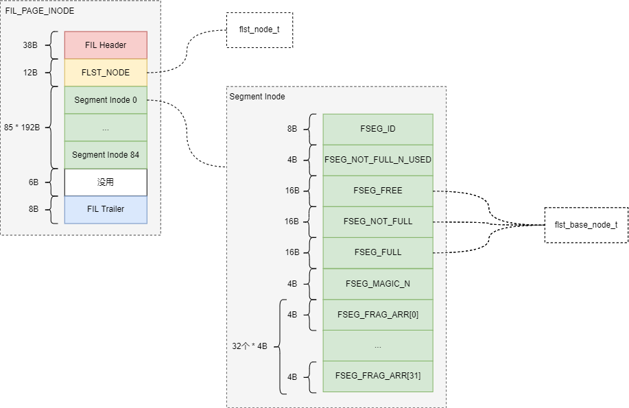

#### 格式

Inode page主体字段信息如下：

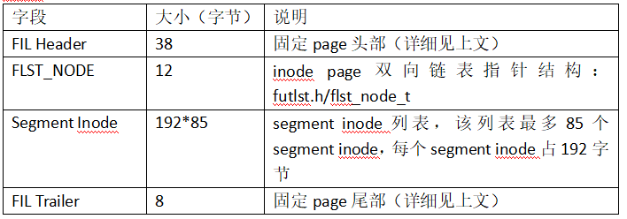

Segment Inode字段信息如下：

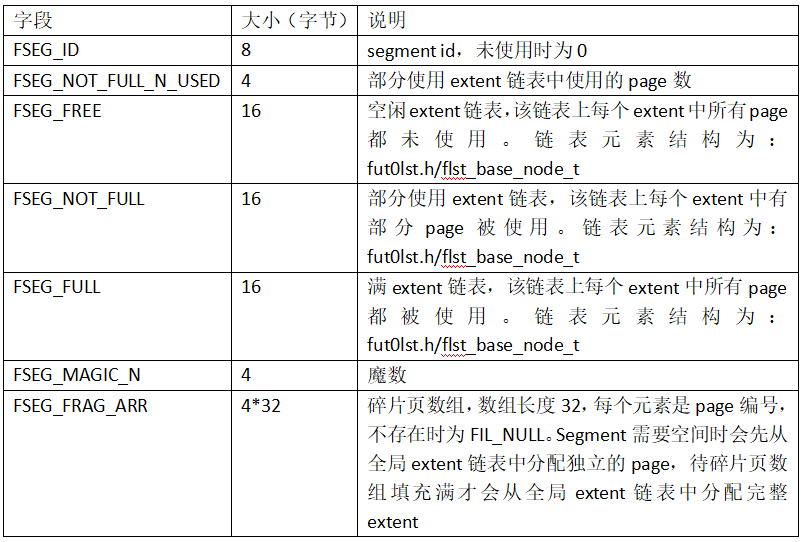

**为节省空间，每个segment都先从FSP HEADER的FSP_FREE_FRAG中分配32个碎片页（FSEG_FRAG_ARR），当这些32个页面不够使用时，再申请区。**

**每个INODE PAGE默认可存储85个SEGMENT INODE**。**每个索引使用2个segment**，**分别用于管理叶子节点和非叶子节点**。

**所以一个INODE PAGE最多可以保存42个索引信息**(一个索引使用两个段)。如果表空间有超过42个索引,则必须再分配一个INODE PAGE。INODE PAGE的分配是从碎片区中申请，但它的位置不是固定的。为了找到索引的INODE ENTRY，InnoDB定义了**SEGMENT HEADER**，结构如下：

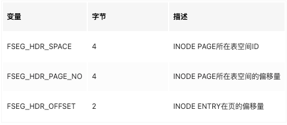

对于用户表，其索引的Root Page中保存了两个SEGMENT HEADER，分别指向**叶子节点的SEGMENT INODE**和**非叶子节点的SEGMENT INODE**。

#### Segment inode链表管理

每个segment inode代表一个segment，segment用于管理使用的extent，包括空闲extent链表、部分使用extent链表、满extent链表，分别由字段FSEG_FREE、FSEG_NOT_FULL、FSEG_FULL表示，管理关系如下所示：

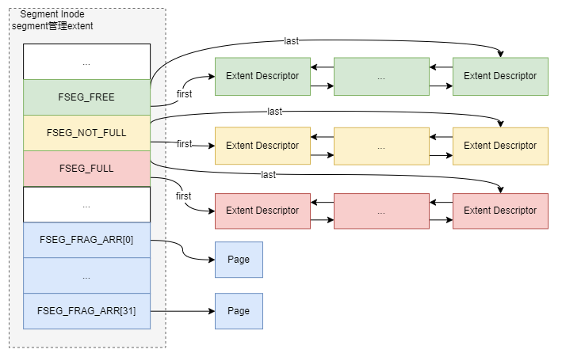

### FIL_PAGE_TYPE_XDES

数据文件的第一个Page类型为FIL_PAGE_TYPE_FSP_HDR，在创建一个新的表空间时进行初始化(fsp_header_init)，该page同时用于跟踪随后的256个Extent(约256MB文件大小)的空间管理，所以每隔256MB就要创建一个类似的数据页，类型为FIL_PAGE_TYPE_XDES ，**用于扩展extent Descriptor，XDES Page除了文件头部外，其他都和FSP_HDR页具有相同的数据结构**，**每个Extent占用40个字节，一个XDES Page最多描述256个Extent**。

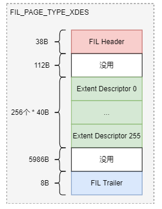

### FIL_PAGE_INDEX

Index page用于存储数据和索引。Index page总体结构如下图所示：

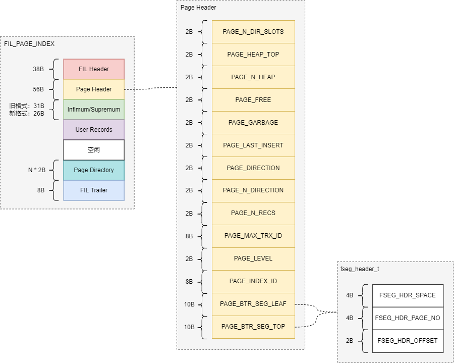

#### 格式

Index page主体字段信息如下：

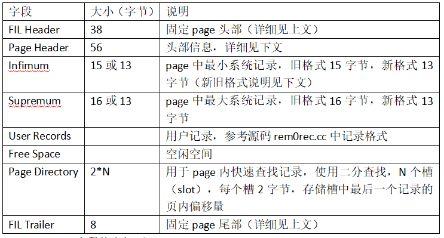

Free Space指的就是空闲空间，同样也是个链表数据结构。在一条记录被删除后，该空间会被加人到空闲链表中。

InnoDB将页中数据进行分组，将每个组最后一条数据的偏移量按顺序存储在Page Directory中，每个分组占用一个槽（Slot，两个字节）。

Page Header字段信息如下：

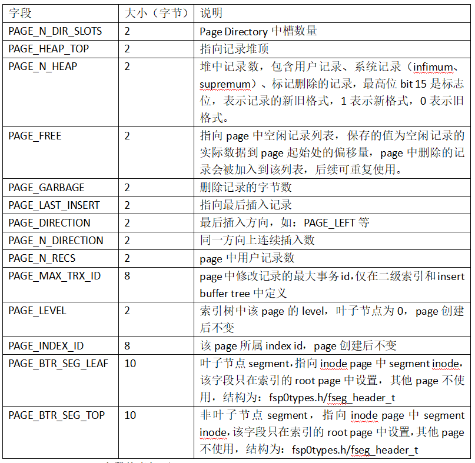

PAGE_LAST_INSERT，PAGE_DIRECTION，PAGE_N_DIRECTION等变量用于进行页的分裂操作。

当记录被删除（不仅是将记录的**deleted_flag**设置为1，而是彻底删除），会放到PAGE_FREE链表中（链表通过记录头信息next_record串联）。

如果这个页上有记录要插入，会：

- 先检查**PAGE_FREE**链表空间是否满足，如果空间满足，直接从PAGE_FREE链表空间分配，**仅检查第一个节点的可用空间，不会通过next_record进行遍历**；
- 如果空间不够，再从空闲空间(**PAGE_HEAP_TOP**)分配；
- 当空闲空间不足时，会调用函数btr_page_reorganize_low进行页的重新组织，即根据页中记录主键的顺序重新进行整理，这样就能整理出碎片的空间；
- 若还是空间不足，则进行分裂操作。

页记录是根据主键顺序排序的，这个排序是逻辑上的，而非物理上的（开销过大）。

fseg_header_t字段信息如下：

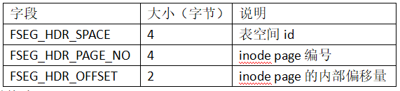

User Records记录具体的数据内容，其中就包括数据库每行数据的具体数据，单条记录文件结构如下(compact类型)：

#### **记录存储格式**

Innodb行格式有四种：**redundant**、**compact**、**compressed**、**dynamic**，参考源码：rem0types.h/rec_format_enum。其中redundant为旧格式，compact、compressed、dynamic为新格式，新旧格式在记录存储格式上差异较大。接来下会详细介绍不同格式下记录的存储方式。

##### compact & compressed & dynamic

Compressed和Dynamic是Compact的变种形式。他们基本没什么本质上的区别，唯一的区别就是对于行溢出的处理不同。Compressed在数据页只存储一个指向溢出页的地址，所有的实际数据都存放在溢出页中。

而Compressed还可以是zlib算法对行数据进行压缩，因此对于BLOB，TEXT，VARCHAR这类大长度类型的数据能够非常有效的存储。

（1）**系统记录**

每个index page中会自动生成两个系统记录：infimum、supremum，分别是最小记录、最大记录。

Infimum记录存储格式：

Supremum记录存储格式：

（2）**用户记录**

用户记录存储格式如下：

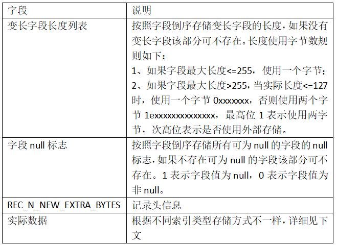

实际数据根据索引类型存储方式不一样，分为：聚簇索引非叶子节点、聚簇索引叶子节点、二级索引非叶子节点、二级索引叶子节点。格式如下：

- 聚簇索引非叶子节点：

  

- 聚簇索引叶子节点：

  

- 二级索引非叶子节点：

  

- 二级索引叶子节点：

  

（3）**记录头信息**

每个记录前都有固定的记录头**REC_N_NEW_EXTRA_BYTES**，用于存储记录相关的属性，格式如下：

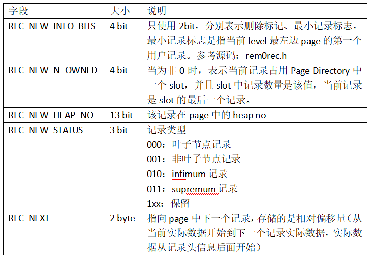

##### redundant

（1）**系统记录**

每个index page中会自动生成两个系统记录：infimum、supremum，分别是最小记录、最大记录。

Infimum记录存储格式：

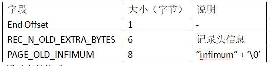

Supremum记录存储格式：

（2）**用户记录**

用户记录存储格式如下：

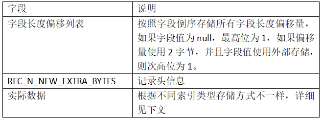

实际数据根据索引类型存储方式不一样，分为：聚簇索引非叶子节点、聚簇索引叶子节点、二级索引非叶子节点、二级索引叶子节点。格式如下：

- 聚簇索引非叶子节点：

  
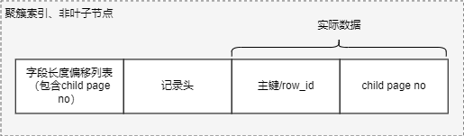

- 聚簇索引叶子节点：

  

- 二级索引非叶子节点：

  

- 二级索引叶子节点：

  

（3）**记录头信息**

每个记录前都有固定的记录头REC_N_OLD_EXTRA_BYTES，用于存储记录相关的属性，格式如下：

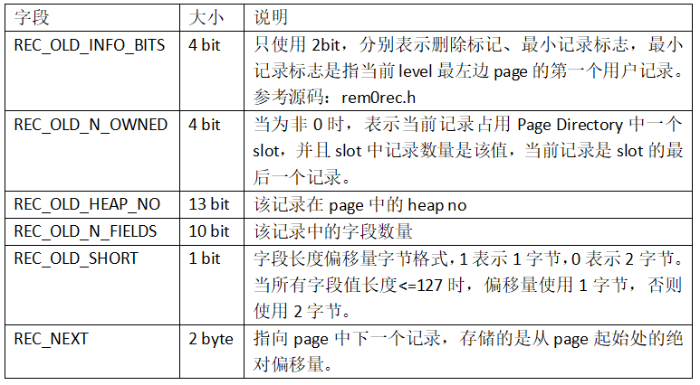

### **FIL_PAGE_TYPE_BLOB**

Blob page用于长度较大的变长字段。Blob page总体结构如下图所示：

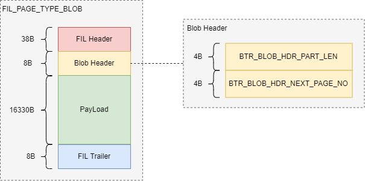

Blob page主体字段信息如下：

Blob Header字段信息如下：

> 参考：
>
> - [深入理解InnoDB -- 存储篇 - 掘金 (juejin.cn)](https://juejin.cn/post/6854573211368030215)
> - [MySQL源码分析系列5——ibd解析 - 程序员的自我修养 (miaozhouguang.com)](http://www.miaozhouguang.com/?p=261#toc-20)
> - [【数据库篇】MySQL InnoDB ibd 文件格式解析_苒翼的博客-CSDN博客_mysql的ibd文件](https://blog.csdn.net/zxz1580977728/article/details/105925014)

