## Mysql体系结构和存储引擎

### 数据库和数据库实例

数据库：**物理操作系统文件或其他形式文件类型的集合**。在MySQL数据库中，数据库文件可以是fim、 MYD、MYI、ibd结尾的文件。当使用NDB引擎时，数据库的文件可能不是操作系统上的文件，而是存放于内存之中的文件，但是定义仍然不变。

实例：**MySQL数据库由后台线程以及一个共享内存区组成**。共享内存可以被运行的后台线程所共享。需要牢记的是，数据库实例才是真正用于操作数据库文件的。

这两个词有时可以互换使用，不过两者的概念完全不同。在MySQL数据库中，实例与数据库的关通常系是一一对应的，即一个实例对应一个数据库，一个数据库对应一个实例。但是，**在集群情况下可能存在一个数据库被多个数据实例使用的情况**。

很多人会把这两个概念混淆，即MySQL是数据库，MySQL 也是数据库实例。这样来理解Oracle和Microsoft SQL Server数据库可能是正确的，但是这会给以后理解MySQL体系结构中的存储引擎带来问题。从概念上来说，数据库是文件的集合，是依照某种数据模型组织起来并存放于二级存储器中的数据集合;数据库实例是程序，是位于用户与操作系统之间的-层数据管理软件，用户对数据库数据的任何操作，包括数据库定义、数据查询、数据维护、数据库运行控制等都是在数据库实例下进行的，应用程序只有通过数据库实例才能和数据库打交道。


**MySQL被设计为一个单进程多线程架构的数据库**，这点与SQL Server比较类似，但与Oracle多进程的架构有所不同(Oracle 的Windows版本也是单进程多线程架构的)。这也就是说，MySQL 数据库实例在系统上的表现就是一个进程。

在Linux中，可以通过一下命令启动Mysql数据库实例，以及查看进程：

```bash
# 启动实例
./mysqld_
# 查看进程
ps -ef | grep mysqld
```

当**启动实例时，MySQL数据库会去读取配置文件，根据配置文件的参数来启动数据库实例**。这与Oracle的参数文件(spfile) 相似，不同的是，Oracle 中如果没有参数文件，在启动实例时会提示找不到该参数文件，数据库启动失败。而在MySQL数据库中，可以没有配置文件，在这种情况下，**MySQL会按照编译时的默认参数设置启动实例**。用以下命令可以查看当MySQL数据库实例启动时，会在哪些位置查找配置文件。

```bash
> mysql --help | grep my.cnf
/etc/my.cnf /etc/mysql/my.cnf /usr/local/mysql/etc/my.cnf  ~/.my.cnf
```

可以看到，数据库按/etc/my.cnf   =》/etc/mysql/my.cnf  =》 /usr/local/mysql/etc/my.cnf  =》 ~/.my.cnf 的顺序读取配置文件的。**如果几个配置文件中都有同一参数，则以最后读取到的配置文件为准**。


### 体系结构

<center></center>

可以看到，Mysql由以下几部分组成：

- 连接池组件
- 管理服务和工具组件
- SQL接口组件
- 查询分析器组件
- 优化器组件
- 缓冲(Cache) 组件
- 插件式存储引擎
- 物理文件

其主要分为以下几层：

- 连接管理层，包括连接池支持的各种组件
- 服务管理层，含管理服务和相关工具、接口、分析、优化等组件
- 存储引擎，含各种以插件提供的数据存储引擎
- 文件存储层，含各种实际落到硬盘的物理文件

从图中还可以发现，MySQL数据库区别于其他数据库的最重要的一个特点就是其**插件式的表存储引擎**。**MySQL插件式的存储引擎架构提供了一系列标准的管理和服务支持，这些标准与存储引擎本身无关，可能是每个数据库系统本身都必需的，如SQL分析器和优化器等，而存储引擎是底层物理结构的实现，每个存储引擎开发者可以按照自己的意愿来进行开发。**

需要特别注意的是，**存储引擎是基于表的，而不是数据库**。


### 存储引擎

存储引擎是MySQL区别于其他数据库的一个最重要特性。存储引擎的好处是，每个存储引擎都有各自的特点，能够根据具体的应用建立不同存储引擎表。对于开发人员来说，存储引擎对其是透明的，但了解各种存储引擎的区别对于开发人员来说也是有好处的。对于DBA来说，他们应该深刻地认识到MySQL数据库的核心在于存储引擎。

由于MySQL数据库的开源特性，**用户可以根据MySQL预定义的存储引擎接口编写自己的存储引擎**。若用户对某一种存储引擎的性能或功能不满意，可以通过修改源码来得到想要的特性，这就是开源带给我们的方便与力量。

#### InnoDB

InnoDB存储引擎**支持事务**，其设计目标主要**面向在线事务处理**(OLTP)的应用。其特点是**行锁设计**、**支持外键**，并支持类似于Oracle的**非锁定读**，即默认读取操作不会产生锁。**从MySQL数据库5.5.8版本开始，InnoDB 存储引擎是默认的存储引擎**。

**InnoDB存储引擎将数据放在一个逻辑的表空间中，这个表空间就像黑盒一样由InnoDB存储引擎自身进行管理**。从MySQL4.1 (包括4.1) 版本开始，它可以将每个
InnoDB存储引擎的表单独存放到一个独立的**ibd**文件中。此外，InnoDB 存储引擎支持用裸设备(row disk)用来建立其表空间。

**InnoDB通过使用多版本并发控制(MVCC)来获得高并发性，并且实现了SQL标准的4种隔离级别，默认为REPEATABLE级别**。同时，使用一种被称为**next-key**
**locking的策略来避免幻读(phantom)现象的产生**。

除此之外，InnoDB 储存引擎还提供了**插人缓冲(insert buffer)、二次写(double write)、自适应哈希索引(adaptive hash index)、预读(read ahead)**等高性能和高可用的功能。

对于表中数据的存储，InnoDB 存储引擎采用了**聚集(clustered)** 的方式，因此**每张表的存储都是按主键的顺序进行存放**。如果没有显式地在表定义时指定主键，InnoDB 存储引擎会为每一行生成一个 **6字节的ROWID**,并以此作为主键。


#### MyISAM

MyISAM存储引擎**不支持事务、表锁设计**，**支持全文索引**，主要面向一些**OLAP**数据库应用。在MySQL5.5.8版本之前MyISAM存储引擎是默认的存储引擎(除
Windows版本外)。

**数据库系统与文件系统很大的一个不同之处在于对事务的支持，然而MyISAM存储引擎是不支持事务的**。究其根本，这也不是很难理解。试想用户是否在所有的应用中都需要事务呢?在数据仓库中，如果没有ETL这些操作，只是简单的报表查询是否还需要事务的支持呢?此外，MyISAM存储引擎的另一个与众不同的地方是**它的缓冲池只缓存(cache) 索引文件，而不缓冲数据文件，这点和大多数的数据库都非常不同**。

MyISAM存储引擎表由**MYD和MYI**组成，**MYD用来存放数据文件，MYI用来存放索引文件**。可以通过使用myisampack工具来进一步压缩数据文件，因为myisampack工具使用赫夫曼(Huffman) 编码静态算法来压缩数据，因此使用myisampack工具压缩后的表是只读的，当然用户也可以通过myisampack来解压数据文件。

在MySQL 5.0版本之前，MyISAM默认支持的表大小为4GB，如果需要支持大于4GB的MyISAM表时，则需要制定**MAX_ROWS**和**AVG_ROW_LENGTH**属性。从MySQL 5.0版本开始，MyISAM 默认支持256TB的单表数据，这足够满足一般应用需求。

>注意：对于MylSAM存储引擎表，MySQL数据库只缓存其索引文件，数据文件的缓存交由操作系统本身来完成，这与其他使用LRU算法缓存数据的大部.
>分数据库大不相同。此外，在MySQL 5.1.23版本之前，无论是在32位还是64位操作系统环境下，缓存索引的缓冲区最大只能设置为4GB。在之后的版本
>中，64位系统可以支持大于4GB的索引缓冲区。


#### NDB

NDB存储引擎是一个**集群存储引擎**，类似于Oracle的RAC集群，不过与Qracle RACshare everything架构不同的是，其结构是share nothing的集群架构，因此能提供更高的可用性。NDB的特点是**数据全部放在内存中**(从MySQL5.1版本开始，可以将非索引数据放在磁盘上)，因此主键查找(primary key lookups)的速度极快，并且通过添加NDB数据存储节点(Data Node)可以线性地提高数据库性能，是高可用、高性能的集群系统。

关于NDB存储引擎，有一个问题值得注意，那就是**NDB存储引擎的连接操作(JOIN)是在MySQL数据库层完成的，而不是在存储引擎层完成的。这意味着，复杂的**
**连接操作需要巨大的网络开销，因此查询速度很慢**。如果解决了这个问题，NDB存储引擎的市场应该是非常巨大的。


#### Memory

Memory存储引擎(之前称HEAP存储引擎)**将表中的数据存放在内存中**，如果数据库重启或发生崩溃，表中的数据都将消失。它**非常适合用于存储临时数据的临时表,**
**以及数据仓库中的纬度表**。Memory 存储引擎**默认使用哈希索引，而不是我们熟悉的B+树索引**。

虽然Memory存储引擎速度非常快，但在使用上还是有一定的限制。 比如，**只支持表锁，并发性能较差，并且不支持TEXT和BLOB列类型**。最重要的是，**存储变长字段(varchar)时是按照定常字段(char) 的方式进行的，因此会浪费内存**(这个问题之前已经提到，eBay 的工程师Igor Chernyshev已经给出了patch解决方案)。

此外有一点容易被忽视，**MySQL 数据库使用Memory存储引擎作为临时表来存放查询的中间结果集**( intermediate result)。 **如果中间结果集大于Memory存储引擎表的容量设置，又或者中间结果含有TEXT或BLOB列类型字段，则MySQL数据库会把其转换到MyISAM存储引擎表而存放到磁盘中。之前提到MyISAM不缓存数据文件，因此这时产生的临时表的性能对于查询会有损失。**


#### Archive

**Archive存储引擎只支持INSERT和SELECT操作**，从MySQL5.1开始支持索引。Archive存储引擎使用zlib算法将数据行(row)进行压缩后存储，压缩比一般可
达1:10。正如其名字所示，Archive存储引擎**非常适合存储归档数据，如日志信息**。Archive存储引擎使用行锁来实现高并发的插人操作，但是其本身并不是事务安全的存储引擎，其设计目标主要是提供高速的插人和压缩功能。


#### Federated

**Federated存储引擎表并不存放数据，它只是指向一台远程MySQL数据库服务器上的表**。这非常类似于SQLServer的链接服务器和Oracle的透明网关，不同的是，当前Federated存储引擎**只支持MySQL数据库表，不支持异构数据库表**。


#### Maria

Maria存储引擎是新开发的引擎，设计目标**主要是用来取代原有的MyISAM存储引擎**，从而成为MySQL的默认存储引擎。Maria 存储引擎的开发者是MySQL的创始人之一的MichaelWidenius。因此，它可以看做是MyISAM的后续版本。Maria存储引擎的特点是：**支持缓存数据和索引文件，应用了行锁设计，提供了MVCC功能，支持事务和非事务安全的选项，以及更好的BLOB字符类型的处理性能**。


#### 比较

除了上诉的存储引擎，还有一些别的存储引擎，比如：Merge、CSV、Sphinx、Infobright。

下图取自于MySQL的官方手册，展现了一些常用MySQL存储引擎之间的不同之处，包括存储容量的限制、事务支持、锁的粒度、MVCC支持、支持的索引、备份和复制等。

<center></center>

可以通过`SHOW ENGINES`语句查看当前使用的MySQL数据库所支持的存储引擎,也可以通过查找information schema 架构下的ENGINES表，如下所示:

<center></center>

下面将通过MySQL提供的示例数据库来简单显示各存储引擎之间的不同。这里将分别运行以下语句，然后统计每次使用各存储引擎后表的大小。

```bash
mysql>CREATE TABLE mytest Engine=MyISAM
     ->AS SELECT * FROM salaries;
Query oK, 2844047 rowS affected (4.37 sec)
Records: 2844047 Duplicates: 0 Warnings: 0

mysql>ALTER TABLE mytest Engine= InnoDB; 
Query oK, 2844047 rows affected (15.86 sec)
Records: 2844047 Duplicates: 0 warnings: 0

mysql>ALTER TABLE mytest Engine =ARCHIVE ;
Query oK, 2844047 rows affected (16.03 sec)
Records: 2844047 Duplicates: 0 warnings: 0
```

通过每次的统计，可以发现当最初表使用MyISAM存储引擎时，表的大少为40.7MB,使用InnoDB存储引擎时表增大到了113.6MB，而使用Archive存储引擎时表的大小却只有20.2MB。该例子只从表的大小方面简单地揭示了各存储引擎的不同。


### 连接MySQL

连接MySQL操作是一个连接进程和MySQL数据库实例进行通信。从程序设计的角度来说，**本质上是进程通信**。如果对进程通信比较了解，可以知道常用的进程通信方式有：**管道**、**命名管道**、**命名字**、**TCP/IP套接字**、**UNIX域套接字**。MySQL数据库提供的连接方式从本质上看都是上述提及的进程通信方式。

（1）**TCP/IP**

TCP/IP套接字方式是MySQL数据库在任何平台下都提供的连接方式，也是网络中使用得最多的一种方式。这种方式在TCP/IP连接上建立一个基于网络的连接请求，一般情况下客户端(client) 在一台服务器上，而MySQL实例(server) 在另一台服务器上，这两台机器通过一个TCP/IP网络连接。例如用户可以在Windows服务器下请求一台远程Linux服务器下的MySQL实例，如下所示:

```sql
mysql -h 192.168.0.101 -u root -p
```

这里需要注意的是，在通过TCP/IP连接到MySQL实例时，MySQL数据库会先检查一张权限视图，用来判断发起请求的客户端IP是否允许连接到MySQL实例。该视图在mysql架构下，表名为user,如下所示:

```bash
mysql>USE mysql;
Database changed
mysql> SELECT host, user, password FROM user;
row★★★★★★★★★★★★★★★★★★★★★★★★★★★★★
host: 192.168.24.%
user: root
password: *75DBD4EA548120B54FE693006C41AA9A16DE8FBE
★★★★★★★★★★★★★★★★★★★★★★★★★★★★2. row ★★★★★★★★★★★★★★★★★★★★★★★★★★★★★
host: nineyou0-43
user: root
password: *75DBD4FA548120B54FE693006C41AA9A16DE8FBE
★★★★★★★★★★★★★★★★★★★★★★★★★★★★3. row★★★★★★★★★★★★★★★★★★★★★★★★★★★★★
host: 127.0.0.1
user: root
password: *75DBD4EA548120B54EE693006C41AA9A16DE8EBE
★★★★★★★★★★★★★★★★★★★★★★★★★★★★4. row★★★★★★★★★★★★★★★★★★★★★★★★★★★★★
host: 192.168.0.100
user: z1m
password: *DAE0939275CC7CD8E0293812A31735DA9CF0953C
★★★★★★★★★★★★★★★★★★★★★★★★★★★★5. row★★★★★★★★★★★★★★★★★★★★★★★★★★★★★
host: %
user: david
password:

5 rows in set (0.00 sec)
```

从这张权限表中可以看到，MySQL允许david这个用户在任何IP段下连接该实例，并且不需要密码。此外，还给出了root用户在各个网段下的访问控制权限。

（2）**命名管道和共享内存**

在Windows 2000、Windows XP、Windows 2003和Windows Vista以及在此之上的平台上，如果两个需要进程通信的进程在同一台服务器上，那么可以使用命名管道，Microsoft SQL Server数据库默认安装后的本地连接也是使用命名管道。在MySQL数据库中须在配置文件中启用**--enable named-pipe**选项。在MySQL 4.1之后的版本中，MySQL还提供了共享内存的连接方式，这是通过在配置文件中添加**--shared-memory**实现的。如果想使用共享内存的方式，在连接时，MySQL 客户端还必须使用**--protocol-memory**选项。

（3）**UNIX域套接字**
在Linux和UNIX环境下，还可以使用UNIX域套接字。**UNIX域套接字其实不是一个网络协议，所以只能在MySQL客户端和数据库实例在一台服务器上的情况下使用**。用户可以在配置文件中指定套接字文件的路径，如--socket=/tmp/mysql.sock。当数据库实例启动后，用户可以通过下列命令来进行UNIX域套接字文件的查找：

```sql
mysql>SHOW VARIABLES LIKE 'socket' ;
*************************** 1. row ***************************
Variable_ name: socket
		Value: 1 tmp/mysql. sock
1 row in set (0.00 sec)
```

在知道UNIX域套接字文件的路径后，就可以使用该方式进行连接了：

```bash
mysql -u david -S tmp/mysql. sock
```


## InnoDB存储引擎

### 概述

InnoDB是事务安全的MySQL存储引擎，设计上采用了类似于Oracle数据库的架构。通常来说，**InnoDB 存储引擎是OLTP应用中核心表的首选存储引擎**。同时，也正是因为InnoDB的存在，才使MySQL数据库变得更有魅力。

InnoDB存储引擎最早由InnobaseOy公司开发，被包括在MySQL数据库所有的二进制发行版本中，从MySQL 5.5版本开始是默认的表存储引擎(之前的版本InnoDB
存储引擎仅在Windows下为默认的存储引擎)。该存储引擎是第一个完整支持ACID事务的MySQL存储引擎(BDB是第一个支持事务的MySQL存储引擎，现在已经停止开发)，其特点是**行锁设计、支持MVCC、支持外键、提供一致性非锁定读**，同时被设计用来最有效地利用以及使用内存和CPU。


### 版本

InnoDB存储引擎被包含于所有MySQL数据库的二进制发行版本中。早期其版本随着MySQL数据库的更新而更新。从MySQL 5.1版本时，MySQL 数据库允许存储引擎开发商以动态方式加载引擎，这样存储引擎的更新可以不受MySQL数据库版本的限制。

- 在MySQL 5.1中，可以支持两个版本的InnoDB，一个是静态编译的InnoDB版本，可将其视为老版本的InnoDB;另一个是动态加载的InnoDB版本，官方称为InnoDB Plugin,可将其视为InnoDB 1.0.x 版本；
- MySQL 5.5版本中又将InnoDB的版本升级到了1.1.x；
- 而MySQL 5.6版本中InnoDB的版本也随着升级为1.2.x 版本。

| 版本         | 功能                                                     |
| ------------ | -------------------------------------------------------- |
| 老版本InnoDB | 支持ACID、行锁设计、MVCC                                 |
| InnoDB 1.0.x | 继承了上述版本所有功能，增加了compress和dynamic页格式    |
| InnoDB 1.1.x | 继承了上述版本所有功能，增加了Linux AIO,多回滚段         |
| InnoDB 1.2.x | 继承了上述版本所有功能，增加了全文索引支持、在线索引添加 |

之前很多人使用的MySQL数据库还是停留在MySQL5.1版本，并使用InnoDB Plugin。很多DBA错误地认为InnoDB Plugin 和InnoDB 1.1 版本之间是没有区
别的。但从上表中还是可以发现，虽然都增加了对于compress和dynamic页的支持，但是InnoDB Plugin 是不支持Linux Native AIO功能的。此外，由于不支持多回滚段,InnoDB Plugin支持的最大支持并发事务数量也被限制在1023。而且随着MySQL 5.5版本的发布，InnoDB Plugin也变成了一个历史产品.


### 体系架构

InnoDB存储引擎的架构。下图简单显示了InnoDB的存储引擎的体系架构，从图可见，InnoDB 存储引擎有多个内存块，可以认为这些内存块组成了一个大的内存池，负责如下工作: .

- 维护所有进程/线程需要访问的多个内部数据结构；
- 缓存磁盘上的数据，方便快速地读取，同时在对磁盘文件的数据修改之前在这里缓存；
- 重做日志(redo log)缓冲。

<center></center>

后台线程的主要作用是负责刷新内存池中的数据，保证缓冲池中的内存缓存的是最近的数据。此外将已修改的数据文件刷新到磁盘文件，同时保证在数据库发生异常的情况下InnoDB能恢复到正常运行状态。


#### 后台线程
InnoDB存储引擎是多线程的模型，因此其后台有多个不同的后台线程，负责处理不同的任务。

（1）**Master Thread**

MasterThread是一个非常核心的后台线程，主要负责**将缓冲池中的数据异步刷新到磁盘，保证数据的一致性**，包括**脏页的刷新**、**合并插人缓冲(INSERT BUFFER)**、**UNDO页的回收**、**redo log的刷盘** 等。后面会详细地介绍各个版本中Master Thread的工作方式。


（2）**IO Thread**

在InnoDB存储引擎中**大量使用了AIO (Async IO)来处理写IO请求**，这样可以极大提高数据库的性能。而IOThread的工作主要是**负责这些IO请求的回调(Callback)**
**处理**。

InoDB 1.0 版本之前共有4个IO Thread,分别是**write、read、 insert buffer和log** IO thread。在Linux平台下，IO Thread的数量不能进行调整，但是在Windows平台下可以通过参数**innodb_ fle_ io_threads** 来增大IO Thread。

从InnoDB 1.0.x 版本开始，**read thread和write thread分别增大到了4个**，并且不再使用innodb_ file_ io_threads参数，而是分别使用innodb_ read_io_ threads 和 innodb_write_ io_ threads 参数进行设置，如:

<center></center>

可以通过命令`show engine innodb status `来观察InnoDB中的IO Thread：

<center></center>

可以看到IO Thread 0为insert buffer thread，IO Thread 1为log thread。之后就是根据参数innodb_read_ io_threads 及innodb_write_ io_threads 来设置的读写线程，并且读线程的ID总是小于写线程。


（3）**Purge Thread**

事务被提交后，其所使用的undolog可能不再需要，因此需要PurgeThread来回收已经使用并分配的undo页。在InnoDB 1.1版本之前，purge 操作仅在InnoDB存储引擎的Master Thread中完成。而**从InnoDB 1.1 版本开始，purge 操作可以独立到单独的线程中进行**，以此来减轻Master Thread的工作，从而提高CPU的使用率以及提升存储引擎的性能。用户可以在MySQL数据库的配置文件中添加如下命令来启用独立的Purge：

```bash
Thread:
[mysq1d]
innodb_ purge_ threads=1
```

在InnoDB 1.1 版本中，即使将innodb purge threads 设为大于1, InnoDB 存储引擎启动时也会将其设为1,并在错误文件中出现如下类似的提示:
```bash
120529 22:54:16 (Warning] option 'innodb-purge- threads': unsigned value 4 adjusted to 1
```

**从InnoDB 1.2版本开始，InnoDB 支持多个Purge Thread**，这样做的目的是为了进步加快undo页的回收。同吋由于PurgeThread需要离散地读取undo页，这祥也能更迸一步利用磁盘的随机湊取性能。如用户可以设置Purge Thread:

<center></center>


（4）**Page Cleaner Thread**

Page Cleaner Thread是在InnoDB 1.2.x 版本中引人的。其作用是**将之前版本中脏页的刷新操作都放人到单独的线程中来完成**。而其目的是为了减轻原Master Thread的工作及对于用户查询线程的阻塞，迸一步提高InnoDB存偖引擎的性能。


#### 内存

##### 缓冲池

**InnoDB存储引擎是基于磁盘存储的，并将其中的记录按照页的方式进行管理。因此可将其视为基于磁盘的数据库系统**(Disk -base Database)。在数据库系统中，**由于CPU速度与磁盘速度之间的鸿沟，基于磁盘的数据库系统通常使用缓冲池技术来提高数据库的整体性能**。

**缓冲池简单来说就是一块内存区域，通过内存的速度来弥补磁盘速度较慢对数据库性能的影响**。**在数据库中进行读取页的操作，首先将从磁盘读到的页存放在缓冲池中,这个过程称为将页“FIX"在缓冲池中。下一次再读相同的页时，首先判断该页是否在缓冲池中。若在缓冲池中，称该页在缓冲池中被命中，直接读取该页。否则，读取磁盘上的页。**

对于数据库中页的修改操作，则**首先修改在缓冲池中的页，然后再以一定的频率刷新到磁盘上**。这里需要注意的是，**页从缓冲池刷新回磁盘的操作并不是在每次页发生更新时触发，而是通过一种称为Checkpoint的机制刷新回磁盘**。同样，这也是为了提高数据库的整体性能。

对于InoDB存储引擎而言，其缓冲池的配置通过参数innodb_bufferpool_size来设置。下面显示一台MySQL数据库服务器，其将InnoDB存储引擎的缓冲池设置为
128MB。

<center></center>

具体来看，**缓冲池中缓存的数据页类型有：索引页、数据页、undo 页、插入缓存（insert buffer）、redo log buffer、Change Buffer 、自适应哈希索引、InnoDB 存储的锁信息、数据字典信息等**。不能简单地认为，缓冲池只是缓存索引页和数据页，它们只是占缓冲池很大的一部分而已。

<center></center>

通过命令`SHOW ENGINE INNODB STATUS`可以观察到buffer的情况：

<center></center>

从InnoDB 1.0.x 版本开始，**允许有多个缓冲池实例**。**每个页根据哈希值平均分配到不同缓冲池实例中**。这样做的好处是减少数据库内部的资源竞争，增加数据库的并发处

<center></center>

在配置文件中将**innodb_ buffer_ pool_ instances** 设置为大于1的值就可以得到多个缓冲池实例。

从MySQL5.6版本开始，还可以通过**information_schema**架构下的表**INNODB_BUFFER_POOL_STATS**来观察缓冲的状态，如运行下列命令可以看到各个缓冲池的使用状态:

<center></center>


##### LRU List & Free List & unzip_LRU & Flush List

**（1）LRU List**

在前一小节中我们知道了缓冲池是一个很大的内存区域，其中存放各种类型的页。那么InnoDB存储引擎是怎么对这么大的内存区域进行管理的呢?

通常来说，**数据库中的缓冲池是通过LRU(LatestRecentUsed，最近最少使用)算法来进行管理的**。即**最频繁使用的页在LRU列表的前端，而最少使用的页在LRU列表的尾端。当缓冲池不能存放新读取到的页时，将首先释放LRU列表中尾端的页。**

在InnoDB存储引擎中，缓冲池中页的大小默认为16KB，同样使用LRU算法对缓冲池进行管理。稍有不同的是InnoDB存储引擎对传统的LRU算法做了一些优化——**冷热分离**。在InnoDB的存储引擎中，LRU列表中还加入了**midpoint**位置。**新读取到的页，虽然是最新访问的页，但并不是直接放人到LRU列表的首部，而是放入到LRU列表的midpoint位置。这个算法在InnoDB存储引擎下称为midpoint insertion strategy。在默认配置下，该位置在LRU列表长度的5/8处**。midpoint 位置可由参数**innodb_old_blocks_pct** 控制，如:

<center></center>

从上面的例子可以看到，**参数innodb_old_ blocks_pct默认值为37**，**表示新读取的页插人到LRU列表尾端的37%的位置**(差不多3/8的位置)。**在InnoDB存储引擎中，把midpoint之后的列表称为old列表，之前的列表称为new列表。可以简单地理解为new列表中的页都是最为活跃的热点数据**。

<center></center>

**当从磁盘读取数据页后，会先将数据页存放到 LRU 链表冷数据区的头部，如果这些缓存页在 1 秒之后被访问，那么就将缓存页移动到热数据区的头部；如果是 1 秒之内被访问，则不会移动，缓存页仍然处于冷数据区中。1 秒这个数值，是由参数 innodb_old_blocks_time 控制。**

参数**innodb_old_ blocks_time**用于表示页读取到mid位置后需要等待多久才会被加人到LRU列表的热端。因此当需要执行上述所说的SQL操作时，可以通过下面的方法尽可能使LRU列表中热点数据不被刷出。

```sql
set global innodb_old_blocks_time=1000;
```

如果用户预估自己活跃的热点数据不止63%，那么在执行SQL语句前，还可以通过下面的语句来减少热点页可能被刷出的概率。
```sql
set global innodb_old_blocks_pct=20;
```

那为什么不采用朴素的LRU算法，直接将读取的页放入到LRU列表的首部呢?这是因为**若直接将读取到的页放人到LRU的首部，那么某些SQL操作可能会使缓冲池中的页被刷新出，从而影响缓冲池的效率**。常见的这类操作为索引或数据的扫描操作。这类操作需要访问表中的许多页，甚至是全部的页，而这些页通常来说又仅在这次查询操作中需要，并不是活跃的热点数据。如果页被放入LRU列表的首部，那么非常可能将所需要的热点数据页从LRU列表中移除，而在下一次需要读取该页时，InnoDB 存储引擎需要再次访问磁盘。而使用了实则这种机制，如果在 1 秒后，因全表扫描和预读机制额外加载进来的缓存页，仍然没有人访问，那么它们会一直待在冷数据区，当再需要淘汰数据时，首先淘汰地就是这一部分数据。

实际上，MySQL 在冷热分离的基础上还做了一层优化。

当一个缓存页处于热数据区域的时候，我们去访问这个缓存页，这个时候我们真的有必要把它移动到热点数据区域的头部吗？

从代码的角度来看，将链表中的数据移动到头部，实际上就是修改元素的指针指向，这个操作是非常快的。但是为了安全起见，在修改链表的时候，我们需要对链表加上锁，否则容易出现并发问题。

当并发量大的时候，因为要加锁，会存在锁竞争，每次移动显然效率就会下降。因此 MySQL 针对这一点又做了优化，**如果一个缓存页处于热数据区域，且在热数据区域的前 1/4 区域（注意是热数据区域的 1/4，不是整个链表的 1/4），那么当访问这个缓存页的时候，就不用把它移动到热数据区域的头部；如果缓存页处于热数据的后 3/4 区域，那么当访问这个缓存页的时候，会把它移动到热数据区域的头部。**


**（2）Free List**

LRU列表用来管理已经读取的页，但当数据库刚启动时，LRU列表是空的，即没有任何的页。这时页都存放在**Free列表**中。**当需要从缓冲池中分页时，首先从Free列表中查找是否有可用的空闲页，若有则将该页从Free列表中删除，放人到LRU列表中**。**否则，根据LRU算法，淘汰LRU列表末尾的页，将该内存空间分配给新的页**。

当页从LRU列表的old部分加入到new部分时，称此时发生的操作为**page made young**,而因为**innodb_old_blocks_time**的设置而导致页没有从old部分移动到new部分的操作称为**page not made young**。可以通过命令**SHOW ENGINE INNODB STATUS**来观察LRU列表及Free列表的使用情况和运行状态。

<center></center>

通过命令SHOW ENGINE NNODB STATUS可以看到：当前Bufter pool size共有183552个页，即183552*16K大小的缓冲池。Free buffers表示当前Free列表中页的数量，Database pages表示LRU列表中页的数量。**可能的情况是Free buffers与Database pages的数量之和不等于Buffer pool size**。前面说了，因为缓冲池中的页还可能会被分配给自适应哈希索引、Lock信息、InsertBuffer等页，而这部分页不需要LRU算法进行维护，因此不存在于LRU列表中。

pages made young 显示了LRU列表中页移动到前端的次数，因为该服务器在运行阶段没有改变innodb_old_blocks_time 的值，因此not young为0。youngs/s、 non-youngs/s表示每秒这两类操作的次数。这里还有一个重要的观察变量——**Buffer pool hit rate**,表示缓冲池的命中率，这个例子中为100%，说明缓冲池运行状态非常良好。**通常该值不应该小于95%**。若发生Buffer pool hit rate 的值小于95%这种情况，用户需要观察是否是由于全表扫描引起的LRU列表被污染的问题。

> 注意执行命令 **SHOW ENGINE INNODB STATUS显示的不是当前的状态**，而是过去某个时间范围内InnoDB存储引擎的状态。从上面的例子可以发现，Persecond averages calculated from the last 24 seconds代表的信息为过去24秒内的数据库状态。

从InnoDB 1.2 版本开始，还可以通过表**INNODB_BUFFER_POOL_STATS** 来观察缓冲池的运行状态，如:

```sql
select pool_id,hit_rate,pages_made_young,pages_not_made_young from information_schema.INNODB_BUFFER_POOL_STATS;
```

<center></center>

此外，还可以通过表**INNODB_BUFFER_PAGE_LRU**来观察每个LRU列表中每个页的具体信息，例如通过下面的语句可以看到缓冲池LRU列表中SPACE为1的表的页类型:

```sql
select table_name,space,page_number,page_type from information_schema.INNODB_BUFFER_PAGE_LRU where space = 1;
```

<center></center>


**（3）unzip_LRU**

InnoDB存储引擎从1.0.x 版本开始支持**压缩页**的功能，即将原本16KB的页压缩为1KB、2KB、4KB和8KB。而由于页的大小发生了变化，LRU列表也有了些许的改变。对于非16KB的页，是通过**unzip_LRU**列表进行管理的。通过命令`SHOW ENGINE INNODB STATUS`可以观察到如下内容: 

<center></center>

可以看到LRU列表中一共有1539个页，而unzip_LRU列表中有156 个页。这里需要注意的是，LRU 中的页包含了unzip_ LRU列表中的页。

对于压缩页的表，每个表的压缩比率可能各不相同。可能存在有的表页大小为8KB，有的表页大小为2KB的情况。unzip_LRU是怎样从缓冲池中分配内存的呢?

首先，在unzip_ LRU列表中对不同压缩页大小的页进行分别管理。其次，**通过伙伴算法进行内存的分配**。例如对需要从缓冲池中申请页为4KB的大小，其过程如下:

1. 检查4KB的unzip_LRU列表，检查是否有可用的空闲页; 
2. 若有，则直接使用;
3. 否则，检查8KB的unzip_LRU列表;
4. 若能够得到空闲页，将页分成2个4KB页，存放到4KB的unzip_ LRU 列表;
5. 若不能得到空闲页，从LRU列表中申请一个16KB的页，将页分为1个8KB的页、2个4KB的页，分别存放到对应的unzip_LRU列表中。同样可以通过**information_schema**架构下的表**INNODB_BUFFER_PAGE_LRU**来观察unzip_LRU列表中的页，如:

```sql
select TABLE_NAME,SPACE,PAGE_NUMBER,COMPRESSED_SIZE from information_schema.innodb_buffer_page_lru where compressed_size!=0;
```

<center></center>

**（4）Flush List**

在LRU列表中的页被修改后，称该页为脏页(dirty page)，即缓冲池中的页和磁盘上的页的数据产生了不一致。这时数据库会通过CHECKPOINT机制将脏页刷新回磁盘，而**Flush列表中的页即为脏页列表**。需要注意的是，脏页既存在于LRU列表中，也存在于Flush列表中。LRU列表用来管理缓冲池中页的可用性，Flush列表用来管理将页刷新回磁盘，二者互不影响。

同LRU列表一样，Flush列表也可以通过命令`SHOW ENGINE INNODB STATUS`来查看，前面例子中Modified db pages 24673就显示了脏页的数量。information_schema架构下并没有类似INNODB_BUFFER_PAGE_LRU的表来显示脏页的数量及脏页的类型，但正如前面所述的那样，脏页同样存在于LRU列表中，故用户可以通过元数据表INNODB_BUFFERPAGE_LRU来查看，唯一不同的是需要加入 **OLDEST_MODIFICATION**大于0的SQL查询条件，如:

```sql
select TABLE_NAME,SPACE,PAGE_NUMBER,oldest_modification from information_schema.innodb_buffer_page_lru where oldest_modification>0;
```

可以看到当前共有5个脏页及它们对应的表和页的类型。TABLE_NAME为NULL表示该页属于系统表空间。


##### 重做日志缓存

InnoDB 存储引擎的内存区域除了有缓冲池外，还有重做日志缓冲(redo log buffer)。InnoDB 存储引擎首先将重做日志信息先放人到这个缓冲区，然后按一定频率将其刷新到重做日志文件。重做日志缓冲一般不需要设置得很大，因为一般情况下每一秒钟会将重做日志缓冲刷新到日志文件，因此用户只需要保证每秒产生的事务量在这个缓冲大小之内即可。该值可由配置参数innodb_log_buffer_size 控制，默认为8MB:
```sql
SHOW VARIABLES LIKE 'innodb_log_buffer_size'\G;
```

在通常情况下，8MB的重做日志缓冲池足以满足绝大部分的应用，因为重做日志在下列三种情况下会将重做日志缓冲中的内容刷新到外部磁盘的重做日志文件中。

- **Master Thread每一秒将重做日志缓冲刷新到重做日志文件;**
- **每个事务提交时会将重做日志缓冲刷新到重做日志文件;**
- **当重做日志缓冲池剩余空间小于1/2 时，重做日志缓冲刷新到重做日志文件。**


##### 额外的内存池

额外的内存池通常被DBA忽略，他们认为该值并不十分重要，事实恰恰相反，该值同样十分重要。

在InnoDB存储引擎中，对内存的管理是通过一种称为内存堆(heap)的方式进行的。在**对一些数据结构本身的内存**进行分配时，需要从额外的内存池中进行申请，当该区域的内存不够时，会从缓冲池中进行申请。例如，分配了缓冲池(innodb_buffer_pool)，但是每个缓冲池中的帧缓冲(frame buffer)还有对应的缓冲控制对象(buffer control block)，这些对象记录了一些诸如LRU、锁、等待等信息，而这个对象的内存需要从额外内存池中申请。因此，**在申请了很大的InnoDB缓冲池时，也应考虑相应地增加这个值。**


### Checkpoint

#### 介绍

前面已经讲到了，缓冲池的设计目的为了协调CPU速度与磁盘速度的鸿沟。因此页的操作首先都是在缓冲池中完成的。如果一条 DML语句，如Update或Delete 改变了页中的记录，那么此时页是脏的，即缓冲池中的页的版本要比磁盘的新。数据库需要将新版本的页从缓冲池刷新到磁盘。

倘若每次一个页发生变化，就将新页的版本刷新到磁盘，那么这个开销是非常大的。若热点数据集中在某几个页中，那么数据库的性能将变得非常差。同时，如果在从缓冲池将页的新版本刷新到磁盘时发生了宕机，那么数据就不能恢复了。为了避免发生数据丢失的问题，当前事务数据库系统普遍都采用了Write Ahead Log策略，即当事务提交时，先写重做日志，再修改页。当由于发生宕机而导致数据丢失时，通过重做日志来完成数据的恢复。这也是事务ACID中D (Durability 持久性)的要求。

思考下面的场景，如果重做日志可以无限地增大，同时缓冲池也足够大，能够缓冲所有数据库的数据，那么是不需要将缓冲池中页的新版本刷新回磁盘。因为当发生宕机时，完全可以通过重做日志来恢复整个数据库系统中的数据到宕机发生的时刻。但是这需要两个前提条件:

- 缓冲池可以缓存数据库中所有的数据；
- 重做日志可以无限增大。

对于第一个前提条件，有经验的用户都知道，当数据库刚开始创建时，表中没有任何数据。缓冲池的确可以缓存所有的数据库文件。然而随着市场的推广，用户的增加，产品越来越受到关注，使用量也越来越大。这时负责后台存储的数据库的容量必定会不断增大。当前3TB的MySQL数据库已并不少见，但是3TB的内存却非常少见。目前Oracle Exadata旗舰数据库一体机也就只有2 TB的内存。因此第一个假设对于生产环境应用中的数据库是很难得到保证的。

再来看第二个前提条件：重做日志可以无限增大。也许是可以的，但是这对成本的要求太高，同时不便于运维。DBA或SA不能知道什么时候重做日志是否已经接近于磁盘可使用空间的阈值，并且要让存储设备支持可动态扩展也是需要一定的技巧和设备支持的。

好的，即使上述两个条件都满足，那么还有一一个情况需要考虑:宕机后数据库的恢复时间。当数据库运行了几个月甚至几年时，这时发生宕机，重新应用重做日志的时间会非常久，此时恢复的代价也会非常大。

因此Checkpoint (检查点)技术的目的是解决以下几个问题:

- 缩短数据库的恢复时间；
- 缓冲池不够用时，将脏页刷新到磁盘；
- 重做日志不可用时，刷新脏页。

当数据库发生宕机时，数据库不需要重做所有的日志，因为Checkpoint之前的页都已经刷新回磁盘。故数据库只需对Checkpoint后的重做日志进行恢复。这样就大大缩短了恢复的时间。


#### redo log

redo log 包括两部分：

1. 内存中的日志缓冲(redo log buffer)，该部分日志是易失性的；包含一个或多个log block，大小为512B。
2. 磁盘上的重做日志文件(redo log file)，该部分日志是持久的。

redo log是物理日志，记录事务对数据页做了哪些修改。MySQL 每执行一条 DML 语句，先将记录写入 redo log buffer，后续根据写入策略将多个log block写到 redo log file。策略有：

- 0 ：设置为 0 的时候，表示每次事务提交时不进行刷盘操作，每次提交事务都只把redo log留在redo log buffer中
- 1（**默认值**） ：设置为 1 的时候，表示每次事务提交时都将进行刷盘操作（默认值），每次提交事务都将redo log 持久化到磁盘上，也就是write+fsync
- 2 ：设置为 2 的时候，表示每次事务提交时都只把 redo log buffer 内容写入 page cache ，也就是只write，不fsync，因此不能完全保证在执行commit时肯定会写入redo log file中。

**innodb_flush_log_at_trx_commit** 参数默认为 1 ，也就是说当事务提交时会调用 fsync 对 redo log 进行刷盘。另外，InnoDB 存储引擎有一个后台线程，每隔1 秒，就会把 redo log buffer 中的内容写到文件系统缓存（page cache），然后调用 fsync 刷盘。（**一个没有提交事务的 redo log 记录，也可能会刷盘**）

>因此为了保证实物的ACID中的持久性，必须将innodb_flush_log_trx_commit设置为1，也就是每当有事务提交时，就必须确保事务都已经写入重做日志文件。那么当数据库因为意外发生宕机时，可以通过重做日志文件恢复，并保证可以恢复已经提交的事务。而将重做日志文件设置为0或2，都有可能发生恢复时部分事务的丢失。不同之处在于，设置为2时，当MySQL数据库发生宕机而操作系统及服务器并没有发生宕机时，由于此时未写入磁盘的事务日志保存在文件系统缓存中，当恢复时同样能保证数据不丢失。

这种先写先写 redo log buffer，再写 redo log file 的技术就是 MySQL 里经常说到的 **WAL(Write-Ahead Logging)** 技术。存在的意义主要就是降低对数据页刷盘的要求。redo log记录了数据页上的修改，但是当数据页也刷回到磁盘后，这些记录就失去作用了。

InnoDB中至少有一个redo group，每个redo group至少有两个redo log file(ib_logfile0,ib_logfile1)，每个redo log file大小固定，除了保存4个512B块：log file header，checkpoint1，空，checkpoint2，其它用于保存log block。采用循环写入的方式，先写redo log file1，写满后再写redo log file2，然后再写redo log file1这样。


两个CP是因为交替写入，避免因介质失败而导致无法找到可用的CP的情况。

为了得到更高的可靠性，用户可以设置多个**日志镜像文件组**，将不同的文件组放在不同的磁盘上，以此来提高重做日志高可用性。

InnoDB的存储管理是基于页的，redo log file也是基于页的，并且不同类型的语句日志记录不同，但首部是相同的：


- type：日志类型
- space：表空间的ID
- page_no：页的偏移量
- offset：每个重做日志的数据部分，恢复时需要调用相应的函数进行解析

<center></center>

- `write pos`：表示 redo log 当前记录的日志序列号LSN(log sequence number)
- `check point`：当数据页已经刷盘后，更新check point。
- `write pos 到 check point之间的部分`：是 redo log 空着的部分，用于记录新的操作；
- `check point 到 write pos 之间`：是 redo log 待落盘的数据页更改记录；
- `当 write pos 追上 check point 时`，这时候不能再执行新的更新，得停下来，同步到磁盘，推动 check point 向前移动，空出位置再记录新的日志。

LSN是日志序列号，有三个含义：①redo log的日志总量 ②checkpoint的位置 ③页的版本

在前面我们已经提到，写入重做日志文件的操作不是直接写，而是先写入一个重做日志缓冲（redo log buffer）中，然后按照一定的条件顺序地写入日志文件：

<center></center>

从重做日志缓冲往磁盘写入时，是按512个字节，也就是一个扇区的大小进行写入。**因为扇区是写入的最小单位，因此可以保证写入必定是成功的，因此在重做日志的写入过程中不需要有doublewrite**。

启动innodb的时候，不管上次是正常关闭还是异常关闭，总是会进行恢复操作。恢复时，会先检查数据页中的LSN，如果这个LSN小于write pos，说明在redo log上记录着数据页上尚未完成的操作，接着就会从最近的一个check point出发，开始同步数据。**在check point和write pos中已经提交的事务会进行redo，没有提交的事务会进行undo。**

`redo log` 是 InnoDB 引擎所特有的，所以我们如果再使用 InnoDB 引擎创建表时，如果数据库发生异常重启，之前提交的记录都不会丢失，这个能力称为 `crash-safe`。


#### checkpoint

checkpoint的工作是将buffer pool中的脏页刷盘，并在redo log file中记录checkpoint的信息。系统故障后，根据redo来恢复数据时，不需要重做所有日志，只需要重做checkpoint点之后的日志，因为redo log也不能无限大，所以当redo log空间不足时，redo log中那部分被更新到磁盘的日志可以覆盖重用。

在redo log file中保存了两个checkpoint，分别保存在ib_logfile0的512字节和1536字节处，每个checkpoint默认大小为512字节，InnoDB的checkpoint主要有3部分信息组成：

- checkpoint no：checkpoint no主要保存的是checkpoint号，因为InnoDB有两个checkpoint，通过checkpoint号来判断哪个checkpoint更新

- checkpoint lsn：checkpoint lsn主要记录了产生该checkpoint是flush的LSN，确保在该LSN前面的数据页都已经落盘，不再需要通过redo log进行恢复

- checkpoint offset：checkpoint offset主要记录了该checkpoint产生时，redo log在ib_logfile中的偏移量，通过该offset位置就可以找到需要恢复的redo log开始位置。

checkpoint分为两种(checkpoint的时机)：

- sharp checkpoint：在关闭数据库时，将buffer  pool中的脏页全部刷入磁盘。

- fuzzy checkpoint：在数据库正常运行时，找到不同时机将脏页写入磁盘，一部分一部分的刷入磁盘，不会因为一次性刷入磁盘造成性能问题。

  - master thread checkpoint。master thread中，**每秒或每10秒一次的频率将脏页按一定的比例从内存刷入磁盘**，这个过程是异步的，即用户查询线程不会阻塞。

  - flush_lru_list checkpoint。flush_lru_list checkpoint是在单独的**page cleaner线程**(Mysql5.6，即InnoDB1.2.x版本后才是该线程，之前是在master thread线程中)中执行的。lru列表是buffer pool的lru列表，**lru空闲列表中保留一定数量的空闲页面**，来保证buffer pool中有足够的空间应对新的数据库请求。在**lru中空闲列表不足时，Innodb存储引擎会将LRU列表尾端的页移除，如果这些页是脏页，那么就需要checkpoint**，空闲数量阈值是可以配置的，由参数`innodb_lru_scan_depth`控制LRU列表中可用页的数量，默认是1024。

  - Dirty Page too much。即**脏页的数量太多**，导致InoDB存储引擎强制进行Checkpoint。**其目的总的来说还是为了保证缓冲池中有足够可用的页**。其可由参数`innodb_max_dirty_pages_pct` 控制，默认是75，即当缓冲池中脏页的数量占据75%时，强制进行checkpoint，刷新一部分的脏页到磁盘。

  - async/sync flush checkpoint。async/sync flush checkpoint是在单独的page cleaner线程中执行的。**当redo log利利用率达到阈值，将buffer pool中的一部分脏数据刷新到磁盘**。 通过配置阈值，在redo log空间不足指定阈值时进行刷新。

    若将已经写人到重做日志的LSN记为redo_Isn, 将已经刷新回磁盘最新页的LSN记为checkpoint_lsn, 则可定义:

    ```sql
    checkpoint_age = redo_lsn - checkpoint_lsn
    ```

    再定义以下的变量:

    ```sql
    async_water_mark = 75% * total_redo_1og_file_size
    sync_water_mark = 90% ★ total_redo_1og_file_size
    ```

    若每个重做日志文件的大小为1GB，并且定义了两个重做日志文件，则重做日志文件的总大小为2GB。那么async_water_mark=1.5GB, sync_water_mark=1.8GB，则：

    - 当checkpoint_age<async_water_mark时，不需要刷新任何脏页到磁盘；
    - 当async_water_mark<checkpoint age<sync_water_mark时触发Async Flush，从Flush列表中刷新足够的脏页回磁盘，使得刷新后满足checkpoint_age<async_water_mark；
    - checkpoint age>sync_water_mark 这种情况一般很少发生，除非设置的重做志文件太小，并且在进行类似LOAD DATA的BULK INSERT操作。此时触
      发Syne Flush操作，从Flush列表中刷新足够的脏页回磁盘，使得刷新后满足checkpoint_age<async_water_mark。

    可见，Async/Sync Flush Checkpoint是为了保证重做日志的循环使用的可用性。在InnoDB 1.2.x 版本之前，Async Flush Checkpoint会阻塞发现问题的用户查询线程，而Sync Flush Checkpoint会阻塞所有的用户查询线程，并且等待脏页刷新完成。从InnoDB1.2.x版本开始一也就是MySQL5.6版本，这部分的刷新操作同样放入到了单独的Page Cleaner Thread中，故不会阻塞用户查询线程。

checkpoint的作用：

1. 缩短数据库的恢复时间；
2. 缓冲池不够用时，将脏页刷新到磁盘；
3. 重做日志空间不足时，刷新脏页。


### Master Thread工作方式

#### Innodb 1.0.x版本之前

Master Thread具有最高的线程优先级别。其内部由多个循环(oop) 组成：**主循环(loop)**、**后台循环(backgroup loop)**、**刷新循环(flush loop)**、**暂停循环(suspend loop)**。Master Thread会根据数据库运行的状态在loop、background loop、fush loop和suspend loop中进行切换。

```c++
void master_thread() {
    goto loop;
    loop:												//------- 主循环
    for (int i = 0 ; i < 10; i++) {
        thread_sleep(l) // sleep 1 second
        do log buffer flush to disk      // 将日志缓冲刷新到磁盘
        if (last one second ios < 5 )
            do merge at most 5 insert buffer  // 如果在过去的一秒少于5次io操作，则合并5个插入缓冲
        if (buf_get_modified_ratio_pct > innodb_max_dirty_pages_pct)
            do buffer pool flush 100 dirty page  // 如果超过了配置文件的阈值，至多刷新100个InnoDB 的缓冲池中的脏页到磁盘
        if ( no user activity)
            goto backgroud loop   // 如果当前没有用户活动，则切换到 background loop
    }
    if (last_ten_second_ios < 200)   // 如果在过去10秒的io操作小于200，则刷新100个脏页到磁盘
        do buffer pool flush 100 dirty page
    do merge at most 5 insert buffer  // 合并5个插入缓冲
    do log buffer flush to disk			// 将日志缓冲刷新到磁盘
    do full purge					// 删除无用的 Undo 页
    if (buf_get_modified_ratio_pct > 70%) 
        do buffer pool flush 100 dirty page
    else						//如果有超过70% 的脏页，则刷新100 个脏页到磁盘，否则刷新10%的脏页
        buffer pool flush 10 dirty page
    goto loop

    background loop:									 //------- 后台循环
    do full purge				//删除无用的 Undo 页
    do merge 20 insert buffer		// 合并20 个插入缓冲
    if not idle :
        goto loop				//跳回到主循环
    else :
        goto flush loop

    flush loop:											 //------- 刷新循环
    do buffer pool flush 100 dirty page //刷新100个脏页
    if(buf_get_modified_ratio_pct > innodb_max_dirty_pages_pct)
        goto flush loop      //主要是用来刷新100个脏页直到满足条件
    goto suspend loop

    suspend loop :										 //------- 暂停循环
    suspend_thread()
    waiting event
    goto loop;
}

```

（1）**loop（主循环）**

**Loop** 被称为主循环，因为大多数的操作是在这个循环中，其中有两大部分的操作：**每秒钟的操作和每10 秒的操作。**

loop循环通过 **thread sleep** 来实现，这意味着所谓的每秒一次或每10 秒一次的操作是 **不精确的**。在负载很大的清况下可能会有延迟(delay), 只能说大概在这个频率下。当然， InnoDB 源代码中还通过了其他的方法来尽量保证这个频率。

**每秒一次的操作：**

1. **日志缓冲刷新到磁盘，即使这个事务还没有提交（总是）**

   即使某个事务还没有提交， InnoDB 存储引擎仍然每秒会将重做日志缓冲中的内容刷新到重做日志文件。这一点是必须要知道的，因为这可以很好地解释为什么再大的事务提交(commit) 的时间也是很短的。

2. **合并插入缓冲（ 可能）**

   合并插入缓冲(Insert Buffer) 并不是每秒都会发生的。InnoDB 存储引擎**会判断当前一秒内发生的IO 次数是否小于5 次**，如果小于5 次，InnoDB 认为当前的IO 压力很小，可以执行合并插入缓冲的操作。

3. **至多刷新100 个InnoDB 的缓冲池中的脏页到磁盘（ 可能）**

   InnoDB 存储引擎通过判断当前缓冲池中脏页的比例(buf_get_modified_ratio_pct) 是否超过了配置文件中 innodb_max_dirty pages_pct 这个参数（默认为90, 代表90%), 如果超过了这个阙值， InnoDB 存储引擎认为需要做磁盘同步的操作，将100 个脏页写入磁盘中。

4. **如果当前没有用户活动，则切换到background loop( 可能）**

**每 10 秒一次的操作：**

1. **将日志缓冲刷新到磁盘（总是）**

   和每秒一次的操作一样

2. **合并至多5 个插入缓冲（总是）**

   不同于每秒一次操作时可能发生的合并插入缓冲操作，这次的合并插入缓冲操作总会在这个阶段进行。

3. **刷新100 个脏页到磁盘（可能的情况下）**

   InnoDB 存储引擎会先判断过去10 秒之内磁盘的IO 操作是否小于 200 次，如果是， InnoDB 存储引擎认为当前有足够的磁盘IO 操作能力，因此将100个脏页刷新到磁盘。

4. **删除无用的Undo 页（总是）**

   执行**full purge** 操作，即删除无用的Undo页。对表进行update 、delete 这类操作时，原先的行被标记为删除，但是因为一致性读(consistent read) 的关系，需要保留这些行版本的信息。但是在full purge 过程中，InnoDB 存储引擎会判断当前事务系统中已被删除的行是否可以删除，比如有时候可能还有查询操作需要读取之前版本的undo 信息，如果可以删除， InnoDB 会立即将其删除。（从源代码中可以发现，每次最多尝试回收 20个undo 页。）

5. **刷新100 个或者10 个脏页到磁盘（总是）** 

   InnoDB 存储引擎会判断缓冲池中脏页的比例( buf_get_modified_ratio pct) ,如果有超过70% 的脏页，则刷新100 个脏页到磁盘，如果脏页的比例小于70%, 则 只需刷新10% 的脏页到磁盘。
   

（2） **background loop （后台循环）**

**若当前没有用户活动（数据库空闲时）或者数据库关闭(shutdown), 就会切换到这个循环**。background loop 会执行以下操作：

1. **删除无用的Undo 页（总是）**；
2. **合并20 个插入缓冲（总是）**；
3. **如果不空闲，跳回到主循环，如果空闲，跳到刷新循环（总是）** ；


（3）**flush loop（刷新循环）**

**刷新100 个脏页，并直到符合条件，也就是直到脏页的数量小于innodb_max_dirty_pages_pct（总是）** 


（4）**suspend loop（悬挂循环）**

若flush loop 中没有什么事情可以做了， InnoDB 存储引擎会切换到**suspend loop**，将Master Thread 挂起，等待事件的发生。若用户启用 (enable) 了InnoDB 存储引擎，却没有使用任何InnoDB 存储引擎的表，那么Master Thread 总是处于挂起的状态。


#### lnnodb 1.2.x版本之前

1.0.x 版本之前的Master Thread的实现方式使 InnoDB 存储引擎对于 IO 其实是有限制的，在缓冲池向磁盘刷新时其实都做了一定的硬编码(hard coding)，这种规定在很大程度上限制了 InnoDB 存储引擎对磁盘IO的性能，尤其是写入性能。

```c++
void master_thread () {
    goto loop ;
    loop:
    for (int i = O; i<lO ; i++) {
        thread_sleep(1) // sleep 1 second
        do log buffer flush to disk   // 将日志缓冲刷新到磁盘
        if(last_one_second_ ios < 5% innodb_io_capacity)	//innodb_io_capacity就是1.0引入的
            do merge 5% innodb_io_capacity insert buffer  // 如果在过去的一秒少于5次io操作，则合并5个插入缓冲
        if( buf_get_modified_ ratio_pct > innodb_max_dirty_pages_pct)
                 // 如果超过了配置文件的阈值，至多刷新100个InnoDB 的缓冲池中的脏页到磁盘
            do buffer pool flush 100% innodb_io_capacity dirty page
        else if enable adaptive flush				// innodb_adaptive_flushing (自适应地刷新）
            do buffer pool flush desired amount dirty page
        if ( no user activity)		 // 如果当前没有用户活动，则切换到 background loop
            goto backgroud loop
    }
    if(last_ten_second_ios < innodb_io_capacity)       //每10秒根据IO的吞吐量更新脏页
        do buffer pool flush 100% innodb_io_capacity dirty page
    do merge 5% innodb_io_capacity insert buffer	//每10秒合并插入缓存为总插入缓存的百分之5
    do log buffer flush to disk
    do full purge
    if(buf_get_modified_ratio_pct > 70%)
        do buffer pool flush 100% innodb_io_ capacity dirty page   //根据脏页总量来刷新，低于一定值也能刷新
    else
        dobuffer pool flush 10% innodb_io_capaciy dirty page
    goto loop

    background loop :
    do full purge
    do merge 100% innodb_io_ capacity insert buffer     //与上面一样
    if not idle :
    goto loop:
    else :
        goto flush loop

    flush loop :
    do buffer pool flush 100% innodb_io_ capacity dirty page    //与上面一样
    if(buf_get_modified_ratio_pct > innodb_max_dirty_pages_pct)
        go to flush loop
        goto suspend loop

    suspend loop :
    suspend_ thread ()
    waiting event
    goto loop ;
}
```

- 问题1：从前面的伪代码来看，无论何时，InnoDB 存储引擎最大只会刷新100 个脏页到磁盘，合并20 个插入缓冲。如果是在写入密集的应用程序中，每秒可能会产生 ＞100 个的脏页，如果是产生大于20 个插入缓冲的情况， **Master Thread 似乎会“忙不过来"'或者说它总是做得很慢**。即使磁盘能在1 秒内处理多于100 个页的写入和20 个插入缓冲的合并，但是由于 hard coding, Master Thread 也只会选择刷新100 个脏页和合并20个插入缓冲。同时， 当发生岩机需要恢复时，由于很多数据还没有刷新回磁盘，会导致恢复的时间可能需要很久，尤其是对于insert buffer 来说。

  解决方法： 提供了参数 **innodb_io_capacity**，用来表示磁盘 IO 的吞吐量，默认值为200。对于刷新到磁盘页的数量，会按照 innodb_io_capacity 的百分比来进行控制。规则如下：

  - **在合并插入缓冲时，合并插入缓冲的数量为 innodb_io_capacity 值的 5%**；
  - **在从缓冲区刷新脏页时，刷新脏页的数量为 innodb_io_capacity** 。

  若用户使用了SSD 类的磁盘，或者将几块磁盘做了RAID, 当存储设备拥有更高的 IO 速度时，完全可以将innodb_io_capacity 的值调得再高点， 直到符合磁盘IO 的吞吐量为止。

- 问题2：参数 **innodb_max_dirty_pages_pct** 默认值的问题，在InnoDB 1.0.x版本之前，该值的默认为90, 意味着脏页占缓冲池的90% 。但是该值“太大”了，因为InnoDB 存储引擎在每秒刷新缓冲池和flush loop 时会判断这个值，如果有很大的内存，或者数据库服务器的压力很大，这时刷新脏页的速度反而会降低。同样，在数据库的恢复阶段可能需要更多的时间。

  解决方法： 从 InnoDB 1.0.x 版本开始，**innodb_max_dirty_pages_pct 默认值变为了 75**, 和 Google 测试的 80 比较接近。这样既可以加快刷新脏页的频率，又能保证了磁盘 IO 的负载。

- 问题3：对于每秒刷新脏页数量的改进。原来的刷新规则：脏页在缓冲池所占的比例 ＜ innodb max_dirty_pages_pct 时，不刷新脏页；＞innodb_max_dirty_pages pct 时，刷新100 个脏页。

  解决方法： InnoDB 1.0.x 版本带来的另一个参数是 **innodb_adaptive_flushing** (自适应地刷新），该值影响每秒刷新脏页的数量。随着innodb_adaptive_flushing 参数的引入， **InnoDB 存储引擎会通过一个名为 buf_flush_get_desired_flush_rate 的函数来判断需要刷新脏页最合适的数量**。粗略地翻阅源代码后发现 buf_ flush get_desired_ flush_rate **通过判断产生重做日志（redo log） 的速度来决定最合适的刷新脏页数量**。因此，**当脏页的比例小于innodb_max_dirty_pages_pct 时，也会刷新一定量的脏页**。

- 问题4：之前每次进行full purge 操作时，最多回收20 个Undo 页。

  解决方法： 从InnoDB 1.0.x 版本开始引入了参数**innodb_purge_batch_size**, 该参数可以控制每次full purge 回收的Undo 页的数最。该参数的默认值为20, 并可以**动态地对其进行修改**。

InnoDB 1.0.x 版本在性能方面取得了极大的提高，其实这和前面提到的Master Thread 的改动是密不可分的，因为InnoDB 存储引擎的核心操作大部分都集中在Master Thread 后台线程中。

命令**SHOW ENGINE INNODB STATUS** 查看当前 **MasterThread** 的状态信息：

```c++
mysql> show engine innodb status\G;
*************************** 1. row***************************
Type: InnoDB
Name:
Status:
091009 10:14:34 INNODB MONITOR OUTPUT
Per second averages calculated from the last 42 seconds
BACKGROUND THREAD
srv_master_ thread l oops: 2188 1_second, 1537 sleeps, 218 10_second, 2 background, 2 flush
srv_master_thread log flush and writes: 1777 log writes only: 5816
......
```

信息的意思是：当前主循环运行了2188 次，但是循环中的每秒挂起(sleep) 的操作只运行了1537 次（这是因为InnoDB 对其内部进行了一些优化，当压力大时并不总是等待 1 秒。因此，并不能认为1_second 和 sleeps 的值总是相等的。在某些情况下，**可以通过两者之间差值的比较来反映当前数据库的负载压力，差值越大说明数据库的负载压力越大**），10 秒一次的活动进行了218 次，符合1 : 10 。background loop 进行了2 次，flush loop 也进行了2次。


#### lnnodb 1.2.x版本

在 **InnoDB 1.2.x** 版本中再次对 **Master Thread** 进行了优化，由此也可以看出 **MasterThread** 对性能所起到的关键作用。在 **InnoDB 1.2.x** 版本中， **Master Thread** 的伪代码如下：

```c++
if InnoDB is idle
	srv master do idle tasks( );
else
	srv master do active tasks();
```

其中 **srv_master_ do_idle_tasks() 就是之前版本中每10 秒的操作， srv_master_ do_active_tasks() 处理的是之前每秒中的操作**。同时**对于刷新脏页的操作，从Master Thread线程分离到一个单独的Page Cleaner Thread**, 从而减轻了Master Thread 的工作，同时进一步提高了系统的并发性。


### Insert Buffer(插入缓存)

#### Insert Buffer

Insert Buffer 可能是InnoDB 存储引擎关键特性中最令人激动与兴奋的一个功能。 lnnoDB 缓冲池中有Insert Buffer 信息固然不错，但是 **Insert Buffer 和数据页一样，也是物理页的一个组成部分**。**insert buffer和doublewrite buffer是类似的概念，他实际上属于system tablespace中的一部分，正由于它也是持久化存储，那么在服务器宕机或是重启之后这些信息不会丢失。**

在InnoDB 存储引擎中，**主键是行唯一的标识符**。通常应用程序中行记录的插入顺序是按照主键递增的顺序进行插入的。因此，**插入聚集索引(Primary Key) 一般是顺序的，不需要磁盘的随机读取。 对于这类情况下的插入操作，速度是非常快的**。

> 注：并**不是所有的主键插入都是顺序的**。若主键类是 UUID 这样的类 （即通用唯一识别码 ，让分布式系统中的所有元素，都能有唯一的辨识信息），那么插入和辅助索引一样，同样是随机的。即使主键是自增类型，但是插入的是指定的值，而不是NULL 值，那么同样可能导致插入并非连续的情况。

**但是不可能每张表上只有一个聚集索引（主键），更多情况下，一张表上有多个非聚集的辅助索引(secondary index)** 。 比如，用户需要按照b 这个字段进行查找，并且b 这个字段不是唯一的：

```sql
CREATE TABLE t (
    a INT AUTO_ 工NCREMENT,
    b VARCHAR(30),
    PRIMARY KEY(a),
    key(b)
);
```

在这样的情况下，产生了一个非聚集的且不是唯一的索引。在**进行插入操作时，数据页的存放还是按主键a进行顺序存放的，但是对于非聚集索引叶子节点的插入不再是顺序的了，这时就需要离散地访问非聚集索引页，由于随机读取的存在而导致了插入操作性能下降**（B+ 树的特性决定了非聚集索引插入的离散性）。

InnoDB 存储引擎开创性地设计了 Insert Buffer （针对非聚集索引）。对于非聚集索引的插入或更新操作，不是每一次直接插入到索引页中，而是**先判断插入的非聚集索引页是否在缓冲池中， 若在，则直接插入； 若不在，则先放入到 Insert Buffer中** 。数据库这个非聚集的索引已经插到叶子节点，而实际并没有，只是存放在另一个位置。**然后再以一定的频率进行Insert Buffer 和辅助索引页子节点的merge (合并）操作，这时通常能将多个插入合并到一个操作中**（因为在一个索引页中） ，这就大大提高了对于非聚集索引插入的性能。

**Insert Buffer** 的使用需要同时满足以下两个条件：

- <span style="color:red">索引是辅助索引</span>
- <span style="color:red">索引不是唯一的</span>

**insert Buffer带来的缺点**：当应用程序进行大量的插入操作，这些都涉及了不唯一的非聚集索引， 也就是使用了Insert Buffer 。若此时MySQL 数据库发生了宕机，这时势必有大量的 Insert Buffer 并没有合并到实际的非聚集索引中去。因此这时恢复可能需要很长的时间，在极端情况下甚至需要几个小时。

用户可以通过命令 **SHOW ENGINE INNODB STATUS** 来查看插入缓冲的信息：

```sql
mysql>SHOW ENGINE INNODB STATUS\G;
*************************** 1. row***************************
Type: InnoDB
Name :
Status:
100727 22 : 21 : 48 INNODB MONITOR OUTPUT
Per second averages calculated from the last 44 seconds
......
---------------------------------------------------------
INSERT BUFFER AND ADAPTIVE HASH INDEX
Ibuf: size 7545, free list len 3790, seg size 11336,
8075308 inserts, 7540969 merged recs, 2246304 merges
......
---------------------------------------------------------
END OF INNODB MONI TOR OUTPUT
1 row in set (0.00 sec)
```

- seg size 显示了当前 Insert Buffer 的大小为 11336X 16KB, 大约为I77MB ;
- free list len 代表了空闲列表的长度；
- size 代表了已经合并记录页的数量；
- Inserts 代表了插入的记录数；
- merged recs 代表了合并的插入记录数量； 
- merges 代表合并的次数，也就是实际读取页的次数。merges:merged recs 大约为1 : 3, 代表了插入缓冲将对于非聚集索引页的离散IO逻辑请求大约降低了2/3。

**目前 Insert Buffer 存在一个问题是**： 在 写密集 的情况下，插入缓冲会占用过多的缓冲池内存 （innodb_buffer _pool）, 默认最大可以占用到1/2 的缓冲池内存。（后来可以通过，修改 IBUF_POOL_SIZE_PER_MAX_SIZE 就可以对插入缓冲的大小进行控制，比如值为3，就是1/3）。


#### Change Buffer

InnoDB 从1.0.x 版本开始引入了 Change Buffer, 可将其视为 Insert Buffer 的升级。从这个版本开始， **InnoDB 存储引擎可以对 DML 操作（INSERT 、DELETE 、UPDATE ）都进行缓冲 ：Insert Buffer 、Delete Buffer 、Purge buffer**。就是当二级索引页不在内存中时，你对它们的操作会被缓存在change buffer中（目的是省去这次随机的磁盘IO）。等之后再将这部分缓存操作merge到B+Tree中。

当然和之前 Insert Buffer 一样，**Change Buffer 适用的对象依然是非唯一的辅助索引**。

 UPDATE 操作可能分为两个过程：

1. **将记录标记为己删除**； 
2. **真正将记录删除**；
3. **插入新的记录**。

因此 **Delete Buffer 对应 UPDATE 操作的第一个过程， 即将记录标记为删除**。**然后真正删除后，在Purge Buffer中记录真正的删除标识，然后进行插入，是否需要Insert Buffer取决于索引的类型与是否能命中当前缓冲池中索引页**。可见，要缓冲更新操作至少需要Insert Buffer、Delete Buffer。

同时，InnoDB 存储引擎提供了参数 **innodb_change_buffering**, 用来开启各种 Buffer 的选项。该参数可选的值为： **inserts** 、**deletes** 、**purges** 、**changes** 、**all** 、**none** 。 inserts 、deletes 、purges 就是前面讨论过的三种情况。changes表示启用inserts和deletes , all表示启用所有， none表示都不启用。**该参数默认值为all** 。

从 InnoDB 1.2.x 版本开始，可以通过参数 **innodb_change_buffer_max_size** 来控制 Change Buffer 最大使用内存的数量。该参数值**默认为25**, 表示最多使用 1/4 的缓冲池内存空间。最大有效值为50 。

在MySQL5.5 版本中通过命令 `SHOW ENGINE INNODB STATUS,` 可以观察到类似如下的内容：

```sql
mysql> SHOW ENGINE I NNODB STATUS\G;
*************************** 1. row***************************
Type: InnoDB
----------------------------------------
INSERT BUFFER AND ADAPTIVE HASH INDEX
----------------------------------------
Ibuf: size 1 , free list len 3 4397 , seg size 34399 , 10875 merges
merged operations :
	insert 20462 , delete mark 20158 , delete 4215
discarded operat i ons :
	insert 0 , delete mark 0 , delete 0
```

- insert 表示Insert Buffer ; delete mark 表示Delete Buffer ; delete 表示Purge Buffer ; 
- discarded operations 表示当 Change Buffer 发生 merge 时，表已经被删除，此时就无需再将记录合并(merge) 到辅助索引中了。


#### Insert Buffer 的内部实现
Insert Buffer 的数据结构是一棵 B+ 树。在MySQL 4.1 之前的版本中每张表有一棵 Insert Buffer B+ 树。而在现在的版本中， 全局只有一棵 Insert Buffer B+ 树，负责对所有的表的辅助索引进行 Insert Buffer 。而这棵 B+ 树存 放在共享表空间中，默认也就是 ibdatal 中。因此，试图通过独立表空间 ibd 文件恢复表中数据时， 往往会导致 CHECK TABLE 失败。这是因为表的辅助索引中的数据可能还在 Insert Buffer 中，也就是共享表空间中，所以通过 ibd 文件进行恢复后，还需要进行 REPAIR TABLE 操作来重建表上所有的辅助索引。

Insert Buffer 是一棵 B+ 树，因此其也由叶节点和非叶节点组成。非叶节点存放的是查询的 search key (键值）。

<center></center>

search key 一共占用9 个字节，其中：

- space 占用4 字节，表示待插入记录所在表的表空间id, 在 InnoDB 存储引擎中，每个表有一个唯一的space id, 可以通过space id 查询得知是哪张表；
- marker 占用1 字节，它是用来兼容老版本的Insert Buffer ；
- offset 占用4 字节，表示页所在的偏移量。（也就是定位到了页）

当一个辅助索引要插入到页(space, offset) 时，如果这个页不在缓冲池中，那么 InnoDB 存储引擎首先根据上述规则**构造一个search key**, 接下来查询Insert Buffer 这棵 B+ 树，然后再将这条记录**插入到Insert Buffer B+ 树的叶子节点中**。

对于插入到 Insert Buffer B+ 树叶子节点的记录，并不是直接将待插入的记录插入，而是需要根据如下的规则进行构造：

<center></center>


**space 、marker 、offset** 字段和之前非叶节点中的含义相同，一共占用9 字节。第4 个字段 **metadata** 占用4 字节，其存储的内容如表：

| 名称                  | 字节 |
| --------------------- | ---- |
| IBUF_REC_OFFSET_COUNT | 2    |
| IBUF_REC_OFFSET_TYPE  | 1    |
| IBUF_REC_OFFSET_FLAGS | 1    |

**IBUF_REC_OFFSET_COUNT 是保存两个字节的整数，用来排序每个记录进入Insert Buffer 的顺序**。因为从InnoDB l.0.x 开始支持 Change Buffer, 所以这个值同样记录进入Change Buffer 的顺序。**通过这个 顺序回放(replay)  才能得到记录的正确值**。

从Insert Buffer 叶子节点的第5 列开始，就是实际插入记录的各个字段了。因此较之原插入记录， Insert Buffer B+ 树的叶子节点记录需要额外13 字节的开销。

因为启用Insert Buffer 索引后，辅助索引页(space, offect) 中的记录可能被插入到 Insert Buffer B+ 树中，所以**为了保证每次 Merge Insert Buffer 页必须成功，还需要有一个特殊的页用来标记每个辅助索引页 (space, page_no) 的可用空间。这个页的类型为 Insert Buffer Bitmap** 。

**每个 Insert Buffer Bitmap 页用来追踪 16384 个辅助索引页，也就是256 个区(Extent)（一个区64个辅助索引页）**。**每个 Insert Buffer Bitmap 页都在16384 个页的第二个页中。**

每个辅助索引页在 Insert Buffer Bitmap 页中占用 4 位：

| 名称                 | 大小(bit) | 说明                                                         |
| -------------------- | --------- | ------------------------------------------------------------ |
| IBUF_BITMAP_FREE     | 2         | 表示该辅助索引页中的可用空间数量，可取值为:<br/>① 0表示无可用剩余空间<br/>② 1表示剩余空间大于1/32页(512 字节)<br/>③ 2表示剩余空间大于1/16页<br/>④ 3表示剩余空间大于1/8页 |
| IBUF_BITMAP_BUFFERED | 1         | 1表示该辅助索引页有记录被缓存在Insert Buffer B+树中          |
| IBUF_BITMAP_IBUF     | 1         | 1表示该页为Insert Buffer B+树的索引页                        |


#### Merge Insert Buffer

Insert/Change Buffer 是一棵 B + 树。若需要实现插入记录的辅助索引页不在缓冲池中，那么需要将辅助索引记录首先插入到这棵B+树中。但是Insert Buffer 中的记录何时合并(merge)到真正的辅助索引中呢？

Merge Insert Buffer 的操作可能发生在以下几种情况下：

1. **辅助索引页被读取到缓冲池时**；
2. **Insert Buffer Bitmap 页追踪到该辅助索引页已无可用空间时**；
3. **Master Thread** 。

第一种情况为当辅助索引页被读取到缓冲池中时，例如：**在执行正常的SELECT 查询操作，这时需要检查Insert Buffer Bitmap 页，然后确认该辅助索引页是否有记录存放于Insert Buffer B+ 树中**。若有，则将Insert Buffer B+ 树中该页的记录插入到该辅助索引页中。可以看到对该页多次的记录操作通过一次操作合并到了原有的辅助索引页中，因此性能会有大幅提高。

**Insert Buffer Bitmap 页用来追踪每个辅助索引页的可用空间，并至少有 1/32 页的空间**。**若插入辅助索引记录时检测到插入记录后可用空间会小于1/32 页，则会强制进行一个合并操作，即强制读取辅助索引页，将Insert Buffer B+ 树中该页的记录及待插入的记录插入到辅助索引页中**。

之前在分析Master Thread 时曾讲到，**在Master Thread 线程中每秒或每10 秒会进行一次Merge Insert Buffer 的操作，不同之处在于每次进行merge 操作的页的数量不同**。

在 Master Thread 中，执行 merge 操作的不止是一个页，而是根据 **srv_innodb_io_capactiy** 的百分比来决定真正要合并多少个辅助索引页 。但 InnoDB 存储引擎又是根据怎样的算法来得知需要合并的辅助索引页呢？

在Insert Buffer B+ 树中，**辅助索引页根据(space, offset) 都已排序好，故可以根据(space, offset) 的排序顺序进行页的选择**。然而，对于Insert Buffer 页的选择，InnoDB 存储引擎并非采用这个方式，它**随机地选择 Insert Buffer B+ 树的一个页，读取该页中的space 及之后所需要数量的页**。 该算法在复杂情况下应有更好的公平性。同时，若进行merge 时，要进行merge 的表已经被删除，此时可以直接丢弃已经被 Insert/Change Buffer 的数据记录。


### double write(两次写)

 如果说 Insert Buffer 带给 InnoDB 存储引擎的是性能上的提升，那么double write (两次写）带给 InnoDB 存储引擎的是 **数据页的可靠性**。

当发生数据库宕机时，可能InnoDB 存储引擎正在写入某个页到表中，而这个页只写了一部分，比如16KB 的页，只写了前4KB, 之后就发生了宕机，这种情况被称为 **部分写失效**。

- 有一个办法，那就是通过**重做日志**进行恢复，但重做日志中记录的是对页的物理操作，那么**如果这个页本身已经发生了损坏，再对其进行重做是没有意义的**。

- 进行改进，**在应用(apply) 重做日志前，用户需要一个页的副本，当写入失效发生时，先通过页的副本来还原该页，再进行重做**，这就是 doublewrite。

<center></center>

doublewrite 由两部分组成：

- **内存**中的 doublewrite buffer, 大小为 2MB

- **物理磁盘上共享表空间中连续的128 个页**，即2个区(extent), 大小同样为2MB 。

工作流程：

- **在对缓冲池的脏页进行刷新时，并不直接写磁盘，而是会通过memcpy 函数将脏页先复制到内存中的 doublewrite buffer**。
- **之后通过 doublewrite buffer 再分两次，每次1MB 顺序地写入共享表空间的物理磁盘上，然后马上调用 fsync 函数，同步磁盘，避免缓冲写带来的问题**。在这个过程中，因为 doublewrite 页是连续的，因此这个过程是顺序写的，开销并不是很大。
- **在完成 doublewrite 页的写入后，再将 doublewrite buffer 中的页写入各个表空间文件中，此时的写入则是离散的**。

可以通过以下命令观察到 **doublewrite** 运行的情况：

```sql
mysql>SHOW GLOBAL STATUS LIKE'innodb_dblwr%' \ G ;
*************************** 1 . row***************************
Variable_narne : Innodb_dblwr_pages_written
Value : 6325194
*************************** 2. row***************************
Variable name: Innodb_dblwr_writes
Value : 100399
2 rows in set (0.00 sec )
```

doublewrite 一共写了 6325194 个页，但实际的写入次数为 100399, 基本上符合64: 1 。如果发现系统在高峰时的**Innodb_dblwr_pages_written : Innodb_dblwr _writes 远小于64: 1,** 那么可以说明系统写入压力并不是很高（因为都通过二次写完成，并且没有类似宕机的事件发生）。如果操作系统在将页写入磁盘的过程中发生了崩溃，在恢复过程中， InnoDB 存储引擎可以从共享表空间中的 doublewrite 中找到该页的一个副本，将其复制到表空间文件，再应用重做日志。

>若查看MySQL 官方手册，会发现在命令SHOW GLOBAL STATUS 中 **Innodb_buffer_pool_pages_flushed** 变星表示当前从缓冲池中刷新到磁盘页的数量。根据之前的介绍，用户应该了解到，在默认情况下所有页的刷新首先都需要放入到doublewrite 中，因此该变量应该和Innodb_dblwr_pages_written 一致。然而在MySQL 5 . 5.24 版本之前，Innodb_buffer pool_pages_flushed 总是为Innodb_dblw _pages_written 的2倍，而此Bug直到MySQL5.5.24 才被修复。因此用户若需要统计数据库在生产环境中写人的量，**最安全的方法还是根据Innodb_dblwr_pages_witten 来进行统计，这在所有版本的MySQL数据库中都是正确的**。

参数 **skip_innodb_doublewrite** 可以禁止使用doublewrite 功能，这时可能会发生前面提及的写失效问题。不过**如果用户有多个从服务器 (slave server), 需要提供较快的性能（如在slaves erver 上做的是RAIDO), 也许启用这个参数是一个办法。不过对于需要提供数据高可靠性的主服务器(master server), 任何时候用户都应确保开启doublewrite 功能。**


### 自适应哈希索引

哈希(hash) 是一种非常快的查找方法，在一般情况下这种查找的时间复杂度为O(1), 即一般仅需要一次查找就能定位数据。而B+ 树的查找次数，取决于 B+ 树的高度，在生产环境中， B+ 树的高度一般为3 ~ 4 层，故需要3~4 次的查询。

**InnoDB 存储引擎会监控对表上各索引页的查询。 如果观察到建立哈希索引可以带来速度提升，则建立哈希索引，称之为自适应哈希索引**(Adaptive Hash Index,AHI) 。 **AHI 是通过缓冲池的B+ 树页构造而来，因此建立的速度很快，而且不需要对整张表构建哈希索引**。InnoDB 存储引擎会自动根据访问的频率和模式来自动地为某些**热点页**建立哈希索引。

<center></center>

使用 AHI 的要求：

1. **对这个页的连续访问模式必须是一样的**（指的是查询的条件一样）。

   例如对于(a,b)这样的联合索引页，其访问模式可以是以下情况：

   - where a=XXX
   - where a=XXX and b=XXX

   **若交替进行上述两种查询**，那么InnoDB存储引擎**不会对该页构造AHI**

2. **以该模式至少访问了100 次**

3. **页通过该模式访问了N 次**，其中**N= 页中记录*1/16**

4. **哈希索引只能用来搜索等值的查询**

根据InnoDB 存储引擎官方的文档显示，启用AHI 后，读取和写入速度可以提高2倍，辅助索引的连接操作性能可以提高5 倍。毫无疑问， AHi 是非常好的优化模式，其设计思想是数据库自优化的(self-tuning), 即无需OBA 对数据库进行人为调整。

通过命令 SHOW ENGINE INNODB STATUS 可以看到当前AHI的使用状况。可以通过参数 **innodb_adaptive_hash_index** 禁用或启动此特性，默认 AHI 为 开启状态。


### 异步IO

为了提高磁盘操作性能，当前的数据库系统都采用异步 IO(Asynchronous IO, AIO) 的方式来处理磁盘操作。InnoDB 存储引擎亦是如此。

- 与 AIO 对应的是 Sync IO, 即每进行一次IO 操作，需要等待此次操作结束才能继续接下来的操作。但是如果用户发出的是一条索引扫描的查询，那么这条SQL 查询语句可能需要扫描多个索引页，也就是需要进行多次的IO 操作。在每扫描一个页并等待其完成后再进行下一次的扫描，这是没有必要的。**用户可以在发出一个IO 请求后立即再发出另一个 IO 请求，当全部 IO 请求发送完毕后，等待所有 IO 操作的完成，这就是AIO** 。

- AIO 的另一个优势是**可以进行 IO Merge 操作（比如要访问的页在一个表中并且紧挨着），也就是将多个 IO 合并为 1 个IO, 这样可以提高 IOPS**（磁盘每秒的读写次数，用来衡量磁盘的性能) 的性能。

  例如：用户需要访问页的(space，page_no)为：(8,6),(8,7),(8,8)

  其中每个页的大小为16KB，那么同步IO需要进行3次IO操作。而AIO会判断这三个页是连续的（显然可以通过(space，page_no)得知），因此**AIO底层会发送一个IO请求，从(8，6)开始，读取48KB的页**

在InnoDB l.l.x 之前， **AIO 的实现通过InnoDB 存储引擎中的代码来模拟实现**。而从 InnoDB 1.1.x 开始(InnoDB Plugin 不支持），**提供了内核级别AIO 的支持**，称为Native AIO 。因此在编译或者运行该版本MySQL 时，需要libaio 库的支持。若没有则会出现如下的提示：

```sql
/usr/local/mysql /bin/mysqld: error while l oading shared libraries: libaio.so.l:
cannot open shared object file: No such file or directory
```

Windows 系统和Linux 系统都提供 Native AIO 支持，而Mac OSX 系统则未提供。因此在这些系统下，依旧只能使用原模拟的方式。参数**innodb_use_native_aio** 用来控制是否启用Native AIO, 在Linux 操作系统下，默认值为ON。用户可以通过开启和关闭Native AIO 功能来比较InnoDB 性能的提升。官方的测试显示，启用NativeAIO, 恢复速度可以提高75% 。

在InnoDB 存储引擎中， **read ahead 方式的读取都是通过AIO 完成，脏页的刷新，即磁盘的写入操作则全部由AIO 完成**。


### read ahead(预读)

预读是当发起一个 I/O 请求时候，异步的预取磁盘多个页面放入缓冲池，也就是预料这些页会马上被读取到，所以预先把接下来的部分数据页读取出来。

（1）**Linear read-ahead(线性预读)**

**线性预读以 extent 作为预定范围单位，预测在buffer pool中被访问到的数据它临近的页也会很快被访问到**。能够通过调整被连续访问的页的数量来控制InnoDB的预读操作，使用参数 `innodb_read_ahead_threshold`配置：

```sql
show variables like 'innodb_read_ahead_threshold';

+-----------------------------+-------+
| Variable_name               | Value |
+-----------------------------+-------+
| innodb_read_ahead_threshold | 56    |
+-----------------------------+-------+
```

`innodb_read_ahead_threshold`这个参数控制InnoDB在检测顺序页面访问模式时的灵敏度。**如果在一个区块顺序读取的页数大于或者等于 innodb_read_ahead_threshold 这个参数，InnoDB启动预读操作来读取下一个区块**。innodb_read_ahead_threshold参数值的范围是 0-64，默认值为56. 这个值越高则访问默认越严格。比如，如果设置为48，在当前区块中当有48个页被顺序访问时，InnoDB就会启动异步的预读操作，如果设置为8，则仅仅有8个页被顺序访问就会启动异步预读操作。

**若没有设置该参数，InnoDB会在读取到当前区段最后一页时才会发起异步预读请求**。


（2）**Random read-ahead(随机预读)**

**随机预读 以 页 作为预定范围单位，也就是一个 extent 中的 64个页为预读范围，通过buffer pool中已有的页来预测哪些页可能很快会被访问，而不考虑这些页的读取顺序。如果发现buffer pool中存中一个区段的13个连续的页，InnoDB会异步发起预读请求这个区段剩余的页**。通过设置 **innodb_random_read_ahead** 为 ON开启随机预读特性。

通过 SHOW INNODB ENGINE STATUS 命令输出的统计信息可以帮助你评估预读算法的效果，统计信息包含了下面几个值：

- innodb_buffer_pool_read_ahead  通过预读异步读取到buffer pool的页数
- innodb_buffer_pool_read_ahead_evicted 预读的页没被使用就被驱逐出buffer pool的页数，这个值与上面预读的页数的比值可以反应出预读算法的优劣。
- innodb_buffer_pool_read_ahead_rnd 由InnoDB触发的随机预读次数。

由于随机预读相对复杂性，同时在性能也存在不稳定性，在5.5中已经将这种预读方式废弃。


### 刷新邻接页
InnoDB 存储引擎还提供了 Flush Neighbor Page ( 刷新邻接页） 的特性。

工作原理为： **当刷新一个脏页时， InnoDB 存储引擎会检测该页所在区(extent) 的所有页，如果是脏页，那么一起进行刷新。**

好处：**通过 AIO 可以将多个IO 写入操作合并为一个IO 操作**，故该工作机制在传统机械磁盘下有着显著的优势。

刷新邻接页 需要考虑的问题：

1. 是不是可能将不怎么脏的页进行了写入，而该页之后又会很快变成脏页？
2. 固态硬盘有着较高的IOPS, 是否还需要这个特性？

为此， InnoDB 存储引擎从 1.2 .x 版本开始提供了参数` innodb_flush_neighbors`, 用来控制是否启用该特性。对于传统机械硬盘建议启用该特性，而**对于固态硬盘有着超高 IOPS（磁盘每秒的读写次数，用来衡量磁盘性能的） 性能的磁盘，则建议将该参数设置为 0**, 即关闭此特性。


### 启动、关闭、恢复

 InnoDB 是MySQL 数据库的存储引擎之一，因此InnoDB 存储引擎的启动和关闭，更准确的是指在MySQL 实例的启动过程中对InnoDB 存储引擎的处理过程。

在关闭时，参数 **innodb_fast_shutdown** 影响着表的存储引擎为 InnoDB 的行为。该参数可取值为0 、1 、2, 默认值为1 。

- 0： **表示在MySQL 数据库关闭时， InnoDB 需要完成所有的 full purge 和merge insert buffer, 并且将所有的脏页刷新回磁盘**。 这需要一些时间，有时甚至需要几个小时来完成。如果在进行InnoDB 升级时，必须将这个参数调为0, 然后再关闭数据库。
- 1： **是参数 innodb_fast_shutdown 的默认值**，表示不需要完成上述的full purge 和merge insert buffer 操作，但是**在缓冲池中的一些数据脏页还是会刷新回磁盘**。
- 2： 表示不完成 full purge 和merge insert buffer 操作，也不将缓冲池中的数据脏页写回磁盘，**只是将日志都写入日志文件**。这样不会有任何事务的丢失，但是下次 MySQL 数据库启动时，会进行恢复操作 。

>这里需要注意的是，insert buffer和doublewrite buffer是类似的概念，他实际上属于system tablespace中的一部分，正由于它也是持久化存储，那么在服务器宕机或是重启之后这些信息不会丢失。

**当正常关闭 MySQL 数据库时，下次的启动应该会非常“正常＂**。但是如果没有正常地关闭数据库，如用 kill 命令关闭数据库，在 MySQL 数据库运行中重启了服务器，或者在关闭数据库时，将参数 innodb_fast_shutdown 设为了2 时，下次MySQL 数据库启动时都会对InnoDB 存储引擎的表进行恢复操作。

参数 **innodb_force_recovery** 影响了整个 InnoDB 存储引擎恢复的状况。**该参数值默认为0，代表当发生需要恢复时，进行所有的恢复操作， 当不能进行有效恢复时，如数据页发生了corruption，MySQL 数据库可能发生宕机(crash), 并把错误写入错误日志中去**。

但是，**在某些情况下，可能并不需要进行完整的恢复操作，因为用户自已知道怎么进行恢复**。比如在对一个表进行 alter table 操作时发生意外了，数据库重启时会对 InnoDB 表进行 回滚操作，对于一个大表来说这需要很长时间，可能是几个小时。这时用户可以自行进行恢复，如可以把表删除，从备份中重新导入数据到表，可能这些操作的速度要远远快于回滚操作。

参数 innodb_force_recovery 可以设置为6 个非零值： 1~6 。

- 1(SRV_FORCE_IGNORE_CORRUPT): 忽略检查到的 corrupt 页。
- 2(SRV_FORCE_NO_BACKGROUND): 阻止Master Thread 线程的运行，如Master Thread 线程需要进行 full purge 操作，而这会导致crash 。
- 3(SRV_FORCE_NO_TRX_UNDO): 不进行事务的回滚操作。
- 4(SRV_FORCE_NO_IBUF_MERGE): 不进行插入缓冲的合并操作。
- 5(SRV_FORCE_NO_UNDO_LOG_SCAN): 不查看撤销日志(Undo Log), InnoDB存储引擎会将未提交的事务视为己提交。
- 6(SRV_FORCE_NO_LOG_REDO): 不进行前滚（前滚：将未完成的操作继续完成）的操作。

在设置了参数 innodb_force_recovery 大于0 后，用户可以对表进行select 、create 和drop 操作，但insert 、update 和delete 这类DML 操作是不允许的。


现在来做一个实验，模拟故障的发生。

（1）在第一个会话中(session)， 对一张接近1000万行的InnoDB存储引擎表进行更新操作，但是完成后不要马上提交:

```sql
mysql>START TRANSACTION;
Query oK, 0 rows affected (0.00 sec)

mysql>UPDATE Profile SET password='';
Query oK,9587770 rows affected (7 min 55.73 sec)
Rows matched: 9999248 Changed: 9587770 Warnings: 0
```

- START TRANSACTION语句开启了事务，同时防止了自动提交(auto commit)的发生；
- UPDATE操作则会产生大量的UNDO日志(undo log)。

（2）这时，人为通过kill命令杀掉MySQL数据库服务器:

```sql
[ root@nineyou0-43 ~]# ps -ef 1 grep mysqld
root 28007    1 0 13:40 pts/1 00:00:00 /bin/sh. /bin/mysqld_safe --datadir=/usr/local/mysql/dạta --pid-file=/usr/local/mysql/data/nineyou0-43.pid
mysql 28045 28007 42 13:40 pts/l 00:04:23 /usr/local/mysql/bin/mysqld --basedir=/usr/local /mysq1 --datadir=/usr/local/mysql/data --user=mysq1 --pid-file=/usr/local/mysql/data/nineyou0-43.pid --skip-external-locking --port=3306 --socket=/ tmp/mysql.sock
root 28110 26963 0 13:50 pts/11  00:00:00 grep mysqld
(root@nineyou0-43 ~]# kill -9 28007
[root@nineyou0-43 ~)# kill -9 28045
```

（3）下次MySQL启动时会对之前的update事务进行回滚操作，而这些信息都会记录在错误日志文件（默认后缀名为err）中。如果查看错误日志文件，可以看到如下结果：

<center></center>

可以看到，采用默认的策略(即innodb_force_recovery设为0)，InnoDB会在每次启动后对发生问题的表进行恢复操作，通过错误日志文件，可知这次回滚操作需要回滚8867280行记录，差不多总共进行了9分钟。

重新做一次实验，此次在启动MySQL之前，将参数innodb_force_recovery设为3，然后观察InnoDB是否还会进行回滚操作，查看错误日志文件，内容如下：

<center></center>

这里出现了“!!!”，InnoDB警告已经将innodb_force_recovery设置为3，**不会进行回滚操作了**，因此数据库很快启动完成。


### 执行流程分析

#### 基本流程

<center></center>

（1）**连接,分析,优化,执行**

客户端与MySQL Server建立连接，发送语句给MySQL Server，接收到后如果是查询语句会先去查询缓存中看，有的话就直接返回了，（新版本的MySQL已经废除了查询缓存，命中率太低了），如果是缓存没有或者是非查询语句，会进行语法分析并创建一个解析树，然后进行优化，（解析器知道语句是要执行什么，会评估使用各种索引的代价，然后去使用索引，以及调节表的连接顺序）然后调用innodb引擎的接口来执行语句。

（2）**写undo log**

innodb 引擎首先开启事务，获得一个事务ID(是一直递增的)，根据执行的语句生成一个反向的语句，(如果是INSERT会生成一条DELETE语句，如果UPDATE语句就会生成一个UPDATE成旧数据的语句)，用于提交失败后回滚，将这条反向语句写入undo log，得到回滚指针，并且更新这个数据行的回滚指针和事务id。（事务提交后，Undo log并不能立马被删除，而是放入待清理的链表，由purge 线程判断是否有其他事务在使用undo 段中表的上一个事务之前的版本信息，决定是否可以清理undo log的日志空间，简单的说就是看之前的事务是否提交成功，这个事务及之前的事务都提交成功了，这部分undo log才能删除）

（3）**从索引中查找数据**

根据索引去B+树中找到这一行数据（如果是普通索引，查到不符合条件的索引，会把所有数据查找出来，唯一性索引查到第一个数据就可以了）

（4）**更新数据**

判断数据页是否在内存中？

1. 数据页在内存中。若为普通索引，直接更新内存中的数据页；若为唯一性索引，判断更新后是否会数据冲突(不能破坏索引的唯一性)，不会的话就更新内存中的数据页。
2. 数据页不在内存中。若为普通索引，将对数据页的更新操作记录到**change buffer**，在下一次查询时需要访问这个数据页时，再执行change buffer中的操作对数据页进行更新。（或者是在MySQL Server空闲时，会将change buffer中所有操作更新到磁盘，也就是俗称的‘刷页’。）；若为唯一性索引，因为需要保证更新后的唯一性，所以不能延迟更新，必须把数据页从磁盘加载到内存，然后判断更新后是否会数据冲突，不会的话就更新数据页。

（5）**写redo log（prepare状态）**

将对数据页的更改写入到redo log，此时redo log中这条事务的状态为prepare状态。

（6）**写bin log（同时将redo log设置为commit状态）**

更新时，先改内存中的数据页，将更新操作写入redo log日志，此时redo log进入prepare状态，然后通知MySQL Server执行完了，随时可以提交，MySQL Server将更新的SQL写入bin log，然后调用innodb引擎接口将redo log设置为提交状态，更新完成。


#### WAL(Write-Ahead Log)

Write-ahead Log的思路：**先在内存中提交事务，然后写日志（所谓的Write-ahead Log），然后后台任务把内存中的数据异步刷到磁盘**。日志是顺序地在尾部Append，从而也就避免了一个事务发生多次磁盘随机 I/O 的问题。明明是先在内存中提交事务，后写的日志，为什么叫作Write-Ahead呢？这里的Ahead，其实是指**相对于真正的数据刷到磁盘，因为是先写的日志，后把内存数据刷到磁盘**，所以叫Write- Ahead Log。

具体到InnoDB中，**Write-Ahead Log是Redo Log**。在InnoDB中，不 光事务修改的数据库表数据是异步刷盘的，连Redo Log的写入本身也是异步的。


#### write和fsync区别

这里我们首先要明确两个概念和两个参数：

- write：**刷盘。指的是MySQL从buffer pool中将内容写到系统的page cache中，并没有持久化到系统磁盘上**。这个速度其实是很快的。
- fsync：同**步持久化到磁盘。指的是从系统的cache中将数据持久化到系统磁盘上**。这个速度可以认为比较慢，而且也是IOPS升高的真正原因。


#### innodb_flush_logs_at_trx_commit & sync_binlog

**innodb_flush_logs_at_trx_commit**（redo log）：

- 0 ：设置为 0 的时候，表示每次事务提交时不进行刷盘操作，每次提交事务都只把redo log留在redo log buffer中
- 1（**默认值**） ：设置为 1 的时候，表示每次事务提交时都将进行刷盘操作（默认值），每次提交事务都将redo log 持久化到磁盘上，也就是write+fsync
- 2 ：设置为 2 的时候，表示每次事务提交时都只把 redo log buffer 内容写入 page cache ，也就是只write，不fsync


**sync_binlog（binlog）**：

- 0（**默认值**）：当事务提交之后，将binlog 从binlog cache中 write到磁盘上，不做fsync之类的磁盘同步指令刷新binlog_cache中的信息到磁盘，而让**File system自行决定**什么时候来做同步，或者**cache满了之后**才同步到磁盘，**性能最佳**；
- 1：当每进行1次事务提交之后，MySQL将进行一次fsync之类的磁盘同步指令来将binlog_cache中的数据强制写入磁盘，是**最慢的，但是最安全**；
- N：每次提交事务都将binlog write到磁盘上，当每进行n次事务提交之后，MySQL将进行一次fsync之类的磁盘同步指令来将binlog_cache中的数据强制写入磁盘。


> 参考：[MySQL日志（redo log、binlog）刷盘策略 - Philosophy - 博客园 (cnblogs.com)](https://www.cnblogs.com/wkynf/p/15855079.html#4：mysql两段提交失败分析)


#### 二阶段提交

正常情况下两阶段提交配合组提交的流程如下：

<center></center>

**在双一模式下的流程**，每个事务提交时都需要进行fsync刷盘，其执行过程才如上图所示。然而在配合两个参数sync_binlog和innodb_flush_log_at_trx_commit，上图会有所调整。

**innodb_flush_log_at_trx_commit**在非1的情况下，步骤三可以忽略：

- innodb_flush_log_at_trx_commit=0，redo log日志条目写入到redo log buffer中，MySQL即认为redo log已完成写入，即redo log prepare状态，可以进行下一步动作。
- innodb_flush_log_at_trx_commit=2，redo log日志条目写入到文件系统缓存page cache，MySQL即认为已完成redo log完成写入，即redo log prepare状态，可以进行下一步动作。此时的刷盘由MySQL的后台主线程和操作系统层进行完成。

**sync_binlog**在非1的情况下，步骤四可以进行忽略：

- sync_binlog=0，binlog只需要写入到binlog cache即可进行下一步，此刻MySQL会认为binlog已完成写入，redo log和binlog达成一致，redo log可以commit。
- sync_binlog=N（N>1）,每个事务的binlog都写入到binlog cache，攒够N个事务之后，集中fsync刷盘（由后台主线程处理），此刻MySQL会认为binlog已完成写入，redo log和binlog达成一致，redo log可以commit。


**那么两段提交过程中失败会发生什么结果呢？MySQL又是怎样处理的呢？**

首先我们先放一下两段提交的图：

<center></center>

接下来，我们就一起分析一下在两阶段提交的不同时刻，MySQL 异常重启会出现什么现象。

如果在图中时刻 A 的地方，也就是写入 redo log 处于 prepare 阶段之后、写 binlog 之前，发生了崩溃（crash），由于此时 binlog 还没写，redo log 也还没提交，所以崩溃恢复的时候，这个事务会回滚。这时候，binlog 还没写，所以也不会传到备库。

如果在图中在时刻 B，也就是 binlog 写完，redo log 还没 commit 前发生 crash，那崩溃恢复的时候 MySQL 会怎么处理？

我们先来看一下崩溃恢复时的判断规则：

- 如果 redo log 里面的事务是完整的，也就是已经有了 commit 标识，则直接提交；
- 如果 redo log 里面的事务只有完整的 prepare，则判断对应的事务 binlog 是否存在并完整：
  - 如果是，则提交事务；
  - 否则，回滚事务。

这里，时刻 B 发生 crash ，崩溃恢复过程中事务会被提交。


那么问题又来了，**MySQL是如何判断binlog是不是完整的呢？**

我们都知道binlog有三种格式statement、row、mix。其中mix是前两种方式的组合，一个事务的binlog是有完整的格式的，

- statement 格式的 binlog，最后会有 COMMIT；
- row 格式的 binlog，最后会有一个 XID event。

另外，在 MySQL 5.6 版本以后，还引入了 **binlog-checksum** 参数，用来验证 binlog 内容的正确性。对于 binlog 日志由于磁盘原因，可能会在日志中间出错的情况，MySQL 可以通过校验 checksum 的结果来发现。所以，MySQL 还是有办法验证事务 binlog 的完整性的。

而且redolog和binlog有一个共同的数据字段，叫 XID。崩溃恢复的时候，会按顺序扫描 redo log：如果碰到既有 prepare、又有 commit 的 redo log，就直接提交； 如果碰到只有 parepare、而没有 commit 的 redo log，就拿着 XID 去 binlog 找对应的事务。这样在两段提交的前提下就能完全保证事务的特性了。


## 文件

主要介绍一些Mysql数据库和InnoDB存储引擎表的各种类型文件，主要有：

- **参数文件**：告诉MySQL实例启动时在哪里可以找到数据库文件，并且指定某些初始化参数，这些参数定义了某种内存结构的大小等设置，还会介绍各种参数的类型。
- **日志文件**：用来记录MySQL实例对某种条件做出响应时写人的文件，如**错误日志文件**、**二进制日志文件**、**慢查询日志文件**、**查询日志文件**等。
- **socket文件**：当用UNIX域套接字方式进行连接时需要的文件。
- **pid文件**：MySQL实例的进程ID文件。
- **MySQL表结构文件**：用来存放MySQL表结构定义文件。
- **存储引擎文件**：因为MySQL表存储引擎的关系，每个存储引擎都会有自己的文件来保存各种数据。这些存储引擎真正存储了记录和索引等数据。


### 参数文件(.cnf)

当**启动实例时，MySQL数据库会去读取配置文件，根据配置文件的参数来启动数据库实例(寻找数据库的各种文件所在位置以及制定某些初始化参数)**。在默认情况下，MySQL实例会按照一定的顺序在指定的位置进行参数文件的读取，用户只需通过下面的命令来进行查看即可：

```sql
> mysql --help | grep my.cnf
/etc/my.cnf /etc/mysql/my.cnf /usr/local/mysql/etc/my.cnf  ~/.my.cnf
```

可以看到，数据库按/etc/my.cnf   =》/etc/mysql/my.cnf  =》 /usr/local/mysql/etc/my.cnf  =》 ~/.my.cnf 的顺序读取配置文件的。**如果几个配置文件中都有同一参数，则以最后读取到的配置文件为准**。

这与Oracle的参数文件(spfile) 相似，不同的是，Oracle 中如果没有参数文件，在启动实例时会提示找不到该参数文件，数据库启动失败。而在MySQL数据库中，可以没有配置文件，在这种情况下，**MySQL会按照编译时的默认参数设置启动实例**。

但是，如果MySQL实例在默认的数据库目录下**找不到mysql架构，则启动同样会失败**，此时可能在错误日志文件中找到如下内容：

<center></center>

MySQL的mysql架构中记录了访问该实例的权限，当找不到这个架构时，MySQL实例不会成功启动。


（1）**什么是参数**

**数据库参数可以看成K/V键值对**，比如：inoodb_buffer_pool_size=1G，那么“inoodb_buffer_pool_size”就是键，“1G”就是值。可以通过SHOW VARIABLES查看数据库的所有参数，也可以通过LIKE来过滤，

<center></center>

5.1版本开始，还可以通过information_schema架构下的GLOBAL_VARIABLES试图来查找。

```sql
select * from information_schema.global_variables where variable_name like 'innodb_buffer_pool_size';
```

**Oracle数据库存在所谓的隐藏参数**，以供Oracle“内部人士”使用，SQL Server也有类似的参数。但是MySQL没有这类参数。当然，也不需要隐藏参数，而且在大多数情况下，这些数据库厂商也不建议用户在生产环境中对其进行很大的调整。


（2）**参数类型**

**MySQL数据库中的参数分为两类：**

- **动态（dynamic）参数**：动态参数意味着可以在MySQL实例运行中进行更改
- **静态（static）参数**：静态参数在整个实例声明周期内都不得进行更改（只读）

可以通过 SET命令对动态的参数值进行修改，SET的语法如下：

```sql
	SET
	| [global | session ] system_var_name= expr
	| [@@global. l @@session. l @@]system_var_name= expr
```

这里可以看到global和session关键字，它们表示该参数的修改是基于当前会话还是整个实例的生命周期。

- 有些参数值只可以**在当前会话中生效**，如autocommit
- 有些参数可以**在整个实例声明周期中生效**，如binlog_cache_size
- 有些参数**既可以在会话中也可以在整个实例的生命周期内生效**，如read_buffer_size

**演示案例**：例如下面使用set命令修改当前会话的“read_buffer_size”参数值，可以看到当前会话的参数修改了，但是全局参数依然没有变化。

<center></center>

用户**也可以通过“set @@global|@@session”来修改当前会话/整个实例的参数**。例如下面演示与上面类似的案例：

<center></center>

注意：set命令修改的参数仅在本次MySQL服务中有效，当MySQL重启之后，参数值恢复为原先的模样。如果想永久的改变参数值，应该去修改MySQL的配置文件。


### 日志文件

日志文件用来记录 MySQL 实例对某种条件做出响应时写入的文件，如错误日志文件、二进制日志文件、慢查询日志文件、查询日志文件等。

Mysql最常见的日志有：

1. **错误日志文件（error log）**
2. **二进制文件（binlog）**
3. **慢查询文件（slow query log）**
4. **查询日志（log）**


#### 错误日志文件(error log)

错误日志文件**对MySQL的启动、运行、关闭过程**进行了记录。遇到问题时应该首先查看该文件以便定位问题。该文件不仅记录了所有的错误信息，也记录一些警告信息或正确的信息。用户可以通过下面命令**来查看错误日志文件的位置：**

```sql
show variables like 'log_error'\G;
```

<center></center>

- 如果默认错误日志路径是console，则服务器将log_error系统变量设置为**stderr**；
- 否则，默认目标是文件，服务器将设置log_error为文件名，比如：**/mysql_data_2/stargazer.log**，在默认情况下错误文件的文件名为服务器的主机名，该主机名为stargazer，所以错误文件名为startgazererr。

当出现MySQL数据库不能正常启动时，第一个必须查找的文件应该就是错误日志文件，该文件记录了错误信息，能很好地指导用户发现问题。当数据库不能重启时，通过查错误日志文件可以得到如下内容：

<center></center>

这里，错误日志文件提示了找不到权限库mysql，所以启动失败。有时用户可以直接在错误日志文件中得到优化的帮助，因为有些警告(warning) 很好地说明了问题所在。而这时可以不需要通过查看数据库状态来得知，例如，下面的错误文件中的信息可能告诉用户需要增大InnoDB存储引擎的redo log:

<center></center>


#### 慢查询日志(slow query log)

（1）**基本使用**

慢查询日志（slow log）可帮助 DBA 定位可能存在问题的 SQL 语句，从而进行 SQL 语句层面的优化。例如，可以在 MySQL 启动时设一个阈值，**将运行时间超过该值的所有 SOL 语句都记录到慢查询日志文件中**。DBA 每天或每过一段时间对其进行检查，确认是否有 SOL语句需要进行优化。该阈值可以通过参数 **long_query_time** 来设置，默认值为 10，代表 10秒。

在默认情况下，MySQL 数据库并不启动慢查询日志，用户需要手工将这个参数设为ON：

<center></center>

这里有两点需要注意：

- 首先，设置 long_query_time 这个阈值后，MySQL 数据库会记录运行时间超过该值的所有 SQL 语句，但运行时间正好等于 long_query_time 的情况并不会被记录下。也就是说，在源代码中判断的是大于long_query_time，而非大于等于。
- 其次，从 MySQL 5.1 开始，long_query_time 开始以微秒记录 SQL 语句运行的时间，之前仅用秒为单位记录。

另一个和慢查询日志有关的参数是 **log_queries_not_using_indexes**，**如果运行的 SQL语句没有使用索引，则 MySQL 数据库同样会将这条 SQL 语句记录到慢查询日志文件**。首先确认打开了log_queries_not_using_indexes：

<center></center>

MySQL 5.6.5 版本开始新增了一个参数 **log_throttle_queries_not_using_indexes**（throttle：风门, 喉咙），用来**表示每分钟允许记录到 slow log 的且未使用索引的 SQL 语句次数**。该值默认为 0，表示没有限制。在生产环境下，若没有使用索引，此类 SOL 语句会频繁地被记录到 slow log，从而导致 slow log 文件的大小不断增加，故 DBA 可通过此参数进行配置。

DBA可以通过慢查询日志来找出有问题的SQL语句，对其进行优化。然而随着MySQL数据库服务器运行时间的增加，可能会有越来越多的SQL查询被记录到了慢查询日志文件中，此时要分析该文件就显得不是那么简单和直观的了。而这时MySQL数据库提供的**mysqldumpslow**命令，可以很好地帮助DBA解决该问题:

<center></center>

例如用户希望在david.log慢查询日志文件中得到执行时间最长的10条SQL语句，可以运行如下的命令：

```sql
mysqldump -s -al -n 10 david.log
```

<center></center>

（2）**slow_log表**

MySQL 5.1 开始可以将慢查询的日志记录放入一张表中，这使得用户的查询更加方便和直观。慢查询表在 mysq架构下，名为 **slow_log**，其表结构定义如下∶

<center></center>

参数 log output 指定了慢查询输出的格式，默认为 FILE，可以将它设为 TABLE，然后就可以查询 mysql 架构下的 slow_log 表了，如：

<center></center>

<center></center>

参数 log_output是动态的，并且是全局的，因此用户可以在线进行修改。

**查看 slow_log 表的定义会发现该表使用的是 CSV 引擎**，对大数据量下的查询效率可能不高。用户可以把 slow_log 表的引擎**转换到 MyISAM**，并在 start_time 列上添加索引以进一步提高查询的效率。但是，如果已经启动了慢查询，将会提示错误∶

<center></center>

不能忽视的是，将 slow_log 表的存储引擎更改为 MyISAM后，还是会对数据库造成额外的开销。不过好在很多关于慢查询的参数都是动态的，用户可以方便地在线进行设置或修改。

（3）读取捕获和long_query_io

InnoSQL版本加强了对于SQL语句的捕获方式。在原版MySQL的基础上在慢查询日志中增加了对于逻辑读取（logical reads）和物理读取（physical reads）的统计：

- 物理读取：是指从磁盘进行IO读取的次数
- 逻辑读取：包含所有的读取，不管是磁盘还是缓冲池

例如，下面的例子可以看到该子查询的逻辑读取次数是91584次，物理读取为19次。
<center></center>

从逻辑读与物理读的比例来看，该SQL语句可进行优化。

用户可以通过额外的参数 **long_query_io** 将超过指定逻辑 IO 次数的 SQL 语句记录到 slow log 中。该值默认为 100，即表示对于逻辑读取次数大于100 的 SQL 语句，记录到 slow log 中。为了兼容原MySQL 数据库的运行方式，还添加了参数 slow_query_type，用来表示启用 slow log 的方式，可选值为∶

- 0：表示不将 SQL 语句记录到 slow log
- 1：表示根据运行时间将 SQL 语句记录到 slow log
- 2：表示根据逻辑 IO 次数将 SQL 语句记录到 slow log
- 3：表示根据运行时间及逻辑 IO 次数将 SQL 语句记录到 slow log


#### 查询日志(query log)

**查询日志记录了所有对MySQL数据库请求的信息，无论这些请求是否得到了正确的执行。默认文件名：主机名.log**。

<center></center>

通过上述查询日志会发现，查询日志甚至记录了对Access denied的请求，即对于未能正确执行的SQL语句，查询日志也会进行记录。

同样的，从MySQL 5.1开始，可以将查询日志的记录放入mysql架构下的general_log表，该表的使用方法和上面提到的slow_log表的使用方式一样（见上）。


#### 二进制日志(bin log)

MySQL 整体来看，其实就有两块：

- 一块是 Server 层，它主要做的是 MySQL 功能层面的事情；
- 还有一块是引擎层，负责存储相关的具体事宜。

redo log 是 InnoDB 引擎特有的日志，而 Server 层也有自己的日志，称为 binlog（归档日志）。

二进制日志（binary log）是 MySQL 的**逻辑日志**，记录了对MySQL数据库执行**更改**的所有操作，**若操作本身没有导致数据库发生变化，该操作可能也会写入二进制文件**，用任何存储引擎的 MySQL 数据库都会记录 binlog 日志。但是**不包括select和show这类操作**（因为这些操作对数据本身不会进行修改）。

<center></center>

从上述例子中可以看到，MySQL数据库首先进行UPDATE操作，从返回的结果看到Changed为0,这意味着该操作并没有导致数据库的变化。但是通过命令`SHOW
BINLOG EVENT`可以看出在二进制日志中的确进行了记录。

如果用户想记录SELECT和SHOW操作，那只能使用查询日志，而不是二进制日志。

此外，**二进制日志还包括了执行数据库更改操作的时间等其他额外信息**。总的来说，二进制日志主要有以下几种作用：

- **恢复**（recovery）：某些数据的恢复需要二进制日志，例如，在一个数据库全备文件恢复后，用户可以通过二进制文件进行**point-in-time**的恢复
- **复制**（replication）：其原理与恢复类似，通过复制和执行二进制日志使一台远程的MySQL数据库（一般称为slave或standby）与一台MySQL数据库（一般称为master或primary）进行实时同步
- **审计**（audit）：用户可以通过二进制日志中的信息来进行审计，判断是否有对数据库进行注入的攻击

通过配置参数`log-bin [=name]`可以启动二进制日志。如果不指定name，则默认二进制日志文件名为主机名，后缀名为二进制日志的序列号，所在路径为数据库所在目录(datadir)，如:

<center></center>

- bin_log.00001即为二进制日志文件，使我们在配置文件中指定的名称，所以没有偶使用默认的文件名
- bin_log.index为二进制的索引文件，用来存储过往产生的二进制日志序号，通常情况下，不建议手动修改这个文件

二进制日志文件在默认情况下并没有启动，需要手动指定参数来启动。开启这个选项会对MySQL的性能造成影响，但是性能损失十分有限。根据MySQL官方手册中的测试指明，开启二进制日志会**使性能下降1%**。但考虑到可以使用复制和point-in-time的恢复，这些性能损失是可以被接受的。


**以下配置文件的参数影响着二进制日志记录的信息和行为：**

- **max_binlog_size**：单个二进制日志文件的最大值
- **binlog_cache_size**：二进制日志的缓冲大小
- **sync_binlog**：同步磁盘策略
- **binlog-do-db**：需要哪些写入日志的库
- **binlog-ignore-db**：忽略哪些写入日志的库
- **log-slave-update**：slave取得并执行master的二进制日志后，会写入到自己的二进制日志
- **binlog_format**：选择日志的格式：statement、row、mixed

（1）**max_binlog_size**

该参数指定了**单个二进制日志文件的最大值**，如果**超过该值**，则产生**新的二进制日志文件**，后缀名+1，并记录到.index文件，从MySQL 5.0开始的**默认值为1073741824，代表1G**（在之前版本中的默认值为1.1G）

```sql
show variables like 'max_binlog_size'\G;
```

（2）**binlog_cache_size**

当使用事务的表存储引擎（如InnoDB存储引擎）时，所有未提交的二进制日志会被记录到一个缓冲中去，等待事务提交时直接将缓冲中的二进制日志写入二进制日志文件，**该缓冲的大小由该参数决定。默认值为32K**。

此参数是基于会话的，因此该值的设置需要小心，不能设置过大。**当一个事务的记录大于设定的binlog_cache_size时，MySQL会把缓冲中的日志写入一个临时文件中**，因此该值又不能设置的太小通过`show global status`可以查看**binlog_cache_use**和**binlog_cache_disk_use**的状态，判断当前binlog_cache_size的设置是否适合与当前会话，如果binlog_cache_disk_use次数过多，需要调整binlog_cache_size的值：

- binlog_cache_use：记录了使用缓冲写二进制日志的次数
- binlog_cache_disk_use：记录了使用临时文件写二进制日志的次数 

<center></center>

（3）**sync_binlog**

**在默认的情况下，二进制日志并不是在每次写的时候同步到磁盘**。**因此，当数据库所在操作系统发生宕机时，可能会有最后一部分数据没有写入二进制日志文件，这会给恢复和复制带来问题**。这个参数是对于MySQL系统来说是至关重要的，他不仅影响到Binlog对MySQL所带来的性能损耗，而且还影响到MySQL中数据的完整性。sync_binlog = [N]表示每写缓冲多少次就同步到磁盘，参数取值如下：

- 0（**默认值**）：当事务提交之后，MySQL不做fsync之类的磁盘同步指令刷新binlog_cache中的信息到磁盘，而让**File system自行决定**什么时候来做同步，或者**cache满了之后**才同步到磁盘，**性能最佳**；
- 1：当每进行1次事务提交之后，MySQL将进行一次fsync之类的磁盘同步指令来将binlog_cache中的数据强制写入磁盘，是**最慢的，但是最安全**；
- N：当每进行n次事务提交之后，MySQL将进行一次fsync之类的磁盘同步指令来将binlog_cache中的数据强制写入磁盘。

>大多数情况下，对数据的一致性并没有很严格的要求，所以并不会把 sync_binlog 配置成 1。为了追求高并发，提升性能，可以设置为 100 或直接用 0。而和 innodb_flush_log_at_trx_commit 一样，对于支付服务这样的应用，还是比较推荐 sync_binlog = 1。


（4）**binlog-do-db、binlog-ignore-db**

这两个参数分别表示**需要写入或忽略写入哪些库的日志**，**默认为都为空**，表示需要同步所有库的日志到二进制日志。如果需要设置多个数据库，可以将库名用逗号隔开，或者按照格式每个一行。


（5）**log-slave-update**

如果当前数据库是复制中的slave角色，则它不会将从master取得并执行的二进制日志写入自己的二进制日志文件中去。如果需要写入，需要设置log-slave-update
如果需要搭建master->slave->slave架构的复制，则必须设置该参数。


（6）**binlog_format**

该参数**影响了记录二进制日志的格式**。在MySQL 5.1版本之前没有这个参数，MySQL 5.1开始引入了这个参数。**没有这个参数之前，所有二进制文件的格式都是基于SQL语句(statement)级别的**，因此基于这个格式的二进制日志文件的复制和Oracle的逻辑Standby有点相似。

该参数对于复制有一定的影响：

- 如在主服务器运行rand、uuid等不确定函数，又或者使用触发器、用户定义函数等操作，这些都可能导致主从服务器上表中数据的不一致
- 会发现InnoDB的默认事务隔离级别是REPEATABLE READ。这其实也是因为二进制日志文件格式的关系，如果使用READ COMMITTED的事务隔离级别，会出现类似丢失更新的现象，从而出现主从数据库上的数据不一致

binlog 日志有三种格式，分别为：statement、row 和 minxed：

- **statement**： **基于SQL语句的复制**（statement-based replication, SBR），也可以理解为 SQL 语句的原文；

- **row**：**基于行记录的复制**（row-based replication,RBR），不记录sql语句上下文相关信息，而是记录哪条记录被修改的细节，binlog 里面记录的是 event（Table_map，Write_rows，Delete_rows）；

  对statement格式下复制的问题予以解决：①不用担心rand、uuid等不确定函数、触发器和用户定义函数等操作，导致主从服务器上表数据的不一致；②如果设置了binlog_format为ROW，可以将InnoDB的事务隔离基本设为READ COMMITED，以获得更好的并发性。

  但它的缺点是：**会记录每行的修改，因此会带来二进制文件大小的增加，而且由于复制是采用传输二进制日志方式实现的，因此复制的网络开销也会变大。**

- **mixed**：基于 statement 和 row 两种模式的混合复制(mixed-based replication, MBR)，一般情况下使用statement格式来进行保存，当遇到statement无法解决时，切换为row格式来进行保存。可能的情况是：
  - 表的存储引擎为NDB，这时对表的DML操作都会以ROW格式记录
  - 使用了UUID()、USER()、CURRENT_USER()、FOUND_ROWS()、ROW_COUNT()等不确定函数
  - 使用了INSERT DELAY语句
  - 使用了用户定义函数（UDF）
  - 使用了临时表

写入机制：

1. 根据记录模式和操作触发event事件生成log event（事件触发执行机制） 

2. 将事务执行过程中产生log event写入缓冲区，每个事务线程都有一个缓冲区 Log Event保存在一个binlog_cache_mngr数据结构中，在该结构中有两个缓冲区，一个是 stmt_cache，用于存放不支持事务的信息；另一个是trx_cache，用于存放支持事务的信息。

3. 事务在提交阶段会将产生的log event写入到外部binlog文件中。 不同事务以串行方式将log event写入binlog文件中，所以一个事务包含的log event信息在 binlog文件中是连续的，中间不会插入其他事务的log event。

   

binlog_format参数还有对于存储引擎的限制，如下表所示：

<center></center>

binlog_format**参数是动态的，**因此可以在运行时进行修改。

在通常情况下，我们将参数 **binlog_format 设置为 ROW**，这可以为数据库的恢复和复制带来更好的可靠性。但是不能忽略的一点是，这会带来二进制文件大小的增加。

比如：我们有两张一样的表，大小都为100w，分别执行UPDATE操作，观察二进制日志大小的变化。

- 当前会话的binlog_format格式为STATEMENT，当我们更改数据后，二进制日志大小**只增加了200字节**（306-106）

  <center></center>

- 我们把当前会话的binlog_format设置为ROW格式，同时对t2表进行了更新操作，可以看到在ROW格式下竟然需要13782094字节，二进制日志大小差不多增加了13MB，而且执行时间也有所增加（这里设置了sync_binlog=1）。**因为这时MySQL不再将逻辑的SQL操作记录到二进制日志中，而是记录对于每行的更改。**

  <center></center>

由此看到，使用row格式会对磁盘空间要求有一定增加，而且由于复制是采用传输二进制日志方式实现的，因此复制的网络开销也会变大。


二进制日志文件采用的是二进制方式存储，因此不容易进行查看。MySQL提供了**mysqlbinlog**工具用来对二进制日志文件进行查看。

（1）对STATEMENT格式的二进制日志文件查看，会显示出执行的逻辑SQL语句，如下所示：
<center></center>
（2）但是**如果对ROW格式的记录进行查看**，会使得结果变为“非常难读”，如下所示：

<center></center>

因此为了方便查看ROW格式的，需要加上参数-v或-vbv即可看到执行的具体信息（-vv会比-v多显示出更新的类型），如下所示：

<center></center>

通过查看我们知道依据简单的update操作记录了对于整个行更改的信息，这也解释了上面的演示案例为什么更新了10W行的数据，在ROW格式下，二进制日志文件会增大13MB。


### 套接字文件(.sock)

在前面介绍MySQL通信方式时介绍过套接字文件，在UNIX系统下本地连接MySQL可以采用UNIX域套接字方式，这种方式需要一个套接字文件。套接字文件可由参数socket控制，如下所示：

```sql
show variables like 'socket'\G;
```

<center></center>


### pid文件(.pid)

当MySQL实例启动时，会**将自己的进程ID写入一个文件中**——该文件为pid文件。该文件可**由参数pid_file控制**，默认位于数据库目录下，文件名为主机名.pid：

```sql
show variables like 'pid_file'\G;
```

<center></center>


### 表结构定义文件(.frm)

因为MySQL插件式存储引擎的体系结构的关系，MySQL数据的存储是根据表进行的，每个表都会有与之对应的文件。但**不论采用何种存储引擎，MySQL都有一个以frm为后缀名的文件，这个文件记录了该表的表结构定义**。

**frm还用来存放视图的定义**，如用户创建一个v_a视图，那么对应的会产生一个v_a.frm文件，用来记录视图的定义，该文件时文本文件，可以直接使用cat命令进行查看：

<center></center>


### InnoDB存储引擎文件

前面介绍的文件都是MySQL数据库本身的文件，**和存储引擎无关**。接下来介绍与存储引擎有关的独有的文件。本文将介绍与InnoDB密切相关的文件，这些文件包括**重做日志文件、表空间文件**。


#### 表空间文件(ibdata1)

InnoDB采用将**存储的数据按表空间（tablespace）进行存放**的设计。在**默认配置下会有一个初始大小为10MB，名为idbata1的文件（见下图）**，该文件就是默认的表空间文件。用户可以通过参数**innodb_data_file_path**对其进行设置：

<center></center>

格式如下：

```sql
innodb_data_file_path=datafile_spec1[;datafile_spec2]...
```

如果用户想通过多个文件组成一个表空间，并且制定文件的属性，则可以使用如下的案例格式：

```sql
[mysq1d]
innodb_data_file_path = /db/ibdata1:2000M;/dr2/db/ibdata2:2000M:autoextend
```

这里把/db/ibdata1和/dr2/db/ibdata2两个文件用来组成表空间。若这两个文件位于不同的磁盘上，磁盘的负载可能被平均，因此可以提高数据库的整体性能。同时文件名后面还跟了文件大小属性：表示ibdata1的大小为2000MB，ibdata2的大小为2000MB，如果用完了这2000MB，该文件会自动增长。

设置 innodb_data_file_path参数后，所有基于InnoDB 存储引擎的表的数据都会记录到该共享表空间中。若设置了参数 **innodb_file_per_table**，则**用户可以将每个基于 InnoDB 存储引擎的表产生一个独立表空间**。独立表空间的命名规则为∶ 表名 **.ibd**。通过这样的方式，**可以将表的数据、索引和插入缓冲BITMAP等信息存入单独的表空间，而不用将所有数据都存放于默认的表空间中**。

<center></center>

表Profile、t1、t2都是基于InnoDB存储的表，由于设置了参数innodb_file_per_table=ON，因此产生了独立的.ibd独立表空间文件。但需要注意的是：这些单独的表空间文件仅存储表的数据、索引和插入缓冲BITMAP等信息，其余信息还是存放到默认的表空间。

<center></center>


#### 重做日志文件(redo log)

##### 核心

redo log 包括两部分：

1. 内存中的日志缓冲(redo log buffer)，该部分日志是易失性的；包含一个或多个log block，大小为512B。
2. 磁盘上的重做日志文件(redo log file)，该部分日志是持久的。

redo log是物理日志，记录事务对数据页做了哪些修改。MySQL 每执行一条 DML 语句，先将记录写入 redo log buffer，后续根据写入策略将多个log block写到 redo log file。策略有：

- 0 ：设置为 0 的时候，表示每次事务提交时不进行刷盘操作，每次提交事务都只把redo log留在redo log buffer中
- 1（**默认值**） ：设置为 1 的时候，表示每次事务提交时都将进行刷盘操作（默认值），每次提交事务都将redo log 持久化到磁盘上，也就是write+fsync
- 2 ：设置为 2 的时候，表示每次事务提交时都只把 redo log buffer 内容写入 page cache ，也就是只write，不fsync，因此不能完全保证在执行commit时肯定会写入redo log file中。

**innodb_flush_log_at_trx_commit** 参数默认为 1 ，也就是说当事务提交时会调用 fsync 对 redo log 进行刷盘。另外，InnoDB 存储引擎有一个后台线程，每隔1 秒，就会把 redo log buffer 中的内容写到文件系统缓存（page cache），然后调用 fsync 刷盘。（**一个没有提交事务的 redo log 记录，也可能会刷盘**）

>因此为了保证实物的ACID中的持久性，必须将innodb_flush_log_trx_commit设置为1，也就是每当有事务提交时，就必须确保事务都已经写入重做日志文件。那么当数据库因为意外发生宕机时，可以通过重做日志文件恢复，并保证可以恢复已经提交的事务。而将重做日志文件设置为0或2，都有可能发生恢复时部分事务的丢失。不同之处在于，设置为2时，当MySQL数据库发生宕机而操作系统及服务器并没有发生宕机时，由于此时未写入磁盘的事务日志保存在文件系统缓存中，当恢复时同样能保证数据不丢失。

这种先写先写 redo log buffer，再写 redo log file 的技术就是 MySQL 里经常说到的 **WAL(Write-Ahead Logging)** 技术。存在的意义主要就是降低对数据页刷盘的要求。redo log记录了数据页上的修改，但是当数据页也刷回到磁盘后，这些记录就失去作用了。

InnoDB中至少有一个redo group，每个redo group至少有两个redo log file(ib_logfile0,ib_logfile1)，每个redo log file大小固定，除了保存4个512B块：log file header，checkpoint1，空，checkpoint2，其它用于保存log block(512B)。采用循环写入的方式，先写redo log file1，写满后再写redo log file2，然后再写redo log file1这样。


两个CP是因为交替写入，避免因介质失败而导致无法找到可用的CP的情况。


> 为了得到更高的可靠性，用户可以设置多个**日志镜像文件组**，将不同的文件组放在不同的磁盘上，以此来提高重做日志高可用性。

重做日志块除了日志本身之外，还由 日志块头(log block header) 及 日志块尾(logblock tailer) 两部分组成。重做日志头一共占用12 字节，重做日志尾占用8 字节。故每个重做日志块实际可以存储的大小为 492 字节(512-12-8) ，如图：

<center></center>

- log buffer 是由 log block 组成，在内部 log buffer 就好似一个 数组，因此 LOG_BLOCK_HDR_NO 用来标记这个数组中的位置。其是 递增并且循环使用 的，占用 4个字节，但是由于第一位用来判断是否是flush bit, 所以最大的值为 2G （4字节，32位，减去1位，也就是31位）；
- LOG_ BLOCK_ HOR_ DATA _LEN 占用2 字节，表示log block 所占用的大小。当logblock 被写满时，该值为Ox200, 表示使用全部log block 空间，即占用512 字节；
- LOG_BLOCK_FIRST_REC_GROUP占用2 个字节，表示 log block 中第一个日志所在的偏移量。如果该值的大小和LOG_BLOCK_OR_DATA_LEN 相同，则表示当前log block 不包含新的日志；
- LOG_BLOCK_CHECKPOINT_NO 占用4 字节，表示该 log block 最后被写入时的检查点第4 字节的值。
- log block tailer 只由1 个部分组成，其值和LOG_BLOCK_HDR_NO 相同，并在函数log_block_init 中被初始化。

InnoDB的存储管理是基于页的，redo log file也是基于页的，并且不同类型的语句日志记录不同，但首部是相同的：


- type：日志类型
- space：表空间的ID
- page_no：页的偏移量
- offset：每个重做日志的数据部分，恢复时需要调用相应的函数进行解析

<center></center>

- `write pos`：表示 redo log 当前记录的日志序列号LSN(log sequence number)
- `check point`：当数据页已经刷盘后，更新check point。
- `write pos 到 check point之间的部分`：是 redo log 空着的部分，用于记录新的操作；
- `check point 到 write pos 之间`：是 redo log 待落盘的数据页更改记录；
- `当 write pos 追上 check point 时`，这时候不能再执行新的更新，得停下来，同步到磁盘，推动 check point 向前移动，空出位置再记录新的日志。

LSN是日志序列号，有三个含义：①redo log的日志总量 ②checkpoint的位置 ③页的版本

在前面我们已经提到，写入重做日志文件的操作不是直接写，而是先写入一个重做日志缓冲（redo log buffer）中，然后按照一定的条件顺序地写入日志文件：

<center></center>

从重做日志缓冲往磁盘写入时，是按512个字节，也就是一个扇区的大小进行写入。**因为扇区是写入的最小单位，因此可以保证写入必定是成功的，因此在重做日志的写入过程中不需要有doublewrite**。

启动innodb的时候，不管上次是正常关闭还是异常关闭，总是会进行恢复操作。恢复时，会先检查数据页中的LSN，如果这个LSN小于write pos，说明在redo log上记录着数据页上尚未完成的操作，接着就会从最近的一个check point出发，开始同步数据。**在check point和write pos中已经提交的事务会进行redo，没有提交的事务会进行undo。**

`redo log` 是 InnoDB 引擎所特有的，所以我们如果再使用 InnoDB 引擎创建表时，如果数据库发生异常重启，之前提交的记录都不会丢失，这个能力称为 `crash-safe`。


##### 参数

下列参数影响着重做日志文件的属性∶

- innodb_log_file_size
- innodb_log_files_in_group
- innodb_mirrored_log_groups
- innodb_log_group_home_dir

参数 innodb_log_file_size指定每个重做日志文件的大小。在 InnoDB1.2.x 版本之前，重做日志文件总的大小不得大于等于 4GB，而1.2.x 版本将该限制扩大为了512GB。

参数innodb_log_files_in_group 指定了日志文件组中重做日志文件的数量，默认为 2。

参数 innodb_mirrored_log_groups指定了日志镜像文件组的数量，默认为1，表示只有一个日志文件组，没有镜像。若磁盘本身已经做了高可用的方案，如磁盘阵列，那么可以不开启重做日志镜像的功能。

参数innodb_log_group_home_dir指定了日志文件组所在路径，默认为 ./，表示在 MySQL数据库的数据目录下。

<center></center>

上面介绍了innodb_log_file_size参数用来决定每个重做日志文件的大小。重做日志文件的大小设置对于InnoDB存储引擎的性能有着非常大的影响：

- 一方面，重做日志文件不能设置的太大，如果设置得很大，在恢复时可能需要很长的时间；
- 另一方面，重做日志文件又不能设置的太小，否则可能导致一个事务的日志需要多次切换重做日志文件，此外，重做日志文件太小会导致**频繁地发生async checkpoint**，导致性能的抖动。

例如，用户可能在错误日志中看到如下警告信息：

<center></center>

上面的错误集中在前两行。这是因为重做日志有一个capacity变量，该值代表了最后的检查点不能超过这个阈值，如果超过则必须将缓冲池中脏页列表中的部分脏数据写回磁盘，这时会导致用户线程的阻塞。


##### Redo Log和Binlog

Q：**MySQL 为什么会有两份日志?**
A：binlog日志只用于归档，只依靠binlog是没有crash-safe能力的。但只有redo log也不行，因为redo log是InnoDB特有的，且日志上的记录落盘后会被覆盖掉。因此需要binlog和redo log二者同时记录，才能保证当数据库发生宕机重启时，数据不会丢失。

这两种日志有以下三点不同：

- redo log 是 InnoDB 引擎特有的；binlog 是 MySQL 的 Server 层实现的，会记录所有与 MySQL数据库有关的日志记录，所有引擎都可以用，包括 InnoDB、MyISAM、Heap 等其他存储引擎的日志；
- redo log 是物理日志，记录的是 **在某个数据页上做了什么修改**；binlog 是逻辑日志，**记录的都是关于一个事务的具体操作内容**；
- redo log中每个事务对应多个日志记录，bin log中仅在事务提交时记录一次；
- redo log 是循环写的，空间固定会用完；binlog 是可以追加写入的。「追加写」是指 binlog 文件写到一定大小后会切换到下一个，并不会覆盖以前的日志；
- binlog适用于主从复制和数据恢复，redo log适用于崩溃恢复(crash-safe)。


## 表

### 索引组织表

在InnoDB存储引擎中，表都是根据主键顺序组织存放的，这种存储方式的表称为索引组织表（index organized table）。在 InnoDB存储引擎表中，每张表都有个主键（Primary Key），如果在创建表时没有显式地定义主键，则InnoDB存储引擎会按如下方式选择或创建主键∶

- 首先判断表中是否有非空的唯一索引（Unique NOT NULL），如果有，则该列即为主键，如果有多个非空唯一索引时，InnoDB存储引擎将选择建表时**第一个**定义的非空唯一索引为主键(主键的选择根据的是**定义索引的顺序**，而不是建表时列的顺序)；
- 如果不符合上述条件，InnoDB存储引擎自动创建一个6字节大小的指针_rowid来表示主键。

如下所示：

```sql
create table test_rowid( 
    a int not null, 
    b int not null, 
    c int, 
    unique key(b), unique key(a)
)engine=innodb;
insert into test_rowid_2(a,b) values(1,2);
select *,_rowid from test_rowid_2;
```

<center></center>

但是有时候查看_rowid会报错：

```sql
ERROR 1054 (42S22): Unknown column '_rowid' in 'field list'
```

这是因为_rowid根据情况是会隐藏的，可以确定的是，**只要创建表，这个\_rowid一定是存在的，唯一区别就是显示和隐示的区别**，也就是是否可以通过select _rowid from table查询出来，以下情况时显示的：

- **当表中有主键并且是数值型的时候才是显示的；**
- **当表中没有主键的时候，但是表中有唯一非空并且是数值型的时候才是显示的。**

**并且\_rowid 只能用于查看单个列为主键的情况，对于多列组成的主键就显得无能为力了**。


### InnoDB逻辑存储结构
从 InnoDB存储引擎的逻辑存储结构看，所有数据都被逻辑地存放在一个空间中，称之为表空间（tablespace）。表空间又由段（segment）、区（extent）、页（page）组成。页在一些文档中有时也称为块（block），InnoDB存储引擎的逻辑存储结构大致如图所示。

<center></center>


#### 表空间(tablespace)

**MySQL中最顶层的逻辑管理结构是表空间**，所有的数据都存放在表空间中。**在默认情况下 InnoDB存储引擎有一个共享表空间 ibdata1**，即所有数据都存放在这个表空间内。如果用户启用了参数 innodb_file_per_table，则每张表内的数据可以单独放到一个表空间内。

如果启用了**innodb_file_per_table**的参数，需要注意的是**每张表的表空间内存放的只是数据、索引和插入缓冲Bitmap 页**，其他类的数据，如回滚（undo）信息，插入缓冲索引页、系统事务信息，二次写缓冲（Double write buffer）等还是存放在共享表空间中。

根据用途表空间分为如下几类：

- **系统表空间**：存放数据字典（data dict）、双写缓存（double write buffer）、变更缓存（change buffer）、回滚日志（undo log）及可能的表数据和索引。文件信息由innodb_data_home_dir和innodb_data_file_path控制，默认情况下有一个ibdata1文件。
- **独占表空间**：存放表数据和索引，是否开启由innodb_file_per_table控制，默认开启，开启后每个表会生成独立的ibd文件。
- **通用表空间**：通过create tablespace语法创建的共享表空间。
- **Undo表空间**：存放undo log，文件路径由innodb_undo_directory控制，表空间个数由innodb_undo_tablespaces控制，undo log默认存储在系统表空间中。
- **临时表空间**：存放临时表，文件路径由innodb_temp_data_file_path控制。

当在一个表中执行多次update语句，**共享表空间ibdata的大小会增加**，**但InnoDB存储引擎不会在执行rollback 时去收缩这个表空间**，也就是ibdata的大小不变。虽然 InnoDB不会回收这些ibdata空间，但是**会自动判断这些 undo信息是否还需要，如果不需要，则会将这些空间标记为可用空间，供下次 undo 使用**。

回想一下，在前面提到的 master thread每10秒会执行一次的 full purge操作，很有可能的一种情况是：用户再次执行上述的 UPDATE 语句后，会发现 ibdata1不会再增大了。


#### 段(segment)

空间是由各个段组成的，常见的段有数据段、索引段、回滚段等。InnoDB存储引擎表是索引组织的（index organized），因此**数据即索引，索引即数据**。那么**数据段即为B+树的叶子节点（Leaf node segment），索引段即为B+树的非索引节点（Non-leaf node segment）**。

**为节省空间，每个segment都先从FSP HEADER的FSP_FREE_FRAG中分配32个碎片页（FSEG_FRAG_ARR），当这些32个页面不够使用时，再申请区。**

**每个INODE PAGE默认可存储85个SEGMENT INODE**。**每个索引使用2个segment**，**分别用于管理叶子节点和非叶子节点**。对于用户表，其索引的Root Page中保存了两个SEGMENT HEADER，分别指向**叶子节点的SEGMENT INODE**和**非叶子节点的SEGMENT INODE**。

**所以一个INODE PAGE最多可以保存42个索引信息**(一个索引使用两个段)。如果表空间有超过42个索引,则必须再分配一个INODE PAGE。

在 InnoDB存储引擎中，对段的管理都是由引擎自身所完成。


#### 区(extent)

**区是由连续页组成的空间，在任何情况下每个区的大小都为1MB**。为了保证区中页的连续性，InnoDB存储引擎一次从磁盘申请4～5个区。在默认情况下，InnoDB存储引擎页的大小为**16KB**，即**一个区中一共有64个连续的页**。

- InnoDB 1.0.x版本开始引入压缩页，即每个页的大小可以通过参数KEYBLOCK SIZE设置为2K、4K、8K，因此每个区对应页的数量就应该为512、256、128。
- InnoDB 1.2.x版本新增了参数 innodb_page _size，通过该参数可以将默认页的大小设置为 4K、8K，但是页中的数据库不是压缩。这时区中页的数量同样也为256、128。总之，不论页的大小怎么变化，区的大小总是为1M。

在用户启用了参数innodb_file_per_talbe 后，**创建的表默认大小是96KB**。区中是64个连续的页，创建的表的大小至少是1MB才对啊?其实这是因为在每个段开始时，**先用32个页大小的碎片页（fragment page）来存放数据，在使用完这些页之后才是64个连续页的申请**。这样做的目的是：**对于一些小表，或者是 undo 这类的段，可以在开始时申请较少的空间，节省磁盘容量的开销**。这里可以通过一个很小的示例来显示InnoDB存储引擎对于区的申请方式∶

（1）第一步：创建一个t1表，将col2字段设为VARCHAR(7000)，这样就能保证一个页最多可以存放2条记录（因为一个页的大小为16KB*1024=16384bit）。然后通过ls命令查看到表空间默认大小为96KB：

<center></center>

（2）第二步：接着向表中插入两条SQL语句，然后查看表空间的大小发现空间没有增加，并且这两条记录应该位于同一个页中：

<center></center>

此时再去使用py_innodb_page_info工具查看表空间，可以看到：

<center></center>

- page offset为3的页：这个就是数据页
- page level：表示所在索引层，0表示叶子节点。因为当前所有记录都在一个页中，因此没有非叶子节点

（3）第三步：现在我们再插入一条记录，就会产生一个非叶节点：

<center></center>

page offset为3的页的page level由之前的0变为了1，这时虽然新插入的记录导致B+树的分裂操作，但这个页的类型还是B-tree Node

（4）第四步：接着上述同样的操作，再插入60条记录，也就是说当前表t1中共有63条记录，32个页。为了导入的方便，在这之前先建立一个导入的存储过程
可以看到，在导入了63条数据后，表空间的大小还是小于1MB，即表示数据空间的申请还是通过碎片页，而不是通过64个连续页的区：

<center></center>

再次查看表空间文件，可以观察到B-tree Node一共有33个，除去一个page level为1的非叶节点页，一共有32个page level为0的页，也就是说，对于数据库，已经有32个碎片页了。之后用户再申请空间，则表空间按连续64个页的大小开始增长了：

<center></center>

（5）第五步：现在继续插入一条记录，之后看看表空间的大小。因为已经用完了32个碎片页，新的页回采用区的方式进行空间的申请：

<center></center>

现在再次分析表空间文件：

<center></center>


#### 页(page)

同大多数数据库一样，InnoDB有页（Page）的概念（也可以称为块），页是InnoDB 磁盘管理的最小单位。在InnoDB存储引擎中，默认每个页的大小为16KB。而从InnoDB 1.2.x版本开始，可以通过参数innodb_page_size 将页的大小设置为4K、8K、16K。若设置完成，则所有表中页的大小都为innodb_page_size，不可以对其再次进行修改。除非通过 mysqldump 导入和导出操作来产生新的库。

在 InnoDB存储引擎中，常见的页类型有∶

- 数据页（B-tree Node）
- undo 页（undo Log Page）
- 系统页（System Page）
- 事务数据页（Transaction system Page）
- 插入缓冲位图页（Insert Buffer Bitmap）
- 插入缓冲空闲列表页（Insert Buffer Free List）
- 未压缩的二进制大对象页（Uncompressed BLOB Page）
- 压缩的二进制大对象页（compressed BLOB Page）


#### 行(record)

InnoDB存储引擎是面向列的（row-oriented），也就说**数据是按行进行存放的**。每个页存放的行记录也是有硬性定义的，最多允许存放16KB/2-200行的记录，即 7992行记录。


### 行记录格式

Innodb行格式有四种：**redundant**、**compact**、**compressed**、**dynamic**，参考源码：rem0types.h/rec_format_enum。其中redundant为旧格式，compact、compressed、dynamic为新格式，新旧格式在记录存储格式上差异较大。接来下会详细介绍不同格式下记录的存储方式。

Compressed和Dynamic是Compact的变种形式。他们基本没什么本质上的区别，唯一的区别就是对于行溢出的处理不同。Compressed在数据页只存储一个指向溢出页的地址，所有的实际数据都存放在溢出页中。

而Compressed还可以是zlib算法对行数据进行压缩，因此对于BLOB，TEXT，VARCHAR这类大长度类型的数据能够非常有效的存储。


#### compact

Compact 行记录是在 MySQL5.0中引入的，其设计目标是高效地存储数据。简单来说，一个页中存放的行数据越多，其性能就越高。图显示了Compact 行记录的存储方式∶

<center></center>

<center></center>

- Compact 行记录格式的首部是一个**非 NULL 变长字段长度列表**，并且其是**按照列的顺序逆序放置**的，其长度为∶

  （1）若列的长度小于255字节，用1字节表示每列；

  （2）若大于255个字节，用2字节表示没列。

  **变长字段的长度最大不可以超过2字节**，这是因在 MySQL数据库中VARCHAR类型的最大长度限制为**65535字节**。

  这里特别要注意的是：从Mysql4.1版本开始，CHAR(N)指的是字符长度，而不是字节长度，也就是说在不同的字符集下，CHAR类型内部存储的可能不是定长的数据，比如：在latin1编码下，都是单字节；在gbk编码下，英文是单字节，中文是两字节；在utf-8编码下，英文是单字节，中文是三字节。也就是说在utf-8下，CHAR(10)最小可以存储10字节的字符，最大可以存储30字节的字符。因此**对于多字节字符编码的CHAR数据类型的存储，InnoDB存储引擎在内部将其视为变长字符类型。**

- 变长字段之后的第二个部分是NULL标志位，该位指示了该行数据中是否有NULL值，有则用1表示(也就是每位表示一个列，列位NULL，则对应的位为1)

接下来的部分是记录头信息（record header），固定占用5字节（40 位）:

<center>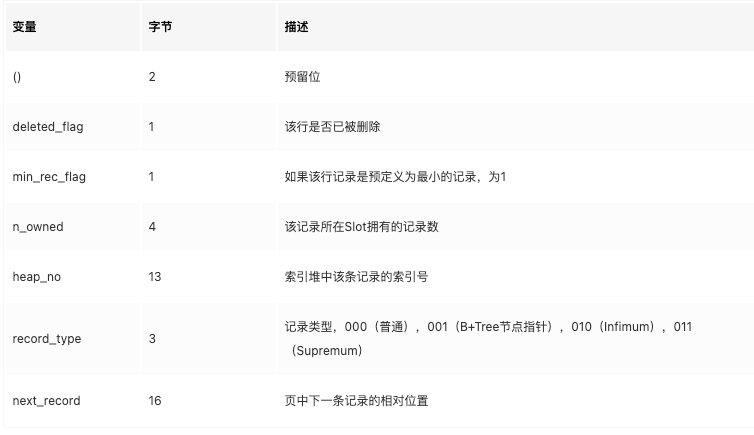</center>

最后的部分就是实际存储每个列的数据。需要特别注意的是：

- **NULL 不占该部分任何空间，即 NULL除了占有 NULL标志位，实际存储不占有任何空间**。
- 每行数据除了用户定义的列外，还有两个隐藏列，**事务 ID列**和**回滚指针列**，分别为6字节和7字节的大小。若InnoDB表没有定义主键，每行还会增加一个6字节的 **rowid列**。

实际数据根据索引类型存储方式不一样，分为：聚簇索引非叶子节点、聚簇索引叶子节点、二级索引非叶子节点、二级索引叶子节点。格式如下：

- 聚簇索引非叶子节点：

  <center></center>

- 聚簇索引叶子节点：

  <center></center>

- 二级索引非叶子节点：

  <center></center>

- 二级索引叶子节点：

  <center></center>

接下去用一个具体示例来分析 Compact 行记录的内部结构∶

<center></center>

在上述示例中，创建表mytest，该表共有4个列。t1、t2、t4都为VARCHAR变长字段类型，t3为固定长度类型 CHAR(因为是latin1编码)。接着插入了3条有代表性的数据，然后将打开表空间文件mytest.ibd（这里启用了innodb_file_per_table，若没有启用该选项，打开默认的共享表空间文ibdatal）。
<center></center>

- 现在第一行数据就展现在用户眼前了。需要注意的是，变长字段长度列表是逆序存放的，因此变长字段长度列表为03 02 01，而不是01 02 03。此外还需要注意 InnoDB每行有隐藏列TransactionID和 Roll Pointer。同时可以发现，固定长度 CHAR字段在未能完全占用其长度空间时，会用0x20来进行填充。
- 接着再来分析下 Record Header 的最后两个字节，这两个字节代表 next recorder，0x2c代表下一个记录的偏移量，即当前记录的位置加上偏移量 0x2c 就是下条记录的起始位置。所以InnoDB 存储引擎在页内部是通过一种链表的结构来串连各个行记录的。

现在来关心有NULL值的第三行数据：
<center></center>

第三行有NULL值，因此NULL标志位不再是00而是06，转换成二进制为00000110，为1的值代表第2列和第3列的数据为NULL。在其后存储列数据的部分，用户会发现没有存储NULL列，而只存储了第1列和第4列非NULL的值。

因此这个例子很好地说明了：不管是CHAR类型还是VARCHAR类型，在compact 格式下NULL 值都不占用任何存储空间。


#### Redundant

Redundant是MySQL5.0版本之前InnoDB的行记录存储方式，MySQL5.0支持Redundant 是为了兼容之前版本的页格式。Redundant行记录采用如下方式存储：

<center></center>

<center></center>

- Redundant行记录格式的首部是一个**字段长度偏移列表**，同样是按照列的顺序**逆序**放置的。

  如果字段为null，最高位为1，如果偏移量使用2字节，并且字段值使用外部存储，则次高位为1。

  注意：CHAR类型的NULL值需要占用空间，全为0。

- 第二个部分为记录头信息（record header），不同于Compact行记录格式，Redundant 行记录格式的记录头占用6字节（48 位），每位的含义如下：

  <center></center>

  可以发现，n_fields 值代表一行中列的数量，占用10位。同时这也很好地解释了为什么 **MySOL 数据库一行支持最多的列为1023**。另一个需要注意的值为1byte_offs_flags，该值**定义了偏移列表占用1字节还是2字节**。而最后的部分就是实际存储的每个列的数据了。

实际数据根据索引类型存储方式不一样，分为：聚簇索引非叶子节点、聚簇索引叶子节点、二级索引非叶子节点、二级索引叶子节点。格式如下：

- 聚簇索引非叶子节点：

  <center></center>

- 聚簇索引叶子节点：

  <center></center>

- 二级索引非叶子节点：

  <center></center>

- 二级索引叶子节点：

  <center></center>

接着创建一张和表mytest内容完全一样但行格式为redundant的表mytest2：

<center></center>

可以看到，现在row_ format 变为Redundant。同样通过hexdump将表空问mytest2.ibd导出到文本文件mytest2.txt。打开文件，找到类似如下行:

<center></center>

23 20 16 14 13 0c 06逆转为06,0c,13,14,16,20,23，分别代表第一列长度6，第二列长度6 (6+6=0x0C),第三列长度为7 (6+6+7=0x13),第四列长度1 (6+6+7+1=0x14), 第五列长度2 (6+6+7+1+2 =0x16)，第六列长度10 (6+6+7+1+2+10=0x20)， 第七列长度3(6+6+7+1+2+10+3=0x23)。

在接下来的记录头信息(Record Header)中应该注意48位中的第22~ 32位，为00000111，表示表共有7个列(包含了隐藏的3列)，接下来的第33位为1,代表偏
移列表为一个字节。

后面的信息就是实际每行存放的数据了，这同Redundant行记录格式大致相同，注意是大致相同，因为如果分析第三行，会发现对于NULL值的处理两者是非常不同的:

<center></center>

这里与之前Compact行记录格式有着很大的不同了，首先来看长度偏移列表，逆序排列后得到06 0c 13 14 94 9e 21,前4个值都很好理解，第5个NULL值变为了94，接着第6个CHAR类型的NULL值为9e (94+10=0x9e)，之后的21代表(14+3=0x21)可以看到对于VARCHAR类型的NULL值，Redundant 行记录格式同样不占用任何存储空间，而**CHAR类型的NULL值需要占用空间**。

当前表mytest2的字符集为Latin1，每个字符最多只占用1字节。若用户将表mytest2的字符集转换为utf8,第三列CHAR固定长度类型不再是只占用10字节了，而
是10X3= 30字节。所以在Redundant行记录格式下，CHAR类型将会占用可能存放的最大值字节数。


#### 行溢出数据
InnoDB存储引擎可以将一条记录中的某些数据存储在真正的数据页面之外。一般认为 BLOB、LOB 这类的大对象列类型的存储会把数据存放在数据页面之外。但是，这个理解有点偏差，**BLOB 可以不将数据放在溢出页面，而且即便是VARCHAR列数据类型，依然有可能被存放为行溢出数据，因为数据页只保存前768字节的前缀数据，之后是偏移量，指向溢出页，也就是Uncompressed BLOB Page。**

首先对VARCHAR数据类型进行研究。MySQL数据库的VARCHAR类型可以存放**65535字节**。但是，这是真的吗?真的可以存放65535字节吗?如果创建VARCHAR长度为65535的表，用户会得到下面的错误信息∶

<center>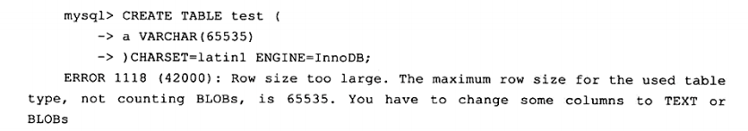</center>


从错误消息可以看到InnoDB存储引擎并不支持65535长度的VARCHAR。这是因为还有别的开销，**通过实际测试发现能存放 VARCHAR类型的最大长度为65532**。

还需要注意上述创建的 VARCHAR长度为65532的表，其字符类型是 latin1 的，如果换成 GBK 又或 UTF-8的，会产生怎样的结果呢?
<center></center>

- **VARCHAR(N)中的N指的是字符的长度。而上面说明VARCHAR类型最大支持65535，单位是字节**。

- 此外需要注意的是，MySQL官方手册中定义的 65535 长度是**指所有VARCHAR列的长度总和**，**如果列的长度总和超出这个长度，依然无法创建**。

<center></center>

3个列长度总和是66000，因此 InnoDB存储引擎再次报了同样的错误。即使能存放65532个字节，但是有没有想过，InnoDB存储引擎的页为16KB，即16384字节，怎么能存放65532字节呢?因此，在一般情况下，InnoDB存储引擎的数据都是存放在页类型为B-tree node 中。但是当发生行溢出时，数据存放在页类型为 Uncompress BLOB页中，**数据页只保存前768字节的前缀数据，之后是偏移量，指向溢出页，也就是Uncompressed BLOB Page**。

<center></center>


**那多长的VARCHAR是保存在单个数据页中的，从多长开始又会保存在BLOB顶呢?** 

InnoDB存储引擎表是索引组织的，即 B+Tree 的结构，这样**每个页中至少应该有两条行记录**（否则失去了B+Tree 的意义，变成链表了）。因此，如果**页中只能存放下一条记录，那么 InnoDB存储引擎会自动将行数据存放到溢出页中**。

如果在一个页至少放入两行数据，那Varchar类型的行数据不会放到BLOB页中去，这个阈值长度为**8098字节**。

另一个问题是，对于**TEXT或BLOB**的数据类型，用户总是以为它们是存放在Uncompressed BLOB Page 中的，其实这也是不准确的。是放在数据页中还是 BLOB页中，和前面讨论的VARCHAR一样，**至少保证一个页能存放两条记录**。如：建立含有BLOB类型列的表，然后插人4行数据长度为8000的记录，发现其实数据并没有保存到BLOB页中：

<center></center>

当然既然用户使用了BLOB列类型，一般不可能存放长度这么小的数据。因此在大多数的情况下BLOB 的行数据还是会发生行溢出，实际数据保存在 BLOB 页中，数据页只保存数据的前768字节。


#### Compressed 和 Dynamic 行记录格式
InnoDB 1.0.x 版本开始引入了新的文件格式（file format，用户可以理解为新的页格式），以前支持的 Compact 和Redundant 格式称为 Antelope 文件格式，新的文件格式称为 Barracuda 文件格式。

Barracuda 文件格式下拥有两种新的行记录格式：Compressed和 Dynamic。

主要有两种不同：

- 新的两种记录格式对于存放在 BLOB中的数据采用了**完全的行溢出的方式，在数据页中只存放 20个字节的指针**，实际的数据都存放在 Off Page 中，而之前的 Compact 和 Redundant 两种格式会存放 768个前缀字节。

  <center></center>

- Compressed 行记录格式的另一个功能就是，**存储在其中的行数据会以 zlib 的算法进行压缩**，因此对于 BLOB、TEXT、VARCHAR这类大长度类型的数据能够进行非常有效的存储。


#### CHAR的行结构存储
通常理解VARCHAR 是存储变长长度的字符类型，CHAR 是存储固定长度的字符类型。而在前面的小节中，用户已经了解行结构的内部的存储，并可以发现每行的变长字段长度的列表都没有存储 CHAR类型的长度。

**从MySQL 4.1版本开始，CHAR（N）中的N指的是字符的长度，而不是之前版本的字节长度**。也就说在不同的字符集下，CHAR类型列内部存储的可能不是定长的数据。例如下面的这个示例∶

往 gbk编码的 char(2)中，插入了我们ab两个数据，查看所占字节：

<center></center>

前两个记录’ab和’我们’字符串长度都为2，但是在内部存储时’ab’占2字节，'我们’占4个字节。

也就是说在不同的字符集下，CHAR类型内部存储的可能不是定长的数据，比如：在latin1编码下，都是单字节；在gbk编码下，英文是单字节，中文是两字节；在utf-8编码下，英文是单字节，中文是三字节。也就是说在utf-8下，CHAR(10)最小可以存储10字节的字符，最大可以存储30字节的字符。因此**对于多字节字符编码的CHAR数据类型的存储，InnoDB存储引擎在内部将其视为变长字符类型。**

<center></center>

上述例子清楚地显示了InnoDB存储引擎内部对CHAR类型在多字节字符集类型的存储。CHAR类型被明确视为了变长字符类型，对于未能占满长度的字符还是填充 0x20。因此可以认为在多字节字符集的情况下，CHAR和 VARCHAR的实际行存储基本是没有区别的。


### 数据页结构

页是 InnoDB存储引擎管理数据库的最小磁盘单位。页类型为B-tree Node(FIL_PAGE_INDEX) 的页存放的即是表中行的实际数据了。Index page用于存储数据和索引。Index page总体结构如下图所示：

<center></center>


InnoDB数据页由以下 7个部分组成：

<center>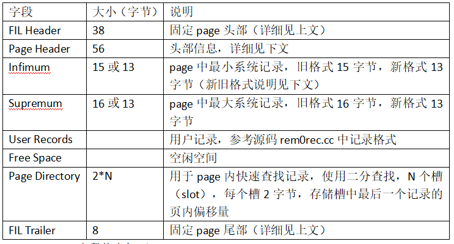</center>

其中File Header、Page Header、File Trailer 的大小是固定的，分别为38、56、8字节，这些空间用来标记该页的一些信息，如 Checksum，数据页所在 B+树索引的层数等。User Records、Free Space、Page Directory 这些部分为实际的行记录存储空间，因此大小是动态的。


#### File Header & Page Header & File Trailer

File Header用来记录页的一些头信息，共占用38字节。

接着 File Header部分的是Page Header，该部分用来记录数据页的状态信息，由14个部分组成，共占用56字节。

每个page具有相同的尾部(**File Trailer**)，该尾部占用固定8字节大小，是为了**检测页是否已经完整地写入磁盘**（如可能发生的写入过程中磁盘损坏、机器关机等）。

> 具体看后面的ibd文件格式解析。


#### Infimum 和 Supremum Record
在InnoDB存储引擎中，**每个数据页中有两个虚拟的行记录(伪行记录)，用来限定记录的边界**。

- **Infimum 记录是比该页中任何主键值都要小的值；**
- **Supremum指比任何可能大的值还要大的值。**

这两个值在页创建时被建立，并且在任何情况下不会被删除。在 Compact 行格式和 Redundant行格式下，两者占用的字节数各不相同。
<center></center>

（1）compact & compressed & dynamic 格式的记录：

- Infimum记录存储格式：

<center></center>

- Supremum记录存储格式：

<center></center>


（2）redundant 格式的记录：

- Infimum记录存储格式：

  <center>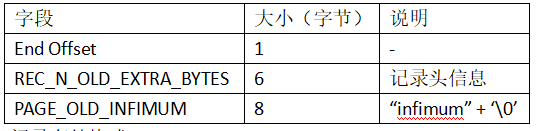</center>


- Supremum记录存储格式：

<center></center>


#### User Record 和 Free Space

User Record就是之前讨论过的部分，即实际存储行记录的内容。再次强调，InnoDB 存储引擎表总是 B+ 树索引组织的。

**Free Space很明显指的就是空闲空间，同样也是个链表数据结构。在一条记录被删除后，该空间会被加入到空闲链表中**。

#### Page Directory
Page Directory(页目录)中**存放了记录的相对位置**(注意，这里存放的是页相对位置，而不是偏移量)，有些时候这些记录指针称为 Slots（槽）或目录槽（Directory Slots）。

与其他数据库系统不同的是，**在 InnoDB中并不是每个记录拥有一个槽，InnoDB 存储引擎的槽是一个稀疏目录（sparse directory），即一个槽中可能包含多个记录**。**伪记录Infimum 的n_owned值总是为1，记录 Supremum 的n_owned 的取值范围为【1，8】，其他用户记录n_owned 的取值范围为【4，8】**。**当记录被插入或删除时需要对槽进行分裂或平衡的维护操作。**

在 Slots 中记录按照索引键值顺序存放，这样可以利用二叉查找迅速找到记录的指针。假设有（‘i’，‘d’，‘c’，‘b’，‘e’，‘g’，‘1’，‘h’，‘f’，'j，‘k’，‘a’），同时假设一个槽中包含4条记录，则 Slots 中的记录可能是（‘a’，‘e’，‘i’）。

由于在 InnoDB存储引擎中Page Direcotry 是稀疏目录，二叉查找的结果只是一个粗略的结果，因此 InnoDB存储引擎必须通过 recorder header 中的 next_record来继续查找相关记录。同时，Page Directory很好地解释了recorder header中的n_owned值的含义，因为这些记录并不包括在 Page Directory 中。

需要牢记的是，**B+ 树索引本身并不能找到具体的一条记录，能找到只是该记录所在的页。数据库把页载入到内存，然后通过Page Directory 再进行二叉查找**。只不过二叉查找的时间复杂度很低，同时在内存中的查找很快，因此通常忽略这部分查找所用的时间。


#### InnoDB数据页结构示例分析

通过前面各小节的介绍，相信读者对 InnoDB存储引擎的数据页已经有了一个大致的了解。本小节将通过一个具体的表，结合前面小节所介绍的内容来具体分析一个数据页的内部存储结构。首先建立一张表t，并导入一定量的数据：

<center></center>

接下来用py_innodb_page_info来分析t.ibd，得到如下内容：

<center></center>

可以发现第四个页(page offset 3)是数据页，然后通过hexdump来分析.ibd文件打开整理得到的十六进制文件，数据页从0x0000c000 (16K*3=0xc000)处开始，得到以下内容：

<center></center>

（1）**File Header**

先来分析前面File Header的38字节：

- 52 1b 24 00，数据页的Checksum值。
- 00 00 00 03，页的偏移量，从0开始。
- ff ff ff ff，前一个页，因为只有当前一个数据页,所以这里为0xffffffff。
- ff ff ff ff，下一个页，因为只有当前一个数据页，所以这里为0xffffffff。
- 00 00 00 0a 6a e0 ac 93，页的LSN。
- 45 bf，页类型，0x45bf 代表数据页。
- 00 00 00 00 00 00 00，这里暂时不管该值。
- 00 00 00 dc，表空间的SPACE ID。

（2）**File Header**

不急着看下面的Page Header部分，先来观察File Trailer部分。因为File Trailer通过比较File Header部分来保证页写人的完整性。File Trailer的8字节为:

```bash
95 ae 5d 39 6a e0 ac 93
```

- 95 ae 5d 39，Checksum值，该值通过checksum函数与FileHeader部分的checksum值进行比较。
- 6a e0 ac 93，注意该值和FileHeader部分页的LSN后4个值相等。

（3）**Page Header**

接着分析56字节的Page Header部分。对于数据页而言，Page Header部分保存了该页中行记录的大量细节信息。分析后可得：

<center></center>

- PAGE_N_DIR_SLOTS=0x001a，代表Page Directory有26个槽，每个槽占用2字节，我们可以从0x0000ffc4到0x0000ff7中找到如下内容:

  <center></center>

- PAGE_HEAP_TOP=0x0dc0代表空闲空间开始位置的偏移量，即0xc000+0x0dc0=0xcdc0处开始，观察这个位置的情况，可以发现这的确是最后一行的结束，接下去的部分都是空闲空间了。

  <center>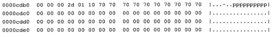</center>

- PAGE_N_HEAP=0x8066，当行记录格式为Compact时，初始值为0x0802；当行格式为Redundant时，**初始值是2**。其实这些值**表示页初始时就已经有Infinimun和Supremum的伪记录行**，0x8066-0x8002=0x64,代表该页中实际的记录有100条记录。

- PAGE_FREE=0x0000代表可重用的空间首地址，因为这里没有进行过任何删除操作，故这里的值为0。

- PAGE_GARBAGE=0x0000代表删除的记录字节为0，同样因为我们没有进行过删除操作，这里的值依然为0。

- PAGE_LAST_INSERT=0x0da5，表示页最后插人的位置的偏移量，即最后的插入位置应该在0xc0000+0x0da5=0xcda5，查看该位置:

  <center></center>

  可以看到的确是最后插入a列值为100的行记录，但是这次直接**指向了行记录的内容**，而不是指向行记录的变长字段长度的列表位置。

- PAGE_DIRECTION=0x0002， 因为通过自增长的方式进行行记录的插人，所以PAGE_ DIRECTION 的方向是向右，为0x00002。
- PAGE_N_DIRECTION=0x0063，表示一个方向连续插人记录的数量，因为我们是自增长的方式插人了100条记录，因此该值为99。
- PAGE_N_RECS=0x0064,表示该页的行记录数为100, 注意该值与PAGE_N_HEAP的比较，**PAGE_N_HEAP 包含两个伪行记录，并且是通过有符号的方式记录的**，因此值为0x8066。
- PAGE_LEVEL=0x00，代表该页为叶子节点。因为数据量目前较少，因此当前B+树索引只有一层。**B+数叶子层总是为0x00**。
- PAGE_ INDEX_ ID=0x000000000001ba， 索引ID.

（4）**Infimum 和 Supremum Record**

前面提到过InnoDB存储引擎有两个伪记录，用来限定行记录的边界，接着往下看:

<center></center>

观察0xc05E到0xc077，这里存放的就是这两个伪行记录，在InnoDB存储引擎中设置伪行只有一个列，且类型是Char (8)。伪行记录的读取方式和一般的行记录并无不同，我们整理后可以得到如下结果:

<center></center>

然后来分析infimum行记录的recorder header部分，最后两个字节位00 1c表示下一个记录的位置的偏移量，即当前行记录内容的位置0xc063+0x001c，即0xc07f。0xc07f应该很熟悉了，之前分析的行记录结构都是从这个位置开始，如：

<center></center>

可以看到这就是第一条实际行记录内容的位置了，整理后我们可以看到：

<center></center>

通过Recorder Header的最后两个字节记录的下一行记录的偏移量就可以得到该页中所有的行记录，**通过Page Header的PAGE_PREV 和PAGE_NEXT就可以知道上个页和下个页的位置，这样InnoDB存储引擎就能读到整张表所有的行记录数据**。

（5）**PageDirectory**

最后分析PageDirectory，前面已经提到了从0x0000ffc4到0x0000ff7是当前页的Page Directory，如下:

<center></center>

需要注意的是，**Page Directory是逆序存放的，每个槽占2字节**，因此可以看到00 63是最初行的相对位置，即0xc063；0070就是最后一行记录的相对位置，即
0xc070。我们发现这就是前面分析的Infmum和Supremum的伪行记录。

Page Directory槽中的数据都是按照主键的顺序存放的，因此查询具体记录就需要通过部分进行。前面已经提到InnoDB存储引擎的槽是稀疏的，故**还需通过RecorderHeader的n_owned进行进一步的判断**，如InnoDB存储引擎需要找主键a为5的记录，通过二叉查找PageDirectory的槽，可以定位记录的相对位置在00 e5处，找到行记录的实际位置0xc0e5.

<center></center>

可以看到第一行的记录是4，不是我们要找的6，但是可以发现前面的5字节的Record Header为04 00 28 00 22。找到4~ 8位表示n_owned值得部分，该值为4，表示该记录有4个记录，因此还需要进一步查找，通过recorder header最后两个字节的偏移最0x0022找到下一条记录的位置0xc107,这才是最终要找的主键为5的记录。


### Named File Formats 机制

长字符类型字段的存储。这些新的页数据结构和之前版本的页并不兼容，因此从 InnoDB 1.0.x版本开始，InnoDB存储引通过 Named File Formats机制来解决不同版本下页结构兼容性的问题。

InnoDB存储引擎将1.0.x 版本之前的文件格式（file format）定义为 Antelope，将这个版本支持的文件格式定义为 Barracuda。新的文件格式总是包含于之前的版本的页格式。下图显示了Barracuda 文件格式和 Antelope 文件格式之间的关系，Antelope文件格式有Compact 和 Redudant 的行格式，Barracuda 文件格式既包括了 Antelope 所有的文件格式，另外新加入了之前已经提到过的 Compressed和 Dynamic行格式。

<center></center>

参数 `innodb_file_format` 用来指定文件格式，可以通过下面的方式来查看当前所使用的InnoDB存储引擎的文件格式。

<center></center>

参数 `innodb_filc_format_check` 用来检测当前 InnoDB存储引擎文件格式的支持度，该值默认为 ON，如果出现不支持的文件格式，用户可能在错误日志文件中看到类似如下的错误：

<center></center>


### 约束(数据完整性)

关系型数据库系统和文件系统的一个不同点是，**关系数据库本身能保证存储数据的完整性，不需要应用程序的控制**，而文件系统一般需要在程序端进行控制。 当前几平所有的关系型数据库都提供了**约束（constraint）机制**，该机制提供了一条强大而简易的途径来**保证数据库中数据的完整性**。

**完整性约束保证授权用户对数据库所做的修改不会破坏数据的一致性**。因此，**完整性约束防止的是对数据的意外破坏**。

一般来说，**数据完整性有以下三种形式∶**

- **实体完整性保证主属性不能为null**。在 InnoDB存储引擎表中，用户可以通过定义**Primary Key** 或 **Unique Key** 约束来保证实体的完整性。用户还可以通过编写一个触发器来保证数据完整性。

- **域完整性保证数据每列的值满足特定的条件**。在 InnoDB存储引擎表中，域完整性可以通过以下几种途径来保证∶

  （1）选择合适的数据类型确保一个数据值满足特定条件。
  （2）外键（Foreign Key）约束。
  （3）编写触发器。
  （4）还可以考虑用DEFAULT约束作为强制域完整性的一个方面。

- **参照完整性保证两张表之间的关系**。InnoDB存储引擎支持外键，因此允许用户定义外键以强制参照完整性，也可以通过编写触发器以强制执行。

对于InnoDB存储引擎本身而言，提供了以下几种约束∶

- Primary Key
- Unique Key
- Foreign Key
- Default
- NOT NULL
- Check

（1）**约束的创建**

约束的创建可以采用以下两种方式∶

- **表建立时就进行约束定义**
- **利用 ALTER TABLE 命令来进行创建约束**

**对 Unique Key（唯一索引）的约束，用户还可以通过命令 CREATE UNIQUE INDEX 来建立**。

约束会有一个名称：

- 对于主键约束而言，其默认约束名为PRIMARY。
- 而对于Unique Key 约束而言，默认约束名和列名一样，当然也可以人为指定 Unique Key约束的名字。
- Foreign Key 约束似乎会有一个比较神秘的默认名称。

通过information_schema架构下的表**TABLE_CONSTRAINTS**来查看当前MySQL库下所有的约束信息。对于Foreign Key的约束的命名，用户还可以通
过查看表**REFERENTIAL_CONSTRAINTS**，并且可以详细地了解外键的属性。

（2）**约束和索引的区别**

当用户创建了一个唯一索引就创建了一个唯一的约束。但是约束和索引的概念还是有所不同的，**约束更是一个逻辑的概念**，用来保证数据的完整性，**而索引是一个数据结构**，**既有逻辑上的概念，在数据库中还代表着物理存储的方式**。

（3）**对错误数据的约束**

在某些默认设置下，MySOL 数据库允许非法的或不正确的数据的插入或更新，又或者可以在数据库内部将其转化为一个合法的值，如向 NOT NULL 的字段插入一个NULL值，MySOL数据库会将其更改为 0 再进行插入，因此数据库本身没有对数据的正确性进行约束。

如果用户想通过约束对于数据库非法数据的插入或更新，即 MySQL 数据库提示报错而不是警告，那么用户必须设置参数**sql_mode**，用来严格审核输入的参数，如∶

```bash
SET sql_mode = 'STRICT_TRANS_TABLES'
```

<center></center>


（4）**ENUM和 SET约束**

**MySQL数据库不支持传统的 CHECK约束，但是通过 ENUM 和 SET类型可以解决部分这样的约束需求，只限于离散数值的约束，连续值的范围约束或更复杂的约束就需要用触发器来实现对于值域的约束**。例如表上有一个性别类型，规定域的范围只能是male 或 female，在这种情况下用户可以通过 ENUM类型来进行约束。

```sql
create table a(
	id int,
    sex enum('male','female')
);
```

注意：需要配合设置参数sql_mode，不然插入就是报警告而不是报错。


（5）**触发器与约束**

触发器的作用是在执行INSERT、DELETE 和UPDATE命令之前或之后自动调用SQL 命令或存储过程。MySQL 5.0对触发器的实现还不是非常完善，限制比较多，MySQL 5.1 开始触发器已经相对稳定，功能也较之前有了大幅的提高。

创建触发器的命令是CREATE TRIGGER，只有具备 Super权限的 MySQL 数据库用户才可以执行这条命令∶

```sql
CREATE <触发器名> < BEFORE | AFTER >
<INSERT | UPDATE | DELETE >
ON <表名> FOR EACH Row <触发器主体>
```

- **最多可以为一个表建立6个触发器**，即分别为INSERT、UPDATE、DELETE的BEFORE 和 AFTER各定义一个。

- **BEFORE和 AFTER代表触发器发生的时间，表示是在每行操作的之前发生还是之后发生**。
- 当前 MySOL数据库只支持**FOR EACH ROW**的触发方式，即按每行记录进行触发，不支持像 DB2的 FOR EACH STATEMENT的触发方式。

通过触发器，用户可以实现MySOL数据库本身并不支持的一些特性，如对干传统CHECK 约束的支持，物化视图、高级复制、审计等特性。这里先关注触发器对于约束的支持。

例子：

```sql
CREATE TRIGGER tgr_usercash_update BEFORE UPDATE ON usercash
FOR EACH ROW
BEGIN
IF new.cash-old.cash > 0 THEN
INSERT INTO usercash_err_log SELECT old. userid, old. cash, new . cash, USERl), NOWI);
SET new.cash=old.cash;
END IF;
END;
$$
```

用户购买东西余额一般是减的，但如果执行的是减一个负值，那么最终的余额反而会增加，因此编写一个触发器，如果修改后的新余额大于旧的余额，则将错误数据写入usercash_err_log表(提前创建好)中，并将余额设置为旧的余额。


（6）**外键约束**

外键用来保证参照完整性，**MySQL 数据库的 MyISAM存储引擎本身并不支持外键，对于外键的定义只是起到一个注释的作用**。而InnoDB存储引擎则完整支持外键约束。外键的定义如下：

```sql
[CONSTRAINT [symbol]] FOREIGN KEY
[index_name] (index_col_name, ...)
REFERENCES tbl_name(index_col_name, . ..)
[ON DELETE reference_option]
[ON UPDATE reference_option]
reference_option:
RESTRICT | CASCADE | SET NULL | NO ACTION
```

一般来说，称被引用的表为父表，引用的表称为子表。外键定义时的**ON DELETE** 和 **ON UPDATE**表示在对父表进行DELETE 和UPDATE操作时，对子表所做的操作，可定义的子表操作有：

- **CASCADE**：当父表发生 DELETE或UPDATE操作时，对相应的子表中的数据也进行DELETE或UPDATE操作
- **SET NULL**：当父表发生DELETE或 UPDATE 操作时，相应的子表中的数据被更新为 NULL 值，但是子表中相对应的列必须允许为NULL值
- **NO ACTION**：当父表发生DELETE或 UPDATE操作时，抛出错误，不允许这类操作发生
- **RESTRICT（默认）**：当父表发生 DELETE或 UPDATE操作时，抛出错误，不允许这类操作发生

在其他数据库中，如 Oracle数据库，有一种称为**延时检查（deferred check）**的外键约束，即检查在 SQL语句运行完成后再进行。而目前 MySOL数据库的外键约束都是**即时检查（immediate check）**，因此从上面的定义可以看出，在 MySQL数据库中NO ACTION和 RESTRICT的功能是相同的。

InnoDB存储引擎**在外键建立时会自动地对该列加一个索引**。因此可以很好地**避免外键列上无索引而导致的死锁问题的产生**。

对于参照完整性约束，外键能起到一个非常好的作用。但是对于数据的导入操作时，外键往往导致在外键约束的检查上花费大量时间。因为 MySQL 数据库的外键是即时检查的，所以对导入的每一行都会进行外键检查。但是**用户可以在导入过程中忽视外键的检查**，如：

```sql
set foreign_key_checks = 0;
```


### 视图

视图是由一个或多个表导出的虚表，其本质是对应于一条SELECT语句，结果集被赋予一个名字，即视图名字。

视图本身并不包含任何数据，它只包含映射到基表的一个查询语句，当基表数据发生变化，视图数据也随之变化。当然，在创建视图时，可以加上WITH CHECK OPTION使视图可以进行更新，只是在更新时会对数据进行检查，对于不满足视图定义条件的，将会抛出一个异常，不允许更新。

视图能简化用户的操作、提供了一定程度的逻辑独立性、使用户能以多种角度看待统一数据、能够对机密数据提供安全保护。


### 物化视图

Oracle数据库支持物化视图(Materialized Views)：

- 该视图不是基于基表的虚表，而**是根据基表实际存在的实表，即物化视图的数据存储在非易失的存储设备上**；
- **在查询物化视图时，并不会去访问基表，而是直接从物化视图里读数据**；
- **基表的数据会修改，那么物化视图的数据也要跟着修改**。

在Oracle数据库中，物化视图的创建方式包括以下两种:

- BUILD IMMEDIATE(默认)：在创建物化视图的时候就生成数据；
- BUILD DEFERRED ：在创建物化视图时不生成数据，以后根据需要再生成数据。

**查询重写是指当对物化视图的基表进行查询时，数据库会自动判断能否通过查询物化视图来直接得到最终的结果，如果可以，则避免了聚集或连接等这类较为复杂的SQL操作，直接从已经计算好的物化视图中得到所需的数据。**

**物化视图的刷新是指当基表发生了DML操作后，物化视图何时采用哪种方式和基表进行同步**。刷新的模式有两种:

- ON DEMAND：物化视图在用户需要的时候进行刷新；
- ON COMMIT：物化视图在对基表的DML操作提交的同时进行刷新。

而刷新的方法有四种:

- FAST：采用增量刷新，只刷新自上次刷新以后进行的修改；
- COMPLETE：对整个物化视图进行完全的刷新；
- FORCE：数据库在刷新时会去判断是否可以进行快速刷新，如果可以，则采用FAST方式，否则采用COMPLETE的方式；
- NEVER：物化视图不进行任何刷新。

MySQL数据库本身并不支持物化视图，换句话说，MySQL数据库中的视图总是虚拟的。但是用户可以通过一些机制来实现物化视图的功能。

例如要创建一个ON DEMAND的物化视图还是比较简单的，用户只需定时把数据导人到另一张表，另一张表就是物化视图，且这是COMPLETE刷新方式，要实现FAST方式，需要记录上一次统计时主键的位置。

要实现ON COMMIT的物化视图就要通过触发器来实现了：

<center></center>


### 分区表

#### 概述

分区功能并不是在存储引擎层完成的，因此不是只有InnoDB存储引擎支持分区，常见的存储引擎 MyISAM、NDB等都支持。但也并不是所有的存储引擎都支持， 如CSV、FEDORATED、MERGE等就不支持。在使用分区功能前，应该对选择的存储引擎对分区的支持有所了解。

MySQL 数据库在5.1版本时添加了对分区的支持。分区的过程是将一个表或索引分解为多个更小、更可管理的部分。就访问数据库的应用而言，从逻辑上讲，只有一个表或一个索引，但是在物理上这个表或索引可能由数十个物理分区组成。每个分区都是独立的对象，可以独自处理，也可以作为一个更大对象的一部分进行处理。

**分区主要用于数据库高可用性的管理**。在 OLTP应用中，对于分区的使用应该非常小心。如果只是一味地使用分区，而不理解分区是如何工作的，也不清楚你的应用如何使用分区，那么分区极有可能会对性能产生负面的影响。

**MySQL 数据库支持的分区类型为水平分区**（不同行的数据放到不同物理文件），并不支持垂直分区（不同列的数据放到不同物理文件）。此外，MySQL 数据库的分区是**局部分区索引**，一个分区中既存放了数据又存放了索引。而全局分区是指，数据存放在各个分区中，但是所有数据的索引放在一个对象中。目前，MySQL数据库还不支持全局分区。

可以通过以下命令来查看当前数据库是否启用了分区功能：

```sql
show variables like '%partition%';
```

也可以通过`show plugins;`。

当前 MySQL 数据库支持以下几种类型的分区：

- RANGE 分区：行数据基于属于一个给定连续区间的列值被放入分区，主要用于日期列的分页。MySQL5.5开始支持RANGE COLUMNS的分区。
- LIST分区：和 RANGE分区类型，只是 LIST分区面向的是离散的值。MySQL5.5开始支持LIST COLUMNS的分区。
- HASH分区：根据用户自定义的表达式的返回值来进行分区，返回值不能为负数，将数据均匀地分布到预先定义的各个分区中，保证各分区的数据数量大致都是一样的。
- KEY分区：根据 MySQL数据库提供的函数(NDB是MD5,其他使hash)来进行分区。

不论创建何种类型的分区，**如果表中存在主键或唯一索引时，分区列必须是唯一索引的一个组成部分**，也就是：唯一索引可以是允许 NULL值的，并且分区列只要是唯一索引的一个组成部分，不需要整个唯一索引列都是分区列。**如果建表时没有指定主键，唯一索引，可以指定任何一个列为分区列**。


#### 分区类型

**（1）RANGE分区**

我们介绍的第一种分区类型是RANGE分区，也是最常用的一种分区类型。下面的CREATE TABLE语句创建了一个id列的区间分区表。当id小于10时，数据插入 p0分区。当id大于等于10小于20时，数据插入p1分区。

<center></center>

查看表在磁盘上的物理文件，启用分区之后，表不再由一个ibd文件组成了，而是由建立分区时的各个分区 ibd文件组成，如下面的t#P#p0.ibd，t#P#p1.ibd∶

<center></center>

可以在**information_schema.PARTITIONS**中查看每个分区的情况：

<center></center>

TABLE ROWS列反映了每个分区中记录的数量。向表中插入了9、10、15三条记录，因此可以看到，当前分区p0中有1条记录，分区p1中有2条记录。

对于表t，由于我们定义了分区，因此对于插入的值应该严格遵守分区的定义，**当插入一个不在分区中定义的值时，MySQL数据库会抛出一个错误**。如下所示，我们向表t 中插入30这个值。

<center></center>

对于上述问题，我们可以对分区添加一个**MAXVALUE** 值的分区。MAXVALUE可以理解为正无穷，因此所有大于等于20且小于MAXVALUE 的值别放入 p2分区。

<center></center>

**RANGE主要用于日期列的分页，比如可以根据年来分区存放销售记录。**

<center></center>

这样创建的好处是，便于对 sales 这张表的管理。如果我们要删除 2008年的数据，不需要执行DELETE FROM sales WHERE date>='2008-01-01’and date<‘2009-01-01’，只需删除2008年数据所在的分区即可：

```sql
alter table sales drop partition p2008;
```

这样创建的另一个好处是**可以加快某些查询操作**，如果我们只需要查询2008年整年的销售额，可以这样：

```sql
EXPAIN PARTITIONS SELECT * FROM sales  WHERE date>='2008-01-01' AND date<='2008-12-31';
```

<center></center>

这样的话只会查询p2008这个分区，不会查询所有分区。

对于RANGE分区的查询，**优化器只能对YEAR()，TO DAYS()，TO SECONDSO()，UNIX TIMESTAMP()** 这类函数进行优化选择。


（2）**LIST分区**

LIST分区和RANGE分区非常相似，只是**分区列的值是离散的，而非连续的**。如：

```sql
CREATE TABLE t(
    a INT,
    b INT
)ENGINE=INNODB -> PARTITION BY LIST(b)(
    PARTITION p0 VALUES IN(1,3,5,7,9),
    PARTITION p1 VALUES IN(0,2,4,6,8)
);
```

在用INSERT插入多个行数据的过程中遇到分区未定义的值时，MyISAM和InnoDB存储引擎的处理完全不同：

- MyISAM引擎会将之前的行数据都插入，但之后的数据不会被插入；
- 而InnoDB存储引擎将其视为一个事务，因此没有任何数据插入。

在使用分区时，要对不同引擎的事务特性进行考虑。


（3）**HASH 分区**

**HASH分区的目的是将数据均匀地分布到预先定义的各个分区中，保证各分区的数据数量大致都是一样的**。在 RANGE 和LIST分区中，必须明确指定一个给定的列值或列值集合应该保存在哪个分区中；而在HASH分区中，**MySQL 自动完成这些工作，用户所要做的只是基于将要进行哈希分区的列值指定一个列值或表达式，以及指定被分区的表将要被分割成的分区数量。**

要使用HASH分区来分割一个表，要在 CREATE TABLE 语句上添加一个"PARTITION BY HASH(expr)"子句，其中"expr"是一个返回一个整数的表达式。它可以仅仅是字段类型为 MySQL整型的列名。此外，用户很可能需要在后面再添加一个"PARTITIONS num’子句，其中 mum是一个非负的整数，它表示表将要被分割成分区的数量。如果没有包括一个 PARTITIONS子句，那么分区的数量将默认为1。

下面的例子创建了一个HASH分区的表t，分区按日期列 b 进行∶

<center></center>

如果插人一个列b为2010-04-01的记录到表t_ hash 中，那么保存该条记录的分区=MOD (YEAR('2010-04-01'),4)=MOD (2010, 4)=2，因此记录会放入分区p2中。

当然也许并不能把数据均匀地分布到各个分区中去，因为分区是按照YEAR函数进行的，而这个值本身可是离散的。**如果对于连续的值进行 HASH分区，如自增长的主键，则可以较好地将数据进行平均分布**。

MySQL 数据库还支持一种称为LINEAR HASH的分区，它使用一个更加复杂的算法来确定新行插入到已经分区的表中的位置。它的语法和 HASH分区的语法相似，只是将关键字HASH改为LINEAR HASH。下面创建一个LINEAR HASH的分区表t_linear_hash，它和之前的表t_hash相似，只是分区类型不同。

同样插人'2010-04-01'的记录，这次MySQL数据库根据以下的方法来进行分区的判断：

- 取大于分区数量4的下一个2的幂值V, V=POWER(2, CEILING(LOG(2,num))=4;
- 所在分区N=YEAR( '2010-04-01' )&(V-1)=2。

虽然还是在分区P2，但是计算的方法和之前的HASH分区完全不同。

LINEAR HASH分区的优点在于，增加、删除、合并和拆分分区将变得更加快捷，这有**利于处理含有大量数据的表**。它的缺点在于，与使用HASH分区得到的数据分布相比，各个分区间数据的分布可能不大均衡。


（4）**KEY分区**

KEY分区和 HASH分区相似，不同之处在于**HASH分区使用用户定义的函数进行分区，KEY分区使用MySQL 数据库提供的函数进行分区**。对于NDB Cluster 引擎，MySQL数据库使用MD5 函数来分区;对于其他存储引擎，MySOL数据库使用其内部的哈希函数，这些函数基于与PASSWORD()一样的运算法则。如∶

<center></center>

在 KEY分区中使用关键字LINEAR和在 HASH分区中使用具有同样的效果，分区的编号是通过2的幂（powers-of-two）算法得到的，而不是通过模数算法。


（5）**COLUMNS分区**

在前面介绍的RANGE、LIST、HASH 和KEY这四种分区中，分区的条件是：数据必须是整型（interger），如果不是整型，那应该需要通过函数将其转化为整型，如YEAR()，TO_DAYS()，MONTH()等函数。MySQL5.5版本开始支持COLUMNS分区，可视为RANGE分区和LIST分区的一种进化。**COLUMINS分区可以直接使用非整型的数据进行分区，分区根据类型直接比较而得，不需要转化为整型**。此外，RANGECOLUMNS分区可以对多个列的值进行分区。

COLUMNS分区支持以下的数据类型：

- 所有的整型类型，如 INT、SMALLINT、TINYINT、BIGINT。FLOAT和 DECIMAL则不予支持。
- 日期类型，如 DATE 和 DATETIME。其余的日期类型不予支持。
- 字符串类型，如 CHAR、VARCHAR、BINARY和 VARBINARY。BLOB和 TEXT类型不予支持。
- 对于日期类型的分区，我们不再需要 YEAR()和 TO DAYS()函数了，而直接可以使用COLUMNS。


>**分区中的NULL值**：
>
>MySQL 数据库允许对NULL值做分区，但是处理的方法与其他数据库可能完全不同。MYSOL数据库的分区总是视NULL值视小于任何的一个非NULL值，这和MySQL数据库中处理NULL值的 ORDER BY操作是一样的。因此对于不同的分区类型，MySQL数据库对于NULL 值的处理也是各不相同。
>
>- 对于RANGE分区，如果向分区列插入了NULL值，则 MySQL 数据库会将该值放入最左边的分区；
>- 在LIST分区下要使用NULL值，则必须显式地指出哪个分区中放入NULL值，否则会报错；
>- HASH和KEY分区对于NULL的处理方式和RANGE分区、LIST分区不一样。任何分区函数都会将含有NULL值的记录返向为0。


#### 子分区
子分区（subpartitioning）是在分区的基础上再进行分区，有时也称这种分区为复合分区（composite partitioning）。MySQL数据库**允许在RANGE和LIST的分区上再进行HASH或KEY的子分区**。子分区可以用于特别大的表，在多个磁盘间分别分配数据和索引。

<center></center>

我们也可以通过使用SUBPARTITION语法来显式地指出各个子分区的名字，例如对上述的ts表同样可以这样：

<center></center>

子分区的建立需要注意以下几个问题:

- 每个子分区的数量必须相同；
- 要在一个分区表的任何分区上使用SUBPARTITION来明确定义任何子分区，就必须定义所有的子分区；
- 每个SUBPARTITION子句必须包括子分区的一个名字；
- 子分区的名字必须是唯一的。


#### 分区和性能

我常听到开发人员说"对表做个分区"，然后数据库的查询就会快了。这是真的吗?实际上可能根本感觉不到查询速度的提升，甚至会发现查询速度急剧下降。因此，在合理使用分区之前，必须了解分区的使用环境。

数据库的应用分为两类：一类是 OLTP（在线事务处理），如 Blog、电子商务、网络游戏等；另一类是 OLAP（在线分析处理），如数据仓库、数据集市。在一个实际的应用环境中，可能既有OLTP的应用，也有OLAP的应用。如网络游戏中，玩家操作的游戏数据库应用就是OLTP 的，但是游戏厂商可能需要对游戏产生的日志进行分析，通过分析得到的结果来更好地服务于游戏，预测玩家的行为等，而这却是OLAP的应用。

对于 OLAP的应用，分区的确是可以很好地提高查询的性能，因为 OLAP 应用大多数查询需要频繁地扫描一张很大的表。假设有一张 1亿行的表，其中有一个时间戳属性列。用户的查询需要从这张表中获取一年的数据**。如果按时间戳进行分区，则只需要扫描相应的分区即可**。这就是前面介绍的 Partition Pruning 技术。

然而对于OLTP 的应用，分区应该非常小心。在这种应用下，通常不可能会获取一张大表中10%的数据，大部分都是通过索引返回几条记录即可。而根据B+树索引的原理可知，对于一张大表，一般的 B+树需要2～3次的磁盘IO。因此 B+树可以很好地完成操作，不需要分区的帮助，并且设计不好的分区会带来严重的性能问题。

我发现很多开发团队会认为含有1000W行的表是一张非常巨大的表，所以他们往往会选择采用分区，如对主键做10个HASH的分区，这样每个分区就只有 100W的数据了，因此查询应该变得更快了，如 **SELECT \* FROM TABLE WHERE PK=@pk**。但是有没有考虑过这样一种情况：100W 和 1000W行的数据本身构成的 B+ 树的层次都是一样的，可能都是2层，那么上述走主键分区的索引并不会带来性能的提高。如果 1000W的 B+树的高度是3，100W的B+树的高度是2，那么上述按主键分区的索引可以避免1次 IO，从而提高查询的效率。这没问题，但是这张表只有主键索引，没有任何其他的列需要查询的。如果还有类似如下的 SOL 语句**SELECT \* FROM TABLE WHERE KEY=@key**，这时对于KEY 的查询需要扫描所有的10个分区，即使每个分区的查询开销为2次IO，则一共需要20次IO。而对于原来单表的设计，对于KEY的查询只需要2～3次IO。

接着来看如下的表 Profile，根据主键 ID进行了HASH分区，HASH分区的数量为10，表 Profile 有接近1000W的数据∶


#### 在表和分区间交换数据
MySQL5.6开始支持**ALTER TABLE…EXCHANGE PARTITION**语法。该语句允许**分区或子分区中的数据与另一个非分区的表中的数据进行交换**。如果非分区表中的数据为空，那么相当于将分区中的数据移动到非分区表中。若分区表中的数据为空，则相当于将外部表中的数据导入到分区中。

要使用ALTER TABLE…·EXCHANGEPARTITIQN 语句，必须满足下面的条件∶

- 要交换的表需和分区表有着相同的表结构，但是表不能含有分区
- 在非分区表中的数据必须在交换的分区定义内
- 被交换的表中不能含有外键，或者其他的表含有对该表的外键引用
- 用户除了需要 ALTER、INSERT和 CREATE 权限外，还需要 DROP 的权限

此外，有两个小的细节需要注意∶

- 使用该语句时，不会触发交换表和被交换表上的触发器
- AUTO_INCREMENT列将被重置


## ibd 文件格式解析

### idb文件

默认情况下每个表会生成一个独立的ibd文件。

Ibd文件中最小存储单元是page，默认情况下每个page是16K，大小由innodb_page_size控制。Ibd中的page包含多种不同类型，每种类型有特定的存储格式及作用，主要是：

- **Tablespaces**(**FIL_PAGE_TYPE_FSP_HDR**,File space header)：是数据文件的第一个Page，存储表空间关键元数据信息。
- **Segments**(**FIL_PAGE_INODE**,Index node)：数据文件的第3个page，用于管理数据文件中的segement，每个索引占用2个segment，分别用于管理叶子节点和非叶子节点。
- **Extents**(**FIL_PAGE_TYPE_XDES**,Extent descriptor)：XDES Page除了文件头部外，其他都和FSP_HDR页具有相同的数据结构，可以称之为Extent描述页，每个Extent占用40个字节，一个XDES Page最多描述256个Extent。
- **Pages**(**FIL_PAGE_INDEX**,B-tree node)：是InnoDB管理存储空间的基本单位，一个页的大小一般是16KB。

除了这四种外，其实还有一个主要的页：**page ibuf(FIL_PAGE_IBUF_BITMAP)**，也就是用于保存接下来这个FIL_PAGE_TYPE_FSP_HDR或者FIL_PAGE_TYPE_XDES的随后所有的页的change buffer信息。

>整个ibd文件中所有page属于同一个表空间，ibd文件前3个page是固定的，分别是page fsp、page ibuf、page inode。

其他的表空间元信息Page，如 **FSP_TRX_SYS_PAGE_NO**，共享表空间第6个Page，记录了InnoDB重要的事务系统信息。 **FSP_DICT_HDR_PAGE_NO**，共享表空间第8个Page，存储了SYS_TABLES，SYS_TABLE_IDS，SYS_COLUMNS，**SYS_INDEXES**和SYS_FIELDS等数据词典表的**Root Page**（b+树Root节点所在Page）。 

Ibd文件总体结构如下图所示：

<center></center>

一个索引的结构：

<center>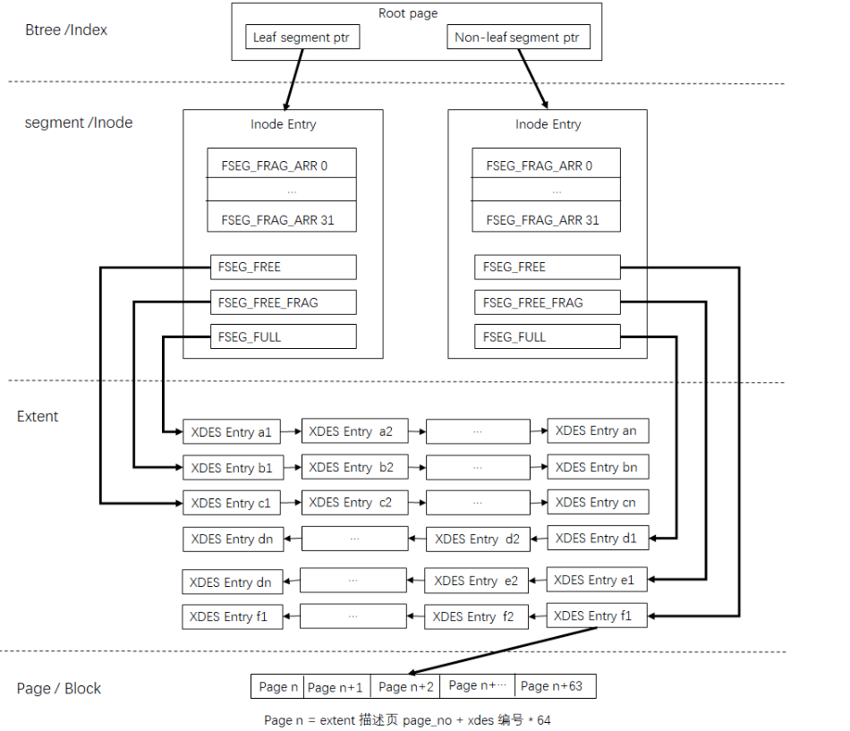</center>

当创建一个新的索引时，实际上构建一个新的btree(btr_create)，先为非叶子节点Segment分配一个inode entry，再创建root page，并将该segment的位置记录到root page中，然后再分配leaf segment的Inode entry，并记录到root page中。当删除某个索引后，该索引占用的空间需要能被重新利用起来。

当我们需要打开一张表时，需要从表空间的数据词典表中加载元数据信息，其中SYS_INDEXES系统表中记录了用户表中所有索引Root Page对应的page no，进而找到B+树Root Page(FIL_PAGE_INDEX)，就可以对整个用户数据B+树进行操作。


### page类型和格式(File Header & Trailer)

page类型及作用如表所示（参考源码fil0fil.h）：

<center></center>

在ibd中每个page具有相同的头部(**File Header**)，该头部占用固定38字节大小，各字段信息如下（参考源码fil0fil.h）：

<center>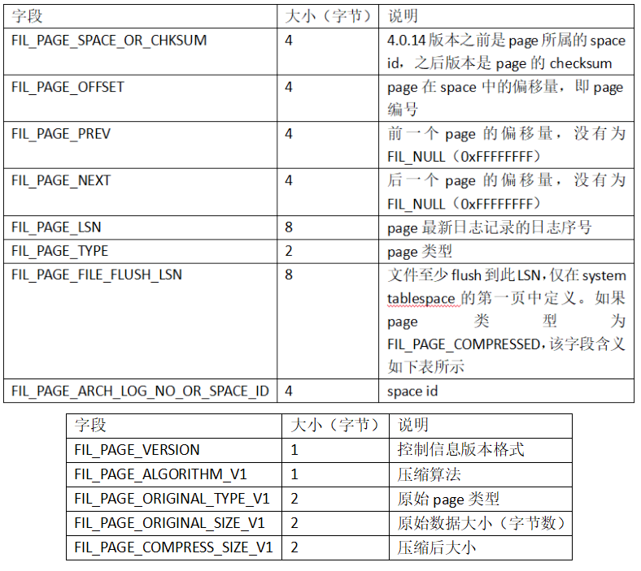</center>

同样在ibd中每个page具有相同的尾部(**File Trailer**)，该尾部占用固定8字节大小，字段信息如下（参考源码fil0fil.h）：

<center>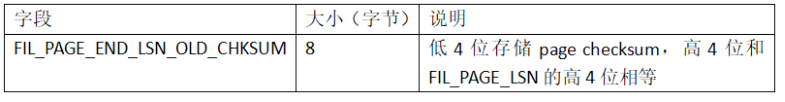</center>

File Trailer是为了**检测页是否已经完整地写入磁盘**（如可能发生的写入过程中磁盘损坏、机器关机等）。

**前4字节代表该页的 checksum值，最后4字节和 File Header 中的 FIL_PAGE_LSN相同**。将这两个值与File Header中的FIL_PAGE_SPACE_OR_CHKSUM和 FIL_PAGE_LSN值进行比较，看是否一致（checksum 的比较需要通过 InnoDB 的 checksum 函数来进行比较，不是简单的等值比较），以此来保证页的完整性（not corrupted）。

在默认配置下，InnoDB存储引擎每次从磁盘读取一个页就会检测该页的完整性，**即页是否发生 Corrupt**，这就是通过 File Trailer部分进行检测，而该部分的检测会有一定的开销。用户可以通过参数 `innodb_checksums` 来开启或关闭对这个页完整性的检查。

MySQL 5.6.6版本开始新增了参数 `innodb_checksum_algorithm`，该参数用来控制检测 checksum 函数的算法，**默认值为 crc32**，可设置的值有：**innodb、crc32、none、strict_innodb、strict_crc32、strict none**。

innodb为兼容之前版本 InnoDB页的 checksum 检测方式，crc32为 MySQL 5.6.6版本引进的新的 checksum算法，该算法较之前的 innodb 有着较高的性能。但是若表中所有页的 checksum 值都以 strict 算法保存，那么低版本的 MySQL数据库将不能读取这些页。none表示不对页启用checksum 检查。

strict *正如其名，表示严格地按照设置的 checksum算法进行页的检测。因此若低版本 MySQL 数据库升级到MySQL 5.6.6或之后的版本，启用 strict_crc32将导致不能读取表中的页。启用strict_crc32方式是最快的方式，因为其不再对innodb和 crc32算法进行两次检测。故推荐使用该设置。若数据库从低版本升级而来，则需要进行mysql_upgrade 操作。


### **FIL_PAGE_TYPE_FSP_HDR**

FSP page是ibd文件的第一个page，主要用于管理全局extent列表、全局inode page列表。FSP page的总体结构如下图所示：

<center>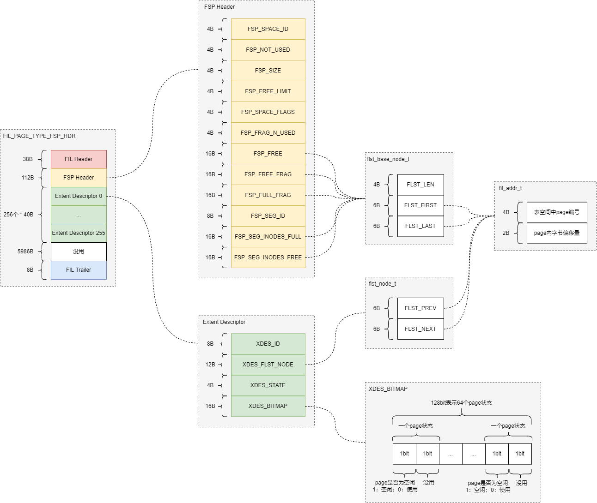</center>


#### 格式

FSP_HDR page主体字段信息如下：

<center></center>

<center></center>

FSP Header字段信息如下：

<center></center>

<center></center>

flst_base_node_t是通用的链表头节点结构，字段信息如下：

<center>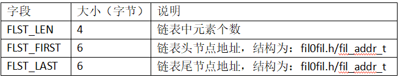</center>

fil_addr_t是通用的节点地址结构，字段信息如下：

<center>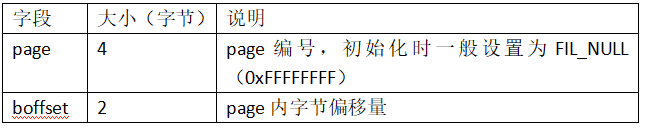</center>


#### Extent Descriptor格式

Extent Descriptor结构：

<center>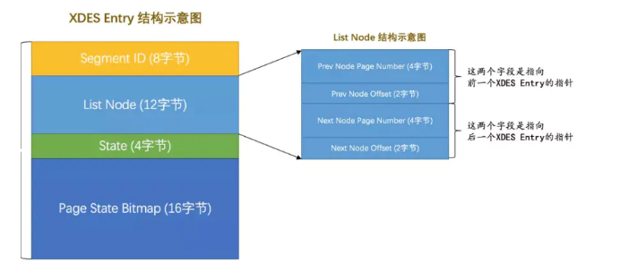</center>

字段信息如下：

<center></center>

flst_node_t是通用的双向链表指针结构，字段信息如下：

<center>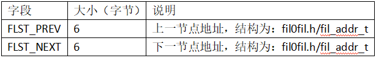</center>

extent状态标志如下：

<center>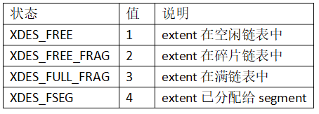</center>

XDES_BITMAP是extent用于管理紧随当前所在页之后的page，每个page占用2bit，一个extent可以管理64个page，结构如下：

<center></center>


####  Extent Descriptor链表管理

Ibd文件中的全局extent链表在FSP page中进行管理，包括：

- 空闲extent链表
- 碎片extent链表
- 满extent链表

分别由FSP Header中字段**FSP_FREE**、**FSP_FREE_FRAG**、**FSP_FULL_FRAG**表示。

每个extent链表中的元素是Extent Descriptor结构，**一个FSP page最多包含256个Extent Descriptor**，**一个Extent Descriptor最多管理64个page**，也就是说一个FSP page最多管理**16384**个page(第三页的FIL_PAGE_IBUF_BITMAP记录的就是这16384个page的change buffer信息)，当page不够时，需要扩展Extent Descriptor，这是通过增加类型为**FIL_PAGE_TYPE_XDES**的page来完成的，**该类型的page和FSP page除了FSP Header不同外，其他一样，主要是为了扩展Extent Descriptor**，详细见后文。

全局extent链表管理关系如下图所示：

<center>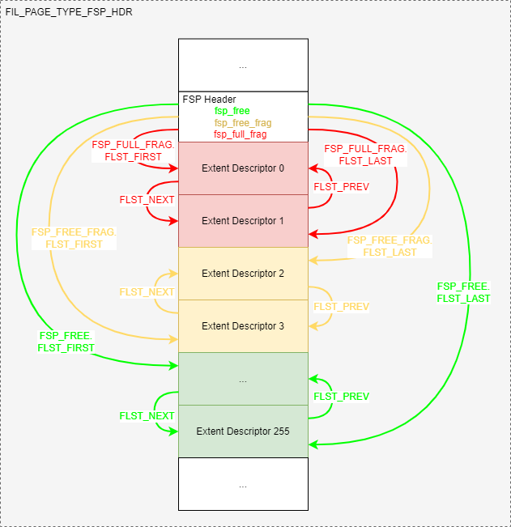</center>

注意一下的是：**链表中的Extent Descriptor元素可能来自FSP page或XDES page**。因为FIL_PAGE_TYPE_XDES并没有FSP page的FSP Header。

Extent Descriptor用于管理page，每个Extent Descriptor最多管理随后的64个page，例如：Extent Descriptor 0管理page 0至page 63，Extent Descriptor 1管理page 64至page 127，依次类推。管理关系如下所示：

<center></center>


#### Inode page链表管理

Ibd文件中的全局inode page链表在FSP page中进行管理，包括：

- 满inode page链表
- 可用inode page链表

分别由FSP Header中字段**FSP_SEG_INODES_FULL**、**FSP_SEG_INODES_FREE**表示，每个inode page链表中的元素是page。全局inode page 链表管理关系如下图所示：

<center>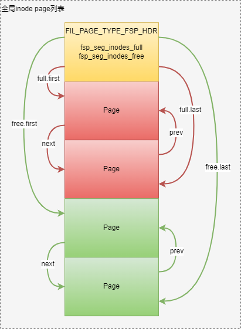</center>


### FIL_PAGE_INODE

Inode page是ibd文件的第三个page，主要用于管理segment。Inode page总体结构如下图所示：

<center></center>

#### 格式

Inode page主体字段信息如下：

<center>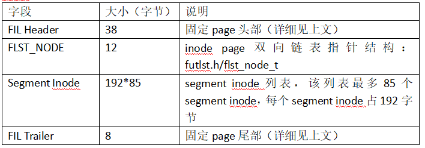</center>

Segment Inode字段信息如下：

<center></center>

**为节省空间，每个segment都先从FSP HEADER的FSP_FREE_FRAG中分配32个碎片页（FSEG_FRAG_ARR），当这些32个页面不够使用时，再申请区。**

**每个INODE PAGE默认可存储85个SEGMENT INODE**。**每个索引使用2个segment**，**分别用于管理叶子节点和非叶子节点**。

**所以一个INODE PAGE最多可以保存42个索引信息**(一个索引使用两个段)。如果表空间有超过42个索引,则必须再分配一个INODE PAGE。INODE PAGE的分配是从碎片区中申请，但它的位置不是固定的。为了找到索引的INODE ENTRY，InnoDB定义了**SEGMENT HEADER**，结构如下：

<center></center>

对于用户表，其索引的Root Page中保存了两个SEGMENT HEADER，分别指向**叶子节点的SEGMENT INODE**和**非叶子节点的SEGMENT INODE**。


#### Segment inode链表管理

每个segment inode代表一个segment，segment用于管理使用的extent，包括空闲extent链表、部分使用extent链表、满extent链表，分别由字段FSEG_FREE、FSEG_NOT_FULL、FSEG_FULL表示，管理关系如下所示：

<center>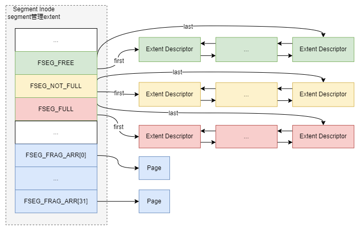</center>


### FIL_PAGE_TYPE_XDES

数据文件的第一个Page类型为FIL_PAGE_TYPE_FSP_HDR，在创建一个新的表空间时进行初始化(fsp_header_init)，该page同时用于跟踪随后的256个Extent(约256MB文件大小)的空间管理，所以每隔256MB就要创建一个类似的数据页，类型为FIL_PAGE_TYPE_XDES ，**用于扩展extent Descriptor，XDES Page除了文件头部外，其他都和FSP_HDR页具有相同的数据结构**，**每个Extent占用40个字节，一个XDES Page最多描述256个Extent**。

<center></center>


### FIL_PAGE_INDEX

Index page用于存储数据和索引。Index page总体结构如下图所示：

<center></center>

#### 格式

Index page主体字段信息如下：

<center></center>

Free Space指的就是空闲空间，同样也是个链表数据结构。在一条记录被删除后，该空间会被加人到空闲链表中。

InnoDB将页中数据进行分组，将每个组最后一条数据的偏移量按顺序存储在Page Directory中，每个分组占用一个槽（Slot，两个字节）。


Page Header字段信息如下：

<center></center>

PAGE_LAST_INSERT，PAGE_DIRECTION，PAGE_N_DIRECTION等变量用于进行页的分裂操作。

当记录被删除（不仅是将记录的**deleted_flag**设置为1，而是彻底删除），会放到PAGE_FREE链表中（链表通过记录头信息next_record串联）。

如果这个页上有记录要插入，会：

- 先检查**PAGE_FREE**链表空间是否满足，如果空间满足，直接从PAGE_FREE链表空间分配，**仅检查第一个节点的可用空间，不会通过next_record进行遍历**；
- 如果空间不够，再从空闲空间(**PAGE_HEAP_TOP**)分配；
- 当空闲空间不足时，会调用函数btr_page_reorganize_low进行页的重新组织，即根据页中记录主键的顺序重新进行整理，这样就能整理出碎片的空间；
- 若还是空间不足，则进行分裂操作。

页记录是根据主键顺序排序的，这个排序是逻辑上的，而非物理上的（开销过大）。

fseg_header_t字段信息如下：

<center>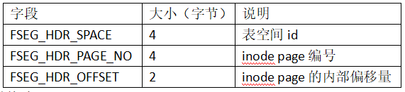</center>

User Records记录具体的数据内容，其中就包括数据库每行数据的具体数据，单条记录文件结构如下(compact类型)：

<center></center>

<center></center>


#### **记录存储格式**

Innodb行格式有四种：**redundant**、**compact**、**compressed**、**dynamic**，参考源码：rem0types.h/rec_format_enum。其中redundant为旧格式，compact、compressed、dynamic为新格式，新旧格式在记录存储格式上差异较大。接来下会详细介绍不同格式下记录的存储方式。

##### compact & compressed & dynamic

Compressed和Dynamic是Compact的变种形式。他们基本没什么本质上的区别，唯一的区别就是对于行溢出的处理不同。Compressed在数据页只存储一个指向溢出页的地址，所有的实际数据都存放在溢出页中。

而Compressed还可以是zlib算法对行数据进行压缩，因此对于BLOB，TEXT，VARCHAR这类大长度类型的数据能够非常有效的存储。


（1）**系统记录**

每个index page中会自动生成两个系统记录：infimum、supremum，分别是最小记录、最大记录。

Infimum记录存储格式：

<center></center>

Supremum记录存储格式：

<center></center>


（2）**用户记录**

用户记录存储格式如下：

<center></center>

实际数据根据索引类型存储方式不一样，分为：聚簇索引非叶子节点、聚簇索引叶子节点、二级索引非叶子节点、二级索引叶子节点。格式如下：

- 聚簇索引非叶子节点：

  <center></center>

- 聚簇索引叶子节点：

  <center></center>

- 二级索引非叶子节点：

  <center></center>

- 二级索引叶子节点：

  <center></center>


（3）**记录头信息**

每个记录前都有固定的记录头**REC_N_NEW_EXTRA_BYTES**，用于存储记录相关的属性，格式如下：

<center></center>


##### redundant

（1）**系统记录**

每个index page中会自动生成两个系统记录：infimum、supremum，分别是最小记录、最大记录。

Infimum记录存储格式：

<center></center>

Supremum记录存储格式：

<center></center>

（2）**用户记录**

用户记录存储格式如下：

<center></center>

实际数据根据索引类型存储方式不一样，分为：聚簇索引非叶子节点、聚簇索引叶子节点、二级索引非叶子节点、二级索引叶子节点。格式如下：

- 聚簇索引非叶子节点：

  <center></center>

- 聚簇索引叶子节点：

  <center></center>

- 二级索引非叶子节点：

  <center></center>

- 二级索引叶子节点：

  <center></center>

（3）**记录头信息**

每个记录前都有固定的记录头REC_N_OLD_EXTRA_BYTES，用于存储记录相关的属性，格式如下：

<center></center>


### **FIL_PAGE_TYPE_BLOB**

Blob page用于长度较大的变长字段。Blob page总体结构如下图所示：

<center>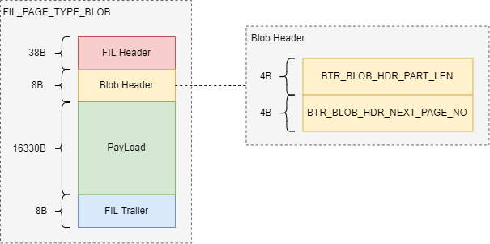</center>

Blob page主体字段信息如下：

<center></center>

Blob Header字段信息如下：

<center></center>


> 参考：
>
> - [深入理解InnoDB -- 存储篇 - 掘金 (juejin.cn)](https://juejin.cn/post/6854573211368030215)
> - [MySQL源码分析系列5——ibd解析 - 程序员的自我修养 (miaozhouguang.com)](http://www.miaozhouguang.com/?p=261#toc-20)
> - [【数据库篇】MySQL InnoDB ibd 文件格式解析_苒翼的博客-CSDN博客_mysql的ibd文件](https://blog.csdn.net/zxz1580977728/article/details/105925014)


## 索引和算法

### B+树索引

B+ 树索引的本质就是 B+ 树在数据库中的实现。但是B+ 索引在数据库中有一个特点是 **高扇出性**，因此在数据库中， B+树的高度一般都在2 ~ 4 层，这也就是说查找某一键值的行记录时最多只需要2 到4 次IO, 这倒不错。因为当前一般的机械磁盘每秒至少可以做 100 次IO , 2 ~ 4 次的IO 意味着查询时间只需0.02 ~ 0.04 秒。

数据库中的B+ 树索引可以分为 **聚集索引** 和 **辅助索引,** 但是不管是聚集还是辅助的索引，其内部都是B+ 树的，即 高度平衡 的，叶子节点存放着所有的数据。

**聚集索引与辅助索引不同的是，叶子节点存放的是否是一整行的信息**。B + 树索引并不能找到一个给定键值的具体行。 B+ 树索引能找到的只是被查找数据行所在的页。然后数据库通过把页读入到内存，再在内存中进行查找， 最后得到要查找的数据。


#### 聚集索引

**聚簇索引**不是一种索引类型，而是一种数据存储方式。一个表只能有一个聚簇索引，InnoDB表要求必须有聚簇索引，默认在主键字段上建立聚簇索引，会按照每张表的主键构造一棵B+ 树。在没有主键字段的情况下，表的第一个非空的唯一索引将被建立为聚簇索引，在前两者都没有的情况下，InnoDB将自动生成一个隐式的自增id列，并在此列上建立聚簇索引。

对于**聚集索引表**来说，**表数据是和主键一起存储的，主键索引的叶结点存储行数据(包含了主键值)**，其他列，事务ID，回滚指针，二级索引的叶结点存储行的主键值。使用的是B+树作为索引的存储结构，非叶子节点都是索引关键字，但非叶子节点中的关键字中不存储对应记录的具体内容或内容地址。叶子节点上的数据是主键与具体记录(数据内容)。

由于实际的数据页只能按照一棵B+ 树进行排序，因此每张表只能拥有一个聚集索引(可以理解为主键)。在多数情况下，**查询优化器倾向于采用聚集索引**。因为聚集索引能够在B+ 树索引的叶子节点上直接找到数据。 此外，由于定义了数据的逻辑顺序，聚集索引能够特别快地访问针对范围值的查询。查询优化揣能够快速发现某一段范围的数据页需要扫描。

对于**MyISAM的非聚集索引表**来说，表数据和索引是分成两部分存储的，主键索引和二级索引存储上没有任何区别。使用的是B+树作为索引的存储结构，所有的节点都是索引，叶子节点存储的是索引+指向索引对应的记录的数据的指针。

看个例子：看一张表，这里以人为的方式让其每个页只能存放两个行记录：
```sql
CREATE TABLE t (
    a INT NOT NULL,
    b VARCHAR (8000),
    c INT NOT NULL,
    PRIMARY KEY (a) ,
    KEY idx c (c)
) ENGINE=INNODB ;
INSERT INTO t SELECT 1 , REPEAT('a', 7000) ,-1;
INSERT INTO t SELECT 2 , REPEAT( 'a', 7000) ,-2;
INSERT INTO t SELECT 3 , REPEAT('a', 7000 ),-3;
INSERT INTO t SELECT 4 , REPEAT( 'a', 7000) ,-4;
```

**使用py_innodb+page_info工具分析表空间，可得**：

<center></center>

- page level为0000的是数据页
- page level为0001的页，当前B+树高度为2，因此这个页是B+树的根

该表对应的B+树索引：

<center></center>

**通过hexdump工具观察索引的根页中所存放的数据，然后通过页尾的Page Directory来分析此页：**

<center></center>

从00 63可以知道：该页中行开始的位置。接着通过Recorder Header来分析：0xc063开始的值为69 6e 66 69 6d 75 6d 00，就代表infimum为行记录，之前的5字节01 00 02 00 1b就是Recorder Header，分析第4位到第8位的值1代表该行记录中只有一个记录（需要记住的是，InnoDB的Page Directory是稀疏的），即infimum记录本身通过Recorder Header最后两个字节00 1b来判断下一条记录的位置，即c063+1b=c07e，读取键值可得80 00 00 01，这就是主键为1的键值（表定义时int是无符号的，因此二进制是0x80 00 00 01，而不是0x0001），80 00 00 01后的值00 00 00 04代表指向数据页的页号。同样的方式可以找到80 00 00 02和80 00 00 04这两个键值以及它们指向的数据页。

通过以上对非数据页节点的分析，可以发现**数据页上存放的是完整的每行的记录**，而**在非数据页的索引页中，存放的仅仅是键值及指向数据页的偏移量**，而不是一个完整的行记录。因此这棵聚集索引数的构造大致如下图所示：

<center>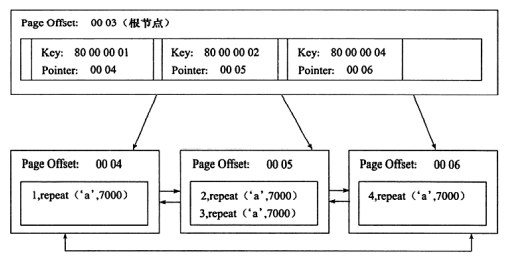</center>

**聚集索引的存储并不是物理上连续的，而是逻辑上连续的**。这其中有两点：

- 前面说过的页通过双向链表链接，页按照主键的顺序排序；
- 每个页中的记录也是通过双向链表进行维护的，物理存储上可以同样不按照主键存储 。

聚集索引的优点：它对于主键的排序查找和范围查找速度非常快。叶子节点的数据就是用户所要查询的数据。

- 如用户需要查询一张注册用户的表，查询最后注册的10 位用户，由于B+ 树索引是双向链表的，用户可以快速找到最后一个数据页，并取出10 条记录。
- 如果要查找主键某一范围内的数据，通过叶子节点的上层中间节点就可以得到页的范围，之后直接读取数据页即可。


#### 辅助索引

对于辅助索引(Secondary Index, 也称非聚集索引），叶子节点并不包含行记录的全部数据。 **叶子节点除了包含键值以外， 每个叶子节点中的索引行中还包含了一个 书签(bookmark)** 。该书签用来告诉InnoDB 存储引擎哪里可以找到与索引相对应的行数据。由于InnoDB 存储引擎表是索引组织表，此InnoDB存储引擎的**辅助索引的书签就是相应行数据的聚集索引键**。

**辅助索引的存在并不影响数据在聚集索引中的组织，因此每张表上可以有多个辅助索引。当通过辅助索引来寻找数据时， InnoDB 存储引擎会遍历辅助索引并通过叶子节点的指针获得指向主键索引的主键，然后再通过主键索引来找到一个完整的行记录。**

如果在一棵高度为3 的辅助索引树中查找数据，那需要对这棵辅助索引树遍历3次找到指定主键，如果聚集索引树的高度同样为3, 那么还需要对聚集索引树进行3 次查找，最终找到一个完整的行数据所在的页，因此一共需要6次逻辑IO访问以得到最终的一个数据页。

看下辅助索引和聚集索引的关系：

<center></center>


#### B+ 树索引的分裂
**B+ 树索引页的分裂并不总是从页的中间记录开始，这样可能会导致页空间的浪费**。并且B+ 树索引实现最为困难的部分是涉及并发的部分。

比如对于1 、2 、3 、4 、5 、6 、7 、8 、9，插入是根据自增顺序进行的，若这时插入10 这条记录后需要进行页的分裂操作，会将记录5 作为分裂点记录(split record), 分裂后得到下面两个页：P1：1 、2 、3 、4；P2：5 、6 、7 、8 、9 、10。然而由于插入是顺序的， P1 这个页中将不会再有记录被插入，从而导致空间的浪费，而 P2 又会再次进行分裂。

InnoDB 存储引擎的 Page Header 中有以下几个部分用来保存插入的顺序信息：

- **PAGE_LAST_INSERT** ：表示页最后插人的位置的偏移量，指向的是行记录内容；
- **PAGE_DIRECTION** ：最后插入的方向；
- **PAGE_N_DIRECTION**：同一个方向上连续插入数。

通过这几个属性， InnoDB 存储引擎可以决定是向左还是向右进行分裂，同时决定将分裂点记录为哪一个。

- **若插入是随机的，则取页的中间记录作为分裂点的记录；**
- **若往同一方向插入的记录数量为5，并且目前已经定位（cursor）到的记录（InnoDB时，首先需要进行定位，定位到的记录为待插入记录的前一条记录）之后还有3条记录，则分裂点的记录为定位到的记录后的第三条记录，否则分裂点记录就是待插入的记录**。

现在看看一个向右分裂的例子，并且定位到的记录之后还有3条记录，则分裂点记录如下图所示：

<center></center>

向右分裂且定位到的记录之后还有3条记录，split record为分裂点记录，最终向右分裂得到下图所示的情况：

<center></center>

对于下图的情况，分裂点就为插人记录本身，向右分裂后仅插人记录本身，这在自增插人时是普遍存在的一种情况：

<center></center>


#### B+ 树索引的管理

索引的创建和删除可以通过两种方法，一种是 **ALTER TABLE**, 另一种是 **CREATE/DROP INDEX：**

```sql
ALTER TABLE tbl_name
ADD {INDEX|KEY} [index_name)
[index_type] (index_col_name, ...) [index_option]...

ALTER TABLE tbl name
DROP PRIMARY KEY
DROP {INDEX|KEY} index_name

CREATE [UNIQUE] INDEX index_name
[index_type]
ON tbl_name (index_col_name, ...)

DROP INDEX index_name ON tbl_name
```

用户可以设置对整个列的数据进行索引，也可以只索引一个列的开头部分数据，如前面创建的表 t(eg1), 列 b 为varchar (8000), 但是用户可以只索引前 100 个字段，如：

```sql
ALTER TABLE t ADD KEY idx_b (b(1OO));
```

并在表t上加一个对于列 **(a, c)** 的联合索引 **idx_a_c**, 可得：

```sql
ALTER TABLE t ADD KEY idx_a_c (a,c);
```

对表 t 查看表中索引的信息，可以使用命令`SHOW INDEX`：

```sql
mysql>SHOW INDEX FROM t\G;
*************************** 1. row***************************
Table : t   Non_unique: 0    Key_name: PRIMARY   Seq_in_index: 1    Column_name: a
Collation: A   Cardinality: 2   Sub_part: NULL   Packed: NULL  Null:   Index_type: BTREE   Comment:
*************************** 2. row***************************
Table: t   Non_unique: 1   Key name: idx b    Seq_in_index: 1   Column_name: b
Collation: A   Cardinality: 2   Sub_part: 100   Packed: NULL  Null: YES   Index_type : BTREE  Comment:
*************************** 3. row***************************
Table: t   Non_unique: 1   Key_name: idx_a c  	Seq_in_index: 1   Column_name: a
Collation: A  Cardinality: 2   Sub_part： NULL  Packed: NULL  Null:   Index_type: BTREE   Comment:
*************************** 4. row***************************
Table: t   Non_unique: 1	Key_name: idx_a c	Seq_in_index: 2	Column_name: c
Collation: A	Cardinality: 2	Sub_part: NULL	Packed: NULL	Null:	Index_type: BTREE	Comment:
*************************** 5. row***************************
Table: t	Non_unique: 1	Key_name: idx c		Seq_in_index: 1	Column_name: c	Collation: A
Cardinality : 2	Sub_part： NULL	Packed: NULL	Null:	Index_type: BTREE	Comment:
5 rows in set (0 .00 sec)
```

通过命令`SHOW INDEX FROM `可以观察到表t 上有4 个索引，分别为主键索引、c列上的辅助索引、b 列的前100 字节构成的辅助索引，以及(a ,c) 的联合辅助索引。

<center></center>

Cardinality 值非常关键，优化器会根据这个值来判断是否使用这个索引。但是这个值并不是实时更新的，即并非每次索引的更新都会更新该值，因为这样代价太大了。因此这个值是不太准确的，只是一个大概的值。上面显示的结果主键的Cardinality 为2，但是我们的表中有4 条记录，这个值应该是4 。如果需要更新索引Cardinality 的信息，可以使用`ANALYZE TABLE` 命令。

（1）**Fast Index Creation**

MySQL 5.5 版本之前的对于索引的添加或者删除的这类DDL 操作让人诟病，过程如下：

- 首先创建一张新的临时表，表结构为通过命令ALTER TABLE 新定义的结构。
- 然后把原表中数据导入到临时表。
- 接着删除原表。
- 最后把临时表重名为原来的表名。

若用户对于一张大表进行索引的添加和删除操作，那么这会需要很长的时间。更关键的是，若有大量事务需要访问正在被修改的表，这意味着数据库服务不可用。

InnoDB 存储引擎从lnnoDB 1.0.x 版本开始支持一种称为 Fast Index Creation (快速索引创建）的索引创建方式——简称 FIC 。

 对于辅助索引的创建， InnoDB 存储引擎会对创建索引的表加上一个S 锁（可以读但是不能写）。在创建的过程中，不需要重建表，因此速度较之前提高很多，并且数据库的可用性也得到了提高。删除辅助索引操作就更简单了， InnoDB 存储引擎只需更新内部视图，并将辅助索引的空间标记为可用，同时删除MySQL 数据库内部视图上对该表的索引定义即可。

注意：

- 临时表的创建路径是通过 参数tmpdir 进行设置的。用户必须保证tmpdir 有足够的空间可以存放临时表，否则会导致创建索引失败。
- 由于FIC 在索引的创建的过程中对表加上了S 锁，因此在创建的过程中只能对该表进行读操作，若有大量的事务需要对目标表进行写操作，那么数据库的服务同样不可用。
- FIC 方式只限定于辅助索引，对于主键的创建和删除同样需要重建一张表。

（2）**Online Schema Change**

Online Schema Change (在线架构改变，简称OSC) 最早是由Facebook 实现的一种在线执行DDL 的方式。所谓“在线”是指在事务的创建过程中，可以有读写事务对表进行操作，这提高了原有MySQL 数据库在DDL 操作时的 并发性。

Facebook 采用PHP 脚本来现实OSC, 而并不是通过修改InnoDB 存储引擎源码的方式。实现OSC 步骤如下：

<center></center>

由于OSC 只是一个PHP 脚本，因此其有一定的局限性。例如其要求进行修改的**表一定要有主键，且表本身不能存在外键和触发器**。此外，在进行OSC 过程中，允许SET sql_bin_log=O, 因此所做的操作不会同步slave 服务器，**可能导致主从不一致的情况。**


（3）**Online DDL**

虽然FIC 可以让InnoDB 存储引擎避免创建临时表，从而提高索引创建的效率。但也有缺陷，比如索引创建时会阻塞表上的DML 操作。OSC 虽然解决了上述的部分问题，但是还是有很大的局限性。

MySQL 5.6 版本开始支持Online DDL (在线数据定义）操作，其允许辅助索引创建的同时，还允许其他诸如INSERT 、UPDATE 、DELETE这类DML 操作，这极大地提高了MySQL 数据库在生产环境中的可用性。

此外，不仅是辅助索引，以下这几类DDL 操作都可以通过“在线”的方式进行操作：

- 辅助索引的创建与删除
- 改变自增长值
- 添加或删除外键约束
- 列的重命名

通过新的ALTER TABLE 语法，用户可以选择索引的创建方式：

```sql
ALTER TABLE tbl name
ADD {INDEX | KEY} [index_ name]
[index_type] (index_col_name, ...) [index_option]...
ALGORITHM[=] {DEFAULT|INPLACE|COPY}
LOCK [=] {DEFAULT|NONE|SHARED|EXCLUSIVE}
```

ALGORITHM 指定了创建或删除索引的算法：

- COPY 表示按照MySQL 5.1 版本之前的工作模式，即创建临时表的方式；
- INPLACE 表示索引创建或删除操作不需要创建临时表；
- DEFAULT 表示根据参数 old_alter_ table 来判断是通过INPLACE 还是COPY 的算法，该参数的默认值为OFF, 表示采用INPLACE 的方式。

LOCK 部分为索引创建或删除时对表添加锁的清况 可有的选择为：

- NONE：执行索引创建或者删除操作时，对目标表不添加任何的锁，即事务仍然可以进行读写操作，不会收到阻塞。因此这种模式可以获得最大的并发度；
- SHARE：这和之前的FIC 类似，执行索引创建或删除操作时，对目标表加上一个S 锁。对于并发地读事务，依然可以执行，但是遇到写事务，就会发生等待操作。如果存储引擎不支持SHARE 模式，会返回一个错误信息；
- EXCLUSIVE：执行索引创建或删除操作时，对目标表加上一个X 锁。读写事务都不能进行，因此会阻塞所有的线程，这和COPY 方式运行得到的状态类似，但是不需要像COPY 方式那样创建一张临时表；
- DEFAULT：首先会判断当前操作是否可以使用NONE 模式，若不能，则判断是否可以使用SHARE 模式，最后判断是否可以使用EXCLUSIVE 模式。也就是说DEFAULT 会通过判断事务的最大并发性来判断执行DDL 的模式。

InnoDB 存储引擎实现Online DDL 的原理是：**在执行创建或者删除操作的同时，将INSERT 、UPDATE 、DELETE 这类DML 操作日志写入到一个缓存中。待完成索引创建后再将重做应用到表上，以此达到数据的一致性。**

这个缓存的大小由参数innodb_online_alter_log_max_size 控制，默认的大小为128MB 。若用户更新的表比较大，并且在创建过程中伴有大量的写事务，如遇到innodb_online_alter_log_max_size 的空间不能存放日志时，会抛出类似如下的错误：

```sql
Error:1799SQLSTATE:HYOOO(ER INNODB ONLINE LOG TOO BIG)
Message: Creating index ' idx_aaa'required more than'innodb_online_alter_log_max_size'bytes of modification log. Please try again.
```

解决方法：

- 调大参数innodb_ online alter_ log_ max_size, 以此获得更大的日志缓存空间。
- 设置ALTER TABLE 的模式为SHARE（S锁）, 这样在执行过程中不会有写事务发生，因此不需要进行DML 日志的记录。

由于 Online DDL 在创建索引完成后再通过重做日志达到数据库的最终一致性，这意味着在索引创建过程中， SQL 优化器不会选择正在创建中的索引。


### Cardinality 值

并不是在所有的查询条件中出现的列都需要添加索引。**在访问表中很少一部分时使用 B+ 树索引才有意义**。

比如按性别进行查询时，SQL 语句得到的结果可能是该表50% 的数据（低选择性），这时添加B+ 树索引是完全没有必要的。相反，如果某个字段的取值范围很广，几乎没有重复，即属于**高选择性**，则此时使用B+ 树索引是最适合的。

可以通过 `SHOW INDEX` 结果中的列 Cardinality 来观察。Cardinality 值非常关键，**表示索引中不重复记录数量的预估值**。同时需要注意的是，Cardinality 是一个预估值，而不是一个准确值，基本上用户也不可能得到一个准确的值。在实际应用中，**Cardinality/n_rows_in_table 应尽可能地接近1**。如果非常小，那么用户需要考虑是否还有必要创建这个索引。故在访问高选择性属性的字段并从表中取出很少一部分数据时，对这个字段添加 B+ 树索引是非常有必要的。

如：表member 大约有500 万行数据。usemick 字段上有一个唯一的索引。这时如果查找用户名为David 的用户，将会得到如下的执行计划：

```sql
mysql>EXPLAIN SELECT* FROM member
-> WHERE usernick='David'\G;
*************************** 1. row***************************
id: 1
select_type: SIMPLE
table: member
type: canst
possible_keys: usernick
key: usernick
key_len: 62
ref: canst
rows: 1
Extra:
1 row in set (0.00 sec)
```

可以看到使用了usernick 这个索引，这也符合之前提到的高选择性，即SQL语句选取表中较少行的原则。


建立索引的前提是**列中的数据是高选择性的，这对数据库来说才具有实际意义**。然而数据库是怎样来统计Cardinality 信息的呢？ 因为MySQL 数据库中有各种不同的存储引擎，而每种存储引擎对于B+ 树索引的实现又各不相同，所以**对Cardinality 的统计是放在存储引擎层进行的**。

索引的更新操作可能是非常频繁的。如果每次索引在发生操作时，也就是 **INSERT 和 UPDATE** 时，就对其进行Cardinality 的统计，那么将会给数据库带来很大的负担。并且表非常大时，那么统计一次Cardinality 信息所需要的时间可能非常长。**数据库对于 Cardinality 的统计都是通过 采样(Sample) 的方法来完成的**。

InnoDB 存储引擎内部对更新Cardinality 信息的策略为：

- **表中1/16 的数据已发生过变化**：自从上次统计Cardinality 信息后，表中1/16 的数据已经发生过变化，这时需要更新Cardinality 信息；
- **stat_modified_counter > 2 000 000 000** ：当发生变化的次数大于2 000 000 000 时，就需要更新Cardinality 信息。因为如果对表中某一行数据频繁地进行更新操作，这时表中的数据实际并没有增加，实际发生变化的还是这一行数据，则第一种更新策略就无法适用这这种情况。

InnoDB 存储引擎内部是怎样来进行Cardinality 信息的统计和更新操作的呢？同样是通过 采样 的方法。**默认InnoDB 存储引擎对 8 个叶子节点(Leaf Page) 进行采用**。采样过程如下:

- 取得B+ 树索引中叶子节点的数量，记为A ；
- 随机取得B+ 树索引中的8 个叶子节点。统计每个页不同记录的个数，即为 P1，P2, …, P8 ；
- 根据采样信息给出Cardinality 的预估值。

在InnoDB存储引擎中，Cardinality值是通过对8个叶子节点预估而得的，**不是一个实际精确的值**。再者，每次对Cardinality 值的统计，都是通过随机取8个叶子节点得到的，这同时又暗示了另一个 Cardinality 现象，即**每次得到的Cardinality 值可能是不同的**。

>SHOW INDEX FROM OrderDetails 会触发MySQL 数据库对于Cardinality 值的统计，因此表的内容没有发生改变，但是Cardinality值发生改变了。

当然，有一种情况可能使得用户每次观察到的索引 Cardinality值都是一样的，那就是**表足够小，表的叶子节点数小于或者等于8个**。这时即使随机采样，也总是会采取到这些页，因此每次得到的 Cardinality 值是相同的。

在InnoDB 1.2 版本之前，可以通过参数 **innodb_stats_sample_pages** 用来设置统计Cardinality 时每次采样页的数量，默认值为8。 同时，参数**innodb_stats_method** 用来判断如何对待索引中出现的NULL 值记录。该参数默认值为nulls_equal, 表示将NULL 值记录视为相等的记录。其有效值还有nulls_unequal, nulls_ignored, 分别表示将NULL值记录视为不同的记录和忽略NULL 值记录。例如某页中索引记录为NULL 、NULL 、1 、2 、2 、3 、3 、3, 在参数innodb_stats_method 的默认设置下，该页的Cardinality 为4; 若参数innodb_stats_method 为 nulls_unequal, 则该页的Caridinality 为5; 若参数innodb_stats_ method 为nulls_ignored, 则 Cardinality 为3 。

**当执行SQL 语句ANALYZE TABLE 、SHOW TABLE STATUS 、SHOW INDEX以及访问INFORMATION_SCHEMA 架构下的表TABLES 和STATISTICS 时会导致lnnoDB 存储引擎去重新计算索引的Cardinality 值。**若表中的数据量非常大，并且表中存在多个辅助索引时，执行上述这些操作可能会非常慢。虽然用户可能并不希望去更新Cardinality 值。InnoDBl.2 版本提供了更多的参数对Cardinality 统计进行设置，如下表：

<center></center>


### B+ 树索引的使用
数据库中存在两种类型的应用， OLTP 和OLAP应用。

OLTP： 在OLTP 应用中，查询操作只从数据库中取得一小部分数据，一般可能都在10 条记录以下，甚至在很多时候只取1 条记录，在这种情况下， B+ 树索引建立后，对该索引的使用应该只是通过该索引取得表中少部分的数据。这时建立B+ 树索引才是有意义的，否则即使建立了，优化器也可能选择不使用索引。

OLAP： 在OLAP 应用中，都需要访问表中大量的数据，根据这些数据来产生查询的结果，这些查询多是面向分析的查询，目的是为决策者提供支持。因此在OLAP 中索引的添加根据的应该是宏观的信息，而不是微观，因为最终要得到的结果是提供给决策者的。但是对于OLAP 中的复杂查询，要涉及多张表之间的联接操作，因此索引的添加依然是有意义的。


#### 联合索引

**联合索引是指对表上的多个列进行索引**。

以下代码创建了一张t 表，并且 索引idx_a_b 是联合索引，联合的列为(a, b) 。

```sql
CREATE TABLE t (
    a INT,
    b INT,
    PRIMARY KEY (a),
    KEY idx ab (a,b)
) ENGINE=INNODB
```

联合索引内部的结构：从本质上来说，联合索引也是一棵B+ 树，不同的是联合索引的键值的数量不是1, 而是大于等于2。比如下图为例，对于查询SELECT * FROM TABLE WHERE a=xxx and b=xxx, 显然是可以使用(a, b) 这个联合索引的。对于单个的a 列查询 SELECT * FROM TABLE WHERE a=xxx, 也可以使用这个（a, b) 索引 。但对于b 列的查询SELECT * FROM TABLE WHERE b=xxx, 则不可以使用这棵B+ 树索引，因为叶子节点的b值不是排序的。

<center></center>

联合索引的第二个好处是**已经对第二个键值进行了排序处理**。其实就是比如联合索引(a,b)，b在a给定的情况下，b是有序的，对于这类的查询是直接可以通过联合索引得到的，SQL语句层面就是：联合索引（a, b) 等价于SELECT ... FROM TABLE WHERE a=xxx ORDER BY b，对于联合索引Ca, b, c) 来说，下列语句同样可以直接通过联合索引得到结果：

```sql
SELECT ... FROM TABLE WHERE a=xxx ORDER BY b
SELECT ... FROM TABLE WHERE a=xxx AND b=xxx ORDER BY c
```

例子：创建如下表，并对userid字段设置**一个单列索引**，对userid和buy_date字段同时设置**一个联合字段**：

```sql
create table buy_log(
    userid int unsigned not null,
    buy_date date
)engine=innodb;
alter table bug_log add key(userid);
alter table bug_log add key(userid,buy_date);
```

- 此时我们查看一下只对userid执行查询时使用到的索引。可以看到**可以使用的索引有两个，但是这个查询语句只用了userid索引**（因为该索引的叶子节点包含单个键值，所以理论上一个页能存放的记录应该更多）：

  <center></center>

- 现在取出userid为1的最近3次购买记录，然后查看执行计划。可以看到**可以使用的索引有两个，但是这个查询语句使用了联合索引**（因为在这个查询中buy_date字段已经排序好了，使用联合索引取出数据，无序再对buy_date字段再进行一次排序操作）

  <center></center>

- 若查询时强制使用userid索引，那么执行计划如下，可以看到在“Extra”信息中显示“Using filesort”代表**需要额外的一次排序操作才能完成查询**，而这次显示需要对列buy_date进行排序，因为索引userid中buy_date是未排序的：

  <center></center>


#### 覆盖索引
InnoDB 存储引擎支持覆盖索引(covering index, 或称索引覆盖），即**从辅助索引中就可以得到查询的记录， 而不需要查询聚集索引中的记录**。

好处：**辅助索引不包含整行记录的所有信息，故其大小要远小于聚集索引，因此可以减少大量的IO 操作**。

对于InnoDB 存储引擎的辅助索引而言，由于其包含了主键信息，因此其叶子节点存放的数据为(primary key 1 , primary key2, …, key1, key2, …）。例如，下列语句都可仅使用一次辅助联合索引来完成查询：

```sql
SELECT key2 FROM table WHERE keyl=xxx;
SELECT primary key2,key2 FROM table WHERE key1=xxx;
SELECT primary key1,key2 FROM table WHERE key1=xxx;
SELECT primary key1,primary key2, key2 FROM table WHERE key1=xxx;
```

覆盖索引的另一个用处是**对某些统计问题而言的，通过辅助索引就能完成数据统计，减少了IO操作**。

执行 `SELECT COUNT(*) FROM buy_log ;` InnoDB 存储引擎并不会选择通过查询聚集索引来进行统计。由于buy_log 表上还有辅助索引，而辅助索引远小于聚集索引，选择辅助索引可以减少IO 操作。在实际执行时，优化器进行了**覆盖索引**操作。possible_keys为NULL，但是Extra却显示了优化器进行了覆盖索引操作。

<center></center>

此外，在通常情况下，诸如(a,b)的联合索引，一般是不可以选择列b中所谓的查询条件。但是如果是统计操作，并且是覆盖索引的，则优化器会进行选择。从图中可以看到possible_keys依然为NULL，但是key却显示userid_2，即表示(userid,buy_date)的联合索引。Extra同样可以发现Using index提示，表示为覆盖索引。

<center></center>


#### 优化器选择不使用索引的情况

在某些情况下，当执行EXPLAIN 命令进行SQL 语句的分析时，会发现优化器并没有选择索引去查找数据(当然不考虑索引本身没用)，而是通过扫描聚集索引，也就是**直接进行全表的扫描来得到数据**。这种情况多发生于**范围查找、JOIN 链接操作**等情况下。

```sql
SELECT * FROM orderdetails WHERE orderid>1OOOO and orderid<102000;
```

表中有(orderid,productid)的联合主键，还有对于列orderid的单个索引，然后通过explain命令：

<center></center>

SQL语句显示的结果，possible_keys上可以看到查询使用primary、orderid、ordersorder_details 3个索引，优化器没有按照orderid上的索引来查找数据，而是选择了primary聚集索引（也就是表扫描，而非orderid辅助索引扫描）。

为什么直接进行全表（聚集索引）的扫描呢？

原因在于如果用户要选取的数据是整行信息，而辅助索引不能覆盖到我们要查询的所有(行)信息，因此在对辅助索引查询到指定数据后，还需要一次书签访问来查找整行数据的信息。虽然辅助索引中数据是顺序存放的，但是**再一次进行书签查找的数据则是无序的，因此变为了磁盘上的离散读操作**。**如果要求访问的数据量很小，则优化器还是会选择辅助索引，但是当访问的数据占整个表中数据的蛮大一部分时（一般是20% 左右），优化器会选择通过聚集索引来查找数据**。因为之前巳经提到过，顺序读要远远快于离散读。因此对于不能进行索引覆盖的情况，优化器选择辅助索引的情况是，通过辅助索引查找的数据是少量的。（如果进行了索引覆盖，那么很多情况我们都可以选择辅助索引代替聚集索引）。

这是由当前传统机械硬盘的特性所决定的，即利用顺序读来替换随机读的查找。若用户使用的磁盘是固态硬盘，随机读操作非常快，同时有足够的自信来确认使用辅助索引可以带来更好的性能。（可以使用关键字**FORCE INDEX**来强制使用某个索引）


#### 索引提示
MySQL数据库支持索引提示（index hint），**显式地告诉优化器使用哪个索引**。以下两种情况可能需要用到索引提示：

- **MySQL数据库的优化器错误地选择了某个索引，导致SQL语句运行的很慢**。这种情况在最新的MySQL数据库版本中很少见。优化器在绝大部分情况下工作得都非常有效和正确。这时有经验的DBA或开发人员可以强制优化器使用某个索引，以此提高SQL运行的速度；
- **某SQL语句可以选择的索引非常多，这时优化器选择执行计划时间的开销可能会大于SQL语句本身**。例如，优化器分析Range查询本身就是比较耗时的操作。这时DBA或开发人员分析最优的索引选择，通过索引提示来强制使优化器不进行各个执行路径的成本分析，直接选择指定的索引来完成查询。

语法格式：

```sql
tbl_name [ [AS] alias] [index_hint_list］
index hint list:
index_hint [, index_hint] ...
index_ hint:
USE {INDEX|KEY}
[{FOR {JOIN|ORDER BY|GROUP BY}) ([index_list])
| IGNORE {INDEX | KEY}
[{FOR {JOIN|ORDER BY|GROUP BY}) (index_list)
| FORCE {INDEX|KEY}
[{FOR {JOIN|ORDER BY|GROUP BY}) (index_list)
index_list:
index_name [, index_ name] ...
```

- **USE INDEX**：提示操作，提示优化器可以使用某个索引，但是实际上使用的索引还是根据优化器自己选择；
- **FORCE INDEX**：强制操作，让优化器强制根据自己提供的索引来进行查询工作。


#### Multi-Range Read 优化(MRR)
MySQL5.6 版本开始支持 Multi-Range Read (MRR) 优化。目的是**为了减少磁盘的随机访问，并且将随机访问转化为较为顺序的数据访问**，这对于IO-bound 类型的SQL 查询语句可带来性能极大的提升；**还可以将某些范围查询，拆分为键值对，以此来进行批量的数据查询**。Multi-Range Read 优化可适用于 **range, ref, eq_ref** 类型的查询。

MRR 优化的好处：

- **MRR 使数据访问变得较为顺序**。在查询辅助索引时，首先根据得到的查询结果，按照主键进行 排序，并按照主键排序的顺序进行书签查找。
- **减少缓冲池中页被替换的次数**。若InnoDB 存储引擎或者MylSAM 存储引擎的缓冲池不是足够大，即不能存放下一张表中的所有数据，此时频繁的离散读操作还会导致缓存中的页被替换出缓冲池，然后又不断地被读入缓冲池。若是按照主键顺序进行访问，则可以将此重复行为降为最低。（性能差距非常大）（进行对比时，需要确保缓冲池中没有被预热，以及需要查询的数据并不包含在缓冲池中。）
- **批量处理对键值的查询操作**。

对于 InnoDB 和MyISAM 存储引擎的范围查询和JOIN 查询操作， MRR 的工作方式：

1. 优化器将二级索引查询到的记录放到一块缓冲区中（read_end_buffer_size）；
2. 如果二级索引扫描到文件的末尾或者缓冲区已满，则使用快速排序对缓冲区中的内容按照主键（rowid）进行排序；
3. 根据缓冲区中的主键来访问实际的数据文件，如果取完数据，则继续调用过程 2) 、3)，直至扫描结束。

通过上述过程，优化器将二级索引随机的 IO 进行排序，转化为主键的有序排列，从而实现了随机 IO 到顺序 IO 的转化，提升性能。

**当不启用MRR特性时，**看到的执行如下图所示：

<center></center>

**若启动MRR特性**，则除了会在列Extra看到Using index condition外，还会**看见Using MRR选项**，如下图所示：

<center></center>


**Multi-Range Read 还可以将某些范围查询，拆分为键值对，以此来进行批量的数据查询。这样做的好处是可以在拆分过程中，直接过滤一些不符合查询条件的数据。**

```sql
select * from t where key_part1>=1000 and key_part1<2000 and let_part2=10000;
```

表t中有(key_part1，key_part2)的联合索引，因此索引根据key_part1，key_part2的位置关系进行排序。

- 若没有启动MRR，此时查询类型为范围查询，SQL优化器会先将key_part1大于1000且小于2000的数据都取出，即使key_part2不等于1000。待取出行数据后再根据key_part2的条件进行过滤。这会导致无用数据被取出。如果有大量的数据且其key_part2不等于1000，则启用MRR优化会使性能有巨大的提升；
- 如果启用了MRR，优化器会先将查询条件进行拆分，然后再进行数据查询。就上述查询而言，优化器会将查询条件拆分为(1000,10000)，(1001,10000)，(1002,10000)，......，(1999,10000)，最后再根据这些拆分出的条件进行数据的查询。

现在来看一个实际的例子。例如：

```sql
select * from salaeies
where (from_date between '1986-01-01' and '1995-01-01')
and (salary between 38000 and 40000);
```

若启用MRR优化，则执行计划如下图所示：

<center></center>

是否启用Multi-Range Read 优化可以通过参数 optimizer_switch 中的标记( flag) 来控制。当mrr 为on 时，表示启用Multi-Range Read 优化。mrr_cost_based 标记表示是否通过cost based 的方式来选择是否启用mrr 。若将mrr 设为on, mrr_cost_based 设为off,则总是启用Multi-Range Read 优化。例如，下述语句可以将Multi-Range Read 优化总是设为开启状态。

```sql
set @@optimizer_switch='mrr=on,mrr_cost_based=off';
```

参数read_md_buffer_size 用来控制键值的缓冲区大小， 当大于该值时，则执行器对已经缓存的数据根据 RowID 进行排序，并通过RowID 来取得行数据。该值默认为256K。


#### Index Condition Pushdown优化(ICP)
和Multi-Range Read 一样， Index Condition Pushdown 同样是MySQLS.6 开始支持的一种 根据索引进行查询的优化方式。之前的MySQL 数据库版本不支持Index Condition Pushdown，当进行索引查询时， 首先根据索引来查找记录，然后再根据WHERE 条件来过滤记录。

在支持Index Condition Pushdown 后， **MySQL 数据库会在取出索引的同时，判断是否可以进行WHERE 条件的过滤，也就是将WHERE 的部分过滤操作放在了存储引擎层。在某些查询下，可以大大减少上层SQL 层对记录的索取(fetch), 从而提高数据库的整体性能**。

当优化器选择Index Condition Pushdown 优化时，可在执行计划的列Extra 看到**Using index condition** 提示。

所有SQL的where条件，均可归纳为3大类：Index Key (First Key & Last Key)，Index Filter，Table Filter：

- **Index First Key**

  只是用来定位索引的起始范围，因此只在索引第一次Search Path(沿着索引B+树的根节点一直遍历，到索引正确的叶节点位置)时使用，一次判断即可；

- **Index Last Key**

  用来定位索引的终止范围，因此对于起始范围之后读到的每一条索引记录，均需要判断是否已经超过了Index Last Key的范围，若超过，则当前查询结束；

- **Index Filter**

  用于过滤索引查询范围中不满足查询条件的记录，因此对于索引范围中的每一条记录，均需要与Index Filter进行对比，若不满足Index Filter则直接丢弃，继续读取索引下一条记录；

- **Table Filter**

  则是最后一道where条件的防线，用于过滤通过前面索引的层层考验的记录，此时的记录已经满足了Index First Key与Index Last Key构成的范围，并且满足Index Filter的条件，回表读取了完整的记录，判断完整记录是否满足Table Filter中的查询条件，同样的，若不满足，跳过当前记录，继续读取索引的下一条记录，若满足，则返回记录，此记录满足了where的所有条件，可以返回给前端用户。

<center></center>

我对Using index condition的理解是，首先mysql server和storage engine是两个组件，server负责sql的parse，执行； storage engine去真正的做数据/index的读取/写入。以前是这样：server命令storage engine按index key把相应的数据从数据表读出，传给server，然后server来按where条件（index filter和table filter）做选择。而在MySQL 5.6加入ICP后，**Index Filter与Table Filter分离，Index Filter下降到InnoDB的索引层面进行过滤，如果不符合条件则无须读数据表，减少了回表与返回MySQL Server层的记录交互开销，节省了disk IO，提高了SQL的执行效率**。

ICP的使用限制：

- 当sql需要全表访问时，ICP的优化策略可用于range, ref, eq_ref, ref_or_null类型的访问数据方法 。
- 支持InnoDB和MyISAM表。
- ICP只能用于二级索引，不能用于主索引。
- 并非全部where条件都可以用ICP筛选，如果where条件的字段不在索引列中，还是要读取整表的记录到server端做where过滤。
- ICP的加速效果取决于在存储引擎内通过ICP筛选掉的数据的比例。

假设下面的表有**联合索引（zip_code,last_name,firset_name）**，查询语句如下：

```sql
select * from people where zipcode='95054'
and lastname like '%etrunia%'
and address like '%Main Street%';
```

95054是Index key，lastname like '%etrunia%' and address like '%Main Street%' 是Index Filter，MySQL**可以通过索引来定位zipcode等于95054的记录**，

- **若不支持ICP优化**，则数据库需要先通过索引取出所有zipcode等于95054的记录，然后再过滤WHERE之后的两个条件；
- **若支持ICP优化**，则在索引取出时，就会进行WHERE条件的过滤，然后再去获取记录。当然，WHERE可以过滤的条件是要该索引可以覆盖到的范围。


>参考：
>
>- [mysql index filter_10分钟让你明白MySQL是如何利用索引的_weixin_39730263的博客-CSDN博客](https://blog.csdn.net/weixin_39730263/article/details/113690694)
>- [ mysql index filter_Index Filter及ICP特性_宇文复的博客-CSDN博客](https://blog.csdn.net/weixin_42510182/article/details/113690693)


### 哈希索引

InnoDB 存储引擎使用哈希算法来对字典进行查找，其冲突机制采用**链表方式**，哈希函数采用**除法散列方式**（h(k)=k%m）。对于缓冲池页的哈希表来说，**在缓冲池中的Page 页都有一个chain 指针，它指向相同哈希函数值的页**（相当于碰撞后的链表）。

而对于除法散列， **m 的取值为略大于2倍的缓冲池页数最的质数**。eg：当前参数innodb_buffer_pool_size 的大小为 l0M, 则共有640 个16KB 的页。对于缓冲池页内存的哈希表来说，需要分配640X2=1280 （因640*16=10240）个槽，但是由于1280 不是质数，需要取比1280 略大的一个质数，应该是1399, 所以在启动时会分配1399 个槽的哈希表，用来哈希查询所在缓冲池中的页。

InnoDB 存储引擎的缓冲池对于其中的页是怎么进行查找的呢？上面只是给出了一般的算法，怎么将要查找的页转换成自然数呢？

InnoDB 存储引擎的表空间都有一个space_id, 用户所要查询的应该是某个表空间的某个连续16KB 的页，即偏移量offset 。InnoDB 存储引擎将space_id 左移20 位，然后加上这个space_id 和offset，即为**space_id<<20+space_id+offset**，然后通过除法散列到各个槽中去。

自适应哈希索引采用哈希表的方式实现。不同的是，**这仅是数据库自身创建并使用的，DBA本身并不能对其进行千预**。自适应哈希索引经哈希函数映射到一个哈希表中，因此对于字典类型的查找非常快速，如SELECT * FROM TABLE WHERE index_col='xxx'。但是对于范围查找就无能为力了。通过命令SHOW ENGINE
INNODB STATUS可以看到当前自适应哈希索引的使用状况。


### 全文索引

前面介绍过了，B+树索引的特点是可以通过索引字段的前缀进行查找。例如对于下面的查询B+树是支持的：

```sql
select * from blog where content like 'xxx%';
```

但是有时候我们要查询的是博客的内容中含有“xxx”，而不是以“xxx”开头，所以应该是下面的SQL语句：

```sql
select * from blog where content like '%xxx%';
```

即便添加了B+ 树索引也是需要进行索引的扫描来得到结果。而这种全文进行查找，这些都不是B+ 树索引所能很好地完成的工作。

全文检索(Full-Text Search) 是将存储于数据库中的整本书或整篇文章中的任意内容信息查找出来的技术。它可以根据需要获得全文中有关章、节、段、句、词等信息，也可以进行各种统计和分析。

在之前的MySQL 数据库中， InnoDB 存储引擎并不支持全文检索技术。大多数的用户转向MyISAM 存储引擎，这可能需要进行表的拆分，并将需要进行全文检索的数据存储为MyISAM 表。这样的确能够解决逻辑业务的需求，但是却丧失了InnoDB 存储引擎的事务性，而这在生产环境应用中同样是非常关键的。从lnnoDB 1.2.x 版本开始， InnoDB 存储引擎开始支持全文检索，其支持MylSAM存储引擎的全部功能，并且还支持其他的一些特性。


#### 倒排索引

全文检索通常使用 倒排索引(inverted index) 来现。倒排索引同B+ 树索引一样，也是一种索引结构。

- 正排索引：由文档指向关键词(记录--> 单词)
- 倒排索引： 由关键词指向文档(单词---> 记录)

它在辅助表(auxiliary table) 中存储了单词与单词自身在一个或多个文档中所在位置之间的映射。这通常利用关联数组实现，其拥有两种表现形式：

- inverted file index, 其表现形式为 {单词，单词所在文档的ID}
- full inverted index, 其表现形式为｛单词，（单词所在文档的ID, 在具体文档中的位置）｝

例如下面是一张表t。其中有DocumentId、Text两个字段：

<center></center>

**如果采用inverted file index的关联数组实现**，则其存储的内容如下表所示：

<center></center>

可以看到：单词code存在于文档1和4中，单词days存在于文档3和6中...

**如果采用full inverted index的关联数组实现**，则其存储的内容如下表所示：

<center></center>

可以看到：code单词为(1:6),(4,8)，表示code这个单词出现在文档1的第6个单词处，和文档4的第8个单词处。

full inverted index还存储了单词所在的位置信息，所以**其占用更多的空间，但是能更好地定位数据**，并扩充一些其他的搜索特性


#### InnoDB全文检索的实现

InnoDB 存储引擎从1.2.x 版本开始支持全文检索的技术，其采用 **full inverted index** 的方式。在InnoDB 存储引擎中，将(Documentld, Position) 视为一个"ilist" 。因此**在全文检索的表中，有两个列，一个是word 字段，另一个是ilist 字段，并且在word 字段上设有索引**。此外，由于InnoDB 存储引擎在ilist 字段中存放了Position 信息，故可以进行**Proximity Search**, 而MyISAM 存储引擎不支持该特性。

FTS Document ID 是另外一个重要的概念。在InnoDB 存储引擎中，**为了支持全文检索，必须有一个列与word 进行映射，在InnoDB 中这个列被命名为 FTS_DOC_ID**, 其类型必须是**BIGINT UNSIGNED NOT NULL**, 并且InnoDB 存储引擎自动会在该列上加入一个名为FTS_DOC_ ID_ INDEX 的**Unique Index** 。上述这些操作都由InnoDB 存储引擎自己完成，用户也可以在建表时自动添加FTS_DOC_ID, 以及相应的Unique Index 。由于列名为FTS_DOC_ID 的列具有特殊意义，因此创建时必须注意相应的类型，否则MySQL 数据库会抛出错误。


倒排索引需要将 word 存放到一张表中，这个表称为 **Auxiliary Table (辅助表）**。在InnoDB 存储引擎中，为了提高全文检索的并行性能，**共有 6 张Auxiliary Table, 目前每张表根据 word 的 Latin 编码进行分区**。

**Auxiliary Table 是持久的表，存放于磁盘上**。 然而在InnoDB 存储引擎的全文索引中，还有另外一个重要的概念**FTS Index Cache(全文检索索引缓存)**，其用来提高全文检索的性能。**FTS Index Cache 是一个红黑树结构，其根据(word, ilist) 进行排序**。这意味着**插入的数据已经更新了对应的表，但是对全文索引的更新可能在分词操作后还在FTS Index Cache 中， Auxiliary Table 可能还没有更新。InnoDB 存储引擎会批量对Auxiliary Table进行更新，而不是每次插入后更新一次Auxiliary Table 。当对全文检索进行查询时，Auxiliary Table 首先会将在FTS Index Cache 中对应的word 字段合并到Auxiliary Table中，然后再进行查询**。 这种merge 操作非常类似之前介绍的Insert Buffer 的功能，不同的是Insert Buffer 是一个持久的对象，并且其是B+ 树的结构。然而FTS Index Cache 的作用又和Insert Buffer 是类似的，它提高了InnoDB 存储引擎的性能，并且由于其根据红黑树排序后进行批量插入，其产生的Auxiliary Table 相对较小。

InnoDB 存储引擎允许用户查看指定倒排索引的 Auxiliary Table 中分词的信息，可以通过设置参数 **innodb_ft_aux_table** 来观察倒排索引的Auxiliary Table 。例如下面的SQL语句**设置查看test数据库下表fts_a的Auxiliary Table：**

```sql
set global innodb_ft_aux_table='test/fts_a';
```

设置之后，就可以通过查**看information_schema数据库下的innodb_ft_index_table表**来得到表fts_a中的分词信息。

**设置参数innodb_ft_aux_table，然后在表中查看分词对应的信息：**

<center></center>

- 每个word都对应一个DOC_ID和POSITION
- 此外，还记录了FITST_DOC_ID、LAST_DOC_ID以及DOC_COUNT。**分别代表了该word第一次出现的文档ID、最后一次出现的文档ID、以及该word在多少个文档中存在**


对于其他数据库，如Oracle Ilg, 用户可以选择手工在事务提交时，或者固定间隔时间时将倒排索引的更新刷新到磁盘。对于InnoDB 存储引擎而言，其**总是在事务提交时将分词写入到 FTS Index Cache, 然后再通过批量更新写入到磁盘**。虽然InnoDB 存储引擎通过一种延时的、批量的写入方式来提高数据库的性能，但是上述操作仅在事务提交时发生。

**当数据库关闭时，在FTS Index Cache 中的数据库会同步到磁盘上的Auxiliary Table中**。然而，如果**当数据库发生宕机时**，一些FTS Index Cache 中的数据库可能未被同步到磁盘上。那么下次重启数据库时，当用户对表进行全文检索（查询或者插入操作）时，InnoDB 存储引擎会自动读取未完成的文档，然后进行分词操作，再将分词的结果放入到 FTS Index Cache 中。

参数 **innodb_ft_cache_size** 用来控制 FTS Index Cache 的大小，默认值为32M 。**当该缓存满时，会将其中的(word, ilist) 分词信息同步到磁盘的 Auxiliary Table 中**。增大该参数可以提高全文检索的性能，但是在宕机时，未同步到磁盘中的索引信息可能需要更长的时间进行恢复。


**文档中分词的插入操作是在事务提交时完成，然而对于删除操作，其在事务提交时，不删除磁盘Auxiliary Table 中的记录，而只是删除FTS Cache Index 中的记录。对于Auxiliary Table 中被删除的记录， InnoDB 存储引擎会记录其FTS Document ID, 并将其保存在 DELETED auxiliary table 中。**在设置参数innodb_ft_aux_table 后，用户同样可以访问information_schema 架构下的表 **INNODB_FT_DELETED** 来观察删除的FTS Document ID 。

由于文档的DML 操作实际并不删除索引中的数据，相反还会在对应的DELETED表中插入记录，因此随着应用程序的允许，索引会变得非常大，即使索引中的有些数据已经被删除，查询也不会选择这类记录。为此， InnoDB 存储引擎提供了一种方式，**允许用户手工地将已经删除的记录从索引中彻底删除**，该命令就是**OPTIMIZE TABLE** 。因为OPTIMIZE TABLE 还会进行一些其他的操作，如Cardinality 的重新统计，若用户希望仅对倒排索引进行操作，那么可以通过参数innodb_optimize_full_text_ only 进行设置(若被删除的文档非常多，那么OPTIMIZE TABLE 操作可能需要占用非常多的时间，这会影响应用程序的并发性，并极大地降低用户的响应时间。用户可以通过参数 **innodb_ft_num_word_optimize** 来限制每次实际删除的分词数量。该参数的默认值为2000)。


**stopword 列表**( stopword list)表示该列表中的 word 不需要对其进行索引分词操作。例如，对于the 这个单词，由于其不具有具体的意义，因此将其视为stopword 。InnoDB 存储引擎有一张默认的stopword 列表，其在 information_schema 架构下，表名为**INNODB_FT_DEFAULT_STOPWORD**, 默认共有36 个stopword 。此外用户也可以通过参数 innodb_ft_server_stopword_table 来自定义stopword 列表。

```sql
create table user_stopword(
    value varchar(30)
)ENGINE=InnoDB;
set global innodb_ft_server_stopword_table="test/user_stopword";
```


当前InnoDB 存储引擎的全文检索还存在以下的限制：

- 每张表只能有一个全文检索的索引；
- 由多列组合而成的全文检索的索引列必须使用相同的字符集与排序规则；
- 不支持没有单词界定符(delimiter) 的语言，如中文、日语、韩语等。


#### 全文检索

MySQL 数据库支持全文检索(Full-Text Search) 的查询，其语法为：

```sql
MATCH (coll, col2, . ..) AGAINST (expr [search_modifier])
search modifier :
	{
		IN NATURAL LANGUAGE MODE
		| IN NATURAL LANGUAGE MODE WITH QUERY EXPANSION
		| IN BOOLEAN MODE
		| WITH QUERY EXPANSION
	}
```

MySQL 数据库通过MATCH() … AGAINST() 语法支持全文检索的查询， MATCH 指定了需要被查询的列， AGAINST 指定了使用何种方法去进行查询。下面将对各种查询模式进行详细的介绍。

创建一个表：

```sql
create table fts_a(
    FTS_DOC_ID BIGINT UNSIGNED AUTO_INCREMENT NOT NULL,
    body TEXT,
    primary key(FTS_DOC_ID),
    fulltext key(body)
);
```

> 在真正创建的时候，并不需要显示的创建FTS_DOC_ID。


（1）**Natural Language**

全文检索通过MATCH 函数进行查询，默认采用Natural Language 模式，其**表示查询带有指定word 的文档**。

例如：查询body 字段中带有Pease的文档，若不使用全文索引技术，则允许使用下述SQL 语句：

```sql
mysql> SELECT* FROM fts_a WHERE body LIKE'%Pease%';
```

显然上述SQL 语句不能使用B+ 树索引。若采用全文检索技术，可以用下面的SQL语句进行查询：

```sql
SELECT * FROM fts_a WHERE MATCH(body) AGAINST ('Porridge' IN NATURAL LANGUAGE MODE);
```

<center></center>

由于NATURAL LANGUAGE MODE 是默认的全文检索查询模式，因此用户可以省略查询修饰符，即上述SQL 语句可以写为：

```sql
SELECT* FROM fts_a WHERE MATCH(body) AGAINST ('Porridge');
```

观察上述SQL语句的查询计划：

<center></center>

在type列显示了fulltext，即表示全文检索的倒排索引，key列显示了body，表示索引的名字。

在where条件中使用MATCH函数，查询返回的结果是根据相关性进行降序排序的，即相关性最高的结果放在第一位。相关性的值是一个非负的浮点数字，0表示没有任何的相关性。根据MySQL官方文档可知，其**相关性的计算**依据以下4个条件：

- **word是否在文档中出现**
- **word在文档中出现的次数**
- **word在索引列中的数量**
- **多少个文档包含该word**

在上述查询中，由于Porridge在文档2种出现了两次，因而具有更高的相关性，故第一个显示为了统计MATCH函数得到的结果数量，可以执行下面的SQL语句：

```sql
select count(*) from fts_a where match(body) against ('Porridge' in natural language mode);
```

<center></center>

上述SQL语句也可以更改为下面的形式：

```sql
select count(if(match(body) against ('Porridge' in natural language mode),1,NULL)) as count from fts_a;
```

上述两个SQL语句虽然得到的逻辑结果是相同的，但是**从内部运行来看，第二句SQL的执行速度更快些**。因为第一句SQL语句还需要进行相关性的排序统计，而在第二句SQL中是不需要的。

此外，用户可以通过SQL语句查看相关性：

```sql
select fts_doc_id,body,match(body) against ('p') as Relevance from fts_a;
```

<center></center>

对于InnoDB的全文检索，还需要考虑以下的因素：

- **查询的word在stopword列中，忽略该字符串的查询**
- **查询的word的字符长度是否在区间[innodb_ft_min_tokennnnnnn_size，innodb_ft_max_token_size]内，不在就忽略**。


（2）**Boolean查询模式**

当使用该修饰符时，**查询字符串的前后字符会有特殊的含义**。Boolean全文检索支持以下几种操作符：

- +：表示该word必须存在；
- -：表示该word必须被排除；
- (no operator)：表示该word是可选的，但是如果出现，其相关性会更高；
- @distance：表示查询的多个单词之间的距离是否在distance之间，distance的单位是字节。这种全文检索的查询也称为**Proximity Search**。如MATCH(body) AGAINST ('"Pease pot"@30' IN BOOLEAN MODE)表示字符串Pease和pot之间的距离需在30字节内；
- \>：表示出现该单词时增加相关性；
- <：表示出现该单词时降低相关性；
- ~：表示允许出现该单词，但是出现时相关性为负（全文检索查询允许负相关性）；
- \*：表示以该单词开头的单词，如lik*，表示可以是lik、like，或者likes；
- ''：表示短语。

例子：

- 以上面的fts_a表为例。下面的SQL语句返回有pease又有hot的文档：

  ```sql
  select * from fts_a where match(body) against ('+Pease +hot' in boolean mode);
  ```

- 下面的SQL语句返回有pease但没有hot的文档：

  ```sql
  select * from fts_a where match(body) against ('+Pease -hot' in boolean mode);
  ```

- 下面的语句返回有pease或有hot的文档：

  ```sql
  select * from fts_a where match(body) against ('Pease hot' in boolean mode);
  ```

- 下面的语句进行Proximity Search：

  ```sql
  select fts_doc_id,body from fts_a where match(body) against ('"Pease pot" @30' in boolean mode);
  select fts_doc_id,body from fts_a where match(body) against ('"Pease pot" @10' in boolean mode);
  ```

  若Pease与pot距离为22字节，第一个语句可以显示出来，第二个语句显示为空。

- 下面的语句根据是否有单词like或pot进行相关性统计，并且出现单词pot后相关性需要增加。文档4虽然出现两个like单词，但是没有pot，因此相关性没有文档1和文档8高：

  ```sql
  select fts_doc_id,body,match(body) against ('like >pot' in boolean mode) as Relevance from fts_a;
  ```

  <center></center>

- 下面的查询增加了“<some”的条件，可以看到文档4变为了负，因为其中存在like单词，也存在some单词：

  ```sql
  select fts_doc_id,body,match(body) against ('like >pot <some' in boolean mode) as Relevance from fts_a;
  ```

  <center></center>

- 接着运行下面的语句，**查询文档中以“po”开头的单词：**

  ```sql
  select * from fts_a where match(body) against ('po*' in boolean mode);
  ```

- **下面的SQL语句查询关于短语，例如：**

  - 第一条SQL语句没有使用" "将like和it视为一个短语，而只是将其视为两个单词，因此结果共返回2个文档
  - 第二条SQL语句使用“like it”，因此查询的是短语，故仅文档4符合查询条件

  <center></center>


（3）**Query Expansion查询模式**

这种查询通常在查询的关键词太短，**用户需要implied knowledge(隐含知识)时进行**。

例如，对于单词“database”的查询，用户可能希望查询的不仅仅是包含database的文档，可能还指哪些包含MySQL、Oracle、DB2、RDBMS的单词。而这时可以使用Query Expansion模式来开启全文检索的implied knowledge。

通过在查询短语中添加**WITH QUERY EXOANSION**或**IN NATURAL LANGUAGE MODE WITH QUERY EXPANSION**可以开启blind query expansion（又称为automatic relevance feedback）。

该查询分为两个阶段：

- 第一阶段：**根据搜索的单词进行全文索引查询**；
- 第二阶段：**根据第一阶段产生的分词再进行一次全文检索的查询**。

创建一个测试表articles，在这个表中没有显示创建FTS_DOC_ID列，因此InnoDB会自动创建该列，并添加唯一索引，此外，表的全文检索索引是根据列title和body的联合索引

<center></center>

接着根据database关键字进行的全文检索查询。可以看到，查询返回了3条记录，body字段包含database关键字：

<center></center>

接着开启Query Expansion，可以看到最后得到8条结果，除了之前包含database的记录，也有包含title或body字段中包含MySQL、DB2的文档。这就是Query Expansion。

<center></center>


## 锁

锁是数据库系统区别于文件系统的一个关键特性。锁机制用于管理**对共享资源的并发访问**，InnoDB 存储引擎会在行级别上对表数据上锁，这固然不错。不过**InnoDB 存储引擎也会在数据库内部其他多个地方使用锁，从而允许对多种不同资源提供并发访问**。

数据库系统使用锁是为了支持对共享资源进行并发访问，提供数据的完整性和一致性。对于锁，用户可能对某个特定的关系数据库系统的锁定模型有一定的经验，但这并不意味着知道其他数据库。也就是说，它们各自对于锁的实现完全不同。

对于MyISAM 引擎，其锁是表锁设计。并发情况下的读没有问题，但是并发插入时的性能就要差一些了，若插入是在“底部", MyISAM 存储引擎还是可以有一定的并发写入操作。

InnoDB 存储引擎锁的实现和 Oracle 数据库非常类似，提供一致性的非锁定读、行级锁支持。行级锁没有相关额外的开销，并可以同时得到并发性和一致性。


### lock 与latch

在数据库中， lock 与 latch 都可以被称为"锁"。但是两者有着截然不同的含义：

- latch 一般称为门锁(轻量级的锁)，因为其要求锁定的时间必须非常短。若持续的时间长，则应用的性能会非常差。在InnoDB 存储引擎中， **latch 又可以分为 mutex (互斥量）和rwlock (读写锁）**。其目的是用来保证并发线程操作 临界资源 的正确性，并且通常没有死锁检测的机制；
- lock 的对象是事务，用来锁定的是数据库中的对象，如表、页、行。并且一般lock的对象仅在事务commit 或rollback 后进行释放（不同事务隔离级别释放的时间可能不同）。此外， lock, 正如在大多数数据库中一样，是有 死锁 机制的。

<center></center>

对于InnoDB 存储引擎中的latch, 可以通过命令SHOW ENGINE INNODB MUTEX 来进行查看：

<center></center>

列 Type 显示的总是InnoDB, 列Name 显示的是latch 的信息以及所在源码的位置（行数）。列Status 比较复杂，在Debug 模式下，除了显示os_waits，还会显示count、spin_waits 、spin_rounds 、os_yields 、os_ wait_ times 等信息。

<center></center>

相对于latch 的查看， lock 信息就显得直观多了。用户可以通过命令 **SHOW ENGINE INNODB STATUS** 及information_schema 架构下的表**INNODB_TRX** 、**INNODB_LOCKS** 、**INNODB_LOCK_WAITS** 来观察锁的信息。（后面会介绍）


### 读锁/写锁/意向锁

InnoDB 存储引擎实现了如下两种标准的行级锁：

- **读锁（共享锁 S）**：允许事务去读一行，阻止其他事务获得相同数据集的排他锁。若事务T对数据对象A加上S锁，则事务T可以读A但不能修改A，其他事务只能再对A加S锁，而不能加X锁，直到T释放A上的S锁。这保证了其他事务可以读A，但在T释放A上的S锁之前不能对A做任何修改。InnoDB通过使用lock in share mode加读锁，但是注意`只锁覆盖索引`
- **写锁（互斥锁 X）**：允许获取排他锁的事务更新数据，阻止其他事务取得相同的数据集共享读锁和排他写锁。若事务T对数据对象A加上X锁，事务T可以读A也可以修改A，其他事务不能再对A加任何锁，直到T释放A上的锁。InnoDB所有的DML操作默认加写锁。select可以通过for update加写锁，并且会锁住所有索引，不仅仅是索引覆盖的索引。

对于UPDATE、DELETE和INSERT语句，InnoDB会自动给涉及数据集加排他锁（X)；对于普通SELECT语句，InnoDB不会加任何锁，因为MVCC机制。 

事务可以通过以下语句显式给记录集加共享锁或排他锁：

- 共享锁（S）：`SELECT * FROM table_name WHERE ... LOCK IN SHARE MODE`。
- 排他锁（X）：`SELECT * FROM table_name WHERE ... FOR UPDATE`。

用`SELECT ... LOCK IN SHARE MODE`获得共享锁，主要用在需要数据依存关系时来确认某行记录是否存在，并确保没有人对这个记录进行UPDATE或者DELETE操作。**但是如果当前事务也需要对该记录进行更新操作，则很有可能造成死锁，对于锁定行记录后需要进行更新操作的应用，应该使用SELECT… FOR UPDATE方式获得排他锁。**


为了允许行锁和表锁共存，实现多粒度锁机制，InnoDB还有两种内部使用的**意向锁（Intention Locks）**，这两种意向锁都是**表锁**。**意向锁是将锁定的对象分为多个层次，意向锁意味着事务希望在更细粒度(fine granularity) 上进行加锁。**

如下图：若将上锁的对象看成一棵树，那么对最下层的对象上锁，也就是对最细粒度的对象进行上锁，那么首先需要对粗粒度的对象上锁。如果需要对页上的记录r 进行上X 锁，那么分别需要对数据库A 、表、页上意向锁 IX, 最后对记录 r 上X 锁。若其中任何一个部分导致等待，那么该操作需要等待粗粒度锁的完成。

<center></center>

- **意向共享锁（IS）**：事务打算给数据行共享锁，事务在给一个数据行加共享锁前必须先取得该表的IS锁。
- **意向排他锁（IX）**：事务打算给数据行加排他锁，事务在给一个数据行加排他锁前必须先取得该表的IX锁。

当向一个表添加表级X锁或者S锁时，如果没有意向锁的话，则需要遍历所有整个表判断是否有不兼容的行锁的存在，以免发生冲突。

如果有了意向锁，只需要判断该意向锁与即将添加的表级锁是否兼容即可，因为意向锁的存在代表了有行级锁的存在或者即将有行级锁的存在，因而无需遍历整个表，即可获取结果。

**InnoDB行锁模式兼容性列表:** 

|      |  S   |  IS  |  X   |  IX  |
| :--: | :--: | :--: | :--: | :--: |
|  S   | 兼容 | 兼容 | 冲突 | 冲突 |
|  IS  | 兼容 | 兼容 | 冲突 | 兼容 |
|  X   | 冲突 | 冲突 | 冲突 | 冲突 |
|  IX  | 冲突 | 兼容 | 冲突 | 兼容 |

>**注意：这里的排他 / 共享锁指的都是表锁！！！意向锁不会与行级的共享 / 排他锁互斥！！！**

如果一个事务请求的锁模式与当前的锁兼容，InnoDB就请求的锁授予该事务；反之，如果两者两者不兼容，该事务就要等待锁释放。 

意向锁是InnoDB自动加的，不需用户干预。

事务在更新某一行数据时，需要申请对这行数据加行级别的锁排斥锁X，在申请X锁之前会申请IX。

意向锁之间是兼容的，IS锁和IX是兼容，因为可能我们对第一行数据加S锁，那么会申请IS锁，对第二行数据加X锁，此时跟第一行的数据的S锁不冲突，所以也会先申请IX锁，由此可见，**IS锁和IX之间不冲突，IS锁，IX锁与行级别的S，行级别的X之间也不冲突。意向锁只是跟表级别的S，X锁可能会冲突。**


### INNODB_TRX/INNODB_LOCKS/INNODB_LOCK_WAITS

在InnoDB 1 . 0 版本之前，用户只能通过命令**SHOW FULL PROCESSLIST, SHOW ENGINE INNODB STATUS** 等来查看当前数据库中锁的请求，然后再判断事务锁的情况。从InnoDBl.O 开始，在 INFORMATION_SCHEMA 架构下添加了表**INNODB_TRX** 、**INNODB_LOCKS** 、**INNODB_LOCK_WAITS** 。通过这三张表，用户可以更简单地监控当前事务并分析可能存在的锁问题。

（1）**INNODB_TRX**

<center></center>

看一个例子：

<center></center>

通过列state可以观察到trx_ id 为730FEE的事务当前正在运行，而trx_id内7314F4的事务目前处于“LOCK WAIT”状态，且运行的SQL语句是select * from parent lock in share mode，该表只是显示了当前运行的InnoDB事务，并不能直接判断锁的一些情况。如果需要查看锁，则还需要访问表INNODB_LOCKS。

（2）**INNODB_LOCKS**

<center></center>

接着上面的例子：

<center></center>

这次用户可以清晰地看到当前锁的信息。trx_id 为730FEE的事务向表parent加了一个X的行锁，ID为7311F4的事务向表parent申请了一个S的行锁。lock_data都是
1，申请相同的资源，因此会有等待。这也可以解释INNODB_TRX中为什么一个事务的tx_ state 是“RUNNING",另一个是“LOCK WAIT”了。

> 另外需要特别注意的是，我发现lock_data 这个值并非是“可信”的值。例如当用户运行一个范围查找时，lock_data可能只返回第一行的主键值。与此同时，如果当前资源被锁住了，若锁住的页因为InnoDB存储引擎缓冲池的容量，导致该页从缓冲池中被刷出，则查看INNODB_LOCKS表时，该值同样会显示为NULL，即InnoDB存储引擎不会从磁盘进行再一次的查找。


（3）**INNODB_LOCK_WAITS**

在通过表INNODB_LOCKS查看了每张表上锁的情况后，用户就可以来判断由此引发的等待情况了。当事务较小时，用户就可以人为地、直观地进行判断了。但是当事务量非常大，其中锁和等待也时常发生，这个时候就不这么容易判断。但是通过表INNODB_LOCK_WAITS,可以很直观地反映当前事务的等待。

<center></center>

接着上面的例子：

<center></center>


> 如果可以的话，用户可以根据这三个表进行联合查询，来得到更直观的信息。


### 一致性非锁定读(快照读)
一致性的非锁定读 ( consistent nonlocking read) 是指 InnoDB 存储引擎通过行**多版本控制(multi versioning) 的方式**来读取当前执行时间数据库中行的数据。

**如果读取的行正在执行DELETE 或UPDATE 操作，这时读取操作不会因此去等待行上锁的释放。相反地， InnoDB 存储引擎会去读取行的一个快照数据**。如下图：

<center>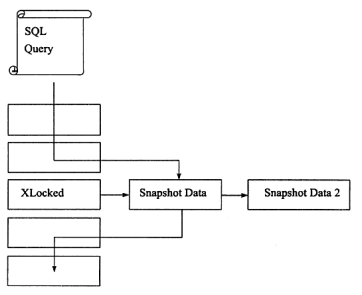</center>

之所以称其为非锁定读，因为不需要等待访问的行上 X 锁的释放。**快照数据是指该行的之前版本的数据，该实现是通过 undo 段来完成**。而 undo 用来在事务中回滚数据，因此快照数据本身是没有额外的开销。此外，读取快照数据是不需要上锁的，因为没有事务需要对历史的数据进行修改操作。

非锁定读机制极大地提高了数据库的并发性。在InnoDB 存储引擎的默认设置下，**这是默认的读取方式，即读取不会占用和等待表上的锁**。 但是在不同事务隔离级别下，读取的方式不同，并不是在每个事务隔离级别下都是采用非锁定的一致性读。此外，即使都是使用非锁定的一致性读，但是对于快照数据的定义也各不相同。


### 一致性锁定读(当前读)

在默认配置下，即事务的隔离级别为REPEATABLE READ模式下， InnoDB 存储引擎的SELECT 操作使用一致性非锁定读。但是**在某些情况下，用户需要显式地对数据库读取操作进行加锁以保证数据逻辑的一致性(比如在有外键时，插入或更新需要查找父表的指定字段)**。而这要求数据库支待加锁语句，即使是对于SELECT 的只读操作。InnoDB 存储引擎对于SELECT 语句支持两种一致性的锁定读(locking read) 操作：

- **SELECT…FOR UPDATE** ：对读取的行记录加一个X 锁，其他事务不能对已锁定的行加上任何锁；
- **SELECT…LOCK IN SHARE MODE**：对读取的行记录加一个S 锁，其他事务可以向被锁定的行加S 锁，但是如果加X 锁，则会被阻塞。

对于一致性非锁定读，即使读取的行已被执行了SELECT … FOR UPDATE, 也是可以进行读取的，这和之前讨论的情况一样。此外， SELECT … FOR UPDATE, SELECT… LOCK IN SHARE MODE 必须在一个事务中，当事务提交了，锁也就释放了。因此在使用上述两句SELECT 锁定语句时，务必加上BEGIN, START TRANSACTION 或者SET AUTOCOMMIT=0 。


### MVCC

MVCC，即**Multi-Version  Concurrency Control （多版本并发控制）**。它是一种并发控制的方法，一般在数据库管理系统中，实现对数据库的并发访问，在编程语言中实现事务内存。由**read view+undo log版本链条**实现。

> 通俗的讲，数据库中同时存在多个版本的数据，并不是整个数据库的多个版本，而是**某一个行记录可能有不止一个版本数据**，在某个事务对其进行操作的时候，需要查看这一条记录的隐藏列事务版本id，比对read view中的id并根据事物隔离级别去判断读取哪个版本的数据。一般称这种技术为行多版本技术。由此带来的并发控制，称之为多版本并发控制(Multi Version Concurrency Control, MVCC)，

数据库隔离级别**读已提交、可重复读** 都是基于MVCC实现的，相对于加锁简单粗暴的方式，它用更好的方式去处理读写冲突，能有效提高数据库并发性能。

- **在 READ COMMITTED 事务隔离级别下，对于快照数据，非一致性读总是读取被锁定行的最新一份快照数据(注意是已提交数据)（解决了读已提交，但没有解决不可重复读）**；
- **在 REPEATABLE READ 事务隔离级别下，对于快照数据，非一致性读总是读取事务开始时的行数据版本（解决了不可重复读问题）**。


#### 版本链

对于InnoDB存储引擎，每一行记录都有两个隐藏列**trx_id**、**roll_pointer**，如果表中没有主键和非NULL唯一键时，则还会有第三个隐藏的主键列**row_id**。

| 列名         | 是否必须 | 描述                                             |
| ------------ | -------- | ------------------------------------------------ |
| row_id       | 否       | 单调递增的行ID，不是必需的，占用6个字节。        |
| trx_id       | 是       | 记录操作该数据事务的事务ID                       |
| roll_pointer | 是       | 这个隐藏列就相当于一个指针，指向回滚段的undo日志 |

多个事务并行操作某一行数据时，不同事务对该行数据的修改会产生多个版本，然后通过回滚指针（roll_pointer），连成一个链表，这个链表就称为**版本链**。如下：

<center></center>

其实，通过版本链，我们就可以看出**事务版本号、表格隐藏的列和undo log**它们之间的关系。


#### Read View

- **Read View是什么呢？** 它就是事务执行SQL语句时，产生的读视图。实际上在innodb中，每个SQL语句执行前都会得到一个Read View。
- **Read View有什么用呢？** 它主要是用来做可见性判断的，即判断当前事务可见哪个版本的数据~

Read View是如何保证可见性判断的呢？我们先看看Read view 的几个重要属性

- m_ids:当前系统中那些活跃(未提交)的读写事务ID, 它数据结构为一个List。
- min_limit_id:表示在生成ReadView时，当前系统中活跃的读写事务中最小的事务id，即m_ids中的最小值。
- max_limit_id:表示生成ReadView时，系统中应该分配给下一个事务的id值。
- creator_trx_id: 创建当前read view的事务ID

**Read view 匹配条件规则**如下：

1. 如果数据事务ID `trx_id < min_limit_id`，表明生成该版本的事务在生成Read View前，已经提交(因为事务ID是递增的)，所以该版本可以被当前事务访问。
2. 如果`trx_id>= max_limit_id`，表明生成该版本的事务在生成ReadView后才生成，所以该版本不可以被当前事务访问。
3. 如果 `min_limit_id <= trx_id`,需要分3种情况讨论

> - （1）如果`m_ids`包含`trx_id`,则代表Read View生成时刻，这个事务还未提交，但是如果数据的`trx_id`等于`creator_trx_id`的话，表明数据是自己生成的，因此是**可见**的。
> - （2）如果`m_ids`包含`trx_id`，并且`trx_id`不等于`creator_trx_id`，则Read   View生成时，事务未提交，并且不是自己生产的，所以当前事务也是**看不见**的；
> - （3）如果`m_ids`不包含`trx_id`，则说明你这个事务在Read View生成之前就已经提交了，修改的结果，当前事务是能看见的。


#### 流程

1. 获取事务自己的版本号，即事务ID
2. 获取Read View
3. 查询得到的数据，然后Read View中的事务版本号进行比较。
4. 如果不符合Read View的可见性规则， 即就需要Undo log中历史快照;
5. 最后返回符合规则的数据

InnoDB 实现MVCC，是通过` Read View+ Undo Log` 实现的，Undo Log 保存了历史快照，Read View可见性规则帮助判断当前事务可见哪个版本的数据。


### 自增长与锁
自增长 在数据库中是非常常见的一种属性，也是很多DBA 或开发人员首选的主键方式。在InnoDB 存储引擎的内存结构中，对**每个含有自增长值的表都有一个自增长计数器 (auto-increment counter)** 。

**当对含有自增长的计数器的表进行插入操作时，这个计数器会被初始化**，执行如下的语句来得到计数器的值：

```sql
SELECT MAX(auto inc col) FROM t FOR UPDATE;
```

**插入操作会依据这个自增长的计数器值加 1 赋予自增长列**。这个实现方式称做AUTO-INC Locking 。**这种锁其实是采用一种特殊的表锁机制，为了提高插入的性能，锁不是在一个事务完成后才释放，而是在完成对自增长值插入的SQL 语句后立即释放**。

虽然AUTO-INC Locking 从一定程度上提高了并发插入的效率，但还是存在一些性能上的问题。首先，对于有自增长值的列的并发插入性能较差，**事务必须等待前一个插入的完成（虽然不用等待事务的完成）**。其次，对于INSERT … SELECT 的大数据量的插入会影响插入的性能，因为另一个事务中的插入会被阻塞。

从MySQL 5.1.22 版本开始， InnoDB 存储引擎中提供了一种**轻量级互斥量的自增长实现机制**，这种机制大大提高了自增长值插入的性能。并且从该版本开始， InnoDB 存储引擎提供了一个参数**innodb_autoinc_lock_mode** 来控制自增长的模式，该参数的默认值为1。

在继续讨论新的自增长实现方式之前，需要对自增长的插入进行分类：

<center></center>

接着来分析参数innodb__autoinc_lock_mode以及各个设置下对自增的影响，其总共有三个有效值可供设定：

<center></center>

InnoDB 存储引擎中自增长的实现和MyISAM 不同，MyISAM 存储引擎是表锁设计，自增长不用考虑并发插入的问题。因此在 master 上用InnoDB 存储引擎，在slave 上用MyISAM 存储引擎的 replication 架构下，用户必须考虑这种情况。

在lnnoDB 存储引擎中，**自增长值的列必须是索引，同时必须是索引的第一个列**。如果不是第一个列，则MySQL 数据库会抛出异常，而MylSAM 存储引擎没有这个问题。


### 外键和锁
外键主要用于引用完整性的约束检查。在InnoDB 存储引擎中，**对于一个外键列，如果没有显式地对这个列加索引， InnoDB 存储引擎自动对其加一个索引**，因为这样可以避免表锁，这比Oracle 数据库做得好， Oracle 数据库不会自动添加索引，用户必须自己手动添加，这也导致了Oracle 数据库中可能产生死锁。

**对于外键值的插入或更新，首先需要查询父表中的记录，即SELECT 父表。 但是对于父表的SELECT 操作，不是使用一致性非锁定读的方式，因为这样会发生数据不一致的问题，因此这时使用的是SELECT … LOCK IN SHARE MODE 方式，即主动对父表加一个S 锁。如果这时父表上已经这样加X 锁，子表上的操作会被阻塞。**


### 行锁类型

InnoDB 存储引擎有3 种行锁 的算法，其分别是：

- Record Lock: 单个行记录上的锁；
- Gap Lock: 间隙锁，锁定一个范围，但不包含记录本身；
- Next-Key Lock : Gap Lock+Record Lock，锁定一个范围，并且锁定记录本身


#### 记录锁(record lock)

`记录锁(Record Locks)`也称为行锁，记录锁定是对单条索引记录的锁定，如果InnoDB 存储引擎表在建立的时候没有设置任何一个索引，那么这时InnoDB 存储引擎会使用 隐式的主键 来进行锁定。。例如， `SELECT c1 FROM t WHERE c1 = 10 FOR UPDATE;` 可以防止从插入，更新或删除行。


#### 间隙锁(gap lock)

间隙锁就会对记录之间的间隙加锁，防止数据插入。就是我们在使用实时读(SELECT  FOR … UPDATE)或者更新，为了防止读的过程中有新的数据插入，会对我们读的数据的**左右区间**进行加锁，防止其他事务插入数据，所以间隙锁之间是不排斥的，间隙锁排斥的只是插入数据的操作。


#### 下一键锁(next-key lock)

next-key lock就是记录锁和间隙锁的组合，会锁记录以及记录之间的间隙，就是对要更新的数据的左右两个端点加间隙锁。主要是用来解决幻读问题。

原则 1：加锁的基本单位是 next-key lock。希望你还记得，next-key lock 是**前开后闭区间**。

原则 2：**查找过程中访问到的对象才会加锁。**

优化 1：索引上的等值查询，**给唯一索引加锁的时候，next-key lock 退化为行锁。**

优化 2：索引上的等值查询，**向右遍历时且最后一个值不满足等值条件的时候，next-key lock 退化为间隙锁。**

一个 bug：唯一索引上的范围查询会访问到不满足条件的第一个值为止。


在默认的事务隔离级别下，即REPEATABLE READ 下， InnoDB 存储引擎采用Next-Key Locking 机制来避免**Phantom Problem (幻读问题**）。


例如：num是一个普通索引，非唯一性索引，已有数据是1，5，10，20，30

那么 next-key lock可以锁定的区间是

```java
(负无穷,1]

(1,5]

(5,10]

(10,20]

(20,30]

(30,正无穷)
```

```java
//更新操作
update table set note = '1' where num = 10;
//或者是使用实时读
SELECT * FROM table WHERE num = 10 for UPDATE;
```

如果num是唯一性索引，那么只需要对num为10的这条索引加锁就行了（就加一个Record lock锁），因为不用担心其他事务再插入一条num为10的数据，因为会有唯一性判断。但是如果num是非唯一性索引，为了防止事务执行过程中有num为10的数据插入，那么会对（5，10]和（10，20]这两个区间加锁。

> 除了next-key locking, 还有 **previous-key locking** 技术。对索引10 、11 、13 和20，若采用previous-key locking 技术，那么可锁定的区间为：（-∞，10），[10,11），[11,13），[13,20），[20, +∞）。


例子1(加锁)：

创建表：

```sql
CREATE TABLE z (a INT, b INT, PRIMARY KEY(a) , KEY(b));
INSERT INTO z SELECT 1,1;
INSERT INTO z SELECT 3,1;
INSERT INTO z SELECT 5,3;
INSERT INTO z SELECT 7,6;
INSERT INTO z SELECT 10,8;
```

表z 的列b 是辅助索引，若在会话A 中执行下面的SQL 语句：

```sql
SELECT* FROM z WHERE b=3 FOR UPDATE
```

这时SQL 语句通过索引列 b 进行查询，因此其使用传统的Next-Key Locking 技术加锁，并且**由于有两个索引，其需要分别进行锁定**：

- 对于聚集索引，其仅对列a 等于 5 的索引加上 Record Lock ；
- 而对于辅助索引，其加上的是 Next-Key Lock,锁定的范围是(1, 3], 特别需要注意的是， InnoDB 存储引擎还会对辅助索引下一个键值加上gap lock, 即还有一个辅助索引范围为(3, 6) 的锁。

因此，若在新会话B 中运行下面的SQL 语句，都会被阻塞：
```sql
SELECT * FROM z WHERE a= 5 LOCK IN SHARE MODE;
INSERT INTO z SELECT 4, 2 ;
INSERT INTO z SELECT 6, 5 ;
```

- 第一个SQL 语句不能执行，因为在会话A 中执行的SQL 语句已经对聚集索引中列a=5 的值加上 X 锁，因此执行会被阻塞；
- 第二个SQL 语句，主键插入4, 没有问题，但是插入的辅助索引值2 在锁定的范围 (1, 3] 中，因此执行同样会被阻塞；
- 第三个SQL 语句，插入的主键6 没有被锁定， 5 也不在范围 (1, 3] 之间。但插入的值5 在另一个锁定的范围 (3, 6) 中，故同样需要等待。

而下面的SQL 语句，不会被阻塞，可以立即执行：
```sql
INSERT INTO z SELECT 8,6;
INSERT INTO z SELECT 2,0;
INSERT INTO z SELECT 6,7;
```


例子2(幻读)：

事务 T1 执行如下的SQL 语句：

```sql
SELECT * FROM t WHERE a > 2 FOR UPDATE;
```

注意这时事务 T1 并没有进行提交操作，上述应该返回 5 这个结果。若与此同时，另一个事务T2 插入了4 这个值，并且数据库允许该操作，那么事务T1 再次执行上述 SQL 语句会得到结果4 和5 。这与第一次得到的结果不同，违反了事务的隔离性，即当前事务能够看到其他事务的结果。

**lnnoDB 存储引擎采用Next-Key Locking 的算法避免 Phantom Problem** 。对于上述的SQL 语句SELECT * FROM t WHERE a>2 FOR UPDATE, 其锁住的不是5 这单个值，而是对(2, +∞)这个范围加了X 锁。因此任何对于这个范围的插入都是不被允许的，从而避免Phantom Problem 。InnoDB 存储引擎默认的事务隔离级别是REPEATABLE READ, 在该隔离级别下，其采用Next-Key Locking 的方式来加锁。而在事务隔离级别READ COMMITTED 下，其仅采用Record Lock, 因此在上述的示例中，会话A 需要将事务的隔离级别设置为READ COMMITTED。


### 并发事务带来的问题

相对于串行处理来说，并发事务处理能大大增加数据库资源的利用率，提高数据库系统的事务吞吐量，从而可以支持可以支持更多的用户。但并发事务处理也会带来一些问题，主要包括以下几种情况。

- **脏读（Dirty Reads）**：一个事务正在对一条记录做修改，在这个事务并提交前，这条记录的数据就处于不一致状态；这时，另一个事务也来读取同一条记录，如果不加控制，第二个事务读取了这些“脏”的数据，并据此做进一步的处理，就会产生未提交的数据依赖关系。这种现象被形象地叫做“脏读”。简单来说就是读取了未提交的数据。

- **不可重复读（Non-Repeatable Reads）**：一个事务在读取某些数据已经发生了改变、或某些记录已经被删除了！这种现象叫做“不可重复读”。简单来说就是两次读取时数据不一样。

- **幻读（Phantom Reads）**：一个事务按相同的查询条件重新读取以前检索过的数据，却发现其他事务插入了满足其查询条件的新数据，这种现象就称为“幻读”。简单来说就是两次读取的数据总数不一样。

- **更新丢失（Lost Update）**：当两个或多个事务选择同一行，然后基于最初选定的值更新该行时，由于每个事务都不知道其他事务的存在，就会发生丢失更新问题——最后的更新覆盖了其他事务所做的更新。一般有两类：回滚丢失和覆盖丢失。

  看了例子：

  - 事务T1查询一行数据，放入本地内存，并显示给一个终端用户User1。
  - 事务T2 也查询该行数据，并将取得的数据显示给终端用户User2 。
  - User1 修改这行记录，更新数据库并提交。
  - User2 修改这行记录，更新数据库并提交。

  显然，这个过程中用户 User1 的修改更新操作 “丢失” 了。

**脏读、不可重复读、幻读三个问题都是由事务A对数据进行修改、增加，事务B总是在做读操作。如果两事务都在对数据进行修改则会导致更新丢失。**


### 阻塞

因为不同锁之间的兼容性关系，在有些时刻一个事务中的锁需要等待另一个事务中的锁释放它所占用的资源，这就是阻塞。阻塞并不是一件坏事，其是为了确保事务可以并发且正常地运行。

在InnoDB 存储引擎中，参数 **innodb_lock_wait_timeout** 用来控制等待的时间（默认是50 秒）， innodb_rollback_on_timeout 用来设定是否在等待超时时对进行中的事务进行回滚操作（默认是OFF, 代表不回滚）。参数innodb_lock_wait_timeout 是 动态的，可以在MySQL 数据库运行时进行调整。而innodb_rollback_on_timeout 是 静态 的，不可在启动时进行修改。当发生超时， MySQL 数据库会抛出一个1205 的错误。

**在默认情况下InnoDB 存储引擎不会回滚超时引发的错误异常。其实InnoDB 存储引擎在大部分情况下都不会对异常进行回滚。**


### 死锁
**死锁是指两个或两个以上的事务在执行过程中，因争夺锁资源而造成的一种互相等待的现象。若无外力作用，事务都将无法推进下去。**

死锁问题的解决方法：

- 解决死锁问题最简单的方式是**不要有等待，将任何的等待都转化为 回滚，并且事务重新开始**。毫无疑问，这的确可以避免死锁问题的产生。然而在线上环境中，这可能导致 并发性能的下降，甚至任何一个事务都不能进行。而这所带来的问题远比死锁问题更为严重，因为这很难被发现并且浪费资源。

- 解决死锁问题最简单的一种方法是 **超时，即当两个事务互相等待时，当一个等待时间超过设置的某一阙值时，其中一个事务进行回滚，另一个等待的事务就能继续进行**。在 InnoDB 存储引擎中，参数innodb_lock_wait_ timeout 用来设置超时的时间。

  超时机制虽然简单，但是其仅通过超时后对事务进行回滚的方式来处理，或者说其是根据 **FIFO** 的顺序选择回滚对象。但若超时的事务所占权重比较大，如事务操作更新了很多行，占用了较多的undo log，这时采用FIFO 的方式，就显得不合适了，因为回滚这个事务的时间相对另一个事务所占用的时间可能会很多。因此，除了超时机制，当前数据库还都普遍采用 wait-for graph (等待图）的方式来进行死锁检测。较之超时的解决方案，这是一种更为主动的死锁检测方式。InnoDB 存储引擎也采用的这种方式。

- **wait-for graph(等待图)** ：这是一种更为主动的死锁检测方式，要求数据库保存以下两种信息：**锁的信息链表、事务等待链表**。**通过上述链表可以构造出一张图，而在这个图中若存在回路，就代表存在死锁，因此资源间相互发生等待。**

在wait-for graph 中，事务为图中的节点。而在图中，事务 T1 指向 T2 边的定义为：事务 T1 等待事务T2 所占用的资源，事务 T1 最终等待 T2 所占用的资源，也就是事务之间在等待相同的资源，而事务 T1 发生在事务 T2 的后面。如下图：

<center></center>

在事务等待列表中可以看到共有4 个事务 t1 、t2 、t3 、t4, 故在 wait-for graph 中应有4 个节点。而事务t2 对row1 占用x 锁，事务 t1 对row2 占用s 锁。事务 t1 需要等待事务t2 中 row1 的资源，因此在wait-for graph 中有条边从节点t1 指向节点t2 。事务t2 需要等待事务t1 、t4 所占用的row2 对象，故而存在节点t2 到节点t1 、t4 的边。同样，存在节点t3 到节点t1 、t2 、t4 的边，因此最终的wait-for graph 如下图：

<center></center>

通过图上图可以发现存在回路(t1, t2), 因此存在死锁。通过上述的介绍，可以发现wait-for graph 是一种较为主动的死锁检测机制，在每个事务请求锁并发生等待时都会判断是否存在回路，若存在则有死锁，通常来说InnoDB 存储引擎选择回滚undo 量最小的事务。

**wait-for graph 的死锁检测通常采用 深度优先 的算法实现**，在InnoDBl.2 版本之前，都是采用递归方式实现。而从1.2 版本开始，对wait-for graph 的死锁检测进行了优化，将递归用**非递归**的方式实现，从而进一步提高了InnoDB 存储引擎的性能。


### 锁升级
锁升级(Lock Escalation) 是指 将当前锁的粒度降低。举例来说，数据库可以把一个表的1000 个行锁升级为一个页锁，或者将页锁升级为表锁。如果在数据库的设计中认为锁是一种稀有资源，而且想避免锁的开销，那数据库中会频繁出现锁升级现象。

Microsoft SQL Server 数据库的设计认为 锁是一种稀有的资源，在适合的时候会自动地将行、键或分页锁 升级为更粗粒度的表级锁。这种升级保护了系统资源，防止系统使用太多的内存来维护锁，在一定程度上提高了效率。

即使在Microsoft SQL Server 2005 版本之后， SQL Server 数据库支持了行锁，但是其设计和lnnoDB 存储引擎完全不同，在以下情况下依然可能发生锁升级：

- **由一句单独的SQL 语句在一个对象上持有的锁的数量超过了阙值，默认这个阙值为5000 。值得注意的是，如果是不同对象，则不会发生锁升级；**
- **锁资源占用的内存超过了激活内存的40% 时就会发生锁升级。**

在Microsoft SQL Server 数据库中，由于锁是一种稀有的资源，因此 锁升级会带来一定的效率提高。但是锁升级带来的一个问题却是因为锁粒度的降低（行或者页锁---->表锁）而导致 并发性能的降低。

**InnoDB 存储引擎不存在锁升级的问题。因为其不是根据每个记录来产生行锁的，相反，其根据每个事务访问的每个页对锁进行管理的，采用的是 位图 的方式。因此不管一个事务锁住页中一个记录还是多个记录，其开销通常都是一致的。**

假设一张表有3 000 000 个数据页，每个页大约有100 条记录，那么总共有300 000 000条记录。若有一个事务执行全表更新的SQL 语句，则需要对所有记录加X 锁。若根据每行记录产生锁对象进行加锁，并且每个锁占用10 字节，则仅对锁管理就需要差不多需要3GB 的内存。而InnoDB 存储引擎根据页进行加锁，并采用位图（使用比特位标记(映射)这些数据，一般用数组表示）方式，假设每个页存储的锁信息占用30 个字节，则锁对象仅需90MB 的内存。由此可见两者对于锁资源开销的差距之大。


### 锁的实现

行锁在InnoDB中的数据结构如下：

```c++
typedef struct lock_rec_struct		lock_rec_t
struct lock_rec_struct{
	ulint space;	/*space id*/
	ulint page_no;	/*page number*/
	unint n_bits;	/*number of bits in the lock bitmap*/
}
```

InnoDB中根据页的组织形式进行锁管理，并使用位图记录锁信息。

n_bits变量表示位图占用的字节数，它后面紧跟着一个bitmap，bitmap占用的字节为：1 + (nbits-1)/8，**bitmap中的每一位标识对应的行记录是否加锁**。

因此，lock_rec_struct占用的实际存储空间为：sizeof(lock_rec_struct) + 1 + (nbits-1)/8


表级锁的数据结构（用于表的意向锁和自增锁）:

```c++
typedef struct lock_table_struct lock_table_t;
struct lock_table_struct {
	dict_table_t*          table;	/*database table in dictionary cache*/
	UT_LIST_NODE_T(lock_t) locks;	/*list of locks on the same table*/
}
```


而事务中关联如下锁结构：

```c++
typedef struct lock_struct      lock_t;
struct lock_struct{
	trx_t*		            trx;		/* transaction owning the lock */
	UT_LIST_NODE_T(lock_t)	trx_locks;	/* list of the locks of the transaction */
	ulint		            type_mode;	/* lock type, mode, gap flag, and wait flag, ORed */
	hash_node_t         	hash;		/* hash chain node for a record lock */
	dict_index_t*           index;		/* index for a record lock */
	union {
		lock_table_t	tab_lock; /* table lock */
		lock_rec_t	    rec_lock; /* record lock */
	} un_member;
};
```

index变量指向一个索引，**行锁本质是索引记录锁**。

lock_struct是根据一个事务的每个页（或每个表）进行定义的。但一个事务可能在不同页上有多个行锁，trx_locks变量将一个事务所有的锁信息进行链接，这样就可以快速查询一个事务所有锁信息。

UT_LIST_NODE_T定义如下，典型的链表结构：

```c++
#define UT_LIST_NODE_T(TYPE)
struct {
       TYPE *   prev;       /* pointer to the previous node,NULL if start of list */
       TYPE *   next;       /* pointer to next node, NULL if end of list */
}
```

lock_struct中type_mode变量是一个无符号的32位整型，从低位排列，第1字节为lock_mode，定义如下；

```c++
/* Basic lock modes */
enum lock_mode {
	LOCK_IS = 0,	/* intention shared */
	LOCK_IX,	/* intention exclusive */
	LOCK_S,		/* shared */
	LOCK_X,		/* exclusive */
	LOCK_AUTO_INC,	/* locks the auto-inc counter of a table
			in an exclusive mode */
	LOCK_NONE,	/* this is used elsewhere to note consistent read */
	LOCK_NUM = LOCK_NONE, /* number of lock modes */
	LOCK_NONE_UNSET = 255
};
```

第2字节为lock_type，目前只用前两位，大小为 16 和 32 ，表示 LOCK_TABLE 和 LOCK_REC：

```c++
#define LOCK_TABLE      16   
#define LOCK_REC        32  
```

剩下的高位 bit 表示行锁的类型record_lock_type：

```sql
#define LOCK_WAIT   256		/* 表示正在等待锁 */
#define LOCK_ORDINARY 0 	/* 表示 Next-Key Lock ，锁住记录本身和记录之前的 Gap*/
#define LOCK_GAP    512		/* 表示锁住记录之前 Gap（不锁记录本身） */
#define LOCK_REC_NOT_GAP 1024	/* 表示锁住记录本身，不锁记录前面的 gap */
#define LOCK_INSERT_INTENTION 2048	/* 插入意向锁 */
#define LOCK_CONV_BY_OTHER 4096		/* 表示锁是由其它事务创建的(比如隐式锁转换) */
```


另外，除了查询某个事务所有锁信息，系统还需要查询某个具体记录的锁信息。如记录id=3是否有锁？ 而InnoDB使用哈希表映射行数据和锁信息：

```c++
struct lock_sys_struct{
	hash_table_t* rec_hash;
}
```

每次新建一个锁对象，都要插入到lock_sys->rec_hash中。lock_sys_struct中的key通过页的space和page_no计算得到，而value则是锁对象lock_rec_struct。

因此若需查询某一行记录是否有锁，首先根据行所在页进行哈希查询，然后根据查询得到的lock_rec_struct，查找lock bitmap，最终得到该行记录是否有锁。

可以看出，根据页进行对行锁的查询并不是高效设计，但这种方式的资源开销非常小。**某一事务对一个页任意行加锁开销都是一样的（不管锁住多少行）。因此也不需要支持锁升级的功能。**

如果根据每一行记录进行锁信息管理，所需的开销会非常巨大。当一个事务占用太多的锁资源时，需要进行锁升级，将行锁升级为更粗粒度的锁，如页锁或表锁。


## 事务

事务可由一条非常简单的SQL语句组成，也可以由一组复杂的SQL语句组成，在数据库提交工作时，可以确保要么所有修改都已经保存了，要么所有修改都不保存。事务的目的：把数据库从一种一致状态转换为另一种一致状态。

### ACID

具备四个特性，也就是acid。

**原子性(Atomic)**：一个事务就是最小的工作单元，要么执行成功提交，要么执行失败回滚。实现原理：undo log，当事务对数据库进行修改时，InnoDB会生成对应的undo log；如果事务执行失败或调用了rollback，导致事务需要回滚，便可以利用undo log中的信息将数据回滚到修改之前的样子。

**一致性(Consistence)**：就是事务的执行不会影响数据库的完整性，保证事务只能把数据库从一个有效（正确）的状态“转移”到另一个有效（正确）的状态，不能执行完一个事务后，使得数据库不符合数据库定义的规则，例如让某个有唯一性约束的字段存在两个相同的值，破坏了唯一性。

**隔离性(isolation)**：就是事务在执行过程中，两个事务之间是隔离的，事务在执行成功之前，所做的修改对其他事务是不可见的。实现原理：隔离级别。

**持久性(durability)**：事务执行成功后，对数据的修改是永久的，即便发生故障重启也不会丢失数据。实现原理：redo log，将所有修改先写入日志，再更新到Buffer Pool，保证了数据不会因MySQL宕机而丢失，从而满足了持久性要求。

原子性、持久性和隔离性，其实都是为了保证数据库状态的一致性。

> 参考：[深入学习MySQL事务：ACID特性的实现原理 - 编程迷思 - 博客园 (cnblogs.com)](https://www.cnblogs.com/kismetv/p/10331633.html)


### 分类

从事务理论的角度来说，可以把事务分为以下几种类型：

- 扁平事务（Flat Transactions）
- 带有保存点的扁平事务（Flat Transactions with Savepoints）
- 链事务（Chained Transactions）
- 嵌套事务（Nested Transactions）
- 分布式事务（Distributed transactions）

对于InnoDB存储引擎来说，其支持扁平事务、带有保存点的事务、链事务、分布式事务。对于嵌套事务，其并不原生支持，因此，对有并行事务需求的用户来说MySQL数据库或InnoDB存储引擎就显得无能为力了。然而用户仍可以通过带有保存点的事务来模拟串行的嵌套事务。


（1）**扁平事务**

扁平事务是事务类型中最简单的一种，但在实际生产环境中，这可能是使用最为频繁的事务。在扁平事务中，所有操作都处于同一层次，其由BEGIN WORK开始，由COMMIT WORK或ROLLBACK WORK结束，其间的操作是原子的，要么都执行，要么都回滚。因此扁平事务是应用程序成为原子操作的基本组成模块。下图显示了扁平事务的三种不同结果：

<center></center>

扁平事务的主要限制是不能提交或者回滚事务的某一部分，或分几个步骤提交。

>下面给出一个扁平事务不足以支持的例子。例如用户在旅行网站上进行自己的旅行度假计划。用户设想从杭州到意大利的佛罗伦萨，这两个城市之间没有直达的班机，需要用户预订并转乘航班，或者需要搭火车等待。用户预订旅行度假的事务为：
>
>- BEGIN WORK
>- S1：预订杭州到上海的高铁
>- S2：上海浦东国际机场坐飞机，预订去米兰的航班
>- S3：在米兰转火车前往佛罗伦萨，预订去佛罗伦萨的火车
>
>但是当用户执行到S3时，发现由于飞机到达米兰的时间太晚，已经没有当天的火车。这时用户希望在米兰当地住一晚，第二天出发去佛罗伦萨。这时如果事务为扁平事务，则需要回滚之前S1、S2、S3的三个操作，这个代价就显得有点大。因为当再次进行该事务时，S1、S2的执行计划是不变的。


（2）**带有保存点的扁平事务**

带有保存点的扁平事务，除了支持扁平事务支持的操作外，允许在事务执行过程中回滚到同一事务中较早的一个状态。这是因为某些事务可能在执行过程中出现的错误并不会导致所有的操作都无效，放弃整个事务不合乎要求，开销也太大。

**保存点（Savepoint）**

- 保存点用来通知系统应该记住事务当前的状态，以便当之后发生错误时，**事务能回到保存点当时的状态**
- 对于扁平的事务来说，其隐式地设置了一个保存点。然而在整个事务中，只有这个保存点，因此，回滚只能回滚到事务开始时的状态
- 保存点用SAVE WORK函数来建立，通知系统记录当前的处理状态。当出现问题时，保存点能用作内部的重启动点，根据应用逻辑，决定是回到最近一个保存点还是其他更早的保存点。下图显示了在事务中使用保存点

下图显示了如何在事务中使用保存点：

<center></center>

当用BEGIN WORK开启一个事务时，隐式地包含了一个保存点，当事务通过 ROLLBACK WORK:2发出部分回滚命令时，事务回滚到保存点2，接着依次执行，并再次执行到 ROLLBACK WORK:7，直到最后的 COMMIT WORK操作，这时表示事务结束，除灰色阴影部分的操作外，其余操作都已经执行，并且提交。

另一点需要注意的是，保存点在事务内部是递增的，这从上图中也能看出。有人可能会想，返回保存点2以后，下一个保存点可以为3，因为之前的工作都终止了。然而新的保存点编号为5，这意味着ROLLBACK不影响保存点的计数，并且单调递增的编号能保持事务执行的整个历史过程，包括在执行过程中想法的改变

此外，当事务通过 ROLLBACK WORK:2命令发出部分回滚命令时，要记住事务并没有完全被回滚，只是回滚到了保存点2而已。这代表当前事务还是活跃的，如果想要完全回滚事务，还需要再执行命令ROLLBACK WORK


（3）**链事务**

链事务可视为保存点模式的一种变种。带有保存点的扁平事务，当发生系统崩溃时，所有的保存点都将消失，因为其保存点是易失的（volatile），而非持久的( persistent)。这意味着当进行恢复时，事务需要从开始处重新执行，而不能从最近的一个保存点继续执行。

链事务的思想是：**在提交一个事务时，释放不需要的数据对象，将必要的处理上下文隐式地传给下一个要开始的事务**。**提交事务操作和开始下一个事务操作将合并为一个原子操作**。这意味着下一个事务将看到上一个事务的结果，就好像在一个事务中进行的一样。下图显示了链事务的工作方式：

<center></center>

链事务与带有保存点的扁平事务不同的是：

- 带有保存点的扁平事务**能回滚到任意正确的保存点**，而链事务中的回滚**仅限于当前事务，即只能恢复到最近一个的保存点**；
- 对于锁的处理，链事务在执行COMMIT后即释放了当前事务所持有的锁，而带有保存点的扁平事务不影响迄今为止所持有的锁。


（4）**嵌套事务**

嵌套事务是一个层次结构框架。由一个顶层事务控制着各个层次的事务。顶层事务之下嵌套的事务被称为子事务（subtransaction），其控制每一个局部的变换。

嵌套事务的层次结构如图所示：

<center></center>

下面给出Moss对嵌套事务的定义：

- 嵌套事务是由若干事务组成的一棵树，**子树既可以是嵌套事务，也可以是扁平事务**
- **处在叶节点的事务是扁平事务**。但是每个子事务从根到叶节点的距离可以是不同的
- 位于根节点的事务称为顶层事务，其他事务称为子事务。事务的前驱称（predecessor）父事务，事务的下一层称为儿子事务
- **子事务既可以提交也可以回滚。但是它的提交操作并不马上生效，除非其父事务已经提交**。因此可以推论出，**任何子事物都在顶层事务提交后才真正的提交**
- 树中的**任意一个事务的回滚会引起它的所有子事务一同回滚**，故子事务仅保留A、C、I特性，不具有D的特性
   

在Moss的理论中，**实际的工作是交由叶子节点来完成的**，即只有叶子节点的事务才能访问数据库、发送消息、获取其他类型的资源。而高层的事务仅负责逻辑控制，决定何时调用相关的子事务。


（5）**分布式事务**

[漫画：什么是分布式事务？](https://blog.csdn.net/bjweimengshu/article/details/79607522)

**分布式事务通常是一个在分布式环境下运行的扁平事务**，因此需要根据数据所在位置访问网络中的不同节点。

假设一个用户在ATM机进行银行的转账操作，例如持卡人从招商银行的储蓄卡转账10000元到工商银行的储蓄卡。在这种情况下，可以将ATM机视为节点A，招商银行的后台数据库视为节点B，工商银行的后台数据库视为C，这个转账的操作可分解为以下的步骤：

- 节点A发出转账命令
- 节点B执行储蓄卡中的余额值减去10000。
- 节点C执行储蓄卡中的余额值加上10000
- 节点A通知用户操作完成或者节点A通知用户操作失败。

这里需要使用分布式事务，因为节点A不能通过调用一台数据库就完成任务。其需要访问网络中两个节点的数据库，而在每个节点的数据库执行的事务操作又都是扁平的。对于分布式事务，其同样需要满足ACID特性，要么都发生，要么都失效。对于上述的例子，如果2)、3)步中任何一个操作失败，都会导致整个分布式事务回滚。若非这样，结果会非常可怕


### undo

#### 核心

undo log 的两个作用：`提供回滚`和多个行版本控制(`MVCC`)。

**undo log 是逻辑日志(记录的是SQL 语句)。根据执行的语句生成一个反向的语句，将这条反向语句写入undo log，得到回滚指针，并且更新这个数据行的回滚指针和事务id。**

- 当执行 rollback 时，就可以从 undo log 中的逻辑记录读取到相应的内容并进行回滚；
- undo的另一个作用是MVCC，当用户读取一行记录时，若该记录已经被其他事务占用，当前事务可以通过undo读取之前的行版本信息，以此实现非锁定读取。


#### 存储

InnoDB 存储引擎对 undo 的管理同样采用段的方式。但是这个段和之前介绍的段有所不同。首先**InnoDB 存储引擎有1024个rollback segment，这些rollback segment 都存储于共享表空间中，每个回滚段中记录了1024 个undo log segment，而在每个undo log segment 段中进行undo 页的申请(支持同时在线的事务为128*1024)**。共享表空间偏移量为5 的页 (0, 5) 记录了所有rollback segment header 所在的页，这个页的类型为FIL_PAGE_TYP_SYS。可以通过py_innodb page_info.py 工具来查看当前共享表空间中undo 的数量。

从InnoDBl.2 版本开始，可通过参数对 rollback segment 做进一步的设置。这些参数包括：

- innodb_undo_directory ：用于设置rollback segment 文件所在的路径。这意味着 rollback segment 可以存放在共享表空间以外的位置，即可以设置为独立表空间。该参数的默认值为". " 表示当前InnoDB 存储引擎的目录；
- innodb_undo_logs ：用来设置rollback segment 的个数，默认值为128 ；
- innodb_undo_tablespaces：用来设置构成rollback segment 文件的数量，这样rollback segment 可以较为平均地分布在多个文件中。设置该参数后，会在路径innodb_ undo_directory 看到 undo 为前缀的文件，该文件就代表rollback segment 文件，如下图，为3个。

**事务在 undo log segment 分配页并写入undo log 的这个过程同样需要写入重做日志**。当事务提交时， InnoDB 存储引擎会做以下两件事情：

- 将 undo log 放入列表中，以供之后的 purge 操作；
- 判断undo log 所在的页是否可以重用，若可以分配给下个事务使用。

事务提交后并不能马上删除 undo log 及undo log 所在的页。这是因为可能还有其他事务需要通过undo log 来得到行记录之前的版本。故事务提交时将 undo log 放入一个链表中， 是否可以最终删除undo log 及undo log 所在页由 purge 线程来判断。

undo log 为什么可以重用 ？purge操作的离散读为什么慢？ 若为每一个事务分配一个单独的 undo 页会非常浪费存储空间，特别是对于OLTP的应用类型。因为在事务提交时，可能并不能马上释放页。假设某应用的删除和更新操作的TPS (transaction per second) 为1000, 为每个事务分配一个undo 页，那么一分钟就需要1000*60 个页，大约需要的存储空间为1GB 。若每秒的purge 页的数量为20, 这样的设计对磁盘空间有着相当高的要求。因此，在InnoDB 存储引擎的设计中对undo 页可以进行重用。具体来说当事务提交时， **首先将undo log 放入链表中，然后判断undo 页的使用空间是否小于3/4, 若是则表示该undo 页可以被重用，之后新的undo log 记录在当前undo log 的后面。由于存放undo log 的列表是以记录进行组织的，而undo 页可能存放着不同事务的undo log，因此purge 操作需要涉及磁盘的离散读取操作，是一个比较缓慢的过程。**

可以通过命令SHOW ENGINE INNODB STATUS 来查看链表中 undo log 的数量：

<center></center>

History list length 就代表了undo log 的数最，这里为12 。purge 操作会减少该值。然而由于undo log 所在的页可以被重用，因此即使操作发生， History list length 的值也可以不为 0 。


#### 格式

在InnoDB 存储引擎中，undo log 分为：

- insert undo log ： 指在insert 操作中产生的undo log 。因为insert 操作的记录，只对事务本身可见，对其他事务不可见（这是事务隔离性的要求），故该 undo log 可以在事务提交后直接删除，不需要进行purge 操作。
- update undo log： 记录的是对delete 和update 操作产生的undo log 。该undo log 可能需要提供MVCC 机制，因此不能在事务提交时就进行删除。提交时放入undo log 链表，等待purge 线程进行最后的删除。

<center></center>

＊表示对存储的字段进行了 压缩。

- insert undo log 开始的前两个字节next 记录的是 下一个undo log 的位置，通过该next 的字节可以知道一个undo log 所占的空间字节数，类似地，尾部的两个字节记录的是undo log 的开始位置；
- type_cmpl 占用一个字节，记录的是undo 的类型，对于insert undo log, 该值总是为11 ；
- undo_no 记录事务的ID，table_id 记录undo log 所对应的表对象。这两个值都是在压缩后保存的。
- 接着的部分记录了所有主键的列和值。在进行rollback 操作时，根据这些值可以定位到具体的记录，然后进行删除即可。

update undo log 相对于之前介绍的insert undo log, 记录的内容更多，所需占用的空间也更大。next 、start 、undo_no 、table_id 与之前介绍的insert undo log 部分相同。这里的type_cmpl, 由于update undo log 本身还有分类，故其可能的值如下：

- TRX_UNDO_ UP_EXIST_ REC 更新non-delete-mark 的记录；
- TRX_UNDO_UPD_DEL_REC 将 delete 的记录标记为not delete；
- TRX_UNDO_DEL_MARK_REC 将记录标记为delete。

接着的部分记录update_vector 信息， update_vector 表示update 操作导致发生改变的列。每个修改的列信息都要记录的undo log 中。对于不同的undo log 类型，可能还需要记录对索引列所做的修改。


#### 查看undo 信息
Oracle 和Microsoft SQL Server 数据库都由内部的数据字典来观察当前 undo 的信息，InnoDB 存储引擎在这方面做得还不够， DBA 只能通过原理和经验来进行判断。InnoSQL对information_schema 进行了扩展， 添加了两张数据字典表，这样用户可以非常方便和快捷地查看undo 的信息。

- 首先增加的数据字典表为INNODB_TRX_ROLLBACK_SEGMENT：
  <center></center>

- 另一张数据字典表为INNODB_TRX_UNDO, 用来记录事务对应的undo log。


### purge
delete 和 update 操作可能并不直接删除原有的数据。

SQL 语句：DELETE FROM t WHERE a=1; 表t 上列a 有聚集索引，列b 上有辅助索引。对于上述的delete 操作，仅是将主键列等于1 的记录delete flag 设置为1, 记录并没有被删除，即记录还是存在于B+ 树中。其次，对辅助索引上a 等于1 b 等于1 的记录同样没有做任何处理，甚至没有产生undo log 。而真正删除这行记录的操作其实被“延时“了，最终在purge 操作中完成。

**purge 用于最终完成delete 和update 操作。这样设计是因为InnoDB 存储引擎支持MVCC, 所以记录不能在事务提交时立即进行处理**。这时其他事物可能正在引用这行，故InnoDB 存储引擎需要保存记录之前的版本。而是否可以删除该条记录通过purge 来进行判断。**若该行记录已不被任何其他事务引用，那么就可以进行真正的delete 操作**。可见， purge 操作是清理之前的delete 和update 操作，将上述操作“最终“完成。而实际执行的操作为delete 操作，清理之前行记录的版本。

此外，为了节省存储空间， InnoDB 存储引擎的undo log 设计是这样的：

**一个页上允许多个事务的undo log 存在**。虽然这不代表事务在全局过程中提交的顺序，但是后面的事务产生的undo log 总在最后。此外， **InnoDB 存储引擎还有一个history 列表，它根据事务提交的顺序，将undo log 进行链接**。undolog 与 history 列表的关系如下图：

<center></center>

**history list 表示按照事务提交的顺序将undo log 进行组织**。在 InnoDB 存储引擎的设计中，先提交的事务总在尾端。undo page 存放了undo log, 由于可以重用，因此一个undo page 中可能存放了多个不同事务的undo log 。trx.5 的灰色阴影表示该undo log 还被其他事务引用。

在执行purge 的过程中， InnoDB 存储引擎首先从history list 中找到第一个需要被清理的记录，这里为trx1, 清理之后InnoDB 存储引擎会在trx1 的undo log 所在的页中继续寻找是否存在可以被清理的记录，这里会找到事务trx.3, 接着找到trx5, 但是发现trx5 被其他事务所引用而不能清理，故再次去history list 中查找，发现这时最尾端的记录为trx.2, 接着找到trx.2 所在的页，然后依次再把事务trx.6 、trx.4 的记录进行清理。由于undo page2 中所有的页都被清理了，因此该undo page 可以被重用。

InnoDB 存储引擎这种先从 history list 中找undo log, 然后再从undo page 中找undo log 的设计模式是为了避免大量的随机读取操作，从而提高purge 的效率。

- innodb_purge_batch_size：用来设置每次purge 操作需要清理的 undo page 数量。在lnnoDB l.2 之前， 该参数的默认值为20 。而从1.2 版本开始，该参数的默认值为300。 这个值不能设置的过大，则每次需要 purge 处理更多的 undo page, 从而导致CPU 和磁盘IO 过于集中于对 undo log 的处理，使性能下降。

- innodb_max_purge_lag : 当InnoDB 存储引擎的压力非常大时，并不能高效地进行purge 操作。那么history list 的长度会变得越来越长。全局动态参数innodb_max_purge_lag 用来控制 history list 的长度， 若长度大于该参数时，其会“延缓" DML 的操作。该参数默认值为 0 , 表示不对 history list 做任何限制。当大于 0 时，就会延缓DML 的操作，其延缓的算法为：

  ```bash
  delay = ((length ( history_list ) - innodb_max_ purge_ lag ) * 10 ) - 5
  ```

  delay 的单位是毫秒。此外， 需要特别注意的是， delay 的对象是行，而不是一个DML 操作。例如当一个update 操作需要更新5 行数据时，每行数据的操作都会被 delay, 故总的延时时间为5*delay 。而delay 的统计会在每一次purge 操作完成后，重新进行计算。

- innodb_max_purge_lag_delay： InnoDB 1.2 版本引入了新的全局动态参数，其用来控制 delay 的最大毫秒数。也就是当上述计算得到的 delay 值大于该参数时，将 delay 设置为 innodb_max_purge_ lag_delay, 避免由于purge 操作缓慢导致其他SQL 线程出现无限制的等待。


### group commit
若事务为非只读事务，则每次事务提交时需要进行一次fsync 操作，以此保证重做日志都已经写入磁盘。当数据库发生宥机时，可以通过重做日志进行恢复。虽然固态硬盘的出现提高了磁盘的性能，然而磁盘的fsync 性能是有限的。为了提高磁盘fsync 的效率，当前数据库都提供了group commit 的功能，即一次 fsync 可以刷新确保多个事务日志被写入文件。 对于InnoDB 存储引擎来说，事务提交时会进行两个阶段的操作：

- 修改内存中事务对应的信息，并且将日志写入重做日志缓冲。
- 调用fsync 将确保日志都从重做日志缓冲写入磁盘。

步骤 ② 相对于步骤 ① 是一个较慢的过程，这是因为存储引擎 需要与磁盘打交道。**但当有事务进行这个过程时，其他事务可以进行步骤 ① 的操作，正在提交的事物完成提交操作后，再次进行步骤 ② 时，可以将多个事务的重做日志通过一次fsync 刷新到磁盘**，这样就大大地减少了磁盘的压力，从而提高了数据库的整体性能。对于写入或更新较为频繁的操作， group commit 的效果尤为明显。

在 InnoDBl.2 版本之前，在开启二进制日志后， InnoDB 存储引擎的 group commit 功能会失效，从而导致性能的下降。并且在线环境多使用 replication 环境，二进制日志的选项基本都为开启状态，因此这个问题尤为显著。导致这个问题的原因是在开启二进制日志后，为了保证存储引擎层中的事务和二进制日志的一致性， 二者之间使用了两阶段事务，其步骤如下：

- 当事务提交时 InnoDB 存储引擎进行prepare 操作；
- MySQL 数据库上层写入二进制日志；
- InnoDB 存储引擎层将日志写入重做日志文件：
  - 修改内存中事务对应的信息，并且将日志写入重做日志缓冲。
  - 调用fsync 将确保日志都从重做日志缓冲写入磁盘。

一旦步骤 ② 中的操作完成，就确保了事务的提交，即使在执行步骤 ③ 时数据库发生了宕机。此外需要注意的是，每个步骤都需要进行一次fsync 操作才能保证上下两层数据的一致性。 步骤 ② 的 fsync 由参数 sync_binlog 控制，步骤 ③ 的 fsync 由参数 innodb_flush_log_at_trx_commit 控制。

问题的解决方法：在这种情况下，**不但MySQL 数据库上层的二进制日志写入是 group commit 的， InnoDB 存储引擎层也是 group commit 的**。此外还移除了原先的锁 prepare_commit_mutex, 从而大大提高了数据库的整体性。MySQL5.6 采用了类似的实现方式，并将其称为Binary Log Group Commit (BLGC) 。

MySQL 5.6 BLGC 的实现方式是将事务提交的过程分为几个步骤来完成，如下图。

<center></center>

在MySQL 数据库上层进行提交时**首先按顺序将其放入一个队列中**，队列中的第一个事务称为leader, 其他事务称为follower, leader 控制着follower 的行为。BLGC 的步骤分为以下三个阶段：

- Flush 阶段，将每个事务的二进制日志写入内存中；
- Sync 阶段，将内存中的二进制日志刷新到磁盘，若队列中有多个事务，那么仅一次fsync 操作就完成了二进制日志的写入，这就是BLGC ；
- Commit 阶段， leader 根据顺序调用存储引擎层事务的提交， InnoDB 存储引擎本就支持group commit, 因此修复了原先由于锁 prepare_commit_mutex 导致 group commit 失效的问题。

当有一组事务在进行Commit 阶段时，其他新事物可以进行 Flush 阶段，从而使 group commit 不断生效。当然group commit 的效果由队列中事务的数量决定，若每次队列中仅有一个事务，那么可能效果和之前差不多， 甚至会更差。但当提交的事务越多时， group commit 的效果越明显，数据库性能的提升也就越大。

binlog_max_flush_queue_time： 用来控制 Flush 阶段中等待的时间，即使之前的一组事务完成提交， 当前一组的事务也不马上进入Sync 阶段，而是至少需要等待一段时间。这样做的好处是group commit 的事务数量更多，然而这也可能会导致事务的响应时间变慢。该参数的默认值为0, 且推荐设置依然为0。除非用户的MySQL 数据库系统中有着大量的连接（如100 个连接） ，并且不断地在进行事务的写入或更新操作。


### 事务控制语句

在MySQL 命令行的默认设置下，事务都是自动提交(auto commit) 的，即执行SQL 语句后就会马上执行COMMIT 操作。因此要显式地开启一个事务需使用命令BEGIN 、START TRANSACTION, 或者执行命令SET AUTOCOMMIT = 0, 禁用当前会话的自动提交。

每个数据库厂商自动提交的设置都不相同，每个DBA 或开发人员需要非常明白这一点，这对之后的SQL 编程会有非凡的意义。

事务控制语句如下图：

<center></center>

- START TRANSACTION 、BEGIN 语句都可以在MySQL 命令行下显式地开启一个事务。但是在存储过程中， MySQL 数据库的分析器会自动将BEGIN 识别为BEGIN …END, 因此在存储过程中只能使用START TRANSACTION 语句来开启一个事务。
- COMMIT 和COMMIT WORK 语句基本是一致的，都是用来提交事务。不同之处在于COMMIT WORK 用来控制事务结束后的行为是CHAIN 还是RELEASE 的。如果是CHAIN 方式，那么事务就变成了链事务。用户可以通过参数completion_type 来进行控制：
  - 该参数默认为0, 表示没有任何操作。在这种设置下COMMIT 和COMMIT WORK 是完全等价的；
  - 当参数completion_type 的值为 1 时， COMMIT WORK 等同于COMMIT AND CHAIN, 即链事务，表示马上自动开启一个相同隔离级别的事务；
  - 参数completion_type为2 时， COMMIT WORK 等同于COMMIT AND RELEASE 。在事务提交后会自动断开与服务器的连接。

事务的两大注意点：

- 构成事务的每条语句都会提交（成为永久）（除非SET AUTOCOMMIT = 0），或者所有语句都回滚。这种保护还延伸到单个的语句。一条语句要么完全成功，要么完全回滚（注意，这里说的是语句回滚）。因此一条语句失败并抛出异常时，并不会导致先前巳经执行的语句自动回滚。所有的执行都会得到保留，必须由用户自己来决定是否对其进行提交或回滚的操作。
- 对于 ROLLBACK TO SAVEPOINT：虽然有ROLLBACK, 但其并不是真正地结束一个事务，因此即使执行了ROLLBACK TO SAVEPOINT, 之后也需要显式地运行COMMIT 或ROLLBACK 命令。即ROLLBACK TO SAVEPOINT命令并不真正地结束事务。
  

### 隐式提交的SQL 语句

以下这些SQL 语句会产生一个隐式的提交操作，即执行完这些语句后，会有一个隐式的 COMMIT 操作：

<center></center>

在Microsoft SQL Server 数据库中，即使是DDL 也是可以回滚的。这和InnoDB 存储引擎、Oracle 这些数据库完全不同。另外，TRUNCATE TABLE 语句是DDL, 因此虽然和对整张表执行DELETE 的结果是一样的，但它是不能被回滚的（这又是和Microsoft SQL Server 数据不同的地方）。


### 对于事务操作的统计

由于InnoDB 存储引擎是支持事务的，因此InnoDB 存储引擎的应用需要在考虑每秒请求数 (Question Per Second, QPS) 的同时，应该关注每秒事务处理的能力 (Transaction Per Second, TPS) 。

计算TPS 的方法是 (com_commit + com_rollback) /time 。但是利用这种方法进行计算的前提是：所有的事务必须都是显式提交的，如果存在隐式地提交和回滚（默认autocommit= 1) , 不会计算到com_commit 和com_rollback 变量中。

MySQL 数据库中另外还有两个参数 handler_commit 和handler_rollback 用于事务的统计操作。但是我注意到这两个参数在MySQL 5 . 1 中可以很好地用来统计InnoDB 存储引擎显式和隐式的事务提交操作，但是在InnoDB Plugin 中这两个参数的表现有些“怪异“，并不能很好地统计事务的次数。所以，如果用户的程序都是显式控制事务的提交和回滚，那么可以通过com_commit 和com_rollback 进行统计。如果不是，那么情况就显得有些复杂。


### 隔离级别

ISO 和ANIS SQL 标准制定了四种事务隔离级别的标准，但是很少有数据库厂商遵循这些标准。比如Oracle 数据库就不支持READ UNCOMMITTED 和REPEATABLE READ 的事务隔离级别。

SQL 标准定义的四个隔离级别为：

- READ UNCOMMITTED 
- READ COMMITTED
- REPEATABLE READ
- SERIALIZABLE

隔离级别越低， 事务请求的锁越少或保持锁的时间就越短。

在InnoDB 存储引擎中，可以使用以下命令来设置当前会话或全局的事务隔离级别：

```sql
SET [GLOBAL | SESSION] TRANSACTION ISOLATION LEVEL
{
	READ UNCOMMITTED | READ COMMITTED | REPEATABLE READ | SERIALIZABLE
}
```

如果想在MySQL 数据库启动时就设置事务的默认隔离级别，那就需要修改MySQL的配置文件，在[mysqld] 中添加如下行：

```sql
[mysqld] transaction -isolation = READ-COMMITTED
```

查看事务隔离级别，可以使用：

```sql
# 当前会话
mysql>SELECT @@tx_ isolation\G;
# 全局
mysql>SELECT @@global.tx_isolation\G;
```


#### 读未提交

事务还没有提交的修改，其他事务都可以读取到。可能会有脏读的问题。


#### 读已提交

读提交就是一个事务只能读到其他事务已经提交过的数据，也就是其他事务调用 commit 命令之后的数据。那脏数据问题迎刃而解了。（大部分数据库系统是采用的这个，但是mysql不是）但是无法做到可重复读，也没办法解决幻读。

这个隔离级别下，读是不加锁的，写，更新，删除是加锁的，如果更新的行是可以通过索引查找到，那么是对这些行加行锁，否则会将所有行都加锁，然后返回给MySQL Server，让他来进行过滤，对于不满足条件的行解锁。


#### 可重复读

可重复读是指，事务不会读到其他事务对已有数据的修改，及时其他事务已提交，也就是说，事务开始时读到的已有数据是什么，在事务提交前的任意时刻，这些数据的值都是一样的，除非是本事务做的修改。但是，对于其他事务新插入、删除的数据是可以读到的，这也就引发了幻读问题。

`要说明的是，当你在 MySQL 中测试幻读的时候，并不会出现上图的结果，幻读并没有发生，MySQL 的可重复读隔离级别其实解决了幻读问题`

mysql解决不可重复读和幻读的措施:

- 为了解决不可重复读，或者为了实现可重复读，MySQL 采用了 MVCC (多版本并发控制) 的方式，并且该种方式也解决了一定的幻读。

我们在数据库表中看到的一行记录可能实际上有多个版本，每个版本的记录除了有数据本身外，还要有一个表示版本的字段，记为 row  trx_id，而这个字段就是使其产生的事务的 id，事务 ID 记为 transaction  id，它在事务开始的时候向事务系统申请，按时间先后顺序递增。

<center></center>

按照上面这张图理解，一行记录现在有 3 个版本，每一个版本都记录这使其产生的事务 ID，比如事务A的transaction id 是100，那么版本1的row trx_id 就是 100，同理版本2和版本3。

在上面介绍读提交和可重复读的时候都提到了一个词，叫做快照，学名叫做一致性视图，这也是可重复读和不可重复读的关键，可重复读是在事务开始的时候生成一个`当前事务全局性的快照`，而读已提交则是`每次执行语句的时候都重新生成一次快照`。

对于一个快照来说，它能够读到那些版本数据，要遵循以下规则：

1. 当前事务内的更新，可以读到；
2. 版本未提交，不能读到；
3. 版本已提交，但是却在快照创建后提交的，不能读到；
4. 版本已提交，且是在快照创建前提交的，可以读到；

两者主要的区别就是在快照的创建上：

- 可重复读仅在事务开始是创建一次；
- 而读提交每次执行commit的时候都要重新创建一次，也就是读取行的最新版本，如果该行被锁定，则读取该行最新的一份快照数据。

**前面的MVCC只能控制部分的幻读。**RR读不会受到其他事务update、insert的影响，但是自己执行了update就会把其他事务insert的数据更新成自己的版本号，下一次读取就会读到了。

针对这种情况引入了Next-Key锁。

通过Next-Key锁，使得第一次update后会直接锁住>10这个区间，使得在当前事务内不可能出现幻读。

在READ COMMITTED 的事务隔离级别下，除了唯一性的约束检查及外键约束的检查需要gap lock, InnoDB 存储引擎不会使用gap lock 的锁算法。


#### 可串行化

强制事务串行执行，会让读取每一行都加锁，读用读锁，写用写锁，读写锁互斥，可以解决幻读的问题。并发比较多的话可能会造成大量的超时等待和锁竞争。如果业务并发的特别少或者没有并发，同时又要求数据及时可靠的话。

在SERIALIABLE 的事务隔离级别， InnoDB 存储引擎会对每个SELECT 语句后自动加上LOCK IN SHARE MODE, 即为每个读取操作加一个共享锁。因此在这个事务隔离级别下，读占用了锁，对一致性的非锁定读不再予以支持。这时，事务隔离级别SERIALIZABLE 符合数据库理论上的要求，即事务是well-formed 的，并且是twophrased的。SERIALIABLE 的事务隔离级别主要用于 InnoDB 存储引擎的分布式事务。


### 分布式事务

（1）**分布式事务**

InnoDB 存储引擎提供了对 XA 事务的支持，并通过XA 事务来支持分布式事务的实现。分布式事务指的是允许多个独立的事务资源(transactional resources) 参与到一个全局的事务中。事务资源通常是关系型数据库系统，但也可以是其他类型的资源。全局事务要求在其中的所有参与的事务要么都提交，要么都回滚，这对于事务原有的ACID 要求又有了提高。

在使用分布式事务时， InnoDB 存储引擎的事务隔离级别必须设置为SERIALIZABLE。

XA 事务允许不同数据库之间的分布式事务，如一台服务器是 MySQL 数据库的，另一台是Oracle 数据库的，又可能还有一台服务器是SQL Server 数据库的，只要参与在全局事务中的每个节点都支持XA 事务。

XA 事务由一个或多个资源管理器(Resource Managers) 、一个事务管理器( Transaction Manager) 以及一个应用程序( Application Program) 组成：

- **资源管理器**：提供访问事务资源的方法。通常一个数据库就是一个资源管理器。
- **事务管理器**：协调参与全局事务中的各个事务。需要和参与全局事务的所有资源管理器进行通信。
- **应用程序**：定义事务的边界，指定全局事务中的操作。

在MySQL 数据库的分布式事务中，资源管理器就是MySQL 数据库，事务管理器为连接MySQL 服务器的客户端，如下图：

<center></center>

分布式事务使用两段式提交(two-phase commit) 的方式：

- 在第一阶段，所有参与全局事务的节点都开始准备(PREPARE), 告诉事务管理器它们准备好提交了。

- 在第二阶段，事务管理器告诉资源管理器执行ROLLBACK 还是COMMIT 。如果任何一个节点显示不能提交，则所有的节点都被告知需要回滚。可见与本地事务不同的是，分布式事务需要多一次的PREPARE 操作，待收到所有节点的同意信息后，再进行COMMIT 或是ROLLBACK 操作。

通过参数innodb_support_ xa 可以查看是否启用了XA 事务的支持（默认为ON ) :

```sql
mysql> SHOW VARIABLES LIKE ' innodb_support_xa ' \G;
```


（2）内部XA事务

之前讨论的分布式事务是外部事务，即资源管理器是MySQL 数据库本身。在MySQL 数据库中还存在另外一种分布式事务，其**在存储引擎与插件之间，又或者在存储引擎与存储引擎之间**，称之为内部XA 事务。

最为常见的内部 XA 事务存在于 binlog 与lnnoDB 存储引擎之间。由于复制的需要，因此目前绝大多数的数据库都开启了binlog 功能。在事务提交时，先写二进制日志，再写InnoDB 存储引擎的重做日志。对上述两个操作的要求也是原子的，即二进制日志和重做日志必须同时写入。若二进制日志先写了，而在写入InnoDB 存储引擎时发生了宕机，那么slave 可能会接收到master 传过去的二进制日志并执行，最终导致了主从不一致的情况。

如下左图，如果执行完①、②后在步骤③之前MySQL 数据库发生了宕机，则会发生主从不一致的情况。为了解决这个问题（下右图）， MySQL 数据库在 binlog 与 InnoDB 存储引擎之间采用XA 事务。当事务提交时， InnoDB 存储引擎会先做一个PREPARE 操作，将事务的xid 写入，接着进行二进制日志的写入，如果在InnoDB 存储引擎提交前， MySQL 数据库宥机了，那么MySQL 数据库在重启后会先检查准备的UXID 事务是否已经提交，若没有，则在存储引擎层再进行一次提交操作。

<center></center>


### 不好的习惯
（1）在循环中提交（不建议）

在曾经使用过的数据库中，对事务的要求总是尽快地进行释放，不能有长时间的事务；其次，很多人可能担心存在Oracle 数据库中由于没有足够undo 产生的Snapshot Too Old 的经典问题。MySQL 的 lnnoDB 存储引擎没有上述两个问题，因此程序员不论从何种角度出发，都不应该在一个循环中反复进行提交操作，不论是显式的提交还是隐式的提交。

（2）使用自动提交（不建议）

自动提交并不是一个好的习惯，MySQL 数据库默认设置使用自动提交(autocommit), 可以使用语句 SET autocommit = 0 来改变当前自动提交的方式。也可以使用START TRANSACTION, BEGIN 来显式地开启一个事务。在显式开启事务后，在默认设置下（即参数completion_type 等于0), MySQL 会自动地执行SET AUTOCOMMIT = 0 的命令，并在COMMIT 或ROLLBACK 结束一个事务后执行SET AUTOCOMMIT = 1。

注：对于不同语言的API. 自动提交是不同的。MySQL C API 默认的提交方式是自动提交，而MySQL Python API 则会自动执行SET AUTOCOMMIT=O, 以禁用自动提交。因此在选用不同的语言来编写数据库应用程序前，应该对连接MySQL 的API 做好研究。

（3）使用自动回滚（不建议）

InnoDB 存储引擎支持通过定义一个 **HANDLER** 来进行自动事务的回滚操作，如在一个存储过程中发生了错误会自动对其进行回滚操作。

自动回滚操作带来的问题：不知道发生了错误，更不知道发生了什么样的错误。在程序中控制事务的好处是，用户可以得知发生错误的原因。

```sql
CREATE PROCEDURE sp_ auto_ rollback_ demo ()
BEGIN
# DECLARE EXIT HANDLER FOR SQLEXCEPTION ROLLBACK;  不知道发生错误
DECLARE EXIT HANDLER FOR SQLEXCEPTION BEGIN ROLLBACK; SELECT -1; END; # 知道发生错误，但是不知道发生了什么样的错误
START TRANSACTION;
INSERT INTO b SELECT 1; 
INSERT INTO b SELECT 2;
INSERT INTO b SELECT 1;
INSERT INTO b SELECT 3;
COMMIT;
SELECT 1 ;
END;
```


### 长事务

长事务(Long-Lived Transactions), 顾名思义，就是执行时间较长的事务。这时这个事务可能需要非常长的时间来完成，这取决于数据库的硬件配置。由于事务ACID 的特性，这个操作被封装在一个事务中完成。这就产生了一个问题，在执行过程中， 当数据库或操作系统、硬件等发生问题时，重新开始事务的代价变得不可接受。数据库需要回滚所有已经发生的变化，而这个过程可能比产生这些变化的时间还要长。因此，**对于长事务的问题，有时可以通过转化为小批量（mini batch) 的事务来进行处理**。当事务发生错误时，只需要回滚一部分数据，然后接着上次已完成的事务继续进行。

注：在执行长事务的时候，在其中可以人为地加上了一个共享锁，以保证在事务的处理过程中，没有其他的事务可以来更新表中的数据，这是有意义的，并且也是非常有必要的操作。


## 备份和恢复

### 分类

（1）根据备份的方法可以分为：

1. **Hot Backup（热备）**：指在数据库运行中直接备份，对正在运行的数据库没有任何影响，也称为Online Backup（在线备份）；
2. **Cold Backup（冷备）**：指在数据库停止的情况下进行备份，这种备份最为简单，一般只需要拷贝相关的数据库物理文件即可，也称为Offline Backup（离线备份）；
3. **Warm Backup（温备）**：同样是在数据库运行时进行，但是会对当前数据库的操作有所影响，例如加一个全局读锁以保证备份数据的一致性。

（2）根据备份后文件的内容，又可以分为：

1. **逻辑备份**：指备份后的文件内容是可读的，通常是文本文件，内容一般是SQL语句，或者是表内的实际数据，如mysqldump和SELECT  * INTO OUTFILE的方法。这类方法的好处是可以看到导出文件的内容，一般适用于数据库的升级、迁移等工作，但是恢复所需要的时间往往较长。
2. **裸文件备份**：指拷贝数据库的物理文件，数据库既可以处于运行状态（如ibbackup、xtrabackup这类工具），也可以处于停止状态。这类备份的恢复时间往往较逻辑备份短很多。

（3）按照备份数据库的内容来分，又可以分为：

1. **完全备份**：指对数据库进行一个完整的备份；
2. **增量备份**：指在上次的完全备份基础上，对更新的数据进行备份；
3. **日志备份**：主要是指对MySQL数据库二进制日志的备份，通过对一个完全备份进行二进制日志的重做来完成数据库的point-in-time的恢复工作。

对于MySQL数据库来说，官方没有提供真正的增量备份的方法，大部分是通过二进制日志来实现的。这种方法与真正的增量备份相比，效率还是很低的。假设有一个100G的数据库，如果通过二进制日志来完成备份，可能同一个页需要多次执行SQL语句来完成重做的工作。但是对于真正的增量备份来说，只需要记录当前每个页最后的检查点的LSN。如果大于之前完全备份时的LSN，则备份该页，否则不用备份。这大大加快了备份的速度以及缩短了恢复的时间，同时这也是xtrabackup工具增量备份的原理。

对于InnoDB存储引擎来说，因为其支持MVCC(多版本控制)功能，因此实现备份一致比较容易。可以先开启一个事务，然后导出一组相关的表，最后提交。当然，事务隔离级别必须是REPEATABLE READ的，这样的做法就可以给你一个完美的一致性备份。然而，这个方法的前提是需要你正确地设计应用程序。

对于mysqldump备份工具来说，可以通过添加-single-transaction选项来获得InnoDB存储引擎的一致性备份，这时的备份是在一个执行时间很长的事务中完成的。另外，对于InnoDB存储引擎的备份，要务必加上-single-transaction的选项（虽然是mysqldump的一个可选选项）。


### 冷备

对InnoDB存储引擎的冷备非常简单，只需要备份MySQL数据库的**frm文件、共享表空间文件、独立表空间文件（*.ibd）、重做日志文件**。另外，**定期备份MySQL数据库的配置文件my.cnf，这样有利于恢复操作**。

通常，DBA会写一个脚本来执行冷备的操作，DBA可能还会对备份完的数据库进行打包和压缩，这并不是一件难事。关键在于，不要遗漏原本需要备份的物理文件，如共享表空间和重做日志文件，少了这些文件数据库可能都无法启动。另外一种经常发生的情况是，由于磁盘空间已满而导致的备份失败，DBA可能习惯性地认为运行脚本的备份是没有问题的，少了检验的机制。

**在同一台机器上对数据库进行冷备是远远不够的，还需要将本地的备份放入一台远程服务器中，以确保不会因为本地数据库宕机而影响备份文件的使用。**

冷备的优点是：

1. 备份简单，只要拷贝相关文件即可。
2. 备份文件易于在不同操作系统、不同MySQL版本上进行恢复。
3. 恢复相当简单，只需要把文件恢复到指定位置即可。
4. 恢复速度快，不需要执行任何SQL语句，也不需要重建索引。

冷备的缺点是：

1. InnoDB存储引擎冷备的文件通常比逻辑文件大很多，因为表空间中存放着很多其他数据，如Undo段、插入缓冲等信息。
2. 冷备并不总是可以轻易地跨平台。操作系统、MySQL的版本、文件大小写敏感和浮点数格式都会成为问题。


### 热备

（1）**ibbackup**

ibbackup是 InnoDB存储引擎官方提供的热备工具,可以同时备份 MyISAM存储引擎和 InnoDB存储引擎表。对于 InnoDB存储引擎表其备份工作原理如下:

1. **记录备份开始时, InnoDB存储引擎重做日志文件检查点的LSN。**
2. **复制共享表空间文件以及独立表空间文件。**
3. **记录复制完表空间文件后, InnoDB存储引擎重做日志文件检查点的LSN**
4. **复制在备份时产生的重做日志。**

对于事务的数据库,如 Microsoft SQL Server数据库和 Oracle数据库,热备的原理大致和上述相同。可以发现,在备份期间不会对数据库本身有任何影响,所做的操作只是复制数据库文件,因此任何对数据库的操作都是允许的,不会阻塞任何操作。故ibbackup的优点如下:

- 在线备份,不阻塞任何的SQL语句。
- 备份性能好,备份的实质是复制数据库文件和重做日志文件。
- 支持压缩备份,通过选项,可以支持不同级别的压缩。
- 跨平台支持, backup可以运行在 Linux、 Windows以及主流的UNX系统平台上。

ibbackup对 InnoDB存储引擎表的恢复步骤为:

- **恢复表空间文件。**
- **应用重做日志文件。**

backup提供了一种高性能的热备方式,是 InnoDB存储引擎备份的首选方式。不过它是收费软件,并非免费的软件。好在开源的魅力就在于社区的力量, Percona公司给用户带来了开源、免费的 XtraBackup热备工具,它实现所有 backup的功能,并且扩展支持了真正的增量备份功能。因此,更好的选择是使用 Xtra Backup来完成热备的工作。


（2）**XtraBackup**

XtraBackup备份工具是由 Percona公司开发的开源热备工具。支持 MySQL5.0以上的版本。 XtraBackup在GPLv2开源下发布,官网地址是：htps://launchpad.net/percona-xtrabackup。

xtrabackup命令的使用方法如下:

```sql
xtrabackup --backup | prepare [OPTIONS]
```

xtrabackup命令的可选参数如下:
```sql
--apply-log-only：prepare备份的时候只执行redo阶段，用于增量备份。
--backup：创建备份并且放入--target-dir目录中
--close-files：不保持文件打开状态，xtrabackup打开表空间的时候通常不会关闭文件句柄，目的是为了正确处理DDL操作。如果表空间数量非常巨大并且不适合任何限制，一旦文件不在被访问的时候这个选项可以关闭文件句柄.打开这个选项会产生不一致的备份。
--compact：创建一份没有辅助索引的紧凑备份
--compress：压缩所有输出数据，包括事务日志文件和元数据文件，通过指定的压缩算法，目前唯一支持的算法是quicklz.结果文件是qpress归档格式，每个xtrabackup创建的*.qp文件都可以通过qpress程序提取或者解压缩
--compress-chunk-size=#：压缩线程工作buffer的字节大小，默认是64K
--compress-threads=#：xtrabackup进行并行数据压缩时的worker线程的数量，该选项默认值是1，并行压缩（'compress-threads'）可以和并行文件拷贝('parallel')一起使用。例如:'--parallel=4 --compress --compress-threads=2'会创建4个IO线程读取数据并通过管道传送给2个压缩线程。
--create-ib-logfile：这个选项目前还没有实现，目前创建Innodb事务日志，你还是需要prepare两次。
--datadir=DIRECTORY：backup的源目录，mysql实例的数据目录。从my.cnf中读取，或者命令行指定。
--defaults-extra-file=[MY.CNF]：在global files文件之后读取，必须在命令行的第一选项位置指定。
--defaults-file=[MY.CNF]：唯一从给定文件读取默认选项，必须是个真实文件，必须在命令行第一个选项位置指定。
--defaults-group=GROUP-NAME：从配置文件读取的组，innobakcupex多个实例部署时使用。
--export：为导出的表创建必要的文件
--extra-lsndir=DIRECTORY：(for --bakcup):在指定目录创建一份xtrabakcup_checkpoints文件的额外的备份。
--incremental-basedir=DIRECTORY：创建一份增量备份时，这个目录是增量别分的一份包含了full bakcup的Base数据集。
--incremental-dir=DIRECTORY：prepare增量备份的时候，增量备份在DIRECTORY结合full backup创建出一份新的full backup。
--incremental-force-scan：创建一份增量备份时，强制扫描所有增在备份中的数据页即使完全改变的page bitmap数据可用。
--incremetal-lsn=LSN：创建增量备份的时候指定lsn。
--innodb-log-arch-dir：指定包含归档日志的目录。只能和xtrabackup --prepare选项一起使用。
--innodb-miscellaneous：从My.cnf文件读取的一组Innodb选项。以便xtrabackup以同样的配置启动内置的Innodb。通常不需要显示指定。
--log-copy-interval=#：这个选项指定了log拷贝线程check的时间间隔（默认1秒）。
--log-stream：xtrabakcup不拷贝数据文件，将事务日志内容重定向到标准输出直到--suspend-at-end文件被删除。这个选项自动开启--suspend-at-end。
--no-defaults：不从任何选项文件中读取任何默认选项,必须在命令行第一个选项。
--databases=#：指定了需要备份的数据库和表。
--database-file=#：指定包含数据库和表的文件格式为databasename1.tablename1为一个元素，一个元素一行。
--parallel=#：指定备份时拷贝多个数据文件并发的进程数，默认值为1。
--prepare：xtrabackup在一份通过--backup生成的备份执行还原操作，以便准备使用。
--print-default：打印程序参数列表并退出，必须放在命令行首位。
--print-param：使xtrabackup打印参数用来将数据文件拷贝到datadir并还原它们。
--rebuild_indexes：在apply事务日志之后重建innodb辅助索引，只有和--prepare一起才生效。
--rebuild_threads=#：在紧凑备份重建辅助索引的线程数，只有和--prepare和rebuild-index一起才生效。
--stats：xtrabakcup扫描指定数据文件并打印出索引统计。
--stream=name：将所有备份文件以指定格式流向标准输出，目前支持的格式有xbstream和tar。
--suspend-at-end：使xtrabackup在--target-dir目录中生成xtrabakcup_suspended文件。在拷贝数据文件之后xtrabackup不是退出而是继续拷贝日志文件并且等待知道xtrabakcup_suspended文件被删除。这项可以使xtrabackup和其他程序协同工作。
--tables=name：正则表达式匹配database.tablename。备份匹配的表。
--tables-file=name：指定文件，一个表名一行。
--target-dir=DIRECTORY：指定backup的目的地，如果目录不存在，xtrabakcup会创建。如果目录存在且为空则成功。不会覆盖已存在的文件。
--throttle=#：指定每秒操作读写对的数量。
--tmpdir=name：当使用--print-param指定的时候打印出正确的tmpdir参数。
--to-archived-lsn=LSN：指定prepare备份时apply事务日志的LSN，只能和xtarbackup --prepare选项一起用。
--user-memory = #：通过--prepare prepare备份时候分配多大内存，目的像innodb_buffer_pool_size。默认值100M如果你有足够大的内存。1-2G是推荐值，支持各种单位(1MB,1M,1GB,1G)。
--version：打印xtrabackup版本并退出。
--xbstream：支持同时压缩和流式化。需要客服传统归档tar,cpio和其他不允许动态streaming生成的文件的限制，例如动态压缩文件，xbstream超越其他传统流式/归档格式的的优点是，并发stream多个文件并且更紧凑的数据存储（所以可以和--parallel选项选项一起使用xbstream格式进行streaming）。
```


（3）XtraBackup实现增量备份

Mysql数据库本身提供的工具并不支持真正的增量备份,更准确地说,**二进制日志的恢复应该是 point-in-time的恢复而不是增量备份**。而 XtraBackup工具支持对于InnoDB存储引擎的增量备份,其工作原理如下:

1. 首选完成一个全备,并记录下此时检查点的LSN。
2. 在进行增量备份时,比较表空间中每个页的LSN是否大于上次备份时的LSN,如果是,则备份该页,同时记录当前检查点的LSN。

<center></center>

在上述过程中,首先将全部文件备份到/backup/base目录下,增量备份产生的文件备份到/backup/delta。在恢复过程中,首先指定全备的路径,然后将增量的备份应用于该完全备份。


### 逻辑备份

#### mysqldump

mysqldump备份工具最初由Igor Romanenko编写完成,通常用来完成转存(dump)数据库的备份及不同数据库之间的移植,如从MySQL低版本数据库升级到 MySQL高版本数据库,又或者从 MySQL数据库移植到 Oracle、 Microsoft SQL Server数据库等。

mysqldump的语法如下:

```bash
mysqldump [arguments] > file name
```

如果想要备份所有的数据库,可以使用--all-databases选项:

```bash
mysqldump --all-databases >dump. sql
```

如果想要备份指定的数据库,可以使用--databases选项:

```bash
mysqldump --databases db1 db2 db3 >dump. sql
```

如果想要对test这个架构进行备份,可以使用如下语句:

```bash
mysqldump --single-transaction test >test_backup.sql
```

上述操作产生了一个对test架构的备份,使用--single-transaction选项来保证备的一致性。备份出的 test_backup. sql是文本文件,通过文本查看命令cat就可以得到文件的内容。

备份出的文件内容就是表结构和数据,所有这些都是用SQL语句方式表示。文件开始和结束的注释部分是用来设置 MySQL数据库的各项参数,一般用来使还原工作更有效和准确地进行。之后的部分先是 CREATE TABLE语句,接着就是 INSERT的SQL语句了。

mysqldump的参数选项很多,可以通过使用 mysqldump --help命令来查看所有的参数,有些参数有缩写形式,如--lock-tables的缩写形式-l。这里列举一些比较重要的参数。

- **--single-transaction**：在备份开始前,先执行 START TRANSACTION命令,以此来获得备份的一致性,当前该参数只对 InnoDB存储引擎有效。当启用该参数并进行备份时,确保没有其他任何的DDL语句执行,因为一致性读并不能隔离DDL操作。
- **--lock-tables(-l)**：在备份中,依次锁住每个架构下的所有表。一般用于 MyIsAM存储引擎,当备份时只能对数据库进行读取操作,不过备份依然可以保证一致性。对于 InnoDB存储引擎,不需要使用该参数,用-- single-transaction即可。并且--lock-tables和--single-transaction是互斥( exclusive)的,不能同时使用。如果用户的 MySQL数据库中,既有 MyISAM存储引擎的表,又有 InnoDB存储引擎的表,那么这时用户的选择只有--lock-tables了。此外,正如前面所说的那样,--lock-tables选项是依次对每个架构中的表上锁的,因此只能保证每个架构下表备份的一致性,而不能保证所有架构下表的一致性。
- **--lock-all-tables(-x)**：在备份过程中,对所有架构中的所有表上锁。这个可以避免之前说的--lock-tables参数不能同时锁住所有表的问题。
- **-add-dop-database**：在 CREATE DATABASE前先运行 DROP DATABASE。这个参数需要和--all-databases或者--databases选项一起使用。在默认情况下,导出的文本文件中并不会有 CREATE DATABASE,除非指定了这个参数。
- **--master-data[=value]**：通过该参数产生的备份转存文件主要用来建立一个replication。当value的值为1时,转存文件中记录CHANGE MASTER语句。当value的值为2时, CHANGE MASTER语句被写出SQL注释。在默认情况下,value的值为空。当 value值为1时,在备份文件中会看到:CHANGE MASTER TO MASTER_LOG_FILE='xen-server-bin.000006',MASTER_LOG_POS=8095;当 value为2时,在备份文件中会看到 CHANGE MASTER语句被注释了。
- **--master-data**：会自动忽略--lock-tables选项。如果没有使用--single-transaction选项,则会自动使用--lock-all-tables选项。
- **--events(-E)**：备份事件调度器。
- **--routines(-R)**：备份存储过程和函数。
- **--triggers**：备份触发器。
- **--hex-blob**：将 BINARY、 VARBINARY、BLOG和BIT列类型备份为十六进制的格式。 mysqldump导出的文件一般是文本文件,但是如果导出的数据中有上述这些类型,在文本文件模式下可能有些字符不可见,若添加--hex-blob选项,结果会以十六进制的方式显示。
- **--tab=path(-T path)**：**产生TAB分割的数据文件**。对于每张表, mysqldump创建一个包含 CREATE TABLE语句的 table_name.sql文件,和包含数据的tbl_name. txt文件。可以使用--fields-terminated-by=.…,--fields-enclosed-by=.…,--fields-optionally-enclosed-by=....,--fields-escaped-by=....,--lines-terminated-by=....来改变默认的分割符、换行符等。

我发现大多数DBA喜欢用 SELECT...INTO OUTFILE的方式来导出一张表,但是通过mysqldump一样可以完成工作,而且可以一次完成多张表的导出,并且实现导出数据的一致性。

- **--where=' where_condition'(-W 'where_condition’)**：导出给定条件的数据。如导出b架构下的表a，并且表a的数据大于2：

  ```sql
  mysqldump --single-transaction --where='b>2' test a > a.sql
  ```


#### SELECT...INTO OUTFILE

SELECT...INTO语句也是一种逻辑备份的方法，更准确地说是导出一张表中的数据。 SELECT...INTO的语法如下:

```sql
SELECT [column 1], [column 2]
INTO
OUTFILE 'file_name'
[ (FIELDS 1 COLUMNS)
[TERMINATED BY 'string']
[ [OPTIONALLY] ENCLOSED BY ' char']
(ESCAPED BY ' char' ]
]
[LINES
[STARTING BY ' string' ]
[TERMINATED BY 'string']
]
FROM TABLE WHERE
```

其中：

- FIELDS[TERMINATED BY 'string']表示每个列的分隔符；
- [[OPTIONALLY] ENCLOSED BY 'char']表示对于字符串的包含符；
- [ESCAPED BY 'char' ]表示转义符；
- [ STARTING BY 'string']表示每行的开始符号, TERMINATED BY 'string',表示每行的结束符号。

如果没有指定任何的 FIELDS和 LINES的选项,默认使用以下的设置:

```sql
FIELDS TERMINATED BY '\t' ENCLOSED BY ' ' ESCAPED BY '\\'
LINES TERMINATED BY '\n' STARTING BY ' '
```

file_name表示导出的文件，但文件所在的路径的权限必须是mysql:mysql的，否则 MySQL会报没有权限导出:
```sql
mysql> select into outfile '/root/a. txt' from a;
ERROR 1(HY000): Can't create/write to file '/root/a. txt (Errcode: 13)
```

若已经存在该文件,则同样会报错：

```sql
mysql test -e "select into outfile '/home/mysql/a. txt' fields terminated by ',' from a
ERROR 1086(HYooo)at line 1: File '/home/mysql/a. txt already exists
```

查看文件：

```sql
cat /home/mysql/a.txt
1	a
2	b
3	c
```

可以看到，默认导出的文件是以TAB进行列分割的，如果想要使用其他分割符，如“，”，则可以使用FIELDS TERMINATED BY 'string' 选项。


#### 恢复

（1）**mysqldump**

mysqldump的恢复操作比较简单,因为备份的文件就是导出的SQL语句,一般只需要执行这个文件就可以了,可以通过以下的方法

```sql
mysql -uroot -p <test_backup.sql
```

因为逻辑备份的文件是由SQL语句组成的,也可以通过SOURCE命令来执行导出的逻辑备份文件,如下:

```sql
mysql> source /home/mysql/test_backup.sql;
```

通过 mysqldump可以恢复数据库,但是经常发生的一个问题是， mysqldump可以导出存储过程、导出触发器、导出事件、导出数据，但是却不能导出视图。因此，如果用户的数据库中还使用了视图，那么在用 mysqldump备份完数据库后还需要导出视图的定义，或者备份视图定义的frm文件，并在恢复时进行导入，这样才能保证 mysqldump数据库的完全恢复。

（2）**mysqldump --tab和SELECT INTO OUTFILE**

若通过 mysqldump --tab，或者通过 SELECT INTO OUTFILE导出的数据需要恢复，这时可以通过命令 **LOAD DATA INFILE**来进行导入。LOAD DATA INFILE的语法如下：

```sql
LOAD DATA INTO TABLE a IGNORE 1 LINES INFILE ' /home/mysql/a.txt'
```

```sql
[REPLACE I IGNORE ]
INTO TABLE tbl_name
[CHARACTER SET charset_name ]
[ (FIELDS I COLUMNS )
[TERMINATED BY ' string' ]
[ [OPTIONALLY] ENCLOSED BY ' char' ]
[ESCAPED BY ' char' ]
]
[ LINES
[STARTING BY ' string' ]
[TERMINATED BY ' string' ]
[ IGNORE number LINES]
[ (col_name_or_user_var,...) ]
[SET col_name= expr,...]
```

要对服务器文件使用 LOAD DATA INFILE,必须拥有FILE权。其中对于导入格式的选项和之前介绍的 SELECT INTO OUTFILE命令完全一样。 IGNORE number LINES选项可以忽略导入的前几行。下面显示一个用 LOAD DATA INFILE命令导入文件的示例,并忽略第一行的导入:
```sql
mysql> load data infile '/home/mysql/a.txt' into table a;
```

为了加快 InnoDB存储引擎的导入，可能希望导入过程忽略对外键的检查，因此可以使用如下方式：

```sql
mysql>SET @@foreign_key_checks=0;
Query OK, 0 rows affected (0.00 sec)
mysql>LOAD DATA INFILE ' /home/mysql/a.txt' INTO TABLE a;
Query OK, 4 rows affected (0.00 sec)
Records: 4 Deleted: 0 Skipped: 0 Warnings: 0
mysql>SET @foreign_key_checks=1;
Query OK, 0 rows affected (0.00 sec)
```

另外可以针对指定的列进行导入,如将数据导人列a、b,而c列等于a、b列之和：

```sql
LOAD DATA INFILE '/home /mysql/a.txt' INTO TABLE b FIELDS TERMINATED BY ',' (a,b) SET c=a+b;
```


（3）**mysqlimport**

mysqlimport是 MySQL数据库提供的一个命令行程序，从本质上来说，是LOAD DATA INFILE的命令接口,而且大多数的选项都和 LOAD DATA INFILE语法相同。其语法格式如下：

```sql
mysqlimport [options] db_name textfile1 [textfile2 ...]
```

和 LOAD DATA INFILE不同的是,，mysqlimport命令可以用来导入多张表。并且通过--user-thread参数并发地导入不同的文件。这里的并发是指并发导人多个文件，而不是指 mysqlimport可以并发地导入一个文件，这是有明显区别的。此外,通常来说并发地对同一张表进行导入，其效果一般都不会比串行的方式好。下面通过 mysqlimport并发地导人2张表:

```sql
[rootexen-servermysql]# mysqlimport --use-threads=2 test /home/mysql/t.txt /home/mysql/s.txt
test.s:Records: 5000000 Deleted: 0 Skipped: 0 Warnings: 0
test.t:Records: 5000000 Deleted: 0 Skipped: 0 Warnings: 0
```


### 二进制日志备份与恢复

二进制日志非常关键，用户可以通过它完成 point-in-time的恢复工作。 MySQL数据库的replication同样需要二进制日志。在默认情况下并不启用二进制日志，要使用二进制日志首先必须启用它。如在配置文件中进行设置:

```sql
[mysqld]
log-bin=mysql-bin
```

对于InnoDB存储引擎只简单启用二进制日志是不够的，还需要启用一些其他参数来保证最为安全和正确地记录二进制日志,因此对于 InnoDB存储引擎,推荐的二进制日志的服务器配置应该是:
```sql
[mysqld]
log-bin=mysql-bin
sync_binlog=1
innodb_support_xa=1
```

在备份二进制日志文件前,可以通过 FLUSH LOGS命令来生成一个新的二进制日志文件,然后备份之前的二进制日志。

要恢复二进制日志也是非常简单的,通过 mysqlbinlog即可。mysqlbinlog的使用方法如下:

```sql
shell>mysqlbinlog [options] log file
```

例如要还原 binlog.00000可以使用如下命令:

```sql
shell>mysqlbinlog binlog.0000001 I mysql -uroot -p test
```

如果需要恢复多个二进制日志文件,最正确的做法应该是同时恢复多个二进制日志文件,而不是一个一个地恢复,如:

```sql
shell>mysqlbinlog binlog.[0-10]* | mysql -uroot -p test
```

也可以先通过 mysqlbinlog命令导出到一个文件,然后再通过 SOURCE 命令来导入,这种做法的好处是可以对导出的文件进行修改后再导入,如：

```sql
shell>mysqlbinlog binlog.000001 >/tmp/statements.sql
shell>mysqlbinlog binlog.000002>>/tmp/statements.sql
shell>mysql -u root -p -e "source /tmp/statements.sql"
```

--start-position和--stop-position选项可以用来指定从二进制日志的某个偏移量来进行恢复,这样可以跳过某些不正确的语句,如:

```sql
shell>mysqlbinlog --start-position107856 binlog.0000001 I mysql-uroot -p test
```

--start-datetime和--stop-datetime选项可以用来指定从二进制日志的某个时间点来进行恢复，用法和--start-position和--stop-position选项基本相同。


### 快照备份(完全备份)

MySQL数据库本身并不支持快照功能,因此快照备份是指通过文件系统支持的快照功能对数据库进行备份。备份的前提是将所有数据库文件放在同一文件分区中,然后对该分区进行快照操作。

**LVM是 LINUX系统下对磁盘分区进行管理的一种机制**。LVM在硬盘和分区之上建立一个逻辑层，来提高磁盘分区管理的灵活性。管理员可以通过LVM系统轻松管理磁盘分区，例如：将若干个磁盘分区连接为一个整块的卷组( Volume Group)，形成一个存储池。管理员可以在卷组上随意创建逻辑卷(Logical Volumes)，并进一步在逻辑卷上创建文件系统。管理员通过LVM可以方便地调整卷组的大小，并且可以对磁盘存储按照组的方式进行命名、管理和分配。简单地说：**用户可以通过LVM由物理块设备(如硬盘等)创建物理卷，由一个或多个物理卷创建卷组，最后从卷组中创建任意个逻辑卷(不超过卷组大小)**。如图：

<center></center>

下图显示了由多块磁盘组成的逻辑卷LV0：

<center></center>

**vgdisplay**命令查看系统中有哪些卷组；**lvdisplay**命令可以用来查看当前系统中有哪些逻辑卷。

用LVM快照备份 InnoDB存储引擎表相当简单,**只要把与 InnoDB存储引擎相关的文件如共享表空间、独立表空间、重做日志文件等放在同一个逻辑卷中,然后对这个逻辑卷做快照备份即可**。

在对 InnoDB存储引擎文件做快照时,**数据库无须关闭,即可以进行在线备份**。虽然此时数据库中可能还有任务需要往磁盘上写数据,但这不会妨碍备份的正确性。因为InnoDB存储引擎是事务安全的引擎,在下次恢复时,数据库会自动检查表空间中页的状态,并决定是否应用重做日志,恢复就好像数据库被意外重启了。

- **LVM使用了写时复制(Copy-on- write)技术来创建快照**。**当创建一个快照时,仅复制原始卷中数据的元数据(meta data),并不会有数据的物理操作,因此快照的创建过程是非常快的。当快照创建完成,原始卷上有写操作时,快照会跟踪原始卷块的改变,将要改变的数据在改变之前复制到快照预留的空间里,因此这个原理的实现叫做写时复制。**

- **而对于快照的读取操作,如果读取的数据块是创建快照后没有修改过的,那么会将读操作直接重定向到原始卷上,如果要读取的是已经修改过的块,则将读取保存在快照中该块在原始卷上改变之前的数据。因此,采用写时复制机制保证了读取快照时得到的数据与快照创建时一致。**
  下图显示了LVM的快照读取,可见B区块被修改了,因此历史数据放入了快照区域。读取快照数据时,A、C、D块还是从原有卷中读取,而B块就需要从快照读取了。

  <center></center>

命令 Ivcreate可以用来创建一个快照,--permission r表示创建的快照是只读的：

```sql
lvcreate --size 100G --snapshot --permission r -n datasnapshot /dev/rep/repdata
```

在快照制作完成后可以用 Display命令查看,输出中的 COW-table size字段表示该快照最大的空间大小, Allocated to snapshot字段表示该快照目前空间的使用状况：

<center></center>

可以看到,当前快照只使用0.04%的空间。快照在最初创建时总是很小,当数据来源卷的数据不断被修改时,这些数据库才会放入快照空间,这时快照的大小才会慢慢增大。


### 复制

复制(replication)是MySQL数据库提供的一种高可用高性能的解决方案,一般用来建立大型的应用。总体来说, replication的工作原理分为以下3个步骤:

1. **主服务器(master)把数据更改记录到二进制日志(binlog)中。**
2. **从服务器(slave)把主服务器的二进制日志复制到自己的中继日志(relay log)中。**
3. **从服务器重做中继日志中的日志,把更改应用到自己的数据库上,以达到数据的最终一致性。**

复制的工作原理并不复杂，其实**就是一个完全备份加上二进制日志备份的还原**。不同的是这个二进制日志的还原操作基本上实时在进行中。这里特别需要注意的是，复制不是完全实时地进行同步，而是**异步实时**。这中间存在主从服务器之间的执行延时,如果主服务器的压力很大，则可能导致主从服务器延时较大。复制的工作原理如图：

<center></center>

从服务器有2个线程：

- 一个是IO线程，负责读取主服务器的二进制日志，并将其保存为中继日志；
- 另一个是SQL线程,复制执行中继日志。 

可以通过**SHOW FULL PROCESSLIST**命令查看线程：

<center></center>

可以看到ID为1的线程就是IO线程,目前的状态是等待主服务器发送二进制日志。ID为2的线程是SQL线程,负责读取中继日志并执行。目前的状态是已读取所有的中继日志,等待中继日志被IO线程更新。

在replication的主服务器上应该可以看到一个线程负责发送二进制日志,类似内容如下：

<center></center>

之前已经说过 MySQL的复制是异步实时的,并非完全的主从同步。若用户要想得知当前的延迟,可以通过命令 SHOW SLAVE STATUS和 SHOW MASTER STATUS得知,如：

<center></center>

通过 SHOW SLAVE STATUS命令可以观察当前复制的运行状态,一些主要的变量如下表所示：

| 变量                  | 说明                                                         |
| --------------------- | ------------------------------------------------------------ |
| Slave_IO_State        | 显示当前IO线程的状态,上述状态显示的是等待主服务发送二进制日志 |
| Master_Log_File       | 显示当前同步的主服务器的二进制日志,上述显示当前同步的是主服务器的mysql-bin.000007 |
| Read_master_Log_Pos   | 显示当前同步到主服务器上二进制日志的偏移量位置,单位是字节。上述的示例显示当前同步到 mysql-bin000007的551671偏移量位置,即已经同步了mysql-bin000007这个二进制日志中529MB (555176471/10241024)的内容 |
| Relay_Master_Log_File | 当前中继日志同步的二进制日志                                 |
| Relay_Log_File        | 显示当前写入的中继日志                                       |
| Relay_Log_Pos         | 显示当前执行到中继日志的偏移量位置                           |
| Slave_IO_Running      | 从服务器中IO线程的运行状态,YES表示运行正常                   |
| Slave_SQL_Running     | 从服务器中SQL线程的运行状态,YES表示运行正常                  |
| Exec_master_Log_Pos   | 表示同步到主服务器的二进制日志偏移量的位置。(Read_Master_Log_Pos-Exec_Master_Log._Pos)可以表示当前SQL线程运行的延时,单位是字节。上述例子显示当前主从服务器是完全同步的 |

命令 SHOW MASTER STATU可以用来查看主服务器中二进制日志的状态,如:

<center></center>

可以看到,当前二进制日志记录了偏移量606181078的位置,该值减去这一时间点时从服务器上的Read_Master_Log_Pos,就可以得知IO线程的延时。

>对于一个优秀的 MySQL数据库复制的监控,用户不应该仅仅监控从服务器上IO线程和SQL线程运行得是否正常,同时也应该监控从服务器和主服务器之间的延迟,确保从服务器上的数据库总是尽可能地接近于主服务器上数据库的状态。


### 快照+复制的备份架构

复制可以用来作为备份,但功能不仅限于备份,其主要功能如下:

- 数据分布。由于 MySQL数据库提供的复制并不需要很大的带宽要求,因此可以在不同的数据中心之间实现数据的复制。
- 读取的负载平衡。通过建立多个从服务器,可将读取平均地分布到这些从服务器中,并且减少了主服务器的压力。一般通过DNS的 Round-Robin和 Linux的LVS功能都可以实现负载平衡。
- 数据库备份。复制对备份很有帮助,但是从服务器不是备份,不能完全代替备份。
- 高可用性和故障转移。通过复制建立的从服务器有助于故障转移,减少故障的停机时间和恢复时间。

可见,复制的设计不是简简单单用来备份的,并且只是用复制来进行备份是远远不够的。假设当前应用采用了主从的复制架构,从服务器作为备份。这时,一个初级DBA执行了误操作,如 DROP DATABASE或 DROP TABLE,这时从服务器也跟着运行了。

这时用户怎样从服务器进行恢复呢?

因此,一个比较好的方法是通过对从服务器上的数据库所在分区做快照，以此来避免误操作对复制造成影响。**当发生主服务器上的误操作时，只需要将从服务器上的快照进行恢复，然后再根据二进制日志进行point-in-time的恢复即可**。因此快照+复制的备份架构如图所示：

<center>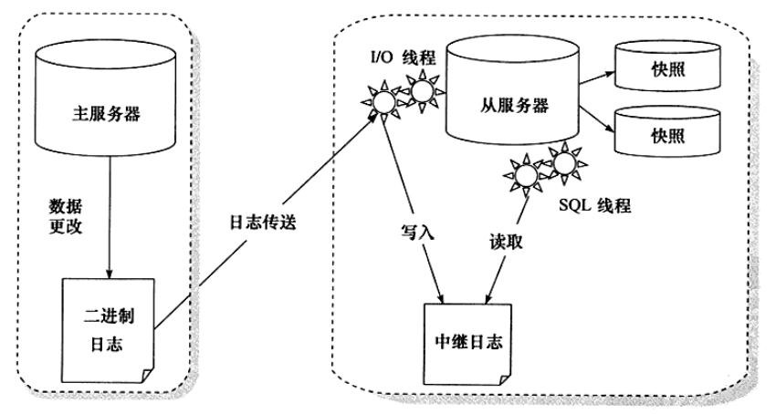</center>

还有一些其他的方法来调整复制,比如采用延时复制,即间歇性地开启从服务器上的同步,保证大约一小时的延时。这的确也是一个方法,只是数据库在高峰和非高峰期间每小时产生的二进制日志量是不同的,用户很难精准地控制。另外,这种方法也不能完全起到对误操作的防范作用。


## 源码

下载地址：[MySQL :: Download MySQL Community Server (Archived Versions)](https://downloads.mysql.com/archives/community/)

代码的主要功能如下：

- boost:这个版本是自带Boost的库相关文件的，放在此处，如果是其它的版本就没有这个文件夹
- client:客户端相关的软件和工具代码
- cmake:CMAKE相关的脚本命令文件
- components:组件工具
- Docs:文档文件夹
- doxyen_resources:doxyen工具相关资源
- extra:引入的一些其它包，如网络消息谁的SSL包以及一些小工具。
- include:源码用的相关的头文件放置的文件夹，但不包括存储引擎的头文件。
- libbinlogevents:解析Binlog的lib服务，5.7后提供。
- libbinlogstandalone:脱机配置CMAKE
- libmysql:可嵌入式的客户端API
- libservices:动态服务插件管理
- man:帮助文档
- mysql-test:服务端mysqlid的测试工具。
- mysys:MySql自己实现的数据结构和一些基本算法。如数组和链表等。
- packaging:打包相关
- plugin:插件管理文件夹，包括一些动态加入的插件。
- router:集群路由
- scripts:系统工具运行的脚本。
- share:共享信息，err和字符集
- source_downloads:
- sql:服务端的主要代码，包括main函数。
- sql-common:服务端和客户端通用的一些代码。
- storage:存储引擎相关文件。
- strings:字符串库
- support-files:.conf的示例文件和相关工具。
- testclients:客户框架测试。
- unittest:单元测试，这个搞程序的都知道。
- utilities:公用的一些文件，有ZLIB等
- vio:虚拟网络IO处理系统，不同平台或不同协议的网络通信API的二次封装。
  


Innodb源码结构：

- btr:B+树的实现。
- buf: 缓冲池的实现，包括LRU算法，Flush刷新算法等。
- dict: InnoDB存储引擎中内存数据字典的实现。
- dyn: InnoDB存储引擎中动态数组的实现。
- fiI: InnoDB存储引擎中文件数据结构以及对文件的一些操作。
- fsp: 可以理解为file space, 即对InnoDB存储引擎物理文件的管理，如页、区、段等。
- ha: 哈希算法的实现。
- handler:继承于MySQL的handler,插件式存储引擎的实现。
- ibuf:插人缓冲的实现。
- include: InnoDB 将头文件(.h, .ic) 文件都统一放在这个文件夹下。
- lock: InnoDB 存储引擎锁的实现，如S锁、X锁，以及定义锁的一系列算法。
- log：日志缓冲和重组日志文件的实现。对重组日志感兴趣的应该好好阅读该源代码。
- mem：辅助缓冲池的实现，用来申请一些数据结构的内存。
- mtr：事务的底层实现。
- os：封装一些对于操作系统的操作。
- page: 页的实现。
- row：对于各种类型行数据的操作。
- SRC：对于InnoDB存储引擎参数的设计。
- sync：InnoDB 存储引擎互斥量(Mutex) 的实现。
- thr：InnoDB 储存弓|擎封装的可移植的线程库。
- trx：事务的实现。
- ut：工具类。


